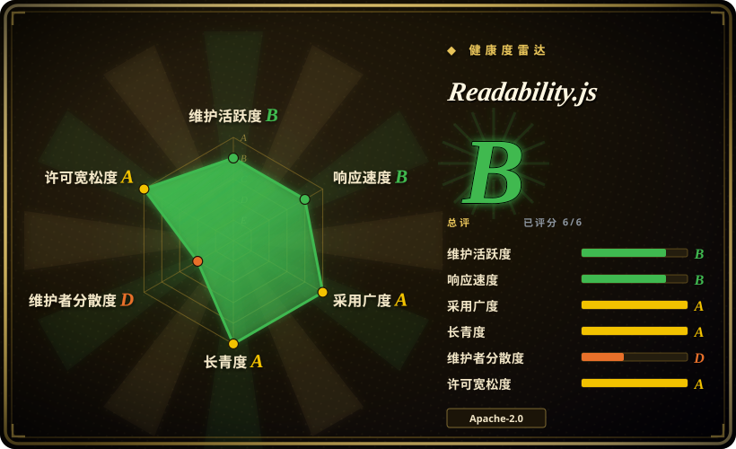
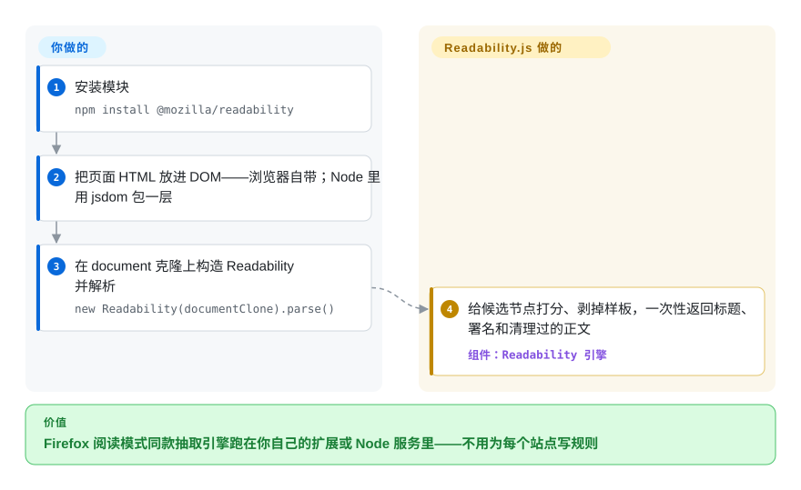

# Readability.js

你抓回一张新闻页面，九成 HTML 是壳——导航栏、cookie 横幅、广告位。把这个 DOM 交给这个库——Firefox 阅读模式出厂的同款引擎——它只还你标题、署名和清理过的正文，样板全部剥掉。

## 何时使用

你在做一个稍后读应用、一条 RSS/newsletter 管线，或一个 LLM 摄取步骤，却老是拿到整张网页，而你只想要文章。原始 HTML 有 90% 是壳——导航栏、cookie 横幅、侧边栏、评论组件、广告位——你只需要标题、作者和人真正会读的正文。于是你转向 Readability.js：把页面解析成 DOM（浏览器里你已经有 `document`；Node 里你用 JSDOM 或 linkedom 包一下 HTML），构造 `new Readability(documentClone).parse()`，拿回一个结构化对象——`title`、`content`（清理过的 HTML）、`textContent`、`excerpt`、`byline`、`siteName`、`lang`、`publishedTime`。这正是 Firefox 在 Reader View 里发布的、久经考验的同一套启发式引擎，所以它能相当好地应付杂乱的真实网页，而不用你为每个站点手写爬虫。

当你想要一次廉价预检时，你也会选它：`isProbablyReaderable(document)` 快速猜测一个页面是否像文章，让时间敏感的管线跳过不值得解析的页面。因为它是一个单一、依赖很轻的 JS 模块，作用在你提供的 DOM 上，所以它能以同一套 API 嵌进浏览器扩展和 Node 服务。

## 怎么用起来

这个库吃你递来的 DOM——它不抓 URL、也不跑 JavaScript——`parse()` 返回一个普通对象：`title`、`content`（清理过的 HTML）、`textContent`、`length`、`excerpt`、`byline`、`dir`、`siteName`、`lang`、`publishedTime`。内部机制：它遍历文档给每个候选容器打分（文本长度、逗号数、class/id 里的关键词，再按链接密度扣罚），把胜出者的最佳父节点升为正文根节点，然后跑一轮「嫌疑剥离」清掉导航、分享组件、广告和评论块；活下来的子树被序列化回 HTML。`parse()` 会改动传入的 DOM，所以如果你还要继续用这个页面，请传 `document.cloneNode(true)` 的克隆。`isProbablyReaderable(document)` 是刻意做得很便宜的预过滤器——文档明说它会假阳和假阴，这是设计而非缺陷。一条影响升级体验的注意：项目自己的 changelog 写着，从语义化版本的角度，*同一篇文档的抽取结果*不算稳定 API——小版本可能改变输出。仍归你管的：它前面的抓取/渲染，Node 里的 DOM 实现（jsdom 或 linkedom），以及给不可信输出做净化——README 推荐 DOMPurify 加 CSP，并明说这不是 Readability 的职责。

<!-- flow-steps:begin (generated from flows/readability-js.json by tools/flow_card.py — do not edit) -->

流程文字版

1. **你**：安装模块 — `npm install @mozilla/readability`
2. **你**：把页面 HTML 放进 DOM——浏览器自带；Node 里用 jsdom 包一层
3. **你**：在 document 克隆上构造 Readability 并解析 — `new Readability(documentClone).parse()`
4. **Readability.js**：给候选节点打分、剥掉样板，一次性返回标题、署名和清理过的正文 — 组件：`Readability 引擎`

**价值**：Firefox 阅读模式同款抽取引擎跑在你自己的扩展或 Node 服务里——不用为每个站点写规则

<!-- flow-steps:end -->

## 何时不用

- **你需要抓取并渲染页面，而不只是解析。** Readability.js 接收 DOM；它**不**抓取 URL、也不跑 JavaScript。对重 JS 的 SPA，你必须先渲染（headless 浏览器/Playwright）再把得到的 DOM 喂给它——这库不会替你做。
- **你在 Node 里又不想要 DOM 依赖。** 核心解析需要 DOM；在 Node 里那意味着 JSDOM（重）或 linkedom——一个真实依赖和成本，而浏览器场景能避开它。
- **你会不净化就直接渲染它的输出。** README 说得直白：`parse()` 的输出不是安全边界——对不可信 HTML 他们推荐 DOMPurify（配合 CSP），Firefox 自己两样都用。DOMPurify `未收录`；把它接进来是你的活，不是库的。
- **你需要超出「这篇文章」之外的结构化字段抽取。** 它返回正文 + 几个元数据字段，而非任意结构化数据（价格、产品规格、表格）——那是抓取/抽取的活，不是 reader-view 的活。
- **你需要在每个站点上都有保证的精度。** 它是启发式的；`isProbablyReaderable` 明确承认会有假阳/假阴，正文抽取在异常布局上可能漏取或过裁。请在你的目标站点上验证。
- **你需要 Python/Java 管线。** 这是 JavaScript；同一 arc90 血统的 Python 版见 [python-readability](python-readability.zh.md)（2026-08 发布 v0.9），且各移植版在启发式与输出上有别。

## 横向对比

| 替代品 | 是否收录 | 我们的评价 | 取舍 |
|---|---|---|---|
| [python-readability](python-readability.zh.md) | ✅ | 管线在 Python、能自己递原始 HTML 时选 python-readability——它的 v0.9（2026-08）附了维护者自跑的 181 页基准，该基准里本引擎排总榜第一；在浏览器/Node 栈里、或要与 Reader View 行为对齐时选本页。 | lxml 移植版：无 DOM 运行时、无 jsdom 成本；启发式与输出字段和本引擎不同（本引擎返回 byline/excerpt/lang/publishedTime，它只返回正文+标题）。 |
| [dragnet](dragnet.zh.md) | ✅ | 想要 ML 模型路线在 Python 里、且能接受老化依赖时，dragnet 是历史替代项；要久经考验的启发式引擎时选本页。 | ML 模型做正文抽取（Python）；某些页面形态可胜出，但更重、维护少得多。 |
| [boilerpipe](boilerpipe.zh.md) | ✅ | 栈在 JVM 上、要经典的文档聚类样板移除算法时选 boilerpipe；JS/浏览器/Node 表面上，本页在线统血统和部署简单性上胜出。 | Java 样板移除算法；思想经典但仓库实际已废弃（见其页面）。 |
| [trafilatura](trafilatura.zh.md) | ✅ | 需要发布日期、feeds/sitemaps 和爬取辅助、且语言是 Python 时选 trafilatura；抽取必须跑在页面已在的地方——浏览器扩展、Node 服务——时选本页。 | Python 抽取库，有公开基准套件和稳定节奏；语言不同、范围更广、不能在浏览器里跑。 |
| Mercury / Postlight Parser | 未收录 | 想要「连页面一起抓」的 Node 解析器（Readability 前面必须自己放抓取/渲染层）时，Mercury 曾是标准答案——但本轮未核实其维护状态，钉版前先查仓库。 | Node 文章解析器，自带抓取；历史流行，欠一次核实。 |

## 技术栈

- **语言：** JavaScript（ES2015+；浏览器与 Node ≥ 14 可用，`package.json` `engines`，npm registry 元数据 2026-09-28）。
- **核心：** 一个自包含的启发式打分引擎（`Readability.js`），外加仓库自带的轻量 `JSDOMParser`；公开面是 `new Readability(doc, options).parse()` 和 `isProbablyReaderable(doc, options)`。
- **选项（README，2026-09 核实）：** `debug`、`maxElemsToParse`（默认 0 即不限）、`nbTopCandidates`（5）、`charThreshold`（500）、`keepClasses`/`classesToPreserve`、`disableJSONLD`、可配置的 `serializer`、`allowedVideoRegex`、`linkDensityModifier`；`isProbablyReaderable` 收 `minContentLength`（140）、`minScore`（20）、`visibilityChecker`。
- **元数据：** 存在时优先用 Schema.org JSON-LD 字段（`disableJSONLD` 可关）；0.6.0 起把 Parsely 标签作为元数据兜底（CHANGELOG）。
- **版本注意：** changelog 声明，从 semver 角度，*对同一输入文档的解析输出*不是稳定 API——小版本可能改变抽取结果。

## 依赖

- **运行时：** 一个 DOM `document`。在**浏览器**里这是内置的——实际上**零运行时依赖**。在 **Node** 里你必须自己提供 DOM 实现（JSDOM 或 linkedom）；这些是*你的*依赖，并非 Readability 捆绑。
- **Node 引擎：** `engines.node >=14.0.0`——已对照 npm 发布包元数据核实（2026-09-28）。
- **安装：** `npm install @mozilla/readability`（npm 最新：**0.6.0**，发布于 2025-03-03），或在网页里直接加载 `Readability.js`。
- **无服务：** 无网络、无数据存储——它纯粹作用在你给的 DOM 上。

## 运维难度

**低。** 它是库不是服务——没什么要部署或运维。浏览器里它是一段无依赖脚本。真正要操心的还是 Node 场景：必须跑一个 DOM（JSDOM 较重，规模化时是内存/CPU 成本），且输入若是 JS 渲染页面，前面还需独立的抓取/渲染阶段。除此之外，「运维」只是保持 npm 依赖更新，并在你关心的站点上验证抽取质量。

## 健康度与可持续性

- **维护（2026-09 核实）。** 成熟型缓慢，比 2026-06 快照显得更慢：npm/GitHub 最新发布仍是 **0.6.0（2025-03-03）**；最后一次*功能性*提交是 2025-09-29（「Improve paragraph wrapping and DOM implementation」）；2026 年全是家务活——完整 Apache-2.0 许可全文 + NOTICE 文件和 dependabot 版本升级（2026-07-09），最后 push 2026-08-04（GitHub commit/branches API，2026-09-28）。未归档。`main` 上躺着 0.6.0 之后未发布的改进。
- **治理 / 背书。** 归 **Mozilla** 所有、随 Firefox Reader View 发布——强机构背书带真实产品依赖，对寿命的意义大于提交节奏本身。但雷达的 12 个月窗口只有约 1 名活跃 committer（治理 D）：仓库内的 bus factor 低，尽管持有它的机构不低。
- **年龄 × Lindy（2026-09）。** 2015-02 创建——约 11.6 年且**仍在收修复**⇒ 强 Lindy：久经验证、被广泛嵌入，而非废弃。
- **采用度与生态。** 约 11.5k star（11,468，GitHub API 2026-09-28）、npm 月下载 12,235,122 次、下游依赖仓库 1,293 个（健康度打分器，2026-09）；嵌入 Firefox，并被无数 reader/scraper/LLM 摄取管线复用。约 316 个 open issue 反映的是大的启发式面（各站点抽取边界情况），不是废弃。
- **风险标记。** Apache-2.0——GitHub API 现在直接报 Apache-2.0（旧 `NOASSERTION` 读法随 2026-07-09 许可全文落地而消除）；无 relicense 历史。真正的存疑在行为而非许可：启发式精度依站点而异、输出对象跨小版本无稳定承诺、发布节奏以年计。

## 存疑（未验证）

- [推断] 抽取精度与 `isProbablyReaderable` 可靠性是启发式且依站点而异；「在你的站点上验证」是一般性建议，而非实测失败率。
- [未验证] 横向对比里 Mercury/Postlight Parser 的维护状态本轮未核实。
- [推断] 「main 上有未发布改进」由 0.6.0（2025-03）之后的功能提交（如 2025-09-29）对照 npm 发布推断；除 changelog 上空着的 `[Unreleased]` 标题外，没有正式条目把它们标为未发布。
- [未验证] 「Firefox 持续发布本引擎」指 README 自述与 Mozilla 持有该仓库；具体随哪个 Firefox 版本耦合未核实。
