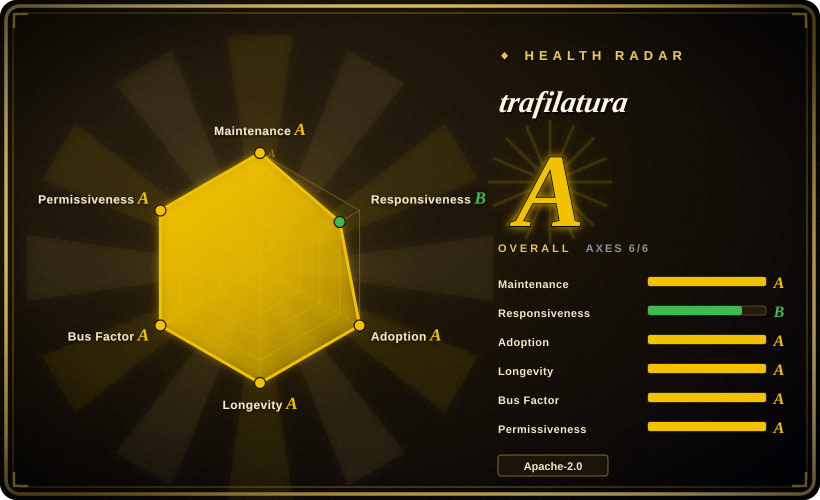
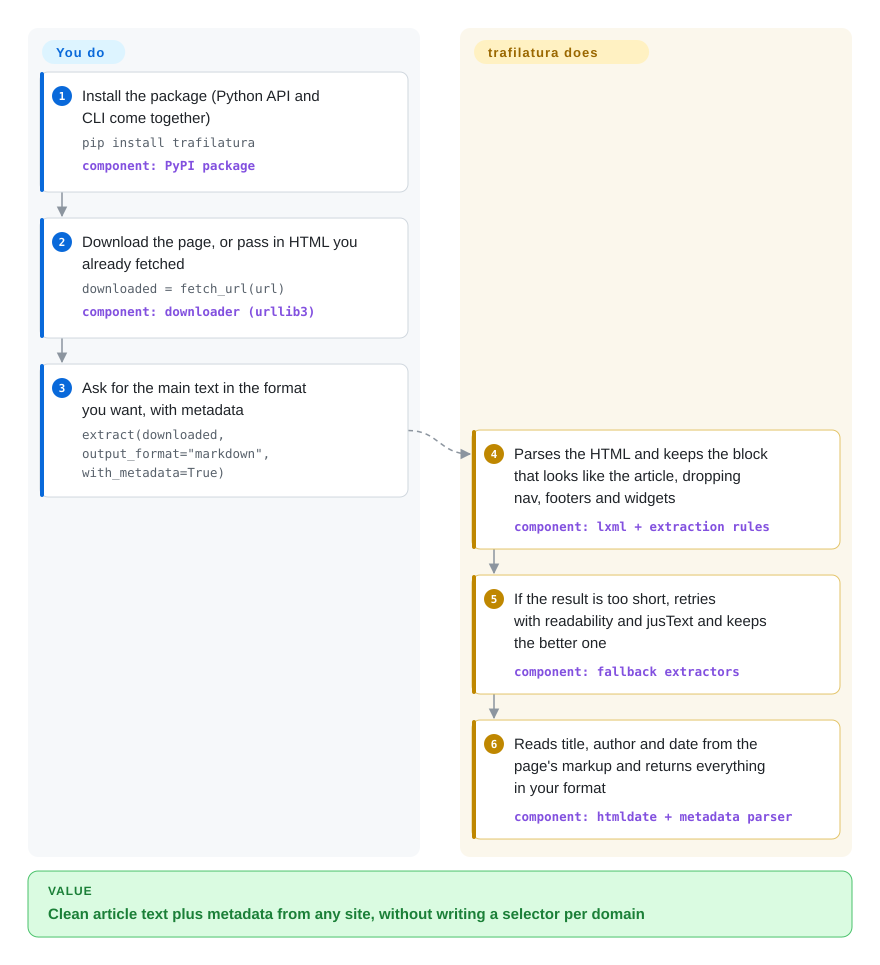

# trafilatura

You fetched ten thousand pages and got ten thousand blobs of menus, cookie banners, "related posts" and footers wrapped around the one article you wanted. trafilatura reads each page's HTML and hands back just the main text, plus title, author and date, in plain text, Markdown, JSON or XML, with no per-site rules for you to write.

## When to use

You are building a text corpus, a RAG index or a news monitor in Python, and the input is thousands of article-like pages from sites you do not control. A `requests.get()` plus BeautifulSoup gets you `<nav>`, `<footer>`, share buttons and comment widgets, so your embeddings end up full of "Subscribe to our newsletter". Writing a CSS selector per site stops working by the twentieth domain. You reach for trafilatura because one call, `extract(downloaded, output_format="markdown", with_metadata=True)`, finds the main content block on almost any page and returns it with its metadata, and the same package also finds the URLs in the first place (sitemaps, RSS/Atom feeds, a polite in-site crawler) and processes the whole list in parallel from the command line.

Pick it over [newspaper](newspaper.md) when you need a library that is still under active development and that returns structure (headings, lists, tables) and formats beyond plain text. Pick it over [python-readability](python-readability.md) when you want metadata and URL discovery as well, not only the cleaned body. trafilatura already uses readability-lxml and jusText as fallbacks inside its own extractor. Pick it over [Firecrawl](../crawling-tools/firecrawl.md) when the pages are server-rendered HTML and you want an Apache-2.0 library running in your own process, with no API key, per-page cost or service stack.

## How it works

trafilatura is a pure-Python library and a CLI with the same options. You either let it download the page (`fetch_url`, a plain HTTP fetch with no JavaScript engine) or pass in HTML you already have. It parses the HTML with lxml (a fast C-based HTML/XML parser) and uses its own rules to pick the block that looks like the article and drop the recurring parts: navigation, headers, footers, sidebars and "boilerplate", meaning text that repeats on every page of a site. If that first pass comes back too short, it automatically retries with two older extraction algorithms, readability and jusText, and keeps the better result. Metadata (title, author, date, site name, tags) comes from the page's own markup, such as OpenGraph and JSON-LD tags, through companion libraries like htmldate. You choose the output format and the precision-vs-recall knobs. You never write a selector.

<!-- flow-steps:begin (generated from flows/trafilatura.json by tools/flow_card.py — do not edit) -->

Text version of the flow

1. **You**: Install the package (Python API and CLI come together) — `pip install trafilatura` — component: `PyPI package`
2. **You**: Download the page, or pass in HTML you already fetched — `downloaded = fetch_url(url)` — component: `downloader (urllib3)`
3. **You**: Ask for the main text in the format you want, with metadata — `extract(downloaded, output_format="markdown", with_metadata=True)`
4. **trafilatura**: Parses the HTML and keeps the block that looks like the article, dropping nav, footers and widgets — component: `lxml + extraction rules`
5. **trafilatura**: If the result is too short, retries with readability and jusText and keeps the better one — component: `fallback extractors`
6. **trafilatura**: Reads title, author and date from the page's markup and returns everything in your format — component: `htmldate + metadata parser`

**Value**: Clean article text plus metadata from any site, without writing a selector per domain

<!-- flow-steps:end -->

## When NOT to use

- **The content is rendered by JavaScript.** trafilatura works on raw HTML, and its own docs tell you to render JS pages with a browser first. If most of your targets are single-page apps, use [Playwright](../../web-automation/playwright-family/playwright.md) to get the rendered HTML and pass it to `extract()`, or let [Firecrawl](../crawling-tools/firecrawl.md) do the rendering for you.
- **The site blocks you (403, Cloudflare challenge, captchas).** `fetch_url` is a normal urllib3 request with no stealth. Download through [Scrapling](../crawling-tools/scrapling.md)'s stealth fetcher or your own browser automation, then feed the HTML to trafilatura. The docs recommend keeping download and extraction separate for this reason.
- **You need specific fields, not the article.** Prices, product specs or table rows in a fixed layout are selector work. Use Scrapling's parser, or Firecrawl's LLM-backed JSON extraction, instead of a main-text extractor that is built to throw "non-article" parts away.
- **You need a distributed, scheduled crawl.** The built-in spider is a single-process focused crawler with politeness rules and deduplication. It has no job queue, no multi-machine scheduling and no dashboard. Run Scrapy spiders under [Scrapyd](../crawling-tools/scrapyd.md) and call trafilatura inside your item pipeline.
- **Your stack is JavaScript or the browser.** trafilatura requires Python 3.10+. In Node or a browser extension, use [Readability.js](readability-js.md), the engine behind Firefox Reader View.
- **You are pinned to an old release.** Versions before v1.8.0 were GPLv3+, not Apache-2.0. Check the version before assuming the permissive license.

## Comparison

| Alternative | In index | Our verdict | Tradeoff |
|---|---|---|---|
| [newspaper](newspaper.md) | ✅ | For new Python pipelines that need main text plus metadata, choose trafilatura. Only consider newspaper (in practice its newspaper4k fork) when you want its built-in NLP keyword/summary helpers. | The original newspaper3k has been dormant since 2020 and returns mostly plain text. trafilatura is actively released and keeps structure, but has no summarization layer. |
| [python-readability](python-readability.md) | ✅ | Choose python-readability when you only need the cleaned body of one HTML document and want the smallest dependency. Choose trafilatura when you also want metadata, formats and URL discovery. | readability-lxml is one of trafilatura's own fallbacks, so its quality floor is already inside trafilatura. The cost is a larger dependency tree (courlan, htmldate, jusText). |
| [Readability.js](readability-js.md) | ✅ | In a browser extension or a Node service that already has a DOM, pick Readability.js. In a Python batch job, pick trafilatura. | Readability.js is the Firefox Reader View engine and runs where the DOM is. It gives title/byline/content but no crawling, feeds or bulk CLI. |
| [Firecrawl](../crawling-tools/firecrawl.md) | ✅ | When pages need JavaScript rendering, anti-bot handling or LLM extraction and you accept an API (hosted or self-hosted), pick Firecrawl. For static HTML at volume, pick trafilatura. | Firecrawl removes the rendering and proxy problem but brings AGPL-3.0 or per-credit pricing and a multi-service stack. trafilatura is a pip install with no service, but it cannot see JS-rendered content. |
| [boilerpipe](boilerpipe.md) | ✅ | Treat boilerpipe as a JVM-era reference only. For maintained boilerplate removal, choose trafilatura (Python) or Readability.js (JS). | boilerpipe's shallow-text-feature algorithm is still cited, but the repo has been dormant since 2018. trafilatura is in active development and reports better benchmark scores [未验证]. |

## Tech stack

- **Language:** Python (requires 3.10+; classifiers list 3.10–3.15).
- **Parsing:** lxml for HTML/XML trees; extraction rules in-package, with readability-lxml-style and jusText algorithms as fallbacks.
- **Companion libraries by the same author:** `courlan` (URL filtering and normalization), `htmldate` (publication-date detection).
- **Network:** urllib3 for downloads (optional pycurl, SOCKS, brotli/zstd decoding via the `all` extra).
- **Outputs:** TXT, Markdown, CSV, JSON, HTML, XML and XML-TEI.
- **Interfaces:** Python API (`fetch_url`, `extract`, `extract_metadata`, `html2txt`, `focused_crawler`) and the `trafilatura` CLI.

## Dependencies

- **Runtime:** `certifi`, `charset_normalizer`, `courlan`, `htmldate`, `justext`, `lxml`, `urllib3` (all pip-installable; lxml ships wheels for common platforms).
- **Optional extras (`trafilatura[all]`):** `brotli`, `faust-cchardet`, `htmldate[speed]`, `py3langid` (language detection), `pycurl`, `urllib3[socks]`.
- **No external services:** no database, queue, browser or API key. The README says "no database is required".
- **Not bundled:** a JavaScript renderer. Bring Playwright or similar if your sources need one.

## Ops difficulty

**Low.** It is a library and CLI. Pin the version, and you are done. The real operating cost is around it. You choose politeness settings (download delays, `--parallel` threads) so you do not get blocked. You decide where raw HTML is backed up (`--backup-dir`) so you can re-extract after an upgrade. You also re-check output quality after minor releases, because extraction heuristics change between versions (v2.3.0 alone listed fixes to link farms, nested lists and Markdown escaping).

## Health & viability

- **Maintenance (A), as of 2026-10-08:** commits land weekly, and v2.1 (2026-06), v2.2 (2026-07), v2.3.0 and v2.3.1 (2026-10) shipped in quick succession after an 18-month gap following v2.0.0 (2024-12). The project is active again, not coasting.
- **Governance (A, up from B):** the recent window shows a broader contributor base. Still, the repository is owned by a personal account (`adbar`, Adrien Barbaresi), who wrote the large majority of all commits. The README says plainly that "its future depends on community support". Treat it as a strong single-author project with growing outside help, not as vendor- or foundation-backed.
- **Longevity (A) and Lindy:** created in 2019 from a PhD/academic-corpus project at the Berlin-Brandenburg Academy of Sciences, so the repository is 2740 days old (about seven and a half years) and still active. That is a good Lindy prior for a niche library.
- **Adoption (A):** heavy PyPI volume, 12,938,590 downloads in the last month. The README cites HuggingFace, IBM, Microsoft Research, NVIDIA, AI2, Stanford and the Internet Archive as users (vendor claims, not independently checked), and the ACL 2021 paper makes it a common citation in corpus work.
- **Risk / License (A):** Apache-2.0 since v1.8.0. Earlier versions were GPLv3+, so it was relicensed toward permissive. No CLA, no open-core split.

## Caveats (unverified)

- [未验证] The README claims trafilatura "consistently outperforms" other open-source extractors and cites ScrapingHub's benchmark and Bevendorff et al. 2023. Those are third-party benchmarks at fixed points in time, and they were not re-run for this page.
- [未验证] The list of named users (HuggingFace, IBM, NVIDIA, Internet Archive, etc.) comes from the README / "used by" docs page and is not independently confirmed.
- [推断] The "single-author with growing outside help" reading comes from the contributors API (adbar ≈1.4k commits; next contributor under 100) and the personal-account ownership. The governance-axis A reflects recent-window breadth, not a change of ownership.
- [推断] The fast fallback cascade (own rules → readability → jusText) is from the quickstart's "Fast mode" note. How often fallbacks fire on a given corpus was not measured.
