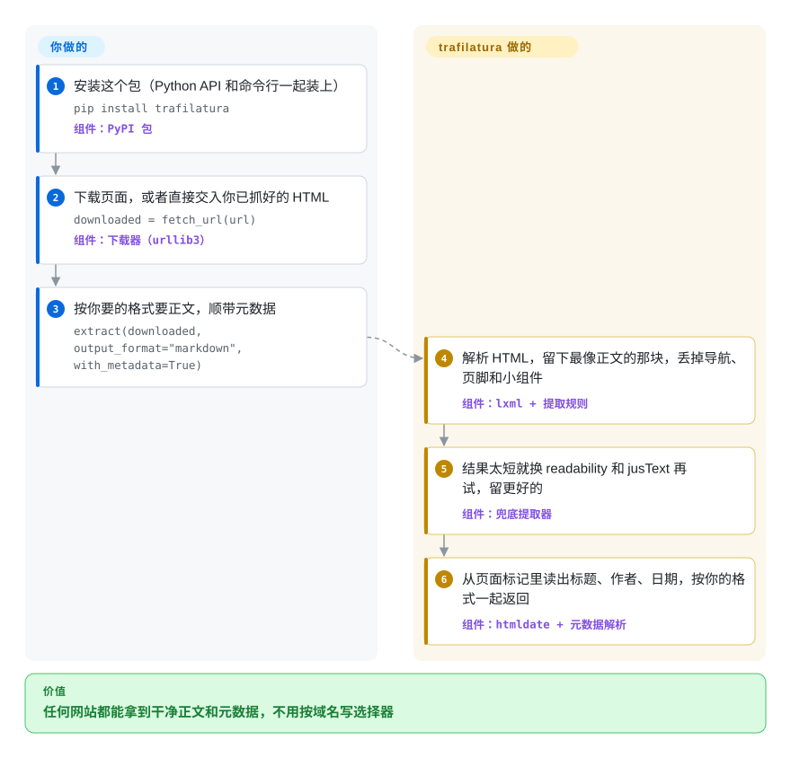

# trafilatura

你抓了一万个网页，拿到的是一万团导航栏、Cookie 弹窗、“相关推荐”和页脚，真正想要的那篇正文夹在中间。trafilatura 读每个页面的 HTML，只把正文连同标题、作者、日期交还给你，可以是纯文本、Markdown、JSON 或 XML，不用你给每个网站写规则。

## 何时使用

你在用 Python 搭语料库、RAG 索引或新闻监测，输入是几千个你管不了的网站上的文章类页面。`requests.get()` 加 BeautifulSoup 拿回来的是 `<nav>`、`<footer>`、分享按钮和评论区，向量库里塞满了“订阅我们的邮件”。按网站写 CSS 选择器，到第二十个域名就撑不住了。这时你会想到 trafilatura：一行 `extract(downloaded, output_format="markdown", with_metadata=True)` 就能在几乎任何页面上找到正文块，连同元数据一起返回。同一个包还负责先把 URL 找出来（站点地图、RSS/Atom 订阅源、一个守礼貌规则的站内爬虫），并能在命令行里并行处理整份列表。

需要一个仍在活跃开发、能保留结构（标题、列表、表格）并输出多种格式的库时，选它而不是 [newspaper](newspaper.zh.md)。除了清洗后的正文，还要元数据和 URL 发现时，选它而不是 [python-readability](python-readability.zh.md)。trafilatura 自己的提取器本来就把 readability-lxml 和 jusText 当兜底。页面是服务端渲染的 HTML，你又想要一个跑在自己进程里、Apache-2.0、不要 API key、不按页计费、不用部署服务的库时，选它而不是 [Firecrawl](../crawling-tools/firecrawl.zh.md)。

## 怎么用起来

trafilatura 是一个纯 Python 库，外加一个选项完全对应的命令行工具。你可以让它下载页面（`fetch_url`，普通 HTTP 请求，不带 JavaScript 引擎），也可以把手上已有的 HTML 直接交给它。它用 lxml（一个 C 实现的快速 HTML/XML 解析器）把 HTML 解析成树，再按自己的规则挑出最像正文的那一块，扔掉反复出现的部分：导航、页眉页脚、侧栏这些“样板文字”，也就是同一网站每页都重复的内容。第一遍结果太短时，它会自动换两种更老的提取算法 readability 和 jusText 再试，留下更好的那份。元数据（标题、作者、日期、站点名、标签）取自页面自带的标记，比如 OpenGraph 和 JSON-LD 标签，由 htmldate 等配套库完成。你决定输出格式，以及偏“宁缺毋滥”还是“宁多勿漏”的开关，选择器一个都不用写。

<!-- flow-steps:begin (generated from flows/trafilatura.json by tools/flow_card.py — do not edit) -->

流程文字版

1. **你**：安装这个包（Python API 和命令行一起装上） — `pip install trafilatura` — 组件：`PyPI 包`
2. **你**：下载页面，或者直接交入你已抓好的 HTML — `downloaded = fetch_url(url)` — 组件：`下载器（urllib3）`
3. **你**：按你要的格式要正文，顺带元数据 — `extract(downloaded, output_format="markdown", with_metadata=True)`
4. **trafilatura**：解析 HTML，留下最像正文的那块，丢掉导航、页脚和小组件 — 组件：`lxml + 提取规则`
5. **trafilatura**：结果太短就换 readability 和 jusText 再试，留更好的 — 组件：`兜底提取器`
6. **trafilatura**：从页面标记里读出标题、作者、日期，按你的格式一起返回 — 组件：`htmldate + 元数据解析`

**价值**：任何网站都能拿到干净正文和元数据，不用按域名写选择器

<!-- flow-steps:end -->

## 何时不用

- **内容靠 JavaScript 渲染。** trafilatura 只处理原始 HTML，官方文档也让你先用浏览器渲染 JS 页面。目标大多是单页应用时，用 [Playwright](../../web-automation/playwright-family/playwright.zh.md) 拿到渲染后的 HTML 再交给 `extract()`，或者让 [Firecrawl](../crawling-tools/firecrawl.zh.md) 替你渲染。
- **网站拦你（403、Cloudflare 验证页、验证码）。** `fetch_url` 是普通的 urllib3 请求，没有任何伪装。改用 [Scrapling](../crawling-tools/scrapling.zh.md) 的隐身抓取器或你自己的浏览器自动化来下载，再把 HTML 交给 trafilatura。文档正是为此建议把下载和提取分开。
- **你要的是特定字段，不是文章。** 价格、商品参数、固定版式里的表格行，是选择器的活。用 Scrapling 的解析器，或 Firecrawl 基于大模型的 JSON 提取，别用一个专门把“非正文”丢掉的正文提取器。
- **你需要分布式、可调度的抓取。** 内置爬虫是单进程的定向爬虫，有礼貌规则和去重，但没有任务队列、多机调度和管理面板。用 Scrapy 写爬虫、交给 [Scrapyd](../crawling-tools/scrapyd.zh.md) 调度，在 item pipeline 里调用 trafilatura。
- **你的技术栈是 JavaScript 或浏览器。** trafilatura 要求 Python 3.10+。在 Node 或浏览器扩展里，用 Firefox 阅读模式背后的 [Readability.js](readability-js.zh.md)。
- **你锁在老版本上。** v1.8.0 之前的版本是 GPLv3+，不是 Apache-2.0。别默认它一直是宽松许可，先看版本号。

## 横向对比

| 替代品 | 是否收录 | 我们的评价 | 取舍 |
|---|---|---|---|
| [newspaper](newspaper.zh.md) | ✅ | 新建的 Python 流水线要正文加元数据，选 trafilatura。只有想要它自带的 NLP 关键词和摘要时，才考虑 newspaper（实际该用它的 newspaper4k 分叉）。 | 原版 newspaper3k 自 2020 年起停滞，输出基本是纯文本。trafilatura 持续发版并保留结构，但没有摘要层。 |
| [python-readability](python-readability.zh.md) | ✅ | 只要单个 HTML 的干净正文、想要最少依赖时，选 python-readability。还要元数据、多种格式和 URL 发现时，选 trafilatura。 | readability-lxml 本身就是 trafilatura 的兜底之一，它的质量下限已经包含在 trafilatura 里。代价是依赖树更大（courlan、htmldate、jusText）。 |
| [Readability.js](readability-js.zh.md) | ✅ | 在浏览器扩展或已有 DOM 的 Node 服务里，选 Readability.js。在 Python 批处理任务里，选 trafilatura。 | Readability.js 是 Firefox 阅读模式的引擎，在有 DOM 的地方运行。它给出标题、署名和正文，但没有爬取、订阅源或批量命令行。 |
| [Firecrawl](../crawling-tools/firecrawl.zh.md) | ✅ | 页面需要 JS 渲染、反爬处理或大模型提取，且你接受一个 API（托管或自托管）时，选 Firecrawl。静态 HTML 大批量处理，选 trafilatura。 | Firecrawl 解决了渲染和代理问题，但带来 AGPL-3.0 或按积分计费，以及一整套多服务部署。trafilatura 一行 pip 安装、没有服务，但看不到 JS 渲染出的内容。 |
| [boilerpipe](boilerpipe.zh.md) | ✅ | 把 boilerpipe 当作 JVM 时代的参考实现即可。要有人维护的样板去除，选 trafilatura（Python）或 Readability.js（JS）。 | boilerpipe 的浅层文本特征算法至今仍被引用，但仓库自 2018 年起停滞。trafilatura 在活跃开发，并自称基准分数更高 [未验证]。 |

## 技术栈

- **语言：** Python（要求 3.10+，分类器列到 3.10–3.15）。
- **解析：** lxml 负责 HTML/XML 树；提取规则在包内，readability-lxml 式算法和 jusText 作兜底。
- **同作者的配套库：** `courlan`（URL 过滤与规范化）、`htmldate`（发布日期识别）。
- **网络：** 下载用 urllib3（`all` 扩展可选 pycurl、SOCKS 代理、brotli/zstd 解压）。
- **输出格式：** TXT、Markdown、CSV、JSON、HTML、XML、XML-TEI。
- **接口：** Python API（`fetch_url`、`extract`、`extract_metadata`、`html2txt`、`focused_crawler`）和 `trafilatura` 命令行。

## 依赖

- **运行时：** `certifi`、`charset_normalizer`、`courlan`、`htmldate`、`justext`、`lxml`、`urllib3`（都能 pip 安装，lxml 在常见平台有预编译 wheel）。
- **可选扩展（`trafilatura[all]`）：** `brotli`、`faust-cchardet`、`htmldate[speed]`、`py3langid`（语言识别）、`pycurl`、`urllib3[socks]`。
- **没有外部服务：** 不需要数据库、队列、浏览器或 API key。README 原话是“不需要数据库”。
- **不自带：** JavaScript 渲染器。数据源需要时，自己配 Playwright 之类。

## 运维难度

**低。** 它是一个库加一个命令行工具，锁好版本就行。真正的运维成本在它周围。你要设好礼貌参数（下载间隔、`--parallel` 线程数），免得被封。你要决定原始 HTML 备份到哪里（`--backup-dir`），升级后才能重新提取。小版本升级后也要复查输出质量，因为提取启发式会随版本变化（光 v2.3.0 就列了链接农场、嵌套列表、Markdown 转义等修正）。

## 健康度与可持续性

- **维护（A，截至 2026-10-08）：** 每周都有提交。v2.0.0（2024-12）之后停了 18 个月，随后 v2.1（2026-06）、v2.2（2026-07）、v2.3.0 和 v2.3.1（2026-10）接连发布。项目重新活跃，不是在吃老本。
- **治理（A，由 B 上调）：** 近一个统计窗口里的贡献者更分散了。但仓库挂在个人账号下（`adbar`，Adrien Barbaresi），历史提交绝大多数是他写的。README 直说“它的未来取决于社区支持”。把它看作一个强力的单作者项目、外部帮手在变多，而不是有厂商或基金会背书。
- **存续（A）与 Lindy：** 2019 年从柏林-勃兰登堡科学院的博士/学术语料项目起步，仓库已有 2740 天（约七年半）且仍活跃。对一个细分领域的库来说，这是不错的 Lindy 先验。
- **采用（A）：** PyPI 下载量很大，近一个月 12,938,590 次。README 列了 HuggingFace、IBM、微软研究院、NVIDIA、AI2、斯坦福、互联网档案馆等用户（项目方自述，未独立核实），ACL 2021 论文也让它成为语料工作的常见引用。
- **风险/许可（A）：** v1.8.0 起是 Apache-2.0；更早的版本是 GPLv3+，许可是往宽松方向改的。没有 CLA，没有开源核心/付费版拆分。

## 存疑（未验证）

- [未验证] README 声称 trafilatura “持续优于”其他开源提取器，并引用 ScrapingHub 基准和 Bevendorff 等人 2023 年的论文。这些都是第三方在特定时间点的基准，本页没有重跑。
- [未验证] 列出的用户（HuggingFace、IBM、NVIDIA、互联网档案馆等）来自 README 和“used by”文档页，未独立核实。
- [推断] “单作者、外部帮手在变多”的判断依据是贡献者 API（adbar 约 1.4k 次提交，第二名不到 100）和个人账号归属。治理轴的 A 反映的是近期窗口的分散度，不代表所有权变了。
- [推断] “自有规则 → readability → jusText”的兜底链来自快速入门里“快速模式”一节的说明。兜底在某个具体语料上触发的频率没有测过。
