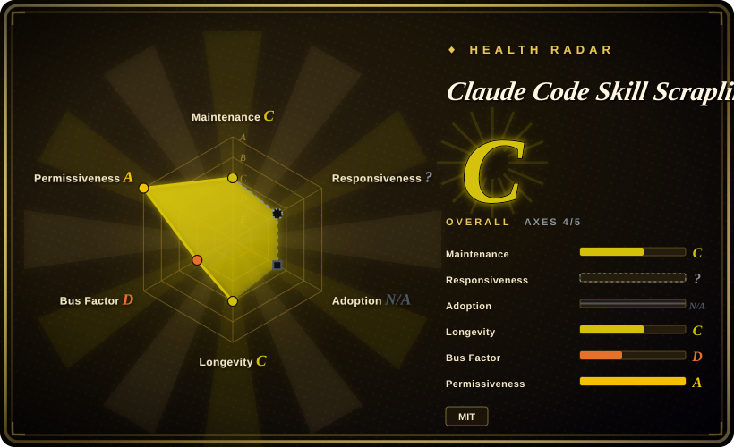
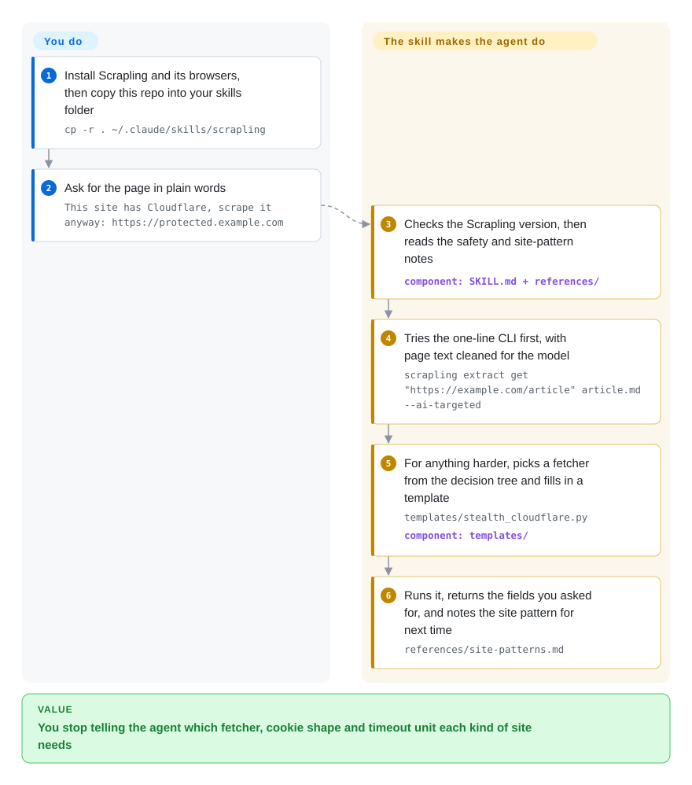

# Claude Code Skill Scrapling

You ask your coding agent to grab a page, it writes a plain HTTP request, gets back Cloudflare's "Just a moment…" 403, and then spends turns guessing which browser tool to try next. This is one Claude Code skill that hands the agent a fixed escalation ladder for the Scrapling Python library — plain request first, a stealth browser only when blocked — plus fill-in script templates for each rung.

## When to use

You work in Claude Code on a Python machine and scraping is a side task, not your product: pull the posts off a Discourse forum behind Cloudflare, read a docs page into Markdown, log into a site with an HTTP form and collect three pages behind it. Left alone, the agent reaches for `requests`, receives `403` with a "Checking your browser" body, and improvises — or it reaches for the right library and trips on its details, passing cookies as a `dict` to a browser fetcher and getting `Expected array, got object at $.cookies`.

You copy this repository into `~/.claude/skills/scrapling` and the agent stops improvising. The skill tells it to try Scrapling's one-line CLI first, and otherwise to walk a five-branch decision tree (parse-only, static, HTTP-form login, Cloudflare/WAF, JavaScript-rendered) and fill in the matching template. It also carries what is tedious to rediscover: cookie shape and timeout unit differ between the HTTP fetchers and the browser fetchers, and a troubleshooting file is indexed by the literal error message.

The choice that matters is against Scrapling's own official skill, `scrapling-official`, shipped inside the `D4Vinci/Scrapling` repository and versioned with the library. That one is the complete, maintained reference: spiders, the MCP server, adaptive selectors, every CLI option. This one is a short Chinese-language wrapper around the high-frequency paths, with two things the official skill does not organise for you: a site-pattern notebook the agent appends to after each job, and a convention for keeping real cookies and private-site notes in git-ignored `.local.md` files. Pick it when you want a small skill that fits in the context window and accumulates your own site notes; pick the official one when correctness against the current library version matters more than brevity. Against [Firecrawl](firecrawl.md), the tradeoff is where the fetching happens: here it is your own machine and IP with no per-request bill, and you own every block and every browser install.

## How it works

The repository contains no scraper. It is one `SKILL.md` (instructions the agent loads when your request looks like scraping), seven reference notes, and four Python templates with `{{URL}}`-style placeholders. All fetching is done by Scrapling, a separate library you install yourself; the skill only decides which part of it to call. On each request the agent checks the installed Scrapling version, reads the safety note and the site-pattern note, and tries the CLI with `--ai-targeted` — a Scrapling flag that keeps only the main content and strips hidden elements before the page text reaches the model. If that is not enough, it picks a "fetcher" (Scrapling's name for a way of getting a page: a plain HTTP client that imitates a browser's network handshake, a real browser, or a stealth-patched browser that also clicks through Cloudflare's challenge), fills in the template and runs it. Think of it as a laminated card taped next to a toolbox: the card says which tool to pick up first; the tools came from somewhere else.

What you do: install Scrapling and its browsers, copy the folder, and decide whether a target is yours to scrape. What the skill does: the routing, the script, and — because the instructions mark it as mandatory — a final step where the agent writes what it learned about the site back into the skill's own `references/` folder.

<!-- flow-steps:begin (generated from flows/claude-code-skill-scrapling.json by tools/flow_card.py — do not edit) -->

Text version of the flow

1. **You**: Install Scrapling and its browsers, then copy this repo into your skills folder — `cp -r . ~/.claude/skills/scrapling`
2. **You**: Ask for the page in plain words — `This site has Cloudflare, scrape it anyway: https://protected.example.com`
3. **Claude Code Skill Scrapling**: Checks the Scrapling version, then reads the safety and site-pattern notes — component: `SKILL.md + references/`
4. **Claude Code Skill Scrapling**: Tries the one-line CLI first, with page text cleaned for the model — `scrapling extract get "https://example.com/article" article.md --ai-targeted`
5. **Claude Code Skill Scrapling**: For anything harder, picks a fetcher from the decision tree and fills in a template — `templates/stealth_cloudflare.py` — component: `templates/`
6. **Claude Code Skill Scrapling**: Runs it, returns the fields you asked for, and notes the site pattern for next time — `references/site-patterns.md`

**Value**: You stop telling the agent which fetcher, cookie shape and timeout unit each kind of site needs

<!-- flow-steps:end -->

## When NOT to use

- **You want the skill that tracks the library.** This wrapper names the official skill as its source of truth and has not been touched since 2026-06-18, while Scrapling shipped six releases after that (v0.4.10 to v0.4.15). Install `scrapling-official` from `agent-skill/Scrapling-Skill` in the Scrapling repository instead; it carries a version field that matches the library release.
- **You will let the agent write code from the bundled API cheat sheet.** `references/api-quick-ref.md` documents `page.css_first('h1')` and `element.css_first(...)`, but Scrapling removed `css_first` / `xpath_first` in v0.4 (2026-02-15) — before this repository's first commit. The skill also describes `StealthyFetcher` as a Camoufox browser, which Scrapling replaced with patchright in v0.3.13. Since step 0 tells the agent to upgrade Scrapling to the latest version, the agent ends up with a current library and a stale reference [推断: read from the upstream changelog, not run]. Use the upstream docs for signatures, or the official skill.
- **Your policy is that an agent asks before running code or installing packages.** The skill's frontmatter declares `allowed-tools: Bash(python*), Bash(pip*), Bash(uv*), Bash(scrapling*)` — arbitrary Python, package installs and upgrades — and its workflow has the agent upgrade the library and edit files inside the skill directory. If that is too wide, use a tool with a narrow call surface such as [Playwright MCP](../../web-automation/playwright-family/playwright-mcp.md), or edit the frontmatter before installing.
- **The page needs clicking, scrolling or a JavaScript login.** The skill's own site-pattern note says the rendered-page fetcher cannot interact, and falls back to driving Playwright directly for an "expand more" button; only HTTP-form logins are templated. Use [Agent Browser](../../web-automation/agent-browser-tools/agent-browser.md) or [Playwright MCP](../../web-automation/playwright-family/playwright-mcp.md) when the task is interaction rather than retrieval.
- **You need a crawl, not a page.** Spiders, proxy rotation, pause/resume, adaptive selectors and the MCP server are explicitly out of scope; the skill only points at upstream docs. Use Scrapling's spider framework directly, [Scrapyd](scrapyd.md) if you already run Scrapy, or [Firecrawl](firecrawl.md) for a hosted crawl.
- **You are not allowed to access the target the way a browser user is.** The headline feature is getting past Cloudflare and WAF challenges. The guardrails (authorised content only, check robots.txt and terms, no paywall or CAPTCHA bypass) are sentences in a Markdown file that the model may or may not follow; nothing enforces them. Where an official API exists, use it — [PRAW](praw.md) for Reddit is the pattern — and where it does not, get permission first.
- **You would store session cookies with it.** The "cookie vault" is a plain Markdown file, `references/cookie-vault.local.md`, inside the skills directory: git-ignored, unencrypted, and read into the model's context whenever a login is needed. For anything beyond a throwaway account, keep credentials in your OS keychain or a secrets manager and pass them at run time.
- **You are not on Claude Code with Python.** Installation is `cp -r` into a Claude Code skills folder, and every path ends in Python; a request for a TypeScript version (issue #1, 2026-04-06) has no reply. Use [Firecrawl](firecrawl.md) for an HTTP API with SDKs in other languages.
- **The site is not fighting you.** For article text from ordinary pages, [trafilatura](../article-extraction/trafilatura.md) needs no browser install; when the only obstacle is network-handshake fingerprinting, [curl_cffi](../../python-tooling/curl-cffi.md) — the library under Scrapling's fastest fetcher — is a smaller dependency.

## Comparison

Scrapling's official skill (`scrapling-official`) and the Scrapling library itself are the closest alternatives; they are discussed in `When to use` and `When NOT to use` above rather than in this table.

| Alternative | In index | Our verdict | Tradeoff |
| --- | --- | --- | --- |
| [Firecrawl](firecrawl.md) | ✅ | When the agent should receive clean Markdown without anything installed locally, or you are outside Python, pick Firecrawl; pick this skill when fetching must run on your own machine with your own cookies and no per-request cost, because Firecrawl moves the fetch — and the page content — to a service. | Firecrawl gives a maintained API, crawling and SDKs, at the price of AGPL-3.0 for self-hosting or usage fees for the hosted tier; this skill is free and local but leaves blocks, browser installs and stale instructions to you. |
| [curl_cffi](../../python-tooling/curl-cffi.md) | ✅ | When the block is purely a network-handshake fingerprint and you are writing the script yourself, pick curl_cffi; pick this skill when you do not yet know why the site refuses you and want the agent to escalate from HTTP to a browser on its own. | curl_cffi is one actively released dependency with no browser; this skill adds a browser stack and a decision procedure, and inherits curl_cffi through Scrapling anyway. |
| [Playwright MCP](../../web-automation/playwright-family/playwright-mcp.md) | ✅ | When the task is to operate a page — click, type, expand, read what appears — pick Playwright MCP; pick this skill when the task is to retrieve content and get past a challenge page, because Playwright MCP launches an ordinary automation browser with no stealth layer. | Playwright MCP is vendor-maintained with a typed, narrow tool surface and costs context per step; this skill is a one-shot script with a wide shell permission and no interaction model. |
| [Agent Browser](../../web-automation/agent-browser-tools/agent-browser.md) | ✅ | When the agent needs a browser that stays open across many steps and addresses elements by stable references, pick Agent Browser; pick this skill for a fetch-parse-return job where a resident browser is overhead. | Agent Browser is a frequently released CLI and daemon built for multi-step sessions; this skill is a single author's instruction file that starts a fresh fetch each time. |
| [trafilatura](../article-extraction/trafilatura.md) | ✅ | When the pages are ordinary articles or docs and nothing blocks you, pick trafilatura; pick this skill only once a plain fetch has actually failed, because a stealth browser is a large install to carry for pages that never needed it. | trafilatura is a long-lived extraction library with no anti-bot capability; this skill reaches protected and rendered pages at the cost of browser binaries and legal exposure you must judge yourself. |

## Health & viability

- **Maintenance (2026-10-08):** four commits in total — two on creation day (2026-03-11), one on 2026-05-13, one on 2026-06-18 — and nothing in the 16 weeks since. No releases, no tags, no CI. Treat it as coasting, and as a snapshot you will maintain yourself once copied.
- **Governance / bus factor:** one personal account (`Cedriccmh`) wrote every commit; the single pull request was the author's own. Two issues are open with zero replies, the older since 2026-04-06. Bus factor 1.
- **Backing & Lindy:** about seven months old, no organisation or funding behind it. Its value is entirely borrowed from Scrapling (BSD-3-Clause, about 86k stars, v0.4.15 on 2026-08-23, pushed 2026-10-07), which is healthy and moving fast — and that is the problem: the wrapper ages every time the library releases. Young plus idle is the weak corner of the Lindy prior.
- **Adoption:** 443 stars and 56 forks is real interest for a seven-month-old instruction folder, but there is no install channel to count, no dependents, and no evidence in the issue tracker of anyone reporting a run. Stars here measure bookmarking [推断].
- **Risk flags:** (1) documented drift against the current library (`css_first`, Camoufox); (2) a pre-approved shell surface plus self-modifying instructions; (3) plaintext cookie storage by design; (4) the anti-bot use itself — whether a given scrape is lawful or within a site's terms is yours to decide, and Cloudflare's detection can change faster than a four-commit repository does. The license is plain MIT with no CLA.

## Caveats (unverified)

- [未验证] Nothing on this page was executed. The skill was not installed into Claude Code and no template was run against Scrapling 0.4.15; every behavioural statement comes from reading `SKILL.md`, the seven `references/` files, the four templates, the test script, and the upstream changelog and docs. Running it would mean scraping third-party sites from this environment.
- [推断] That the `css_first` examples fail on a current install follows from Scrapling's v0.4 changelog ("`css_first`/`xpath_first` removed") and from a code search of the Scrapling repository that finds the name only in `CHANGELOG.md`; it was not reproduced. The four templates themselves do not call `css_first`.
- [未验证] The other signatures in `references/api-quick-ref.md` (fetcher keyword arguments, `Response` attributes, the seconds-versus-milliseconds timeout split) were not checked one by one against the upstream API reference; only `solve_cloudflare`, `block_webrtc`, `hide_canvas`, the `--ai-targeted` flag and `scrapling.__version__` were confirmed to exist upstream.
- [未验证] "Automatically passes Cloudflare" is the author's and upstream's claim. Success depends on Cloudflare's current detection, the target's settings and your IP reputation, changes over time, and cannot be measured without live protected targets.
- [未验证] How much protection `--ai-targeted` gives against prompt injection is upstream's description ("safe against common Prompt Injection attacks"); it was not tested with adversarial pages.
- [推断] The effect of the `allowed-tools` frontmatter depends on the Claude Code version and your permission settings; the page reads the declared intent, not an observed permission prompt.
- [推断] Whether the agent really performs the "mandatory" write-back into `references/site-patterns.md` on every run is model behaviour, not something the repository can guarantee; the same holds for every guardrail in `references/security.md`.
- [未验证] The third command in the repository's own verification checklist points at a hard-coded personal Windows path (`C:/Users/CedricChen/.codex/skills/...`), so that check cannot be run elsewhere; the first check (`tests/test_pr1_pr3_content.py`) only asserts that certain strings are present in the docs.
- [推断] Reading the star count as bookmarking rather than use rests on the absence of usage reports in three issue threads; no download or install telemetry exists for a copy-the-folder skill.
- [未验证] The relative merits of this skill and the official `scrapling-official` skill were judged from both `SKILL.md` files, not from a side-by-side run.
