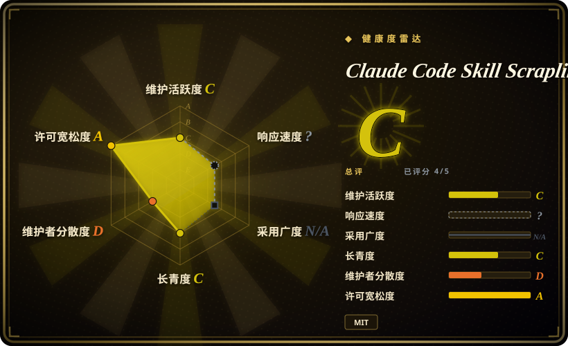
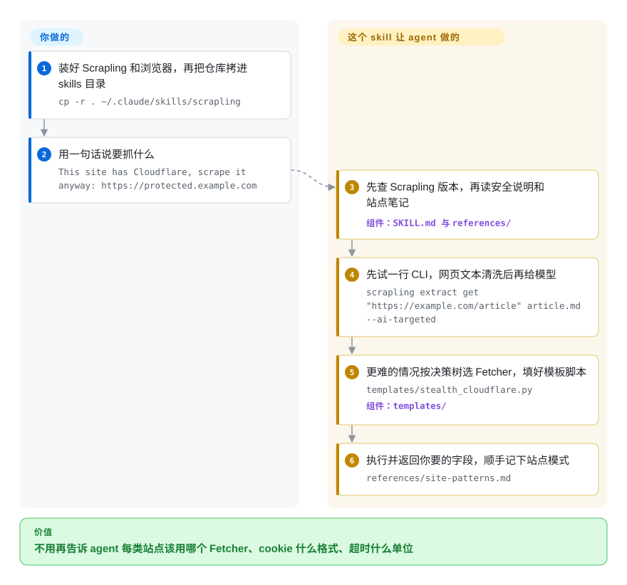

# Claude Code Skill Scrapling

你让编程 agent 抓一个网页，它写了个普通 HTTP 请求，拿回来的是 Cloudflare 的“Just a moment…”和一个 403，接着好几轮都在瞎猜下一步该换哪个浏览器工具。这是一个 Claude Code skill，给 agent 一条固定的升级路线去用 Scrapling 这个 Python 库：先发普通请求，被拦了才上隐身浏览器，每一级都配好填空式脚本模板。

## 何时使用

你在一台装了 Python 的机器上用 Claude Code，抓取只是顺手的活，不是你的产品：把一个挂在 Cloudflare 后面的 Discourse 论坛帖子拉下来，把一页文档读成 Markdown，用 HTTP 表单登录某个站再取后面三页。放任不管的话，agent 会先用 `requests`，收到 `403` 和一段“Checking your browser”，然后开始即兴发挥；或者它选对了库，却栽在细节上——把 `dict` 形式的 cookie 传给浏览器类 Fetcher，得到一句 `Expected array, got object at $.cookies`。

你把这个仓库拷进 `~/.claude/skills/scrapling`，agent 就不再即兴发挥。skill 要求它先试 Scrapling 的一行 CLI，不够再走一棵五个分支的决策树（只解析、静态页、HTTP 表单登录、Cloudflare/WAF、需要 JS 渲染），填对应的模板。它还带着那些每次都要重新踩一遍的细节：HTTP 类 Fetcher 和浏览器类 Fetcher 的 cookie 格式、超时单位都不一样；排错文档直接按报错原文做索引。

真正要做的选择，是它和 Scrapling 官方 skill `scrapling-official` 之间。官方那份放在 `D4Vinci/Scrapling` 仓库里，随库一起发版，是完整且在维护的参考：Spider、MCP server、自适应选择器、全部 CLI 参数都有。这一份是围绕高频路径写的中文轻量封装，多出两样官方 skill 没替你安排的东西：一本 agent 每次抓完都往里追加的站点模式笔记，以及一套把真实 cookie 和私有站点笔记放进被 git 忽略的 `.local.md` 文件的约定。想要一个塞得进上下文、还能攒下你自己站点经验的小 skill，选它；更在意和当前库版本严格一致，选官方那份。和 [Firecrawl](firecrawl.zh.md) 比，取舍在于抓取发生在哪里：这里是你自己的机器和 IP，没有按请求计费，但每一次被拦、每一次装浏览器都归你管。

## 怎么用起来

仓库里没有爬虫。它是一份 `SKILL.md`（你的请求看起来像抓取时 agent 会加载的指令）、七份参考笔记，加四个带 `{{URL}}` 这类占位符的 Python 模板。真正去抓页面的是 Scrapling——一个要你自己另外安装的库；skill 只负责决定调用它的哪一部分。每次请求，agent 先查本机 Scrapling 版本，读安全说明和站点模式笔记，然后用带 `--ai-targeted` 的 CLI 试一次——这是 Scrapling 的一个参数，只保留正文、去掉隐藏元素，再把网页文本交给模型。不够的话，它挑一个“Fetcher”（Scrapling 对“取页面的方式”的叫法：模仿浏览器网络握手的普通 HTTP 客户端、真实浏览器，或者打过隐身补丁、还会自己点过 Cloudflare 验证的浏览器），把模板填好并执行。可以把它想成贴在工具箱旁边的一张塑封卡片：卡片告诉你先拿哪件工具，工具本身是别处来的。

你做的事：装 Scrapling 和它的浏览器，拷目录，并判断目标站是不是你有权抓的。skill 做的事：选路、写脚本，以及——因为指令里标了“必做”——最后让 agent 把这次摸到的站点经验写回 skill 自己的 `references/` 目录。

<!-- flow-steps:begin (generated from flows/claude-code-skill-scrapling.json by tools/flow_card.py — do not edit) -->

流程文字版

1. **你**：装好 Scrapling 和浏览器，再把仓库拷进 skills 目录 — `cp -r . ~/.claude/skills/scrapling`
2. **你**：用一句话说要抓什么 — `This site has Cloudflare, scrape it anyway: https://protected.example.com`
3. **Claude Code Skill Scrapling**：先查 Scrapling 版本，再读安全说明和站点笔记 — 组件：`SKILL.md 与 references/`
4. **Claude Code Skill Scrapling**：先试一行 CLI，网页文本清洗后再给模型 — `scrapling extract get "https://example.com/article" article.md --ai-targeted`
5. **Claude Code Skill Scrapling**：更难的情况按决策树选 Fetcher，填好模板脚本 — `templates/stealth_cloudflare.py` — 组件：`templates/`
6. **Claude Code Skill Scrapling**：执行并返回你要的字段，顺手记下站点模式 — `references/site-patterns.md`

**价值**：不用再告诉 agent 每类站点该用哪个 Fetcher、cookie 什么格式、超时什么单位

<!-- flow-steps:end -->

## 何时不用

- **你要的是跟着库走的那份 skill。** 这个封装自己就把官方 skill 当事实源，而且从 2026-06-18 起没再动过，其间 Scrapling 又发了六个版本（v0.4.10 到 v0.4.15）。改装 Scrapling 仓库 `agent-skill/Scrapling-Skill` 里的 `scrapling-official`，它带一个和库版本对齐的版本号字段。
- **你会让 agent 照着附带的 API 速查卡写代码。** `references/api-quick-ref.md` 里写着 `page.css_first('h1')` 和 `element.css_first(...)`，但 Scrapling 在 v0.4（2026-02-15）就删掉了 `css_first` / `xpath_first`——比这个仓库的第一个提交还早。skill 还把 `StealthyFetcher` 描述成 Camoufox 浏览器，而 Scrapling 在 v0.3.13 已经换成 patchright。步骤 0 又要求 agent 把 Scrapling 升到最新版，于是 agent 手里是一个最新的库配一份过期的参考 [推断：依据是上游 changelog，没有实际运行]。函数签名以上游文档为准，或者直接用官方 skill。
- **你的规矩是 agent 跑代码、装包之前要先问。** skill 的 frontmatter 声明了 `allowed-tools: Bash(python*), Bash(pip*), Bash(uv*), Bash(scrapling*)`——任意 Python、装包和升级都在里面——工作流还让 agent 升级库、改写 skill 目录里的文件。嫌太宽，就用调用面窄的工具，例如 [Playwright MCP](../../web-automation/playwright-family/playwright-mcp.zh.md)，或者安装前先改 frontmatter。
- **页面需要点击、滚动，或者登录靠 JavaScript。** skill 自己的站点模式笔记里写明，负责渲染页面的 Fetcher 做不了交互，遇到“展开更多”按钮是退回去直接操作 Playwright；模板只覆盖 HTTP 表单登录。任务是“操作页面”而不是“取回内容”时，用 [Agent Browser](../../web-automation/agent-browser-tools/agent-browser.zh.md) 或 [Playwright MCP](../../web-automation/playwright-family/playwright-mcp.zh.md)。
- **你要的是整站爬取，不是一页。** Spider、代理轮换、暂停恢复、自适应选择器和 MCP server 都被明确划在范围外，skill 只指向上游文档。直接用 Scrapling 的 Spider 框架；已经在跑 Scrapy 就用 [Scrapyd](scrapyd.zh.md)；要托管式爬取用 [Firecrawl](firecrawl.zh.md)。
- **你并没有权限像普通浏览器用户那样访问目标。** 它的招牌功能就是过 Cloudflare 和 WAF 验证。那些护栏（只抓有授权的内容、先看 robots.txt 和服务条款、不绕付费墙和验证码）只是 Markdown 文件里的几句话，模型可能照做也可能不照做，没有任何东西强制执行。有官方 API 就用官方 API——Reddit 用 [PRAW](praw.zh.md) 就是这个思路；没有的话，先拿到许可。
- **你打算用它存登录 cookie。** 所谓“cookie 保险库”是 skills 目录里的一个普通 Markdown 文件 `references/cookie-vault.local.md`：被 git 忽略，但不加密，而且每次需要登录都会被读进模型上下文。只要不是随手可弃的账号，就把凭据放在系统钥匙串或密钥管理工具里，运行时再传入。
- **你不在 Claude Code 加 Python 这条线上。** 安装方式是 `cp -r` 进 Claude Code 的 skills 目录，每条路径最后都落到 Python；有人问有没有 TypeScript 版本（issue #1，2026-04-06），至今无人回复。需要其他语言的 SDK 和 HTTP API，用 [Firecrawl](firecrawl.zh.md)。
- **对方网站根本没在拦你。** 普通页面的文章正文，[trafilatura](../article-extraction/trafilatura.zh.md) 不用装浏览器；唯一的障碍是网络握手指纹时，[curl_cffi](../../python-tooling/curl-cffi.zh.md)——也就是 Scrapling 最快那个 Fetcher 底下的库——是更小的依赖。

## 横向对比

最接近的替代品是 Scrapling 官方 skill（`scrapling-official`）和 Scrapling 库本身；它们放在上面的“何时使用”和“何时不用”里讨论，不进这张表。

| 替代品 | 是否收录 | 我们的评价 | 取舍 |
| --- | --- | --- | --- |
| [Firecrawl](firecrawl.zh.md) | ✅ | 如果你希望 agent 直接拿到干净的 Markdown、本地什么都不装，或者你不在 Python 生态，选 Firecrawl；如果抓取必须在你自己的机器上、用你自己的 cookie、不按请求付费，选这个 skill，因为 Firecrawl 会把抓取动作和页面内容一起交给一个服务。 | Firecrawl 给你有人维护的 API、爬取能力和多语言 SDK，代价是自托管要面对 AGPL-3.0、托管版要付费；这个 skill 免费且在本地，但被拦、装浏览器、指令过期都由你承担。 |
| [curl_cffi](../../python-tooling/curl-cffi.zh.md) | ✅ | 如果拦你的只是网络握手指纹，而且脚本由你自己写，选 curl_cffi；如果你还不知道网站为什么拒绝你，想让 agent 自己从 HTTP 升级到浏览器，选这个 skill。 | curl_cffi 是一个发版活跃、不带浏览器的单一依赖；这个 skill 多带一整套浏览器和一套决策流程，而且本来就通过 Scrapling 间接依赖 curl_cffi。 |
| [Playwright MCP](../../web-automation/playwright-family/playwright-mcp.zh.md) | ✅ | 如果任务是操作页面——点击、输入、展开、读取随后出现的内容，选 Playwright MCP；如果任务是取回内容并通过验证页，选这个 skill，因为 Playwright MCP 启动的是没有隐身层的普通自动化浏览器。 | Playwright MCP 由厂商维护，工具面窄且有类型，但每一步都要花上下文；这个 skill 是一次性脚本，shell 权限放得宽，也没有交互模型。 |
| [Agent Browser](../../web-automation/agent-browser-tools/agent-browser.zh.md) | ✅ | 如果 agent 需要一个跨很多步骤常驻、用稳定引用定位元素的浏览器，选 Agent Browser；如果只是“抓取、解析、返回”的一次性任务，常驻浏览器是多余开销，选这个 skill。 | Agent Browser 是频繁发版、为多步会话设计的 CLI 加守护进程；这个 skill 是单个作者写的指令文件，每次都重新发起一次抓取。 |
| [trafilatura](../article-extraction/trafilatura.zh.md) | ✅ | 如果页面是普通文章或文档、没有任何拦截，选 trafilatura；只有当普通抓取确实失败之后才选这个 skill，因为给从来不需要它的页面背一个隐身浏览器是很重的安装负担。 | trafilatura 是存续多年的正文抽取库，没有反反爬能力；这个 skill 能拿到受保护和需渲染的页面，代价是浏览器二进制和需要你自己判断的法律风险。 |

## 健康度与可持续性

- **维护（2026-10-08）：** 总共四个提交——建仓当天（2026-03-11）两个，2026-05-13 一个，2026-06-18 一个——此后 16 周没有任何动静。没有 release、没有 tag、没有 CI。按“滑行中”看待，并且默认拷下来之后由你自己维护这份快照。
- **治理与巴士因子：** 所有提交都出自一个个人账号（`Cedriccmh`），唯一的 PR 也是作者自己提的。两个 issue 开着且零回复，较早的一个从 2026-04-06 挂到现在。巴士因子为 1。
- **背书与 Lindy：** 大约七个月大，背后没有组织也没有资金。它的价值完全借自 Scrapling（BSD-3-Clause，约 8.6 万 star，2026-08-23 发布 v0.4.15，2026-10-07 仍有推送）——那个库健康且迭代很快，而这恰恰是问题：库每发一版，这份封装就老一点。年轻又停更，正是 Lindy 先验里最弱的那一角。
- **采用情况：** 一个七个月大的指令目录能有 443 个 star、56 个 fork，说明确实有人感兴趣；但没有可统计的安装渠道，没有下游依赖，issue 里也没有任何人报告实际跑过的情况。这里的 star 更像收藏 [推断]。
- **风险信号：** （1）文档与当前库版本已有可查证的漂移（`css_first`、Camoufox）；（2）预先放行的 shell 权限加上会自我改写的指令；（3）按设计就是明文存 cookie；（4）反反爬用途本身——某次抓取是否合法、是否符合对方条款，要你自己判断，而 Cloudflare 检测手段的变化速度可以比一个四次提交的仓库快得多。许可证是普通 MIT，没有 CLA。

## 存疑（未验证）

- [未验证] 本页没有执行任何东西。skill 没有装进 Claude Code，也没有拿任何模板去跑 Scrapling 0.4.15；所有行为描述都来自阅读 `SKILL.md`、七份 `references/` 文件、四个模板、测试脚本，以及上游的 changelog 和文档。真跑就意味着从这个环境去抓第三方网站。
- [推断] “`css_first` 示例在当前版本会失败”这一判断，依据是 Scrapling v0.4 changelog 里的“`css_first`/`xpath_first` removed”，以及在 Scrapling 仓库里搜代码只在 `CHANGELOG.md` 命中这个名字；没有复现。四个模板本身并不调用 `css_first`。
- [未验证] `references/api-quick-ref.md` 里其余的签名（各 Fetcher 的关键字参数、`Response` 属性、超时“秒与毫秒”的区分）没有逐条对照上游 API 文档；只确认了 `solve_cloudflare`、`block_webrtc`、`hide_canvas`、`--ai-targeted` 参数和 `scrapling.__version__` 在上游确实存在。
- [未验证] “自动过 Cloudflare”是作者和上游的说法。成不成取决于 Cloudflare 当下的检测手段、目标站的配置和你的 IP 信誉，会随时间变化，没有真实的受保护目标就无法测量。
- [未验证] `--ai-targeted` 对提示注入到底能防多少，用的是上游的描述（“safe against common Prompt Injection attacks”）；没有拿对抗性页面测过。
- [推断] `allowed-tools` 这段 frontmatter 的实际效果取决于 Claude Code 版本和你的权限设置；本页读到的是它声明的意图，不是观察到的权限弹窗。
- [推断] agent 是否真的每次都执行“必做”的回写（写入 `references/site-patterns.md`），属于模型行为，仓库保证不了；`references/security.md` 里的每一条护栏也是同理。
- [未验证] 仓库自带的验证清单里，第三条命令指向一个写死的个人 Windows 路径（`C:/Users/CedricChen/.codex/skills/...`），换一台机器就跑不了；第一条（`tests/test_pr1_pr3_content.py`）只断言文档里出现了某些字符串。
- [推断] 把 star 数读成“收藏”而不是“使用”，依据是三个 issue 讨论串里没有任何使用反馈；一个靠拷目录安装的 skill 本来也没有下载或安装统计。
- [未验证] 这个 skill 和官方 `scrapling-official` 的优劣是对照两份 `SKILL.md` 判断出来的，没有并排实跑。
