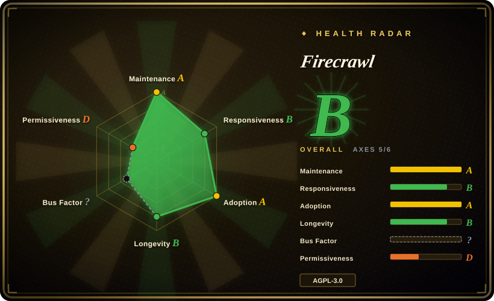
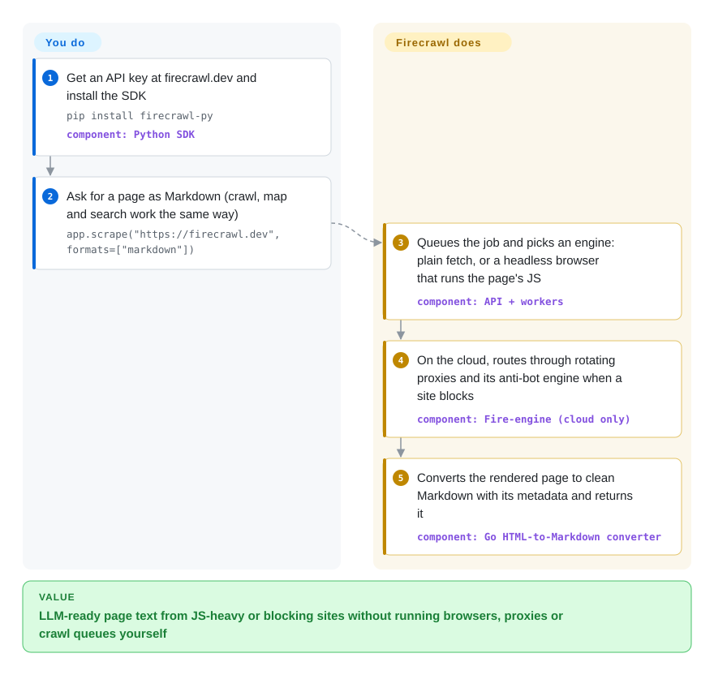

# Firecrawl

Your agent has to read the web, but `curl` gives it 300 KB of markup for one paragraph of text, JavaScript-heavy pages come back as an empty `
`, and half the sites answer with a bot check. Firecrawl is a scraping API: you send a URL (or a search query, or a whole site), and it renders the page, gets past the blocking where it can, and returns clean Markdown or JSON.

## When to use

You are building an AI agent, a RAG ingester or a research tool, and web pages are an input you do not want to own. You tried `requests` plus an HTML-to-Markdown converter. React docs sites returned nothing, a news site returned a cookie wall, and your crawler for "all pages under /docs" turned into a week of queue code. You reach for Firecrawl because one call, `app.scrape(url, formats=["markdown"])`, covers rendering, proxies and conversion. Sibling endpoints cover the rest of the job: `search` (web search plus page content), `crawl` (a whole site), `map` (list a site's URLs) and `agent` (describe the data and let it find the pages). It also plugs into coding agents as an MCP server or CLI skill.

Pick it over [trafilatura](../article-extraction/trafilatura.md) or [Readability.js](../article-extraction/readability-js.md) when your sources are JavaScript-rendered or blocked, or when you need crawling and search, not just main-text extraction from HTML you already have. Pick it over writing [Playwright](../../web-automation/playwright-family/playwright.md) or [Scrapling](scrapling.md) scripts when you would rather pay per page (or run its stack) than maintain browsers, proxies and selectors yourself. The deciding fact is that the hard anti-bot engine and several features live only in the hosted cloud.

## How it works

Firecrawl is an HTTP API with SDKs (Python, Node, Go, Rust, Java and more), a CLI and an MCP server in front. Behind the API, a job queue hands each URL to a scrape engine. That is either a plain fetch or a headless browser (a real Chromium with no visible window) that runs the page's JavaScript before reading it. The result is converted into Markdown, HTML, links or LLM-extracted JSON. On the hosted service (firecrawl.dev) you only bring an API key, and the company runs the browsers, rotating proxies and rate limiting, including a proprietary engine called Fire-engine. You can also self-host the AGPL-3.0 code with Docker Compose. Then you run the API, workers, a Playwright service, Redis, RabbitMQ and PostgreSQL yourself, and the self-host guide states that Fire-engine, screenshots, page actions and the Agent/interact features are not included. Either way, you decide which URLs, which formats and how deep a crawl goes. Firecrawl does the fetching, rendering and cleanup.

<!-- flow-steps:begin (generated from flows/firecrawl.json by tools/flow_card.py — do not edit) -->

Text version of the flow

1. **You**: Get an API key at firecrawl.dev and install the SDK — `pip install firecrawl-py` — component: `Python SDK`
2. **You**: Ask for a page as Markdown (crawl, map and search work the same way) — `app.scrape("https://firecrawl.dev", formats=["markdown"])`
3. **Firecrawl**: Queues the job and picks an engine: plain fetch, or a headless browser that runs the page's JS — component: `API + workers`
4. **Firecrawl**: On the cloud, routes through rotating proxies and its anti-bot engine when a site blocks — component: `Fire-engine (cloud only)`
5. **Firecrawl**: Converts the rendered page to clean Markdown with its metadata and returns it — component: `Go HTML-to-Markdown converter`

**Value**: LLM-ready page text from JS-heavy or blocking sites without running browsers, proxies or crawl queues yourself

<!-- flow-steps:end -->

## When NOT to use

- **You plan to self-host and expect the cloud product.** The open-source stack ships with fetch plus Playwright only. Fire-engine anti-bot, screenshots, page actions, Agent and interact are cloud-only or need separate services, per the self-host guide. If you must stay on your own infrastructure and the targets fight back, use [Scrapling](scrapling.md)'s stealth fetchers. If you need scripted clicks and logins, use [Playwright](../../web-automation/playwright-family/playwright.md).
- **The pages are static HTML and you only need the article.** Use [trafilatura](../article-extraction/trafilatura.md) (Apache-2.0, `pip install`, no service) instead of paying per page or running a multi-container stack for a job a library does in-process.
- **You will modify Firecrawl and offer it to others over a network, and copyleft is unacceptable.** The core is AGPL-3.0, which applies to network use of modified code. The SDKs and some UI components are MIT. Calling the hosted API from closed-source code is a different case from modifying the server. If you need a permissive scraping engine you can fork freely, build on Scrapling (BSD-3-Clause) or Playwright (Apache-2.0).
- **High, steady volume with a fixed budget.** The hosted service bills per credit. At millions of pages a month, a Scrapy/Playwright fleet you run yourself (with [Scrapyd](scrapyd.md) for scheduling) usually beats a per-page price. It costs you engineering time instead.
- **The data cannot leave your network, or a third party may not see your target URLs.** The hosted API sees every URL and page you fetch. Self-host (and accept the ops in "Ops difficulty") or use an in-process library.
- **Deep, stateful authenticated flows across many sites.** Multi-step logins, MFA and long sessions are more controllable in your own Playwright code than through a scrape API's action list, which self-hosted Firecrawl does not support anyway.

## Comparison

| Alternative | In index | Our verdict | Tradeoff |
| --- | --- | --- | --- |
| [trafilatura](../article-extraction/trafilatura.md) | ✅ | For server-rendered article pages processed in Python, choose trafilatura. Choose Firecrawl when pages need JS rendering, anti-bot handling, crawling as a service or search. | trafilatura is Apache-2.0, in-process and free, but sees only raw HTML. Firecrawl sees rendered pages but costs credits or a multi-service deployment. |
| [Scrapling](scrapling.md) | ✅ | When you must run on your own machines against sites that block bots, choose Scrapling. Choose Firecrawl's cloud when you would rather buy that capability than operate it. | Scrapling gives you the stealth browser and adaptive selectors in a BSD library you control. Firecrawl hides all of it behind an API, but its strongest anti-bot engine is not in the self-hosted build. |
| [Playwright](../../web-automation/playwright-family/playwright.md) | ✅ | For logins, multi-step interactions and full control of the browser, choose Playwright. Choose Firecrawl when "URL in, Markdown out" is all you need. | Playwright is the browser layer Firecrawl's self-hosted stack itself uses. You get total control but write the extraction, retries, queueing and proxies yourself. |
| [Scrapyd](scrapyd.md) | ✅ | When you already write Scrapy spiders and need to deploy and schedule them, choose Scrapyd. Choose Firecrawl when you do not want to write spiders at all. | Scrapyd runs your code with full control and no per-page fee. Firecrawl replaces the spider with an API call but makes you depend on its engine and pricing. |
| Crawl4AI | not indexed | If you want an open-source, LLM-oriented crawler as a Python library without a service stack, evaluate Crawl4AI. Choose Firecrawl when you want a managed API with SDKs in many languages. | Crawl4AI runs in your process (with your own browser). Firecrawl offloads the browser fleet but is AGPL or paid. |

## Tech stack

- **TypeScript / Node.js:** the API server and workers (`apps/api`) and a separate Playwright scraping service (`apps/playwright-service-ts`).
- **Go and Rust:** HTML-to-Markdown conversion is a Go library, loaded into the API as a shared library or run as a separate service (`apps/go-html-to-md-service`), with a Rust native module (`@mendable/firecrawl-rs`) post-processing the Markdown.
- **Queues and storage:** Redis, RabbitMQ and "NuQ" PostgreSQL, a PostgreSQL-backed job queue. FoundationDB is an experimental alternative queue backend.
- **Browser automation:** Playwright (Chromium) in the self-hosted stack. The cloud adds the proprietary Fire-engine.
- **Clients:** SDKs for Python, Node.js, Go, Java, Rust, Ruby, Elixir, .NET and PHP, plus a CLI, an MCP server (`firecrawl-mcp`) and agent skills.
- **AI features:** OpenAI-compatible providers or Ollama for LLM extraction when self-hosting.

## Dependencies

- **Hosted:** an API key from firecrawl.dev and outbound HTTPS. Nothing else runs on your side.
- **Self-hosted (Docker Compose at v2.11.x):** the Firecrawl API and worker containers, the Playwright service, Redis, RabbitMQ and NuQ PostgreSQL (FoundationDB only if you set `NUQ_BACKEND=fdb`). Only the API port (3002) is published by default.
- **Optional:** an LLM provider (OpenAI-compatible endpoint or Ollama) for JSON/LLM extraction. A separately run Fire-engine or proxy provider for harder targets.

## Ops difficulty

**Low (hosted) / High (self-hosted).** Hosted is an HTTP integration with an API key and a credit budget. Self-hosting is a real distributed system. The default compose file runs with API authentication off (`USE_DB_AUTHENTICATION=false`), no persistent volumes for PostgreSQL, Redis or RabbitMQ, and no TLS. The project's own guide calls it "a source-aligned starting point, not a production architecture". You own auth, backups, scaling of memory-hungry browser workers, upgrades pinned to exact release tags, and the gap between the cloud and self-hosted feature sets.

## Health & viability

- **Maintenance (A), as of 2026-10-08:** commits every day (13 of 13 recent weeks active, last commit 0 days ago). The code ships continuously as rolling `v2.11.x` tags. The last formal GitHub release was v2.11.0 (2026-06-19).
- **Governance (A, newly scored, was "?"):** 51 active contributors in the trailing 12 months, and no single person dominates. The roadmap belongs to one company, Firecrawl (formerly Mendable; the repo moved from `mendableai/` to `firecrawl/`), which also sells the cloud. Expect open-source priorities to follow the commercial product.
- **Longevity (B) and Lindy:** created 2024-04, 905 days old. Young, so the Lindy prior is weak despite the activity.
- **Adoption (A):** 5,339,910 `firecrawl-py` downloads in the last month, plus integrations with n8n, Zapier, Lovable and MCP clients. The star count (~190k in about two and a half years) is far above typical for an infrastructure repo of this age. Treat it as a hype signal, not proof of production use.
- **Risk / License (D):** AGPL-3.0 core with MIT SDKs, and an open-core split where key capabilities (Fire-engine, actions, Agent) are cloud-only. No relicense observed, but the commercial pull is the main risk.

## Caveats (unverified)

- [未验证] README performance claims ("covers 96% of the web", "P95 latency of 3.4s") are vendor benchmarks and were not reproduced.
- [未验证] Whether calling the hosted API from proprietary code triggers any AGPL obligation was not legally reviewed. The reading that it does not (because you are not modifying or distributing the server) is the common interpretation, not legal advice.
- [推断] The self-hosted vs cloud feature gap is taken from the self-host guide pinned to v2.11.162. Later tags may change which features run without Fire-engine.
- [未验证] Crawl4AI's license terms and current feature set were not read for this page. The comparison row is based only on its being an in-process Python crawler.
- [推断] The very high star count relative to age suggests heavy marketing-driven starring. Organic production adoption beyond SDK downloads was not measured.
