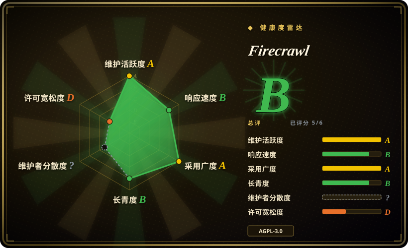
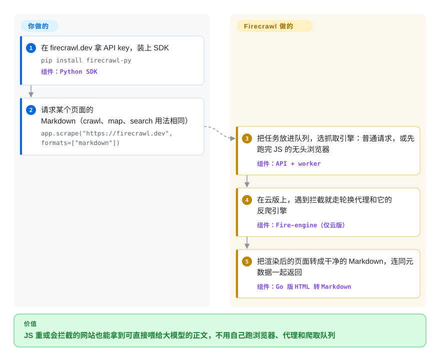

# Firecrawl

你的 agent 得读网页，可 `curl` 回来的是 300 KB 标记包着一段正文，靠 JavaScript 渲染的页面只剩一个空的 `
`，一半网站还先甩给你一个机器人验证。Firecrawl 是一个抓取 API：你发一个 URL（或一个搜索词、一整个站点），它负责渲染页面、尽量绕过拦截，交回干净的 Markdown 或 JSON。

## 何时使用

你在做 AI agent、RAG 入库程序或调研工具，网页是输入之一，但你不想自己扛这一层。你试过 `requests` 加一个 HTML 转 Markdown 的工具，结果 React 写的文档站返回空白，新闻站返回 Cookie 墙，“抓 /docs 下所有页面”的爬虫写成了一周的队列代码。这时你会想到 Firecrawl：一行 `app.scrape(url, formats=["markdown"])` 就把渲染、代理、转换都包了。同一套接口还有 `search`（网页搜索并带回正文）、`crawl`（整站）、`map`（列出站点全部 URL）和 `agent`（描述你要什么数据，它自己去找页面）。它还能以 MCP 服务器或 CLI 技能的形式接进编码 agent。

数据源靠 JavaScript 渲染或会拦截你，或者你需要爬取和搜索，而不只是从手上的 HTML 里抽正文时，选它而不是 [trafilatura](../article-extraction/trafilatura.zh.md) 或 [Readability.js](../article-extraction/readability-js.zh.md)。宁可按页付费（或运维它那套服务），也不想自己维护浏览器、代理和选择器时，选它而不是自己写 [Playwright](../../web-automation/playwright-family/playwright.zh.md) 或 [Scrapling](scrapling.zh.md) 脚本。决定性的事实是：最强的反爬引擎和好几项功能只在托管云上有。

## 怎么用起来

Firecrawl 是一个 HTTP API，前面挂着多种语言的 SDK（Python、Node、Go、Rust、Java 等）、一个命令行和一个 MCP 服务器。API 背后，任务队列把每个 URL 派给一个抓取引擎：要么是普通 HTTP 请求，要么是无头浏览器，也就是没有窗口的真 Chromium，先把页面里的 JavaScript 跑完再读。结果被转成 Markdown、HTML、链接列表，或由大模型抽成 JSON。用托管版（firecrawl.dev）时，你只带一个 API key，浏览器、轮换代理、限速都由公司来跑，其中包括一个叫 Fire-engine 的闭源引擎。你也可以用 Docker Compose 自托管 AGPL-3.0 的代码。那样 API、worker、Playwright 服务、Redis、RabbitMQ、PostgreSQL 都要你自己跑，而且自托管指南写明：Fire-engine、截图、页面动作、Agent 和 interact 功能都不包含在内。无论哪种方式，抓哪些 URL、要什么格式、爬多深由你定，抓取、渲染和清洗由 Firecrawl 做。

<!-- flow-steps:begin (generated from flows/firecrawl.json by tools/flow_card.py — do not edit) -->

流程文字版

1. **你**：在 firecrawl.dev 拿 API key，装上 SDK — `pip install firecrawl-py` — 组件：`Python SDK`
2. **你**：请求某个页面的 Markdown（crawl、map、search 用法相同） — `app.scrape("https://firecrawl.dev", formats=["markdown"])`
3. **Firecrawl**：把任务放进队列，选抓取引擎：普通请求，或先跑完 JS 的无头浏览器 — 组件：`API + worker`
4. **Firecrawl**：在云版上，遇到拦截就走轮换代理和它的反爬引擎 — 组件：`Fire-engine（仅云版）`
5. **Firecrawl**：把渲染后的页面转成干净的 Markdown，连同元数据一起返回 — 组件：`Go 版 HTML 转 Markdown`

**价值**：JS 重或会拦截的网站也能拿到可直接喂给大模型的正文，不用自己跑浏览器、代理和爬取队列

<!-- flow-steps:end -->

## 何时不用

- **你打算自托管，却指望拿到云版的能力。** 开源栈只带普通抓取加 Playwright。按自托管指南，Fire-engine 反爬、截图、页面动作、Agent 和 interact 要么只在云上有，要么得另配服务。必须留在自己机器上又遇到反爬时，用 [Scrapling](scrapling.zh.md) 的隐身抓取器。需要脚本化点击和登录时，用 [Playwright](../../web-automation/playwright-family/playwright.zh.md)。
- **页面是静态 HTML，你只要正文。** 用 [trafilatura](../article-extraction/trafilatura.zh.md)（Apache-2.0，`pip install`，没有服务）。一个库在进程内就能做完的事，不值得按页付费或运维一整套多容器服务。
- **你要修改 Firecrawl 再通过网络提供给别人用，又不能接受 copyleft。** 核心是 AGPL-3.0，修改后的代码通过网络提供服务也受约束。SDK 和部分 UI 组件是 MIT。在闭源代码里调用托管 API 和修改服务端代码是两回事。需要一个能随意分叉的宽松许可抓取引擎时，基于 Scrapling（BSD-3-Clause）或 Playwright（Apache-2.0）来搭。
- **量大且稳定，预算固定。** 托管版按积分计费。每月几百万页的量级，自己跑一组 Scrapy/Playwright 机器（用 [Scrapyd](scrapyd.zh.md) 调度）通常比按页价格便宜，代价是工程时间。
- **数据不能出内网，或不能让第三方看到你的目标 URL。** 托管 API 能看到你抓的每个 URL 和页面。要么自托管（并接受“运维难度”里那些活），要么用进程内的库。
- **跨多个网站的深度、有状态的登录流程。** 多步登录、MFA、长会话，在你自己的 Playwright 代码里比通过抓取 API 的动作列表更可控，何况自托管版的 Firecrawl 本来就不支持页面动作。

## 横向对比

| 替代品 | 是否收录 | 我们的评价 | 取舍 |
| --- | --- | --- | --- |
| [trafilatura](../article-extraction/trafilatura.zh.md) | ✅ | 用 Python 处理服务端渲染的文章页，选 trafilatura。页面需要 JS 渲染、反爬、托管式爬取或搜索时，选 Firecrawl。 | trafilatura 是 Apache-2.0、进程内运行、免费，但只看得到原始 HTML。Firecrawl 看得到渲染后的页面，代价是积分费用或一套多服务部署。 |
| [Scrapling](scrapling.zh.md) | ✅ | 必须在自己机器上对付会拦机器人的网站，选 Scrapling。宁可买下这项能力也不想自己运维时，选 Firecrawl 云版。 | Scrapling 把隐身浏览器和自适应选择器放进一个你能掌控的 BSD 库里。Firecrawl 把这一切藏在 API 后面，但最强的反爬引擎不在自托管版里。 |
| [Playwright](../../web-automation/playwright-family/playwright.zh.md) | ✅ | 要登录、多步交互、完全掌控浏览器，选 Playwright。只需要“URL 进、Markdown 出”，选 Firecrawl。 | Playwright 正是 Firecrawl 自托管栈本身用的浏览器层。你得到完全控制权，但提取、重试、排队、代理都得自己写。 |
| [Scrapyd](scrapyd.zh.md) | ✅ | 已经在写 Scrapy 爬虫、需要部署和调度它们，选 Scrapyd。根本不想写爬虫，选 Firecrawl。 | Scrapyd 跑你自己的代码，完全可控、不按页收费。Firecrawl 用一次 API 调用替代爬虫，但你要依赖它的引擎和定价。 |
| Crawl4AI | 未收录 | 想要一个开源、面向大模型、以 Python 库形式运行、不用部署服务的爬虫，评估 Crawl4AI。想要多语言 SDK 的托管 API，选 Firecrawl。 | Crawl4AI 在你的进程里运行（用你自己的浏览器）。Firecrawl 把浏览器集群外包出去，但要么受 AGPL 约束，要么付费。 |

## 技术栈

- **TypeScript / Node.js：** API 服务和 worker（`apps/api`），以及一个独立的 Playwright 抓取服务（`apps/playwright-service-ts`）。
- **Go 与 Rust：** HTML 转 Markdown 由一个 Go 库完成，要么作为共享库加载进 API，要么作为独立服务运行（`apps/go-html-to-md-service`），再由 Rust 原生模块（`@mendable/firecrawl-rs`）对 Markdown 做后处理。
- **队列与存储：** Redis、RabbitMQ，以及基于 PostgreSQL 的任务队列 “NuQ”。FoundationDB 是实验性的备选队列后端。
- **浏览器自动化：** 自托管栈用 Playwright（Chromium），云版另加闭源的 Fire-engine。
- **客户端：** Python、Node.js、Go、Java、Rust、Ruby、Elixir、.NET、PHP 的 SDK，外加命令行、MCP 服务器（`firecrawl-mcp`）和 agent 技能。
- **AI 功能：** 自托管时接 OpenAI 兼容接口或 Ollama，用于大模型提取。

## 依赖

- **托管版：** firecrawl.dev 的 API key 和出站 HTTPS，你这边什么都不用跑。
- **自托管（v2.11.x 的 Docker Compose）：** Firecrawl API 和 worker 容器、Playwright 服务、Redis、RabbitMQ、NuQ PostgreSQL（设了 `NUQ_BACKEND=fdb` 才需要 FoundationDB）。默认只对宿主机暴露 API 端口（3002）。
- **可选：** 大模型提供方（OpenAI 兼容接口或 Ollama），用于 JSON/大模型提取。难抓的目标可另配单独运行的 Fire-engine 或代理服务商。

## 运维难度

**低（托管）/ 高（自托管）。** 托管版就是一个带 API key 和积分预算的 HTTP 集成。自托管是一个真正的分布式系统。默认 compose 关掉了 API 鉴权（`USE_DB_AUTHENTICATION=false`），PostgreSQL、Redis、RabbitMQ 都没有持久卷，也没有 TLS。项目自己的指南称它是“与源码对齐的起点，不是生产架构”。鉴权、备份、吃内存的浏览器 worker 怎么扩容、按精确版本标签升级、云版和自托管版的功能差距，全归你管。

## 健康度与可持续性

- **维护（A，截至 2026-10-08）：** 每天都有提交（近 13 周 13 周活跃，最后一次提交在 0 天前）。代码以滚动的 `v2.11.x` 标签持续发布，最近一次正式 GitHub release 是 v2.11.0（2026-06-19）。
- **治理（A，新近可评，原为“?”）：** 过去 12 个月有 51 名活跃贡献者，没有哪个人一家独大。但路线图归一家公司 Firecrawl 所有（前身 Mendable，仓库从 `mendableai/` 迁到 `firecrawl/`），它同时在卖云服务。开源部分的优先级会跟着商业产品走。
- **存续（B）与 Lindy：** 2024-04 创建，仓库 905 天。很年轻，尽管很活跃，Lindy 先验仍然弱。
- **采用（A）：** `firecrawl-py` 近一个月下载 5,339,910 次，另有 n8n、Zapier、Lovable 和各类 MCP 客户端的集成。约两年半拿到约 19 万 star，远超同龄基础设施仓库的常态。把它当作热度信号，不是生产使用的证据。
- **风险/许可（D）：** 核心 AGPL-3.0，SDK 是 MIT，并且是开源核心模式：关键能力（Fire-engine、页面动作、Agent）只在云上。没看到改许可的历史，但商业拉力是主要风险。

## 存疑（未验证）

- [未验证] README 里的性能说法（“覆盖 96% 的网页”“P95 延迟 3.4 秒”）是厂商自测，本页没有复现。
- [未验证] 在闭源代码里调用托管 API 是否触发 AGPL 义务，没有做法律审查。“不触发”（因为你没修改也没分发服务端）是常见理解，不构成法律意见。
- [推断] 自托管与云版的功能差距取自固定在 v2.11.162 的自托管指南。之后的标签可能改变哪些功能在没有 Fire-engine 时可用。
- [未验证] 本页没有阅读 Crawl4AI 的许可条款和当前功能。对比行只基于它是一个进程内运行的 Python 爬虫这一点。
- [推断] star 数相对仓库年龄极高，说明有大量营销带来的点星。SDK 下载量之外的真实生产采用情况没有测量。
