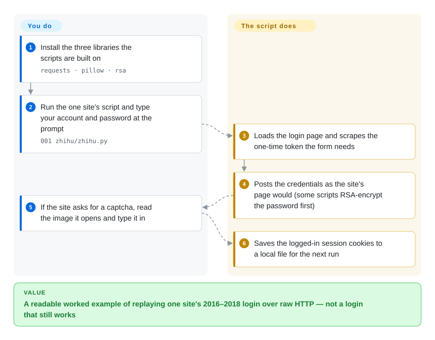

# fuck-login

A collection of ~20 Python scripts that script the login flow of well-known (mostly Chinese) websites — Zhihu, Weibo, Baidu, JD, Bilibili, GitHub, Douban — so you can carry the resulting session cookies into a scraper. A 2016-era teaching repo, explicitly **no longer maintained**.

## When to use

You're a Python beginner learning how site logins actually work under the hood — CSRF tokens, RSA-encrypted passwords, captcha images, the dance of cookies and headers — and you want concrete, readable examples instead of abstract theory. You stumble on this repo, open `zhihu/`, and read a self-contained script that uses `requests` to fetch the login page, `pillow` to surface the captcha, and `rsa` to encrypt the password the way the site's JavaScript does, then proves it worked by hitting a logged-in endpoint. As a *historical learning artifact* — "here is roughly how people automated logins in 2016–2018" — it's a fine read.

Realistically that's the only safe use today. The login flows these scripts target have changed repeatedly in the years since the last commit (2018-06), so treat any individual script as illustrative pseudo-code, not a working tool. [推断]

## How it works

There is no library here to install or import: each folder holds one standalone script that replays one website's login **as raw HTTP requests**, the way a browser would have sent them in 2016–2018. **The script does the request choreography for that one site; you supply the account, the password, and — when the site asks — your own eyes for the captcha.** Taking the Zhihu script as the example: it loads the login page, scrapes a one-time anti-forgery token (`_xsrf`, which the site checks to make sure the form came from its own page), posts your credentials with that token, and if the site refuses without a captcha, downloads the captcha image, opens it with pillow and waits for you to type it. Other scripts add a step the site's JavaScript performed, such as encrypting the password with the site's RSA public key before sending. On success the session cookies — the small tokens that tell the site "this client is logged in" — are saved to a local file, so a scraper can reuse them. Think of it as a recorded set of dance steps for a partner who has since changed the choreography: you can learn the moves, but the partner no longer follows them.

<!-- flow-steps:begin (generated from flows/fuck-login.json by tools/flow_card.py — do not edit) -->

Text version of the flow

1. **You**: Install the three libraries the scripts are built on — `requests · pillow · rsa`
2. **You**: Run the one site's script and type your account and password at the prompt — `001 zhihu/zhihu.py`
3. **fuck-login**: Loads the login page and scrapes the one-time token the form needs
4. **fuck-login**: Posts the credentials as the site's page would (some scripts RSA-encrypt the password first)
5. **You**: If the site asks for a captcha, read the image it opens and type it in
6. **fuck-login**: Saves the logged-in session cookies to a local file for the next run

**Value**: A readable worked example of replaying one site's 2016–2018 login over raw HTTP — not a login that still works

<!-- flow-steps:end -->

## When NOT to use

- **You need it to actually log in today.** The repo is abandoned (last push 2018-06) and targets login flows from 2016–2018; the major sites here have changed auth, added captcha/risk-control, and rotated endpoints since. Expect most scripts to be broken. [推断]
- **Anything production or at scale.** No package, no tests, no releases, no API — it is a folder of demo scripts, not a library you import.
- **You want a real captcha solution.** It surfaces captcha images for a human; it does not solve modern behavioral/sliding/JS captchas.
- **You care about licensing.** There is **no LICENSE file** in the repo, so the code is "all rights reserved" by default copyright — you have no legal grant to reuse it. [推断]
- **You have ToS / legal sensitivity.** Automating logins to scrape often violates site Terms of Service and, in some jurisdictions, anti-circumvention or unauthorized-access law; this is for learning, not for evading site controls.
- **You need maintained scraping infra.** Use a maintained framework (Scrapy, Playwright) and handle auth yourself; this repo will not be patched.

## Comparison

| Alternative | In index | Our verdict | Tradeoff |
|---|---|---|---|
| Playwright / [Selenium](../../web-automation/browser-driver-frameworks/selenium.md) | 部分已收录 | Choose Playwright or Selenium when you need a real browser to handle JS and modern auth. | Drive a real browser to log in instead of replaying raw HTTP; heavier but more viable on modern sites. Playwright is not indexed separately. |
| Scrapy | 未收录 | Choose Scrapy when you need a maintained crawling framework with a login middleware pattern. | A maintained crawling framework with a login middleware pattern; you write the auth, but everything around it is production-grade. |
| [requests-html](requests-html.md) | ✅ | Choose requests-html when you need a maintained-ish requests + JS-rendering scraper building block. | Maintained-ish requests + JS-rendering scraper; a real building block, where fuck-login is just example scripts. |
| [newspaper](../article-extraction/newspaper.md) | ✅ | Choose newspaper when you need article extraction, not login automation. | Article extraction, not login automation — different job; listed to show this category's maintained members. |
| DrissionPage | 未收录 | Choose DrissionPage when you need a modern Chinese-ecosystem browser-automation/scraping library. | Modern Chinese-ecosystem browser-automation/scraping lib; a living alternative for the same "log in to a CN site then scrape" goal. |

## Tech stack

- **Language:** Python 2/3-era scripts (README asks PRs to keep Py2/Py3 compatible — so it predates Py3-only norms).
- **Core libraries:** `requests` (HTTP + session/cookies), `pillow` (render captcha images for the user), `rsa` (replicate the site's password encryption).
- **Shape:** one directory per target site, each a near-standalone script; no shared library layer, no packaging.

## Dependencies

- **Runtime:** a Python interpreter plus `requests`, `pillow`, `rsa`; some scripts may need extra per-site libs. No central manifest pins versions, so expect to install ad hoc.
- **External:** network access to the target sites — and, critically, the *current* site behaving like its 2016–2018 self, which it generally does not.
- **No services/DB:** nothing to stand up; it writes/reads cookies locally.

## Ops difficulty

**Not applicable as infrastructure** — there is nothing to deploy or operate. The only "ops" is getting one script to run, which today usually means debugging why a site's changed login no longer matches the script and rewriting the request flow yourself. As a maintained dependency the difficulty is effectively *infinite*: it won't be updated, so you own every break.

## Health & viability

- **Responsiveness**: Cannot be scored — no_data.
- **Maintenance (2026-06).** **Abandoned.** README states outright "本项目不在继续维护了 (This project is not maintained)"; last push 2018-06-08, ~8 years stale. Archived on GitHub (and functionally abandoned).
- **Governance / bus factor.** Single-maintainer (`xchaoinfo`) personal/teaching repo on a `User` account with 5.8k stars — high stars on an abandoned single-author repo is a **risk flag**, not social proof: the stars reflect 2016-era popularity, not current health.
- **Age & Lindy verdict.** Created 2016-02, ~10 years old but **not still active** ⇒ Lindy **fails**: age without ongoing activity is a negative signal here, not a positive one. A long-abandoned repo is the textbook case where the Lindy prior does *not* apply.
- **Backing.** None — personal project, originally tied to a video tutorial series ("Python 模拟登录那些事儿") and a WeChat public account. No org, no funding.
- **Risk flags.** No license (legal reuse risk); abandoned; targets that have since changed; subject matter (login automation to scrape) carries ToS/legal exposure. [推断]

## Caveats (unverified)

- Archived on GitHub (`archived: true` via the GitHub API as of 2026-06-28) and abandoned since 2018; the repo is read-only and will receive no further commits.
- [推断] No LICENSE file in the repo tree (checked via the GitHub API on 2026-10-08); reading that as default copyright with no reuse grant is a general legal inference, not legal advice. Treat as unlicensed; the `license` field is set to `NONE` to reflect this.
- [推断] "Most scripts are broken today" is inferred from the 2018 freeze plus known auth/captcha changes on the target sites, not from running each script.
- [未验证] ~5.8k stars / 1.97k forks as of 2026-06; star counts are date-sensitive and here reflect historical, not current, relevance.
- [未验证] The exact set and current working state of the ~20 site scripts shift; verify any specific one against the live site before relying on it.
- [推断] Dependency versions are not centrally pinned; the install set above is inferred from the README's named libraries.
