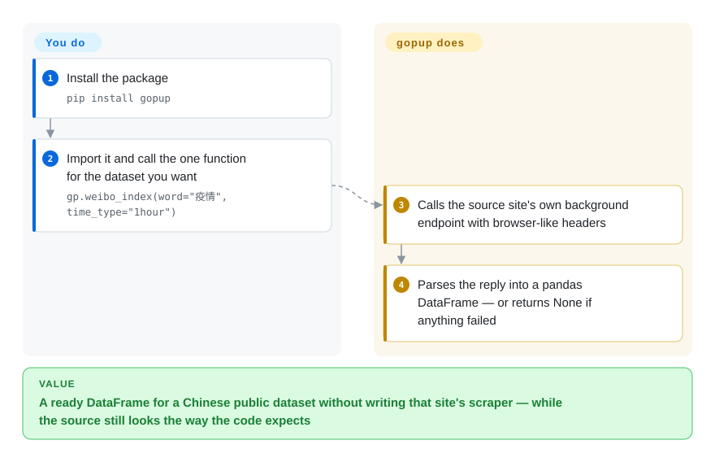

# gopup

A Python library that wraps a grab-bag of (mostly Chinese) public data sources behind one-line calls returning pandas DataFrames — Baidu/Weibo/Google search indices, Chinese macro indicators (CPI/PPI/PMI, money supply, FX rates), Shibor/LPR rates, unicorn-company lists, box-office and epidemic data, and more.

## When to use

You're a quant researcher or data analyst in China doing exploratory work, and you need a quick pull of some public dataset — say the Weibo search index for a keyword, the latest CPI, or Shibor rates — to drop straight into a notebook. You don't want to find the source site, reverse its API, and parse the response yourself. You `pip install gopup`, write `gp.weibo_index(word="疫情", time_type="1hour")`, and get a DataFrame back, then move on to the actual analysis. The value is the *catalog*: dozens of heterogeneous Chinese sources behind one consistent DataFrame-returning interface, so you stay in pandas instead of writing a fresh scraper per source.

It fits academic/research use specifically — the README is explicit that the data is for academic research. The README also says some interfaces need a TOKEN registered on the project's site (gopup.cn); those are the `pro_api` interfaces, and as of 2026-10-08 that site no longer serves gopup at all. The Baidu index functions take your own logged-in Baidu `cookie` instead.

## How it works

Each gopup function is a small, pre-written scraper for one Chinese public data source. **The scraping ships in the package — which URL to hit, which headers make the request look like a browser, how to turn the reply into a table; you only pick the function and its arguments.** `gp.weibo_index(word=..., time_type=...)`, for example, asks the same background endpoint that Weibo's index page calls in your browser, then reshapes the numbers into a pandas DataFrame (the standard Python table object). There is no server in between: your process talks to the source sites directly, so each function works only as long as its source keeps the page or API the code was written against. A few groups need something from you — the Baidu index functions take your own logged-in Baidu `cookie`, and the TOKEN-based `pro_api` depended on gopup.cn, which no longer serves it. When a source has changed, many functions do not raise an error; they catch it and quietly return `None`, so checking each return value is your job.

<!-- flow-steps:begin (generated from flows/gopup.json by tools/flow_card.py — do not edit) -->

Text version of the flow

1. **You**: Install the package — `pip install gopup`
2. **You**: Import it and call the one function for the dataset you want — `gp.weibo_index(word="疫情", time_type="1hour")`
3. **gopup**: Calls the source site's own background endpoint with browser-like headers
4. **gopup**: Parses the reply into a pandas DataFrame — or returns None if anything failed

**Value**: A ready DataFrame for a Chinese public dataset without writing that site's scraper — while the source still looks the way the code expects

<!-- flow-steps:end -->

## When NOT to use

- **Production or anything you must rely on.** These are scrapers over third-party public sites; when a source changes its page/API, the corresponding `gopup` function breaks until someone patches it — and maintenance has slowed (last commit 2023-09). [推断]
- **You need data outside China.** The catalog is overwhelmingly Chinese sources (Baidu/Weibo/Toutiao indices, Chinese macro/rates); for global market or alt-data you want a different tool.
- **Stable, licensed data feeds.** For anything commercial or compliance-sensitive, use an official/licensed data vendor — scraped public data carries ToS, accuracy, and continuity risk.
- **You need the TOKEN interfaces or the online docs.** `gp.pro_api(token)` posts to `http://www.gopup.cn/api/v1` with a TOKEN registered on that site; on 2026-10-08 the domain served an unrelated landing page and the API path returned 404, so those interfaces and the Chinese docs the README links are gone. For a token-backed Chinese data API use [Tushare](../../investment-finance/tushare.md); for maintained docs use [AKShare](../../investment-finance/akshare.md).
- **You need failures to be loud.** Many functions wrap the whole fetch in a bare `except:` and `return None`, so a source that changed shape gives you `None` instead of an error. In an unattended job that is silent data loss; check every return value, or use [AKShare](../../investment-finance/akshare.md), where broken sources get fixed upstream.
- **You care about license clarity.** There is **no LICENSE file** in the repo — default copyright, no reuse grant. [推断]
- **Long-term reproducibility.** A research pipeline pinned to a coasting scraper of mutable public sites will rot; snapshot the data you pull.

## Comparison

| Alternative | In index | Our verdict | Tradeoff |
|---|---|---|---|
| [AKShare](../../investment-finance/akshare.md) | ✅ | Pick AKShare for the same Chinese finance/economics data job when maintenance and catalog breadth matter most. | The dominant, actively maintained Chinese open financial/economic data library; far broader catalog and a much larger community — generally the better-maintained choice for the same job. |
| [Tushare](../../investment-finance/tushare.md) | ✅ | Pick Tushare when you accept token/points gating for a long-standing Chinese markets data source. | Long-standing Chinese financial-data library (much of it token/points-gated now); strong on markets data, more commercial gating than gopup. |
| baostock | 未收录 | Pick baostock when you only need free Chinese stock/market history data. | Free Chinese stock/market history data; narrower (markets-only) but stable interface. |
| pandas-datareader | 未收录 | Pick pandas-datareader when the source set is mostly Western/global and DataFrame ergonomics are enough. | Maintained generic reader for (mostly Western) economic/market sources into DataFrames; same DataFrame ergonomics, different (global) source set. |
| [requests-html](requests-html.md) | ✅ | Pick requests-html when you want a generic scraping building block and are willing to implement every source yourself. | Generic scraping building block — you'd reimplement each source yourself; gopup is the pre-built catalog over many sources. |

## Tech stack

- **Language:** Python 3.7+ (per README).
- **Core:** pandas (every interface returns a DataFrame); HTTP scraping under the hood against the upstream public sources.
- **Shape:** a flat function catalog grouped by domain (index data, macro, rates, new-economy companies, KOL/Weibo data, news, etc.), distributed as a `pip`-installable package.

## Dependencies

- **Runtime:** Python 3.7+, pandas, requests, plus the scraping helpers `setup.py` declares (bs4, pyquery, demjson, jsonpath, PyExecJS, matplotlib, Pillow, xlrd); installed via `pip install gopup`.
- **External services:** network access to the many upstream Chinese sites it scrapes; the Baidu index functions need **your own logged-in Baidu cookie**. The TOKEN-gated `pro_api` depended on gopup.cn, whose API path returned 404 on 2026-10-08.
- **No DB/infra to run:** it's a client library; you bring your own notebook/script environment.

## Ops difficulty

**Low to operate, but fragile over time.** As a library there is nothing to deploy — `pip install` and call functions. The real cost is *maintenance fragility*: each function depends on an upstream site's current shape, so breakage is expected over months/years, and with the project coasting (last commit 2023-09) you may be the one fixing it. Plan for retries, caching, and snapshotting the data you depend on; don't put it on a critical, unattended path.

## Health & viability

- **Responsiveness**: Cannot be scored — no_data.
- **Maintenance (2026-10).** **Coasting / near-dormant.** Last commit 2023-09 (~3 years stale), last PyPI release 0.3.8 (2022-09); not archived, but no recent activity. For a scraper-over-public-sites library, staleness directly means broken interfaces accumulate. [推断]
- **Governance / bus factor.** Single-maintainer (`justinzm`) `User` repo — the contributor list is essentially one person. 2.5k stars on a one-author, stalling scraper is a mild **bus-factor flag**.
- **Age & Lindy verdict.** Created 2020-03, ~6 years old but only *intermittently* active; weak Lindy — young-ish and now coasting, so age gives little assurance here. [推断]
- **Backing.** None institutional; tied to the author and the gopup.cn site. That risk has already landed: on 2026-10-08 gopup.cn served an unrelated landing page, and the TOKEN API and the docs it hosted were gone.
- **Risk flags.** No LICENSE (legal reuse risk); scraping-ToS exposure on upstream sites; TOKEN API already offline; failures swallowed into `None`; data-accuracy/continuity risk inherent to scraped public data. [推断]

## Caveats (unverified)

- [推断] No LICENSE file in the repo tree (checked via the GitHub API on 2026-10-08); reading that as default copyright with no reuse grant is a general legal inference — `license` is set to `NONE`.
- [未验证] ~2.5k stars / 384 forks as of 2026-06; star counts are date-sensitive and not a maintenance signal.
- [未验证：未实际 pip install] The dependency list was read from `setup.py`; whether it still installs on current Python (e.g. `demjson`, pinned at 2.2.4 in `requirements.txt`, is an old package) was not tested.
- [推断] gopup.cn being gone is from two requests on 2026-10-08 (unrelated landing page; `/api/v1` → 404); whether the author moved the TOKEN API elsewhere was not searched beyond the README and source.
- [推断] The bare `except:` → `return None` pattern was seen in the sampled modules (`index_weibo`, `index_baidu`, `index_toutiao`, `hot_list`, `shibor`), not audited across every module.
- [推断] "Interfaces break as sources change" and "coasting" are inferred from the scraper architecture plus the 2023-09 last-commit date, not from testing each function.
- [未验证] Comparison rivals (AKShare/Tushare/baostock breadth and gating) are characterized from general ecosystem knowledge, not re-verified this pass.
