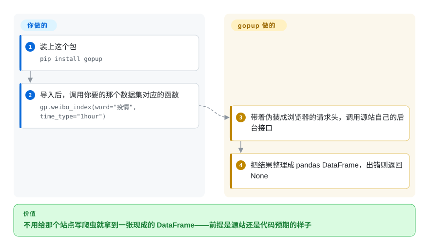

# gopup

一个 Python 库，把一大堆（多为中文的）公开数据源封装成返回 pandas DataFrame 的单行调用——百度/微博/谷歌搜索指数、中国宏观指标（CPI/PPI/PMI、货币供应量、汇率）、Shibor/LPR 利率、独角兽公司名单、影视票房和疫情数据等等。

## 何时使用

你是中国的量化研究者或数据分析师，在做探索性工作，需要快速拉取某个公开数据集——比如某关键词的微博搜索指数、最新 CPI，或 Shibor 利率——直接丢进 notebook。你不想去找源站、逆向它的 API、再自己解析返回。你 `pip install gopup`，写 `gp.weibo_index(word="疫情", time_type="1hour")`，拿回一个 DataFrame，然后接着做真正的分析。价值在于这个*目录*：几十个异构的中文源被收在一个统一的、返回 DataFrame 的接口背后，让你留在 pandas 里，而不必为每个源各写一个爬虫。

它专门契合学术/研究用途——README 明说数据仅用于学术研究。README 还说部分接口要在项目站点（gopup.cn）注册获取 TOKEN；那指的是 `pro_api` 一类接口，而截至 2026-10-08 该站点已经完全不再提供 gopup 的服务。百度指数类函数用的则是你自己登录百度后的 `cookie`。

## 怎么用起来

gopup 的每个函数，都是给某一个中文公开数据源预先写好的小爬虫。**爬取这部分随包附带——请求哪个网址、带什么请求头装成浏览器、怎么把返回结果整理成表格；你只管挑函数、填参数。** 比如 `gp.weibo_index(word=..., time_type=...)` 会去请求微博指数页面在你浏览器里调用的同一个后台接口，再把数字整理成 pandas DataFrame（Python 里标准的表格对象）。中间没有服务器：你的进程直接连源站，所以每个函数只在源站还保持着代码编写时的页面或接口时才能用。有几类函数要你出点东西——百度指数类函数要你自己登录百度后的 `cookie`，而基于 TOKEN 的 `pro_api` 依赖 gopup.cn，那个站点已不再提供这项服务。源站一改版，很多函数并不报错，而是把异常吞掉、悄悄返回 `None`，所以检查每个返回值是你的事。

<!-- flow-steps:begin (generated from flows/gopup.json by tools/flow_card.py — do not edit) -->

流程文字版

1. **你**：装上这个包 — `pip install gopup`
2. **你**：导入后，调用你要的那个数据集对应的函数 — `gp.weibo_index(word="疫情", time_type="1hour")`
3. **gopup**：带着伪装成浏览器的请求头，调用源站自己的后台接口
4. **gopup**：把结果整理成 pandas DataFrame，出错则返回 None

**价值**：不用给那个站点写爬虫就拿到一张现成的 DataFrame——前提是源站还是代码预期的样子

<!-- flow-steps:end -->

## 何时不用

- **生产，或任何你必须依赖的东西。** 这些是对第三方公开站点的爬虫；当某个源改了页面/API，对应的 `gopup` 函数就会失效，直到有人打补丁——而维护已放缓（最后提交 2023-09）。[推断]
- **你需要中国以外的数据。** 目录压倒性地是中文源（百度/微博/头条指数、中国宏观/利率）；要全球市场或另类数据请用别的工具。
- **稳定、有授权的数据源。** 任何涉及商业或合规的场景，请用官方/有授权的数据供应商——爬来的公开数据带 ToS、准确性和连续性风险。
- **你需要 TOKEN 接口或在线文档。** `gp.pro_api(token)` 会带着在 gopup.cn 注册的 TOKEN 去请求 `http://www.gopup.cn/api/v1`；2026-10-08 该域名返回的是一个无关的落地页，API 路径返回 404，所以这些接口和 README 链接的中文文档都已失效。要带 token 的中文数据 API，用 [Tushare](../../investment-finance/tushare.zh.md)；要有人维护的文档，用 [AKShare](../../investment-finance/akshare.zh.md)。
- **你需要失败时明确报错。** 很多函数把整段抓取包在一个裸 `except:` 里然后 `return None`，源站改版后你拿到的是 `None` 而不是报错。放在无人值守的任务里，这就是悄无声息的数据丢失；要么检查每个返回值，要么改用 [AKShare](../../investment-finance/akshare.zh.md)，那边坏掉的源会在上游被修。
- **你在意授权是否清晰。** 仓库里**没有 LICENSE 文件**——默认版权，没有复用授权。[推断]
- **长期可复现性。** 把研究管线钉在一个对可变公开源吃老本的爬虫上会腐烂；请对拉取到的数据做快照。

## 横向对比

| 替代品 | 是否收录 | 我们的评价 | 取舍 |
|---|---|---|---|
| [AKShare](../../investment-finance/akshare.zh.md) | 已收录 | 做同类中文金融/经济数据任务，且最看重维护活跃度和目录广度时，选 AKShare。 | 当下主流、活跃维护的中文开源金融/经济数据库；目录广得多、社区也大得多——干同样的活通常是更有维护的选择。 |
| [Tushare](../../investment-finance/tushare.zh.md) | 已收录 | 能接受 token/积分门槛，并需要老牌中文市场数据源时，选 Tushare。 | 老牌中文金融数据库（如今大量走 token/积分门槛）；市场数据强，比 gopup 更多商业门槛。 |
| baostock | 未收录 | 只需要免费的中文股票/行情历史数据时，选 baostock。 | 免费的中文股票/行情历史数据；更窄（仅市场）但接口稳定。 |
| pandas-datareader | 未收录 | 数据源主要是西方/全球市场，且 DataFrame 体验足够时，选 pandas-datareader。 | 有维护的通用读取器，把（多为西方的）经济/市场源读成 DataFrame；DataFrame 体验相同，源集（全球）不同。 |
| [requests-html](requests-html.zh.md) | ✅ | 想要通用爬取构件，并愿意自己实现每个数据源时，选 requests-html。 | 通用爬取构件——你得自己重写每个源；gopup 是覆盖多源的预制目录。 |

## 技术栈

- **语言：** Python 3.7+（据 README）。
- **核心：** pandas（每个接口都返回 DataFrame）；底层对上游公开源做 HTTP 爬取。
- **形态：** 一个按领域分组的扁平函数目录（指数数据、宏观、利率、新经济公司、KOL/微博数据、信息等），以 `pip` 可装的 package 分发。

## 依赖

- **运行时：** Python 3.7+、pandas、requests，外加 `setup.py` 声明的一组爬取辅助库（bs4、pyquery、demjson、jsonpath、PyExecJS、matplotlib、Pillow、xlrd）；经 `pip install gopup` 安装。
- **外部服务：** 能访问它所爬取的众多上游中文站点的网络；百度指数类函数需要**你自己登录百度后的 cookie**。需要 TOKEN 的 `pro_api` 依赖 gopup.cn，而它的 API 路径在 2026-10-08 返回 404。
- **无数据库/基础设施要跑：** 它是客户端库；你自带 notebook/脚本环境。

## 运维难度

**运行很轻，但随时间脆弱。** 作为库没什么要部署的——`pip install` 后调函数即可。真正的代价是*维护脆弱性*：每个函数都依赖某上游站点的当前形态，所以以月/年计的失效是预期内的，而项目正吃老本（最后提交 2023-09），可能得你自己来修。请规划重试、缓存，并对你依赖的数据做快照；别把它放在关键、无人值守的路径上。

## 健康度与可持续性

- **响应速度**：无法计算——no_data。
- **维护（2026-10）。** **吃老本 / 近乎停滞。** 最后提交 2023-09（停滞约 3 年），PyPI 最后发布 0.3.8（2022-09）；未归档，但近期无活动。对一个爬公开站点的库来说，停滞直接意味着失效的接口会累积。[推断]
- **治理 / bus factor。** 单一维护者（`justinzm`）的 `User` 仓库——贡献者列表基本就一个人。一个单作者、正在停滞的爬虫拿 2.5k star，是个轻度 **bus-factor 标记**。
- **年龄与 Lindy 判断。** 2020-03 创建，约 6 岁，但只是*断续*活跃；Lindy 偏弱——偏年轻且已吃老本，年龄在这里给不了多少保证。[推断]
- **背书。** 无机构背书；与作者及 gopup.cn 站点绑定。这个风险已经兑现：2026-10-08 gopup.cn 返回的是一个无关的落地页，它承载的 TOKEN API 和文档都已不在。
- **风险标记。** 无 LICENSE（法律复用风险）；上游站点的爬取 ToS 暴露；TOKEN API 已下线；失败被吞成 `None`；爬来的公开数据固有的准确性/连续性风险。[推断]

## 存疑（未验证）

- [推断] 仓库文件树里没有 LICENSE 文件（2026-10-08 经 GitHub API 核实）；据此认定按默认版权、没有复用授权，是一般性的法律推断——`license` 填为 `NONE`。
- [未验证] 截至 2026-06 约 2.5k star / 384 fork；star 数对时间敏感，不是维护信号。
- [未验证：未实际 pip install] 依赖列表读自 `setup.py`；它在当前 Python 上还能不能装上（比如 `requirements.txt` 里锁在 2.2.4 的 `demjson` 是个老包）没有实测。
- [推断] “gopup.cn 已失效”依据的是 2026-10-08 的两次请求（返回无关落地页；`/api/v1` 返回 404）；作者是否把 TOKEN API 挪到了别处，除 README 和源码外没有再找。
- [推断] 裸 `except:` → `return None` 的写法是在抽查的模块（`index_weibo`、`index_baidu`、`index_toutiao`、`hot_list`、`shibor`）里看到的，没有逐个模块审计。
- [推断] “源改版接口就失效”和“吃老本”是从爬虫架构加上 2023-09 的最后提交日期推断的，而非逐个函数测试。
- [推断] 对比对手（AKShare/Tushare/baostock 的广度与门槛）取自对生态的一般认知，本轮未再核验。
