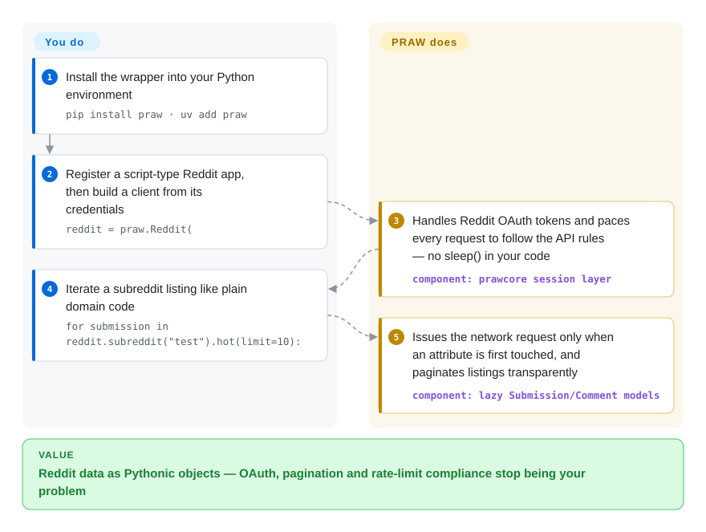

# PRAW

Your Reddit script keeps getting throttled because nobody refreshes the OAuth token or paces the calls. PRAW absorbs that plumbing: you code against Pythonic subreddit/submission objects, and it follows Reddit's API rules and rate-limits on your behalf.

## When to use

You're building something that reads or writes Reddit — a research dataset of posts from a few subreddits, a moderation bot that removes spam, a tool that monitors mentions of your product. You could hit Reddit's REST endpoints directly, but then you own OAuth token refresh, pagination, and (the painful part) staying under Reddit's rate limits without getting your app throttled or banned. You `pip install praw`, give it your client credentials and a descriptive user agent, and work with objects instead of JSON: `reddit.subreddit("python").hot(limit=25)` yields `Submission` objects you iterate; `submission.comments.replace_more()` flattens the comment forest. PRAW follows Reddit's API rules internally and paces requests for you, so the code reads like domain logic rather than HTTP plumbing.

It's the default building block when your data source *is* Reddit specifically and you want the official, OAuth-compliant path rather than scraping HTML. For streaming new items there's `subreddit.stream`, and an async sibling exists for concurrent workloads: the README points asyncio users (e.g. discord.py) to **Async PRAW**, its official asynchronous version, "similar in usage … the same features as PRAW" — same project, same maintainers, `pip install asyncpraw`.

## How it works

PRAW is a client-side abstraction over Reddit's OAuth API — nothing to run or deploy, no server component. You register an app on Reddit's "apps" page, pass the credentials to `praw.Reddit(...)`, and from there everything is a Python object. Under the hood the lower-level companion library `prawcore` owns the HTTP session: it gets and refreshes the OAuth token and reads Reddit's rate-limit headers to pace requests before they go out — the quota itself is Reddit's lever, not PRAW's. The model layer is **lazy**: `submission.title` fires its first network request only when you read an attribute that wasn't fetched yet, and listings like `.hot()` page through results transparently as you iterate. What stays yours: storage, application-level retries, and respecting Reddit's usage policy — PRAW paces your requests but never fetches data the API won't serve.

<!-- flow-steps:begin (generated from flows/praw.json by tools/flow_card.py — do not edit) -->

Text version of the flow

1. **You**: Install the wrapper into your Python environment — `pip install praw · uv add praw`
2. **You**: Register a script-type Reddit app, then build a client from its credentials — `reddit = praw.Reddit(`
3. **PRAW**: Handles Reddit OAuth tokens and paces every request to follow the API rules — no sleep() in your code — component: `prawcore session layer`
4. **You**: Iterate a subreddit listing like plain domain code — `for submission in reddit.subreddit("test").hot(limit=10):`
5. **PRAW**: Issues the network request only when an attribute is first touched, and paginates listings transparently — component: `lazy Submission/Comment models`

**Value**: Reddit data as Pythonic objects — OAuth, pagination and rate-limit compliance stop being your problem

<!-- flow-steps:end -->

## When NOT to use

- **You're not targeting Reddit.** It is Reddit-specific by definition; for any other site this is the wrong tool.
- **You need to bypass Reddit's API terms or rate/quota limits.** PRAW *complies* with the API — it won't get you data the API won't serve, and Reddit's API access terms and pricing/quotas (which have changed) bound what you can do, not the library. [未验证]
- **You want HTML scraping of Reddit's web pages.** PRAW uses the official JSON API; if the API doesn't expose a field, PRAW won't either — a different (scraping) approach would be needed, with its own ToS risk.
- **High-concurrency / async-first pipelines.** The README "strongly recommends" the official Async PRAW for asyncio environments rather than threading sync PRAW.
- **You need Pushshift-style historical bulk archives.** PRAW reads the live API (with listing caps); large historical backfills are a different data-source problem.

## Comparison

| Alternative | In index | Our verdict | Tradeoff |
|---|---|---|---|
| Async PRAW (asyncpraw) | 未收录 | Pick Async PRAW when the same Reddit API wrapper model must run in asyncio pipelines. | The same project's asyncio variant; better for concurrent/streaming workloads, at the cost of async code. Same maintainers. |
| Raw Reddit REST + requests | 未收录 | Pick raw REST only when you want full control and accept owning OAuth refresh, pagination, and rate-limit compliance. | Maximum control and zero abstraction, but you reimplement OAuth refresh, pagination, and rate-limit compliance yourself. |
| PSAW / Pushshift clients | 未收录 | Pick Pushshift-style clients for historical bulk Reddit archives when that data source is available. | Historical bulk Reddit data (when Pushshift access is available); complements rather than replaces the live-API wrapper. |
| JRAW / snoowrap | 未收录 | Pick these when the real constraint is Java or JavaScript runtime rather than Python. | Reddit API wrappers for other languages (Java / JS); same niche, different runtime. |
| [requests-html](requests-html.md) | ✅ | Pick requests-html only when you are deliberately scraping generic HTML instead of using Reddit's official API. | Generic scraping lib — you'd parse Reddit HTML yourself and carry ToS risk; PRAW uses the sanctioned API instead. |

## Tech stack

- **Language:** Python 3.10+ (`requires-python` in pyproject); v8.0.0 added support for Python 3.13 and 3.14. Pure-Python package shipping a `py.typed` marker.
- **Transport:** Reddit's OAuth2 REST API via the `prawcore` HTTP/session layer (`prawcore>=4,<5` in pyproject — the lower-level companion library handling auth, requests, and rate limiting); remaining pinned deps are `websocket-client`, `defusedxml`, and `update_checker`.
- **Model:** lazy object model — `Submission`/`Comment`/`Subreddit`/`Redditor` objects that fetch attributes on access and paginate listings transparently (documented in the quickstart).
- **Tooling signals:** README shows Ruff, pre-commit, GitHub Actions CI, an OpenSSF Scorecard badge, and Contributor Covenant — a well-tooled modern Python project.

## Dependencies

- **Runtime:** Python 3.10+; pip installs `prawcore` plus `defusedxml`, `update_checker`, and `websocket-client` (pyproject), and prawcore in turn pulls its HTTP stack; install with `uv add praw` or `pip install praw`.
- **External:** Reddit API credentials (a registered app: client id/secret) and a descriptive user agent — and an active Reddit API account subject to Reddit's current access terms/quotas.
- **No DB/services of its own:** it's a client library; you supply your own storage if you persist results.

## Ops difficulty

**Low.** As a pure client library there's nothing to deploy — pip install, set credentials, run. The real operational considerations are *external*: registering a Reddit app, keeping credentials safe, and living within Reddit's rate limits and API terms (PRAW handles pacing, but quotas/pricing are Reddit's lever, not yours). For long-running bots you'll add your own process supervision, error handling, and persistence, but PRAW itself is undemanding.

## Health & viability

- **Responsiveness**: Cannot be scored — the scorer did not find enough qualifying recent issue/PR traffic (`no_traffic`).
- **Maintenance (2026-09).** **Active.** v8.0.3 (2026-08-12) continues the 8.x line that opened with v8.0.0 (2026-06-14); the patch fixes a rate-limit file-upload retry bug — maintenance is responding to real usage. Last push to `main` 2026-09-28; 0 open issues at check time. Not archived.
- **Governance / bus factor.** Lives under the `praw-dev` GitHub **organization** since 2012 (per README history); pyproject lists two named maintainers (`bboe` Bryce Boe, `LilSpazJoekp` Joel Payne) — better bus factor than a single-maintainer lib, though still a small core team.
- **Age & Lindy verdict.** Created 2010-08, ~16 years old and **still actively shipping** ⇒ **strong Lindy**: one of the longest-lived, most-proven Reddit API wrappers in Python.
- **Adoption & ecosystem.** Widely used as *the* canonical Reddit Python wrapper; mature docs on Read the Docs, async sibling, and modern CI/linting/Scorecard tooling signal a healthy, disciplined project. [推断]
- **Risk flags.** The dominant external risk isn't the library but **Reddit's API policy** — access terms, quotas, and pricing have changed industry-wide and can constrain or cost what your app does, independent of PRAW's quality. [未验证]

## Caveats (unverified)

- [未验证] Reddit API access terms, rate limits, and pricing/quotas are set by Reddit and have changed over time; verify current terms before building — they bound usage more than the library does.
- [推断] Async PRAW's "same features" parity is the maintainers' own README claim, not independently verified feature-by-feature.
- [推断] "Strong Lindy / canonical wrapper" is judgment from age + activity + org governance, not a measured market-share claim.
- [未验证] Streaming (`subreddit.stream`) exists in the model layer per docs, but its per-workload limits and reconnect behavior were not tested this pass.
