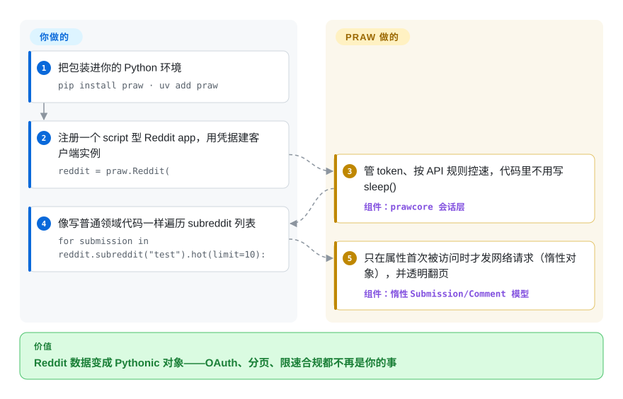

# PRAW

你的 Reddit 脚本总是在 429 限流或 OAuth token 过期上栽跟头，因为没人刷新凭据、也没人给请求控速。PRAW 把这段管道活揽了下来：你对着 Pythonic 的 subreddit/submission 对象写代码，它内部遵循 Reddit 的 API 规则并替你限速。

## 何时使用

你在做一个读写 Reddit 的东西——某几个 subreddit 帖子的研究数据集、一个删垃圾的审核机器人、一个监控自家产品提及的工具。你本可以直接打 Reddit 的 REST 端点，但那样你就得自己管 OAuth token 刷新、分页，以及（最痛的部分）在不被限流或封禁的前提下守住 Reddit 的限速。你 `pip install praw`，给它客户端凭据和一个有描述性的 user agent，然后用对象而非 JSON 工作：`reddit.subreddit("python").hot(limit=25)` 产出可迭代的 `Submission` 对象；`submission.comments.replace_more()` 把评论树拍平。PRAW 内部遵循 Reddit 的 API 规则并替你控速，所以代码读起来像领域逻辑，而非 HTTP 管道。

当你的数据源*就是* Reddit、且你想走官方、OAuth 合规的路而非爬 HTML 时，它就是默认构件。要流式获取新内容有 `subreddit.stream`；并发负载则有异步姊妹包：README 把 asyncio 用户（如 discord.py）强烈引向 **Async PRAW**——它的官方异步版本，「用法相似、特性与 PRAW 相同」，同一个项目、同一批维护者，`pip install asyncpraw`。

## 怎么用起来

PRAW 是对 Reddit OAuth API 的客户端抽象——没有要运行或部署的东西，不含服务端组件。你在 Reddit 的 apps 页面注册一个应用，把凭据交给 `praw.Reddit(...)`，此后一切都是 Python 对象。底层由伴随库 `prawcore` 掌管 HTTP 会话：它获取并刷新 OAuth token，读取 Reddit 的限速响应头、在请求发出前替你控速——配额本身是 Reddit 的杠杆，不是 PRAW 的。模型层是**惰性的**：`submission.title` 直到你读取一个尚未取回的属性时才发出第一个网络请求；`.hot()` 这类列表在遍历时透明翻页。留给你的：存储、应用层重试、遵守 Reddit 的使用条款——PRAW 替你控速，但 API 不给的数据它拿不到。

<!-- flow-steps:begin (generated from flows/praw.json by tools/flow_card.py — do not edit) -->

流程文字版

1. **你**：把包装进你的 Python 环境 — `pip install praw · uv add praw`
2. **你**：注册一个 script 型 Reddit app，用凭据建客户端实例 — `reddit = praw.Reddit(`
3. **PRAW**：管 token、按 API 规则控速，代码里不用写 sleep() — 组件：`prawcore 会话层`
4. **你**：像写普通领域代码一样遍历 subreddit 列表 — `for submission in reddit.subreddit("test").hot(limit=10):`
5. **PRAW**：只在属性首次被访问时才发网络请求（惰性对象），并透明翻页 — 组件：`惰性 Submission/Comment 模型`

**价值**：Reddit 数据变成 Pythonic 对象——OAuth、分页、限速合规都不再是你的事

<!-- flow-steps:end -->

## 何时不用

- **你的目标不是 Reddit。** 它按定义就是 Reddit 专用；对任何别的站点这都是错的工具。
- **你想绕开 Reddit 的 API 条款或限速/配额。** PRAW *遵守* API——它拿不到 API 不提供的数据，而 Reddit 的 API 访问条款与定价/配额（这些已变过）限定你能做什么，而非这个库。[未验证]
- **你想爬 Reddit 网页的 HTML。** PRAW 用官方 JSON API；API 不暴露的字段 PRAW 也没有——那就需要另一套（爬取）做法，并自带 ToS 风险。
- **高并发 / 异步优先的管线。** README 对 asyncio 环境「强烈建议」改用官方 Async PRAW，而非给同步 PRAW 套线程。
- **你需要 Pushshift 式的历史批量归档。** PRAW 读实时 API（有列表上限）；大规模历史回填是另一个数据源问题。

## 横向对比

| 替代品 | 是否收录 | 我们的评价 | 取舍 |
|---|---|---|---|
| Async PRAW（asyncpraw） | 未收录 | 需要把同一套 Reddit API wrapper 放进 asyncio 管线时，选 Async PRAW。 | 同一项目的 asyncio 变体；更适合并发/流式负载，代价是异步代码。同一批维护者。 |
| 裸 Reddit REST + requests | 未收录 | 只有在你要完全控制请求，并愿意自管 OAuth 刷新、分页和限速合规时，才选裸 REST。 | 控制最大、零抽象，但 OAuth 刷新、分页、限速合规都得自己重写。 |
| PSAW / Pushshift 客户端 | 未收录 | 需要历史批量 Reddit 归档，且 Pushshift 类数据源可用时，选这类客户端。 | Reddit 历史批量数据（在 Pushshift 可用时）；是对实时 API wrapper 的补充而非替代。 |
| JRAW / snoowrap | 未收录 | 真正约束是 Java 或 JavaScript 运行时时，选这些语言生态里的 wrapper。 | 其他语言（Java / JS）的 Reddit API wrapper；同一生态位，不同运行时。 |
| [requests-html](requests-html.zh.md) | ✅ | 只有在你明确要爬通用 HTML，而不是走 Reddit 官方 API 时，才选 requests-html。 | 通用爬取库——你得自己解析 Reddit HTML 并承担 ToS 风险；PRAW 改用受认可的 API。 |

## 技术栈

- **语言：** Python 3.10+（pyproject 的 `requires-python`）；v8.0.0 起支持 Python 3.13 与 3.14。纯 Python 包，随包发布 `py.typed` 标记。
- **传输：** 经 `prawcore` HTTP/会话层访问 Reddit 的 OAuth2 REST API（pyproject 钉 `prawcore>=4,<5`，这个底层伴随库处理鉴权、请求与限速）；其余钉住的依赖是 `websocket-client`、`defusedxml`、`update_checker`。
- **模型：** 惰性对象模型——`Submission`/`Comment`/`Subreddit`/`Redditor` 对象在访问时拉取属性，并对列表透明分页（quickstart 有明文说明）。
- **工具信号：** README 显示 Ruff、pre-commit、GitHub Actions CI、OpenSSF Scorecard 徽章与 Contributor Covenant——一个工具链完备的现代 Python 项目。

## 依赖

- **运行时：** Python 3.10+；pip 会装入 `prawcore` 及 `defusedxml`、`update_checker`、`websocket-client`（pyproject），prawcore 再拉入自己的 HTTP 栈；用 `uv add praw` 或 `pip install praw` 安装。
- **外部：** Reddit API 凭据（一个注册的 app：client id/secret）和一个有描述性的 user agent——以及一个受 Reddit 当前访问条款/配额约束的有效 Reddit API 账号。
- **自身无数据库/服务：** 它是客户端库；若你要持久化结果，存储自备。

## 运维难度

**低。** 作为纯客户端库没什么要部署的——pip 装、设凭据、跑起来即可。真正的运维考量是*外部的*：注册一个 Reddit app、保管好凭据、活在 Reddit 的限速与 API 条款之内（PRAW 替你控速，但配额/定价是 Reddit 的杠杆，不是你的）。长跑机器人你要自加进程守护、错误处理和持久化，但 PRAW 本身不挑食。

## 健康度与可持续性

- **响应速度**：无法计算——评分器没有找到足够的近期 qualifying issue/PR 互动样本（`no_traffic`）。
- **维护（2026-09）。** **活跃。** v8.0.3（2026-08-12）延续 8.x 线（v8.0.0 于 2026-06-14 开线）；这个补丁修的是限速重试时文件上传流被耗尽的 bug——维护在回应真实使用问题。最后 push 到 `main` 是 2026-09-28；核查时 open issue 为 0。未归档。
- **治理 / bus factor。** 自 2012 年起挂在 `praw-dev` GitHub **组织**下（README 历史一节写明）；pyproject 列名两位维护者（`bboe` Bryce Boe、`LilSpazJoekp` Joel Payne）——bus factor 好于单维护者库，不过核心团队仍小。
- **年龄与 Lindy 判断。** 2010-08 创建，约 16 岁且**仍在活跃发布**⇒ **强 Lindy**：Python 里最长寿、最久经验证的 Reddit API wrapper 之一。
- **采用与生态。** 被广泛当作 Reddit 的*那个*权威 Python wrapper；Read the Docs 上文档成熟、有异步姊妹包、现代 CI/lint/Scorecard 工具，都指向一个健康、自律的项目。[推断]
- **风险标记。** 主导的外部风险不在库本身，而在 **Reddit 的 API 政策**——访问条款、配额与定价在全行业范围内已变过，可能约束甚至给你的 app 增加成本，与 PRAW 的质量无关。[未验证]

## 存疑（未验证）

- [未验证] Reddit 的 API 访问条款、限速与定价/配额由 Reddit 设定且随时间变过；动手前请核实当前条款——它们对用法的约束大于这个库本身。
- [推断] Async PRAW「特性相同」是维护者 README 的自述，未逐特性独立核验。
- [推断] “强 Lindy / 权威 wrapper”是从年龄 + 活跃度 + 组织治理得出的判断，而非测得的市场份额结论。
- [未验证] 流式（`subreddit.stream`）在文档模型层确有其物，但针对具体负载的上限与重连行为本轮未实测。
