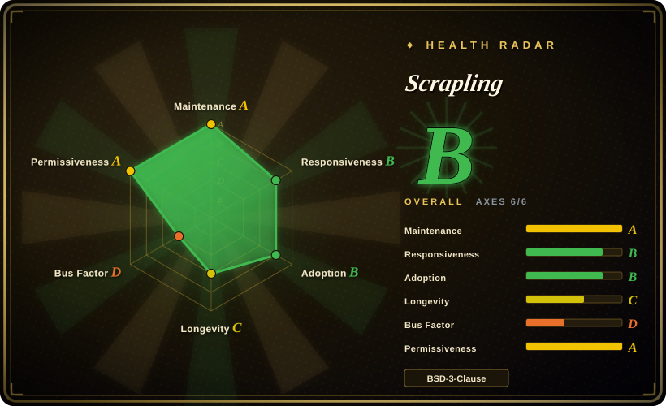
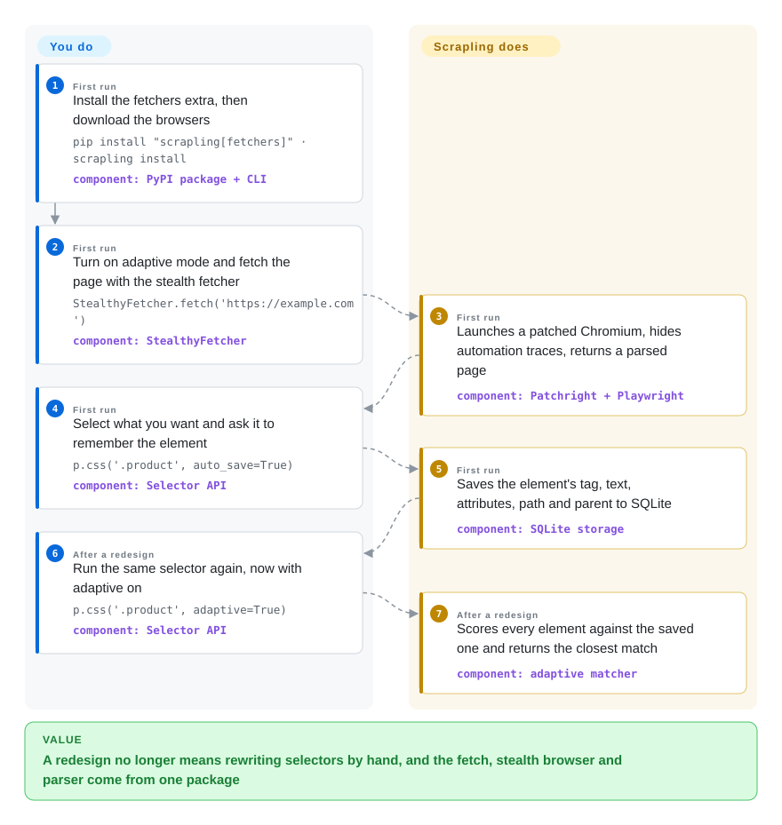

# Scrapling

Your Python scraper breaks in two ways: the site answers 403 or a "checking your browser" page instead of the data, and when you do get in, a redesign renames the classes and every selector you wrote returns nothing. Scrapling puts both fixes in one package — a fetcher that drives a patched Chromium so the request looks like a person's, and a parser that remembers what an element looked like and finds it again after the HTML moved.

## When to use

You are a Python developer maintaining a handful of scrapers — price monitors, a lead list, a nightly crawl of a few thousand product pages — and the maintenance is what hurts. `requests.get(url)` now returns `<title>Just a moment...</title>` because the site sits behind Cloudflare; you bolt on Playwright, then a stealth plugin, then a parser, and three libraries later a front-end deploy turns `page.css('#p1')` into an empty list at 3 a.m. With Scrapling you install one package, call `StealthyFetcher.fetch(url, solve_cloudflare=True)`, and select with the same `.css()` / `.xpath()` calls you would use in Scrapy — plus `auto_save=True` the first time, so that after the redesign `adaptive=True` relocates the element by similarity instead of by the selector that no longer matches.

The deciding tradeoff is **one integrated, stealth-first package against a mature, modular one**. Pick Scrapling over Scrapy when the hard part of your job is getting past bot protection and surviving markup churn, not scheduling ten million URLs: Scrapy has the middleware ecosystem and fifteen years behind it, but it gives you no browser, no TLS impersonation and no Cloudflare handling unless you assemble them. Pick it over [curl_cffi](../../python-tooling/curl-cffi.md) alone when the target also needs JavaScript executed (Scrapling's plain `Fetcher` is built on curl_cffi, and the two browser fetchers sit beside it behind one response type). Pick it over [Firecrawl](firecrawl.md) when you want a permissively licensed library inside your own process rather than an AGPL service or a metered API.

## How it works

Scrapling is three layers that share one result object. The **fetchers** get the page: `Fetcher` sends an ordinary HTTP request through curl_cffi while copying a real browser's TLS handshake (the opening exchange that sets up encryption, which anti-bot systems fingerprint); `DynamicFetcher` drives Chromium through Playwright for pages that need JavaScript; `StealthyFetcher` does the same through Patchright — a Playwright fork with the automation giveaways patched out — and can click through Cloudflare's Turnstile challenge. The **parser** wraps whatever came back in a `Selector` built on lxml, and that is where the adaptive part lives: when you pass `auto_save=True`, it writes the element's tag, text, attributes, tag path and parent into a local SQLite file keyed by site domain and selector; later, `adaptive=True` scores every element on the new page against that record and returns the closest one above a 40% similarity floor. It is less like a search by address and more like recognising a friend who moved house — you look for the person, not the door number. The **spiders** layer is a Scrapy-shaped async crawler on top (`start_urls`, `async def parse`, `response.follow`) that routes each request to an HTTP or browser session, retries responses it considers blocked, and can checkpoint to disk. You write the selectors, the parse callback and the choice of fetcher per site; Scrapling owns the browser, the fingerprinting, the retry loop and the element memory. Proxies are yours to buy and supply — it only rotates them. A CLI (`scrapling extract …`) and an MCP server (`scrapling-mcp`, 13 tools, for AI agents) expose the same fetchers without writing Python.

<!-- flow-steps:begin (generated from flows/scrapling.json by tools/flow_card.py — do not edit) -->

Text version of the flow

1. **You** (First run): Install the fetchers extra, then download the browsers — `pip install "scrapling[fetchers]" · scrapling install` — component: `PyPI package + CLI`
2. **You** (First run): Turn on adaptive mode and fetch the page with the stealth fetcher — `StealthyFetcher.fetch('https://example.com')` — component: `StealthyFetcher`
3. **Scrapling** (First run): Launches a patched Chromium, hides automation traces, returns a parsed page — component: `Patchright + Playwright`
4. **You** (First run): Select what you want and ask it to remember the element — `p.css('.product', auto_save=True)` — component: `Selector API`
5. **Scrapling** (First run): Saves the element's tag, text, attributes, path and parent to SQLite — component: `SQLite storage`
6. **You** (After a redesign): Run the same selector again, now with adaptive on — `p.css('.product', adaptive=True)` — component: `Selector API`
7. **Scrapling** (After a redesign): Scores every element against the saved one and returns the closest match — component: `adaptive matcher`

**Value**: A redesign no longer means rewriting selectors by hand, and the fetch, stealth browser and parser come from one package

<!-- flow-steps:end -->

## When NOT to use

- **The target is protected by something other than Cloudflare.** The built-in solver handles Cloudflare Turnstile/Interstitial only. Asked about an Imperva/Incapsula block that defeated all three fetchers (issue #472, 2026-10), the maintainer answered that there is no dedicated solver and access "is not guaranteed"; the README itself points Akamai, DataDome, Kasada and Incapsula users to a paid sponsor's token API. For those, budget for a commercial unblocker or a managed scraping API such as [Firecrawl](firecrawl.md)'s hosted tier rather than expecting this library to get you in.
- **You need a Firefox-based stealth browser.** Scrapling dropped Camoufox in v0.3.13 (2026-01) and is Chromium-only since (Patchright Chromium, or your installed Chrome via `real_chrome=True`). If your target fingerprints Chromium specifically, drive Camoufox directly instead.
- **You are crawling at a scale that needs more than one process.** The spider engine is a single asyncio process with on-disk checkpoints; the docs describe no distributed queue or shared scheduler. For a multi-machine crawl use Scrapy with a shared queue and [Scrapyd](scrapyd.md) to deploy it, or Crawlee for Python with its storage clients.
- **You need a stable API you can leave alone.** It is `0.x`, PyPI-classified Beta, and has broken callers repeatedly: v0.3.13 swapped the stealth engine, v0.4 (2026-02) removed `css_first`/`xpath_first` and changed return types, v0.4.15 (2026-08) renamed and regrouped the MCP tools. If you cannot pin and re-test on every upgrade, use Scrapy, a 1.0+ framework with fifteen years of history.
- **The site is not fighting you and the markup is yours or stable.** A browser download plus fingerprint data is a lot of machinery for a friendly page. Use `httpx` with `parsel` or `selectolax` for static HTML, or [trafilatura](../article-extraction/trafilatura.md) when all you want is the article text.
- **You are relying on adaptive selectors as a correctness guarantee.** Relocation is a similarity score with a 40% default floor, not a proof: it can return a plausible wrong element after a large redesign, and it only works if a baseline was saved while the old selector still matched. The default SQLite file also lives inside the installed package directory, so a rebuilt container or fresh virtualenv silently forgets every element unless you point `storage_args` at a persistent path. For data you must not get wrong, keep explicit selectors plus a validation step that fails loudly.
- **An LLM should decide what to extract.** Scrapling's extraction is selector-based by design ("without AI"); its MCP server narrows pages with CSS selectors before the model sees them. If you want schema-driven or prompt-driven extraction from arbitrary pages, use Crawl4AI or [Firecrawl](firecrawl.md).
- **Your organisation needs a defensible legal position on the collection.** This is a tool built to defeat access controls; the README's own disclaimer limits it to "educational and research purposes" and tells you to respect terms of service and robots.txt (`robots_txt_obey` is opt-in, off by default). Bypassing a site's bot protection can breach its terms or computer-misuse law in some jurisdictions regardless of the BSD license. When an official API or a data licence exists, use that instead — e.g. [PRAW](praw.md) for Reddit.
- **You are not writing Python.** Use Crawlee (Node.js) or [Playwright](../../web-automation/playwright-family/playwright.md) in your language; the MCP server and CLI are the only non-Python entry points and they still need a Python runtime.

## Comparison

| Alternative | In index | Our verdict | Tradeoff |
|---|---|---|---|
| Scrapy | not indexed | Pick Scrapy when the crawl is large, long-lived and mostly unprotected, and you want a framework whose API and plugin ecosystem will not move under you; pick Scrapling when bot protection and selector rot are the daily problem. | Scrapy (BSD-3-Clause, created 2010, about 64.6k stars, active 2026-10) brings middlewares, pipelines, extensions and deployment tooling, but no browser, no TLS impersonation and no adaptive selectors out of the box — you add scrapy-playwright and friends yourself. Not added in this tab batch. |
| Crawlee for Python | not indexed | Pick Crawlee when you want a vendor-backed crawler with pluggable request queues and storage and an easy path to a hosted platform; pick Scrapling when the stealth fetch and adaptive parser matter more than the queue. | Crawlee (apify/crawlee-python, Apache-2.0, about 9.6k stars, active 2026-10) is run by Apify, a company, where Scrapling is one person; it is less aggressive about evasion and its natural deployment target is Apify's paid platform. Not added in this tab batch. |
| Crawl4AI | not indexed | Pick Crawl4AI when the consumer is an LLM pipeline and you want Markdown plus LLM- or schema-driven extraction as the main product; pick Scrapling when you want deterministic selectors and Cloudflare handling. | Crawl4AI (unclecode/crawl4ai, Apache-2.0, about 84.9k stars, active 2026-10) centres on LLM-ready output and extraction strategies; Scrapling's Markdown export and MCP server are add-ons to a selector-first library. Not added in this tab batch. |
| [Firecrawl](firecrawl.md) | ✅ | Pick Firecrawl when you would rather call an API and get Markdown or JSON back than operate browsers and proxies; pick Scrapling when the code must run in your own process under a permissive licence. | Firecrawl removes the browser and proxy operations but is AGPL-3.0 to self-host and metered when hosted; Scrapling is BSD-3-Clause and free, and every block, proxy bill and breaking upgrade is yours to handle. |
| [curl_cffi](../../python-tooling/curl-cffi.md) | ✅ | Pick curl_cffi alone when the block is purely a TLS/HTTP fingerprint and the data is in the raw response; pick Scrapling when some targets also need JavaScript, a challenge solved, or a crawl loop. | curl_cffi is one small dependency with no browser to install; Scrapling already uses it for its HTTP fetcher and adds roughly a Chromium download, Patchright and a parser on top — more capability, far more surface to keep working. |

## Tech stack

- **Language:** Python ≥ 3.10, fully type-hinted (CI runs MyPy and PyRight); packaged with setuptools, version 0.4.15.
- **Parser core:** `lxml`, `cssselect`, `orjson`, `tld`, `w3lib`; the CSS-to-XPath translator is adapted from Parsel. Adaptive element storage is SQLite (WAL mode) via the standard library.
- **Fetchers (`fetchers` extra):** `curl_cffi` for HTTP with TLS impersonation and HTTP/3, `playwright` for `DynamicFetcher`, `patchright` for `StealthyFetcher`, `browserforge` and `apify-fingerprint-datapoints` for generated headers and fingerprints, `protego` for robots.txt, `anyio`, `msgspec`, `click`.
- **Spiders:** an asyncio engine with scheduler, per-domain throttle, checkpointing, response cache and templates (`CrawlSpider`, `SitemapSpider`, feed spiders, `ShopifySpider`, `SiteToMarkdownSpider`).
- **Agent surfaces:** an MCP server (`mcp` SDK, stdio or authenticated HTTP transport), an IPython-based shell, an `extract` CLI, and an Agent Skill bundle under `agent-skill/`.

## Dependencies

- **Parser only:** `pip install scrapling` pulls just the six parser dependencies — no browser, no network stack. Importing `scrapling.fetchers` or `scrapling.spiders` then raises `ModuleNotFoundError`.
- **Fetching:** `pip install "scrapling[fetchers]"` followed by `scrapling install`, which downloads Chromium and its system libraries. On a server this means a few hundred MB of browser plus OS packages; the published Docker image (`pyd4vinci/scrapling`, `ghcr.io/d4vinci/scrapling`) bundles them.
- **Proxies:** not included. For any protected target at volume you bring residential or mobile proxies; the library rotates what you give it (`ProxyRotator`).
- **Persistent path for adaptive data:** a writable location you control for the SQLite file if adaptive selectors must survive redeploys.
- **Optional extras:** `ai` (MCP server), `rag` (Markdown conversion via `markdownify`), `shell` (IPython), `all`.

## Ops difficulty

**Low for parsing and plain HTTP, medium for browser fetching, and an ongoing chore for stealth.** The parser and `Fetcher` are ordinary library code with nothing to run. The browser fetchers bring what any headless Chromium brings: memory per tab, system libraries, zombie processes to watch, and a `scrapling install` step to repeat in every image. The stealth part is the real maintenance cost and it is not yours to fix: evasion is an arms race, so a target that worked last month can start blocking with no change on your side, and the remedy is usually upgrading Scrapling — which, at 0.x, may also change the API you call. Two open reports show the kind of edge you will meet: the Cloudflare solver overrunning the fetch `timeout` (74 s observed against 15 s, issue #468) and `StealthyFetcher` failing to launch from an elevated Windows shell (issue #463). Pin the version, keep a canary request per target, and expose the MCP HTTP transport only with `--auth-token` (required by default since v0.4.15).

## Health & viability

- **Maintenance (2026-10-08).** Very active: commits on the default branch within the last day, eight releases between 2026-05 and 2026-08 (v0.4.8 → v0.4.15), 53 PyPI releases since the first on 2024-10-13. Issues are answered and closed within days — 3 open of 169 total, 3 open PRs.
- **Governance / bus factor.** One person. Karim Shoair (`D4Vinci`, a personal account) has 1,554 of the contributions; the next contributor has 15. There is a CONTRIBUTING guide, a code of conduct, and an AI-disclosure policy for PRs, but no second maintainer, no organisation and no foundation. Bus factor 1.
- **Backing and funding.** GitHub Sponsors plus paid placements: the README carries a twelve-row "Platinum Sponsors" table and six more sponsor logos, mostly proxy and scraping-service vendors. That funds the work, and it also means the project's own documentation recommends paid services for exactly the cases the library does not solve — read its capability claims with that in mind.
- **Age / Lindy.** Created 2024-10, so about two years old and on its third architecture (parser only → Camoufox-based stealth → Patchright Chromium plus a spider framework). Young and still changing shape: the Lindy prior is weak, and the breaking-change history is the evidence.
- **Adoption.** 919,855 PyPI downloads in the last month (pypistats, 2026-10-08) and about 73k Docker Hub pulls — real use, not only stars. The 86.2k stars on a two-year-old repo are far out of proportion to that and to Scrapy's 64.6k after fifteen years; treat the star count as attention, not as proof of production depth. [推断]
- **Risk flags.** BSD-3-Clause since the first commit, no CLA, no open-core split found. The risks are elsewhere: an arms-race feature set that decays without constant upstream work, dependence on third-party evasion projects (Patchright, browserforge, curl_cffi), and the legal exposure of the use case itself.

## Caveats (unverified)

- [未验证] "Bypasses all types of Cloudflare's Turnstile/Interstitial" is the project's own claim; it was not reproduced here because it needs live protected targets, and its success rate against current Cloudflare configurations is unknown.
- [未验证] The README's "92% test coverage" and "used daily by hundreds of Web Scrapers" were not checked — no coverage report was fetched and no usage survey exists.
- [未验证] The parser benchmark (1.99 ms vs 2.06 ms for Parsel, ~785× faster than BeautifulSoup) is author-run from `benchmarks.py`; it was not re-run and measures one text-extraction shape.
- [推断] "Single-process spider engine, no distributed mode" is inferred from the architecture docs describing one engine, scheduler and on-disk checkpoint, and from the absence of any queue-backend option; no explicit statement of the limit was found.
- [推断] The reading of the star count as disproportionate attention rests on comparing stars with PyPI downloads and with Scrapy; stargazer history could not be sampled (the API returned 404 for deep pages).
- [推断] The conflict-of-interest note about sponsors is a reading of the README layout, not evidence that any claim was shaped by a sponsor.
- [未验证] Whether adaptive relocation returns wrong elements in practice, and how often, was not measured; the 40% default threshold and the package-directory default database path were read from `scrapling/parser.py`.
- [未验证] Legal risk depends on jurisdiction, the target's terms and what data is collected; nothing here is legal advice.
- [推断] "A few hundred MB of browser plus OS packages" for `scrapling install` is an estimate from what a Playwright Chromium install normally weighs; the image size was not measured.
- [未验证] The one-line descriptions of Scrapy, Crawlee for Python and Crawl4AI rest on their repo metadata (checked 2026-10-08) and general knowledge of the projects; their docs were not re-read for this page.
- [未验证] Stars, download counts, issue counts and the sponsor list are 2026-10-08 snapshots and go stale quickly.
