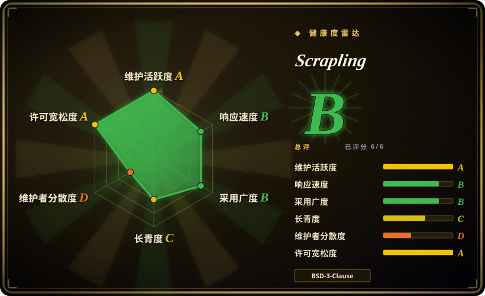
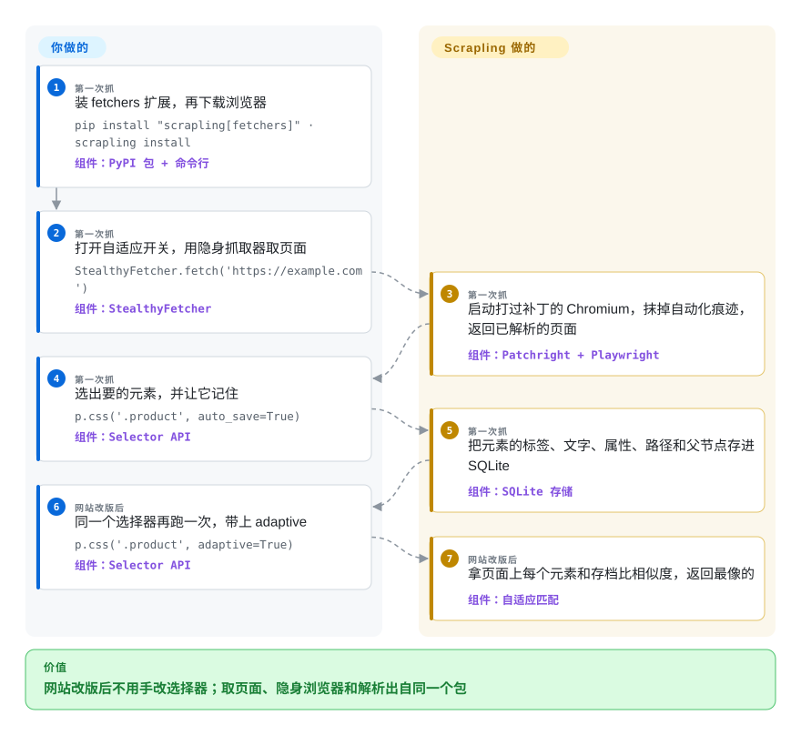

# Scrapling

你的 Python 爬虫坏法有两种：一种是网站不给数据，回一个 403 或“正在检查你的浏览器”；另一种是好不容易进去了，对方一改版，类名全换，你写的选择器全部返回空。Scrapling 把两件事放进同一个包：取页面时开一个打过补丁的 Chromium，让请求看起来像真人；解析时记住元素长什么样，HTML 挪了位置也能把它找回来。

## 何时使用

你用 Python 维护着几只爬虫——比价、线索名单、每晚抓几千个商品页——真正磨人的是维护。目标站上了 Cloudflare，`requests.get(url)` 拿回来的是 `<title>Just a moment...</title>`；你先接 Playwright，再接一个隐身插件，再接一个解析库，三个库拼好之后，对方前端发一次版，`page.css('#p1')` 在凌晨三点变成空列表。用 Scrapling，你只装一个包，调用 `StealthyFetcher.fetch(url, solve_cloudflare=True)`，选择器写法和 Scrapy 里一样（`.css()`、`.xpath()`）；第一次选元素时加上 `auto_save=True`，改版之后带上 `adaptive=True`，它就按相似度把元素找回来，而不是靠那条已经失效的选择器。

决定性的取舍是**一个集成的、以反检测为先的包，对一套成熟的、模块化的框架**。当难点是过机器人防护和扛住页面改版，而不是调度一千万个 URL 时，选 Scrapling 而不选 Scrapy：Scrapy 有中间件生态和十五年积累，但浏览器、TLS 指纹伪装和 Cloudflare 处理都得你自己拼。当目标还需要执行 JavaScript 时，选它而不是只用 [curl_cffi](../../python-tooling/curl-cffi.zh.md)（Scrapling 的普通 `Fetcher` 就是基于 curl_cffi 的，两个浏览器抓取器和它并排，返回同一种响应对象）。当你要的是一个许可宽松、跑在自己进程里的库，而不是 AGPL 服务或按量计费的 API 时，选它而不选 [Firecrawl](firecrawl.zh.md)。

## 怎么用起来

Scrapling 分三层，共用一种结果对象。**抓取器**负责把页面拿回来：`Fetcher` 通过 curl_cffi 发普通 HTTP 请求，同时照抄真实浏览器的 TLS 握手（建立加密连接时的开场交换，反爬系统会拿它当指纹）；`DynamicFetcher` 通过 Playwright 驱动 Chromium，对付需要 JavaScript 的页面；`StealthyFetcher` 做同样的事，但走的是 Patchright——一个把自动化痕迹补掉的 Playwright 分叉——并且能点过 Cloudflare 的 Turnstile 验证。**解析器**把拿回来的内容包成基于 lxml 的 `Selector`，自适应就在这一层：你传 `auto_save=True` 时，它把元素的标签、文字、属性、标签路径和父节点写进本地一个 SQLite 文件，按站点域名和选择器做键；之后传 `adaptive=True`，它拿新页面上每个元素和这份存档比相似度，返回超过 40% 门槛里最像的那个。这不像按门牌号找人，更像认出一个搬了家的朋友——认的是人，不是门牌。**爬虫层**是架在上面的一个 Scrapy 形状的异步爬虫（`start_urls`、`async def parse`、`response.follow`），把每个请求分给 HTTP 会话或浏览器会话，对它判定为被拦的响应自动重试，还能把进度存盘。选择器、parse 回调、每个站用哪种抓取器由你来定；浏览器、指纹、重试循环和元素记忆归 Scrapling 管。代理要你自己买、自己提供——它只负责轮换。另有命令行（`scrapling extract …`）和 MCP 服务（`scrapling-mcp`，13 个工具，给 AI agent 用），不写 Python 也能调同一批抓取器。

<!-- flow-steps:begin (generated from flows/scrapling.json by tools/flow_card.py — do not edit) -->

流程文字版

1. **你**（第一次抓）：装 fetchers 扩展，再下载浏览器 — `pip install "scrapling[fetchers]" · scrapling install` — 组件：`PyPI 包 + 命令行`
2. **你**（第一次抓）：打开自适应开关，用隐身抓取器取页面 — `StealthyFetcher.fetch('https://example.com')` — 组件：`StealthyFetcher`
3. **Scrapling**（第一次抓）：启动打过补丁的 Chromium，抹掉自动化痕迹，返回已解析的页面 — 组件：`Patchright + Playwright`
4. **你**（第一次抓）：选出要的元素，并让它记住 — `p.css('.product', auto_save=True)` — 组件：`Selector API`
5. **Scrapling**（第一次抓）：把元素的标签、文字、属性、路径和父节点存进 SQLite — 组件：`SQLite 存储`
6. **你**（网站改版后）：同一个选择器再跑一次，带上 adaptive — `p.css('.product', adaptive=True)` — 组件：`Selector API`
7. **Scrapling**（网站改版后）：拿页面上每个元素和存档比相似度，返回最像的 — 组件：`自适应匹配`

**价值**：网站改版后不用手改选择器；取页面、隐身浏览器和解析出自同一个包

<!-- flow-steps:end -->

## 何时不用

- **目标站用的不是 Cloudflare。** 内置的求解器只处理 Cloudflare 的 Turnstile／Interstitial。有人报告 Imperva／Incapsula 把三种抓取器全部拦下（issue #472，2026-10），维护者的回答是没有专门的求解器，能否访问“不保证”；README 自己也把 Akamai、DataDome、Kasada、Incapsula 的用户指向一家付费赞助商的令牌 API。这类目标请预留商业解封服务的预算，或用 [Firecrawl](firecrawl.zh.md) 托管版这样的托管抓取 API，别指望这个库能进去。
- **你需要基于 Firefox 的隐身浏览器。** Scrapling 在 v0.3.13（2026-01）弃用了 Camoufox，此后只支持 Chromium（Patchright 的 Chromium，或用 `real_chrome=True` 调你本机的 Chrome）。如果目标专门识别 Chromium 指纹，请直接驱动 Camoufox。
- **抓取规模需要不止一个进程。** 爬虫引擎是单个 asyncio 进程加磁盘检查点，文档里没有分布式队列或共享调度器。多机抓取用 Scrapy 配共享队列，并用 [Scrapyd](scrapyd.zh.md) 部署，或用带存储客户端的 Crawlee for Python。
- **你需要一套装上就不用管的稳定 API。** 它是 `0.x`，PyPI 分类为 Beta，并且多次改坏过调用方：v0.3.13 换了隐身引擎，v0.4（2026-02）删掉 `css_first`／`xpath_first` 并改了返回类型，v0.4.15（2026-08）给 MCP 工具改名、重新分组。做不到钉版本并在每次升级后重测的话，用 Scrapy——1.0 以上、有十五年历史的框架。
- **对方不拦你，页面结构也稳定或者就是你自己的。** 为一个友好的页面下载一个浏览器外加指纹数据，机器太重。静态 HTML 用 `httpx` 配 `parsel` 或 `selectolax`；只要文章正文用 [trafilatura](../article-extraction/trafilatura.zh.md)。
- **你把自适应选择器当成正确性保证。** 找回元素靠的是相似度打分，默认门槛 40%，不是证明：大改版之后它可能返回一个看着合理但其实不对的元素，而且前提是旧选择器还有效时存过基线。默认的 SQLite 文件放在已安装的包目录里，容器重建或新建虚拟环境会悄悄把所有元素记忆清空，除非你用 `storage_args` 指到一个持久路径。不能出错的数据，请保留显式选择器，再加一步会大声失败的校验。
- **你想让大模型决定抽什么。** Scrapling 的抽取在设计上就是基于选择器的（原话是“without AI”）；它的 MCP 服务也是先用 CSS 选择器把页面裁小再交给模型。要对任意页面做按 schema 或按提示词的抽取，用 Crawl4AI 或 [Firecrawl](firecrawl.zh.md)。
- **你的组织需要对这次采集有站得住的法律立场。** 这是一个为绕过访问控制而做的工具；README 自己的免责声明把用途限定在“教育和研究”，并要求遵守服务条款和 robots.txt（`robots_txt_obey` 需手动开启，默认关闭）。绕过网站的机器人防护，在一些法域可能违反对方条款或计算机滥用相关法律，这和 BSD 许可无关。有官方 API 或数据授权时就用它们——比如 Reddit 用 [PRAW](praw.zh.md)。
- **你不写 Python。** 用 Crawlee（Node.js）或你所用语言的 [Playwright](../../web-automation/playwright-family/playwright.zh.md)；MCP 服务和命令行是仅有的非 Python 入口，而且仍然需要 Python 运行时。

## 横向对比

| 替代品 | 是否收录 | 我们的评价 | 取舍 |
|---|---|---|---|
| Scrapy | 未收录 | 抓取量大、长期运行、目标大多不设防，并且你要一个 API 和插件生态不会在脚下变动的框架时选 Scrapy；机器人防护和选择器失效是日常问题时选 Scrapling。 | Scrapy（BSD-3-Clause，2010 年创建，约 6.46 万星，2026-10 仍活跃）带中间件、管道、扩展和部署工具，但不自带浏览器、TLS 伪装和自适应选择器——scrapy-playwright 之类要你自己加。本批未收录。 |
| Crawlee for Python | 未收录 | 想要一个有公司支持、请求队列和存储可插拔、并且能顺滑接到托管平台的爬虫时选 Crawlee；隐身抓取和自适应解析比队列更重要时选 Scrapling。 | Crawlee（apify/crawlee-python，Apache-2.0，约 9600 星，2026-10 仍活跃）由 Apify 这家公司维护，而 Scrapling 是一个人；它在反检测上没那么激进，最自然的部署去处是 Apify 的付费平台。本批未收录。 |
| Crawl4AI | 未收录 | 下游是大模型流水线、主要想要 Markdown 加上由大模型或 schema 驱动的抽取时选 Crawl4AI；想要确定性的选择器和 Cloudflare 处理时选 Scrapling。 | Crawl4AI（unclecode/crawl4ai，Apache-2.0，约 8.49 万星，2026-10 仍活跃）围绕面向大模型的输出和抽取策略展开；Scrapling 的 Markdown 导出和 MCP 服务只是一个选择器优先的库上的附加功能。本批未收录。 |
| [Firecrawl](firecrawl.zh.md) | ✅ | 宁愿调一个 API 直接拿回 Markdown 或 JSON、不想自己运维浏览器和代理时选 Firecrawl；代码必须在自己进程里跑、许可必须宽松时选 Scrapling。 | Firecrawl 省掉了浏览器和代理的运维，但自托管是 AGPL-3.0、托管版按量计费；Scrapling 是 BSD-3-Clause 且免费，每一次被拦、每一笔代理账单、每一次破坏性升级都归你处理。 |
| [curl_cffi](../../python-tooling/curl-cffi.zh.md) | ✅ | 被拦的原因纯粹是 TLS／HTTP 指纹、数据就在原始响应里时，只用 curl_cffi；有些目标还要执行 JavaScript、过验证或需要抓取循环时选 Scrapling。 | curl_cffi 是一个小依赖，不用装浏览器；Scrapling 的 HTTP 抓取器本来就用它，再往上加了一次 Chromium 下载、Patchright 和一个解析器——能力更多，要维持正常运转的面也大得多。 |

## 技术栈

- **语言：** Python ≥ 3.10，全量类型标注（CI 跑 MyPy 和 PyRight）；用 setuptools 打包，版本 0.4.15。
- **解析内核：** `lxml`、`cssselect`、`orjson`、`tld`、`w3lib`；CSS 转 XPath 的翻译器改编自 Parsel。自适应元素存储用标准库的 SQLite（WAL 模式）。
- **抓取器（`fetchers` 扩展）：** `curl_cffi` 负责带 TLS 伪装和 HTTP/3 的 HTTP 请求，`playwright` 给 `DynamicFetcher`，`patchright` 给 `StealthyFetcher`，`browserforge` 和 `apify-fingerprint-datapoints` 生成请求头和指纹，`protego` 解析 robots.txt，另有 `anyio`、`msgspec`、`click`。
- **爬虫层：** asyncio 引擎，带调度器、按域名限速、检查点、响应缓存和现成模板（`CrawlSpider`、`SitemapSpider`、feed 爬虫、`ShopifySpider`、`SiteToMarkdownSpider`）。
- **面向 agent 的入口：** MCP 服务（`mcp` SDK，stdio 或带鉴权的 HTTP 传输）、基于 IPython 的交互 shell、`extract` 命令行，以及 `agent-skill/` 下的一个 Agent Skill 包。

## 依赖

- **只用解析器：** `pip install scrapling` 只拉六个解析依赖——没有浏览器，也没有网络栈。此时导入 `scrapling.fetchers` 或 `scrapling.spiders` 会抛 `ModuleNotFoundError`。
- **要抓取：** 先 `pip install "scrapling[fetchers]"`，再跑 `scrapling install`，它会下载 Chromium 及其系统库。在服务器上这意味着几百 MB 的浏览器加一批系统包；官方 Docker 镜像（`pyd4vinci/scrapling`、`ghcr.io/d4vinci/scrapling`）已经打包好。
- **代理：** 不含。对有防护的目标做批量抓取，住宅或移动代理要你自己带；库只轮换你给它的代理（`ProxyRotator`）。
- **自适应数据的持久路径：** 如果自适应选择器要跨部署存活，需要一个你自己掌控的可写位置放 SQLite 文件。
- **可选扩展：** `ai`（MCP 服务）、`rag`（经 `markdownify` 转 Markdown）、`shell`（IPython）、`all`。

## 运维难度

**解析和普通 HTTP 是低，浏览器抓取是中，隐身这一块是一项长期杂事。** 解析器和 `Fetcher` 就是普通库代码，没有东西要常驻运行。浏览器抓取器带来的是任何无头 Chromium 都会带来的事：每个标签页的内存、系统库、要盯着的僵尸进程，以及每个镜像里都要重复一次的 `scrapling install`。真正的维护成本在隐身部分，而且它不归你修：反检测是军备竞赛，上个月还能抓的目标，可能在你这边什么都没改的情况下开始拦你，补救办法通常是升级 Scrapling——而它还在 0.x，升级可能连你调用的 API 一起改掉。两条仍未关闭的报告能说明你会碰到哪类边角：Cloudflare 求解器超出 fetch 的 `timeout`（设 15 秒、实测 74 秒，issue #468），以及在 Windows 提权 shell 里 `StealthyFetcher` 启动失败（issue #463）。请钉住版本，给每个目标留一个金丝雀请求，MCP 的 HTTP 传输只在带 `--auth-token` 时对外开放（v0.4.15 起默认强制）。

## 健康度与可持续性

- **维护（2026-10-08）。** 非常活跃：默认分支在过去一天内有提交，2026-05 到 2026-08 之间发了八个版本（v0.4.8 → v0.4.15），自 2024-10-13 首发以来 PyPI 共 53 个版本。issue 几天内就有回复和关闭——169 个里只有 3 个开着，另有 3 个开放 PR。
- **治理／巴士系数。** 一个人。Karim Shoair（`D4Vinci`，个人账号）有 1554 次贡献，第二名 15 次。有 CONTRIBUTING 指南、行为准则和针对 PR 的 AI 披露政策，但没有第二位维护者，没有组织，也没有基金会。巴士系数为 1。
- **背书与资金。** GitHub Sponsors 加付费广告位：README 里有一张十二行的“Platinum Sponsors”表和另外六个赞助商标志，多数是代理和抓取服务厂商。这笔钱养活了项目，同时也意味着项目自己的文档恰好在库解决不了的地方推荐付费服务——读它的能力宣称时要带着这一点。
- **年龄／Lindy。** 2024-10 创建，约两岁，已经是第三套架构（只有解析器 → 基于 Camoufox 的隐身 → Patchright Chromium 加爬虫框架）。年轻且仍在变形：Lindy 先验很弱，破坏性变更的历史就是证据。
- **采用。** PyPI 近一个月 919,855 次下载（pypistats，2026-10-08），Docker Hub 约 7.3 万次拉取——是真有人用，不只是星数。但两岁的仓库 8.62 万星，和这个下载量不成比例，也超过了 Scrapy 十五年攒下的 6.46 万星；请把星数当成关注度，而不是生产深度的证明。[推断]
- **风险旗标。** 从第一次提交起就是 BSD-3-Clause，没有 CLA，没发现开源核心加收费功能的切分。风险在别处：一套不靠上游持续投入就会失效的军备竞赛功能、对第三方反检测项目的依赖（Patchright、browserforge、curl_cffi），以及这个用途本身的法律暴露。

## 存疑（未验证）

- [未验证] “能过所有类型的 Cloudflare Turnstile／Interstitial”是项目自己的说法；这里没有复现，因为需要真实的受保护目标，它对当前 Cloudflare 配置的成功率未知。
- [未验证] README 里的“92% 测试覆盖率”和“每天被数百名爬虫工程师使用”没有核对——没取覆盖率报告，也不存在使用调查。
- [未验证] 解析器基准（1.99 毫秒，Parsel 是 2.06 毫秒，比 BeautifulSoup 快约 785 倍）是作者用 `benchmarks.py` 自己跑的；没有重跑，而且只测了一种文本抽取形态。
- [推断] “爬虫引擎单进程、没有分布式模式”是从架构文档推断的（只描述了一个引擎、一个调度器和磁盘检查点），也因为找不到任何队列后端选项；没找到对这个上限的明确表述。
- [推断] “星数是不成比例的关注度”这一判断，依据是把星数和 PyPI 下载量、和 Scrapy 做对比；星标历史没能抽样（API 对深分页返回 404）。
- [推断] 关于赞助商利益冲突的那句提醒，是对 README 版面的解读，不是任何宣称被赞助商影响的证据。
- [未验证] 自适应找回在实践中会不会返回错误元素、频率多高，没有测过；40% 的默认门槛和放在包目录里的默认数据库路径读自 `scrapling/parser.py`。
- [未验证] 法律风险取决于法域、目标站条款和采集的数据种类；这里的内容不构成法律意见。
- [推断] `scrapling install` “几百 MB 的浏览器加系统包”是按 Playwright 装 Chromium 的一般体量估的，没有实测镜像大小。
- [未验证] 对 Scrapy、Crawlee for Python、Crawl4AI 的一句话描述，依据是它们的仓库元数据（2026-10-08 核对）和对这些项目的一般了解；没有为本页重读它们的文档。
- [未验证] 星数、下载量、issue 数和赞助商名单都是 2026-10-08 的时点快照，很快会过期。
