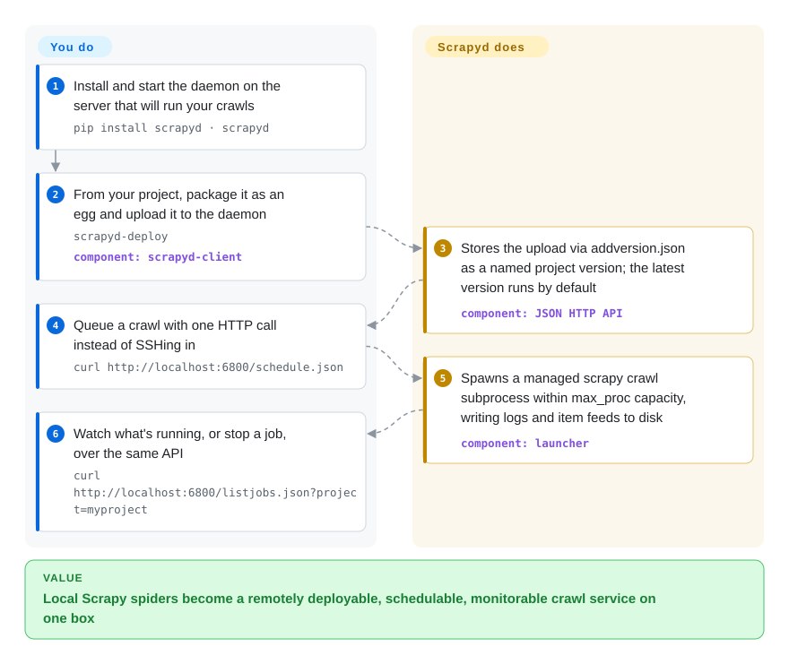

# Scrapyd

Your Scrapy spiders run fine via SSH-and-`scrapy crawl`, and that is the whole operations story — until you want versions, remote scheduling, and logs without logging in. Scrapyd turns deploying and running spiders into JSON HTTP calls: upload an egg, `POST schedule.json`, and a managed subprocess crawls for you. The canonical "run Scrapy in production" daemon, from the Scrapy org itself.

## When to use

You're a data engineer who has written a handful of Scrapy spiders that work fine on your laptop, and now you need them to run on a server — on a schedule, restartable, with multiple project versions you can roll forward and back. You don't want to SSH in and `scrapy crawl` by hand, or hand-roll a supervisor around it. You install Scrapyd on the box, use `scrapyd-deploy` to package each project into an egg and upload it, and from then on you drive everything over HTTP: `POST schedule.json` to queue a crawl, `listjobs.json` to see what's running, `cancel.json` to stop one. Scrapyd spawns each job as a managed `scrapy crawl` subprocess with configurable parallelism, keeps logs and item feeds, and serves a minimal status page at port 6800. It's the standard, Scrapy-org-blessed way to turn local spiders into a deployable crawl service — and the API layer that admin UIs like ScrapydWeb, Gerapy, and SpiderKeeper sit on top of.

## How it works

Scrapyd is a small always-on daemon (a Twisted app — the async framework Scrapy itself is built on) that you run on the server beside your spiders. Nothing about crawling changes; what changes is who launches it. You never SSH to start a crawl: `scrapyd-deploy` (from the separate `scrapyd-client` package) packages your project into a *Python egg* — a self-contained deployable archive — and POSTs it to `addversion.json`, where it is stored as a named version of a project; the newest version is what later crawls run. `schedule.json` then spawns a managed `scrapy crawl` subprocess, `cancel.json` stops one, and `listjobs.json` plus a minimal page at port 6800 show what is running, with per-job logs and item feeds written to disk. Concurrency is capped by the launcher's `max_proc` setting (0 = one slot per CPU) polled every `poll_interval`, so queued crawls start as capacity frees instead of fork-bombing the box. What stays yours: the host itself (supervision via systemd, disk hygiene), an auth layer before anything beyond localhost reaches port 6800 — the shipped default config leaves `username`/`password` empty, so the API is unauthenticated until you set them — and calendar scheduling: Scrapyd runs jobs when you (or cron, or a UI like SpiderKeeper) ask, never on its own timer.

<!-- flow-steps:begin (generated from flows/scrapyd.json by tools/flow_card.py — do not edit) -->

Text version of the flow

1. **You**: Install and start the daemon on the server that will run your crawls — `pip install scrapyd · scrapyd`
2. **You**: From your project, package it as an egg and upload it to the daemon — `scrapyd-deploy` — component: `scrapyd-client`
3. **Scrapyd**: Stores the upload via addversion.json as a named project version; the latest version runs by default — component: `JSON HTTP API`
4. **You**: Queue a crawl with one HTTP call instead of SSHing in — `curl http://localhost:6800/schedule.json`
5. **Scrapyd**: Spawns a managed scrapy crawl subprocess within max_proc capacity, writing logs and item feeds to disk — component: `launcher`
6. **You**: Watch what's running, or stop a job, over the same API — `curl http://localhost:6800/listjobs.json?project=myproject`

**Value**: Local Scrapy spiders become a remotely deployable, schedulable, monitorable crawl service on one box

<!-- flow-steps:end -->

## When NOT to use

- **It only runs Scrapy.** It literally spawns `scrapy crawl`; it is not a general job scheduler. For orchestrating arbitrary tasks, use Airflow, Celery, or cron.
- **Single-node by design.** No built-in clustering or cross-machine distribution — horizontal scaling means running multiple Scrapyd instances and coordinating them yourself (typically via a UI layer that targets several daemons).
- **Minimal, opt-in security.** The default `scrapyd.conf` ships with empty `username`/`password`, so the JSON API is unauthenticated until you configure basic auth or put your own reverse proxy in front — never expose port 6800 to the public internet as-is.
- **You'll want a UI on top for real usability.** The built-in web page is monitoring-only — day-to-day management expects [SpiderKeeper](spiderkeeper.md), ScrapydWeb, or Gerapy layered over it.
- **You want a managed, hands-off SaaS.** If you'd rather not run the daemon at all, Zyte Scrapy Cloud removes the ops burden Scrapyd leaves to you.

## Comparison

| Alternative | In index | Our verdict | Tradeoff |
|---|---|---|---|
| [SpiderKeeper](spiderkeeper.md) | ✅ | Choose SpiderKeeper when you need a Flask admin UI on top of Scrapyd. | Not a competitor — a Flask admin **UI on top of** Scrapyd (deploy, periodic scheduling, dashboard). Older/staler; complements Scrapyd rather than replacing it. |
| ScrapydWeb / Gerapy | 未收录 | Choose ScrapydWeb or Gerapy when you need richer admin UIs over Scrapyd. | Also admin UIs over Scrapyd: ScrapydWeb adds multi-node/log-parsing/alerts; Gerapy is Django+Vue and more modern. Both call Scrapyd's API, not replacements for the daemon. |
| Zyte Scrapy Cloud | 未收录 | Choose Zyte Scrapy Cloud when you need commercial managed SaaS for Scrapy. | Commercial managed SaaS for Scrapy (no self-hosting); removes ops at the cost of vendor lock-in and per-usage pricing. |
| Apache Airflow / Celery / cron | 未收录 | Choose Airflow, Celery, or cron when you need general-purpose scheduling rather than Scrapy-native deployment. | General-purpose schedulers — broader scope, but no Scrapy-native eggify/deploy/version model; you build the spider-running glue yourself. |

## Tech stack

- **Language:** Python (classifiers list 3.10–3.13; master's changelog drops the still-listed-on-PyPI 3.9 in the next release).
- **Core framework:** Twisted — the daemon is a Twisted application (Twisted-style `render_GET`, avatar/realm auth primitives).
- **State:** the default config binds the job queue to `scrapyd.spiderqueue.SqliteSpiderQueue` and persists versions/eggs on disk under the daemon's root dir.
- **Runtime deps (pyproject @ master):** `scrapy>=2.0.0`, `twisted>=17.9`, `w3lib`, `zope.interface`, `packaging`, `setuptools>=67.7.0,<81`, plus `pywin32` on Windows.
- **Interface:** JSON HTTP API (`schedule.json`, `cancel.json`, `addversion.json`, `listjobs.json`, …) and a minimal status web page; `scrapyd-deploy` (from the separate `scrapyd-client`) handles eggify + upload.

## Dependencies

- **Runtime:** Python 3.10+, a Twisted/Scrapy install, and disk for eggs, logs, and the sqlite state file.
- **Companion tool:** `scrapyd-client` (separate package) provides `scrapyd-deploy` for packaging and deploying projects.
- **No external database/service required** for the daemon itself; state is local sqlite. A reverse proxy + auth is recommended if exposed.
- **Optional UI:** SpiderKeeper / ScrapydWeb / Gerapy if you want a management dashboard.

## Ops difficulty

**Low-to-medium.** The happy path is `pip install scrapyd`, run it, and `scrapyd-deploy` your project — one process, local sqlite state, no cluster. Difficulty appears at the edges: the default config ships with empty `username`/`password`, so you must enable auth / a reverse proxy / firewalling before exposing it; scaling beyond one box means standing up several daemons and a UI/coordinator to target them; and you own the host-level supervision (systemd), disk hygiene for logs/eggs, and tuning of `max_proc` concurrency. The daemon itself is stable and undemanding — the work is the production hardening around it.

## Health & viability

- **Responsiveness**: Cannot be scored — no_traffic.
- **Maintenance (2026-09).** Active but release-quiet — last pushed 2026-09-21, latest release still v1.6.0 (2025-07-22, ~14 months ago), with post-1.6.0 changes accumulating in the changelog's "Unreleased" section (dropped Python 3.9, DEBUG logging, clearer launcher errors). Recent commits are mostly dependabot plus a steady handful from the lead maintainer; ~8 open issues — a small, well-tended scope. Status "Production/Stable", not archived.
- **Governance / bus factor.** Lives under the **`scrapy` GitHub org** (same community/team that maintains the Scrapy framework), not a solo account — `jpmckinney` is the notable current maintainer (only human repeat committer in the last year's history). Org governance is the cushion; the single-active-committer pattern is the residual risk.
- **Age × Lindy.** Created 2013 (~13.5 years) and still pushed this quarter ⇒ a **strong Lindy** signal: mature, slow-moving infrastructure that has long outlived hype cycles.
- **Adoption.** ~3.1k stars; it is the de-facto Scrapy deployment daemon, with a whole ecosystem of admin UIs (ScrapydWeb/Gerapy/SpiderKeeper) built to target its API.
- **Risk flags.** Few. BSD-3-Clause, no relicense history; the main caution is the unauthenticated-by-default API (`username`/`password` empty in the shipped config), which is a deployment responsibility, not a project-health problem.

## Caveats (unverified)

- [推断] SQLite job queue and empty default credentials are confirmed from the shipped `default_scrapyd.conf`, but per-version egg storage details were not traced through runtime source line-by-line.
- [推断] The GitHub Releases API still stops at 1.4.1 (2023); 1.5.0/1.6.0 come from git tags plus the `docs/news.rst` changelog — the team appears to have stopped cutting GitHub Release objects while still shipping to PyPI.
- [未验证] "~8 open issues" and ~3.1k stars are date-sensitive snapshot counts (2026-09-28), indicative only.
