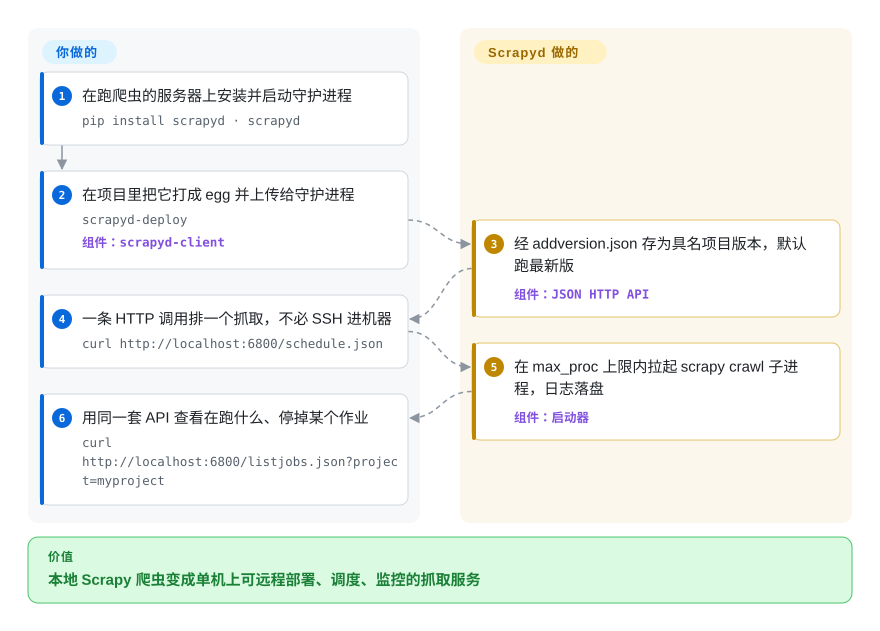

# Scrapyd

你的 Scrapy 爬虫靠 SSH 上去敲 `scrapy crawl` 来跑，这套办法就是你的全部运维——直到你要版本管理、远程调度和不落地的日志。Scrapyd 把部署和运行爬虫变成 JSON HTTP 调用：上传一个 egg、`POST schedule.json`，受管的子进程替你爬。它是 Scrapy 官方组织出品、把“在生产里跑 Scrapy”标准化的守护进程。

## 何时使用

你是数据工程师，写了几个在自己笔记本上跑得好好的 Scrapy 爬虫，现在需要让它们在服务器上跑——按计划、可重启、还能有多个项目版本来回前滚后滚。你不想 SSH 进去手动 `scrapy crawl`，也不想自己围着它搓一个 supervisor。你在机器上装好 Scrapyd，用 `scrapyd-deploy` 把每个项目打包成 egg 并上传，此后一切都走 HTTP：`POST schedule.json` 排一个抓取、`listjobs.json` 看在跑什么、`cancel.json` 停掉某个。Scrapyd 把每个作业作为受管的 `scrapy crawl` 子进程拉起、并发可配，保留日志与 item feed，并在 6800 端口提供一个极简状态页。它是 Scrapy 官方背书、把本地爬虫变成可部署抓取服务的标准方式——也是 ScrapydWeb、Gerapy、SpiderKeeper 这类管理 UI 所依托的那层 API。

## 怎么用起来

Scrapyd 是一个常驻的小型守护进程（一个 Twisted 应用——Twisted 即 Scrapy 自身构建其上的异步框架），跑在你的服务器上的爬虫旁边。爬取本身没有任何变化，变的是由谁来启动它。你不再 SSH 进去开爬：`scrapyd-deploy`（来自单独的 `scrapyd-client` 包）把项目打包成 *Python egg*——一个自包含的可部署归档——POST 给 `addversion.json`，作为项目的具名版本存下；之后的抓取默认跑最新版。`schedule.json` 拉起一个受管的 `scrapy crawl` 子进程，`cancel.json` 停掉某个，`listjobs.json` 加 6800 端口的极简状态页展示在跑什么，每个作业的日志与 item feed 落盘。并发由启动器的 `max_proc` 设置封顶（0 表示每 CPU 一个槽位），按 `poll_interval` 轮询，排队的抓取随容量释放而启动，而不是把机器 fork 爆。留给你的：主机本身（systemd 进程守护、磁盘清理）、在 localhost 之外有任何东西能碰到 6800 端口之前的鉴权层——出厂默认配置里 `username`/`password` 为空，不设就是无鉴权——以及日历式调度：Scrapyd 只在你（或 cron、或 SpiderKeeper 这类 UI）要求时跑作业，从不自己掐表。

<!-- flow-steps:begin (generated from flows/scrapyd.json by tools/flow_card.py — do not edit) -->

流程文字版

1. **你**：在跑爬虫的服务器上安装并启动守护进程 — `pip install scrapyd · scrapyd`
2. **你**：在项目里把它打成 egg 并上传给守护进程 — `scrapyd-deploy` — 组件：`scrapyd-client`
3. **Scrapyd**：经 addversion.json 存为具名项目版本，默认跑最新版 — 组件：`JSON HTTP API`
4. **你**：一条 HTTP 调用排一个抓取，不必 SSH 进机器 — `curl http://localhost:6800/schedule.json`
5. **Scrapyd**：在 max_proc 上限内拉起 scrapy crawl 子进程，日志落盘 — 组件：`启动器`
6. **你**：用同一套 API 查看在跑什么、停掉某个作业 — `curl http://localhost:6800/listjobs.json?project=myproject`

**价值**：本地 Scrapy 爬虫变成单机上可远程部署、调度、监控的抓取服务

<!-- flow-steps:end -->

## 何时不用

- **它只跑 Scrapy。** 它字面上就是拉起 `scrapy crawl`；不是通用作业调度器。要编排任意任务，用 Airflow、Celery 或 cron。
- **按设计就是单节点。** 没有内建集群或跨机分布——横向扩展意味着跑多个 Scrapyd 实例并自己协调它们（通常靠一个面向多个守护进程的 UI 层）。
- **极简、需自行开启的安全。** 默认 `scrapyd.conf` 的 `username`/`password` 为空，JSON API 在你配置 basic auth 或自建反向代理之前都是无鉴权的——别把 6800 端口原样暴露到公网。
- **要真正好用，你会想在上面加个 UI。** 内建 web 页只能监控——日常管理需要在其上叠 [SpiderKeeper](spiderkeeper.zh.md)、ScrapydWeb 或 Gerapy。
- **你想要托管、省心的 SaaS。** 如果你压根不想自己跑这个守护进程，Zyte Scrapy Cloud 替你卸掉 Scrapyd 留给你的运维负担。

## 横向对比

| 替代品 | 是否收录 | 我们的评价 | 取舍 |
|---|---|---|---|
| [SpiderKeeper](spiderkeeper.zh.md) | ✅ | 需要叠在 Scrapyd 之上的 Flask 管理 UI 时，选 SpiderKeeper。 | 不是竞品——是**叠在 Scrapyd 之上**的 Flask 管理 UI（部署、周期调度、看板）。更老更陈旧；是 Scrapyd 的补充而非替代。 |
| ScrapydWeb / Gerapy | 未收录 | 需要 Scrapyd 之上更丰富的管理 UI 时，选 ScrapydWeb 或 Gerapy。 | 同样是 Scrapyd 之上的管理 UI：ScrapydWeb 加多节点/日志解析/告警；Gerapy 是 Django+Vue、更现代。二者都调 Scrapyd 的 API，不是守护进程的替代。 |
| Zyte Scrapy Cloud | 未收录 | 需要 Scrapy 商业托管 SaaS 时，选 Zyte Scrapy Cloud。 | Scrapy 的商业托管 SaaS（无需自托管）；以厂商锁定和按量计费为代价卸掉运维。 |
| Apache Airflow / Celery / cron | 未收录 | 需要通用调度器，而不是 Scrapy 原生部署模型时，选 Airflow、Celery 或 cron。 | 通用调度器——范围更广，但没有 Scrapy 原生的 eggify/部署/版本模型；跑爬虫的胶水得你自己搭。 |

## 技术栈

- **语言：** Python（pyproject classifiers 列 3.10–3.13；master 的 changelog 表明下一版将放弃仍列在 PyPI 上的 3.9）。
- **核心框架：** Twisted——该守护进程是一个 Twisted 应用（Twisted 风格的 `render_GET`、avatar/realm 鉴权原语）。
- **状态：** 默认配置把作业队列绑到 `scrapyd.spiderqueue.SqliteSpiderQueue`，版本/egg 持久化在守护进程 root 目录下的磁盘上。
- **运行时依赖（pyproject @ master）：** `scrapy>=2.0.0`、`twisted>=17.9`、`w3lib`、`zope.interface`、`packaging`、`setuptools>=67.7.0,<81`，Windows 上加 `pywin32`。
- **接口：** JSON HTTP API（`schedule.json`、`cancel.json`、`addversion.json`、`listjobs.json`……）加一个极简状态 web 页；`scrapyd-deploy`（来自单独的 `scrapyd-client`）负责 eggify + 上传。

## 依赖

- **运行时：** Python 3.10+、一个 Twisted/Scrapy 安装，以及放 egg、日志和 sqlite 状态文件的磁盘。
- **配套工具：** `scrapyd-client`（单独的包）提供 `scrapyd-deploy` 来打包并部署项目。
- 守护进程本身**不需要外部数据库/服务**；状态是本地 sqlite。若对外暴露，建议加反向代理 + 鉴权。
- **可选 UI：** 若想要管理看板，可上 SpiderKeeper / ScrapydWeb / Gerapy。

## 运维难度

**低到中。** 顺路径是 `pip install scrapyd`、跑起来、`scrapyd-deploy` 你的项目——一个进程、本地 sqlite 状态、无集群。难度出现在边缘：默认配置的 `username`/`password` 为空，所以暴露前你必须开启鉴权/加反向代理/防火墙；超出一台机器的扩展意味着起多个守护进程加一个面向它们的 UI/协调器；而主机级看护（systemd）、日志/egg 的磁盘清理、`max_proc` 并发调优都归你。守护进程本身稳定省心——功夫在它周围的生产加固。

## 健康度与可持续性

- **响应速度**：无法计算——no_traffic。
- **维护（2026-09）。** 活跃但发布安静——最后 push 于 2026-09-21，最新 release 仍是 v1.6.0（2025-07-22，约 14 个月前），1.6.0 之后的改动堆在 changelog 的 Unreleased 段（放弃 Python 3.9、DEBUG 日志、更清晰的启动器报错）。近期提交以 dependabot 为主、外加主力维护者稳定的少量人工提交——约 8 个 open issue，小而被精心照料。状态“Production/Stable”，未归档。
- **治理 / bus factor。** 归在 **`scrapy` GitHub 组织**下（维护 Scrapy 框架的同一社区/团队），不是个人账号——`jpmckinney` 是当前的代表性维护者（近一年提交史里唯一反复出现的人类提交者）。组织治理是缓冲，单活跃提交者是残余风险。
- **年龄 × Lindy。** 创建于 2013（约 13 年半）且本季度仍有 push ⇒ **强 Lindy** 信号：成熟、慢节奏的基础设施，早已熬过炒作周期。
- **采用度。** 约 3.1k star；它是事实上的 Scrapy 部署守护进程，周围有一整套面向其 API 构建的管理 UI（ScrapydWeb/Gerapy/SpiderKeeper）。
- **风险标记。** 很少。BSD-3-Clause，无 relicense 历史；主要注意点是默认无鉴权的 API（出厂配置里 `username`/`password` 为空），这属于部署责任，不是项目健康问题。

## 存疑（未验证）

- [推断] sqlite 作业队列与默认空凭据已从出厂的 `default_scrapyd.conf` 核实，但版本/egg 的存储细节未逐行读运行时源码确认。
- [推断] GitHub Releases API 仍停在 1.4.1（2023）；1.5.0/1.6.0 取自 git tag 加 `docs/news.rst` changelog——团队似乎停止切 GitHub Release 对象，但仍向 PyPI 发布。
- [未验证] “约 8 个 open issue”与约 3.1k star 是 2026-09-28 的时间敏感快照，仅供参考。
