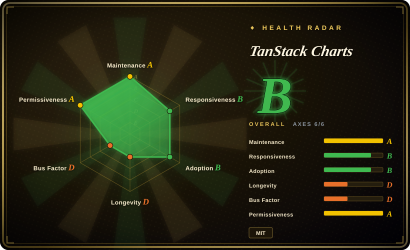
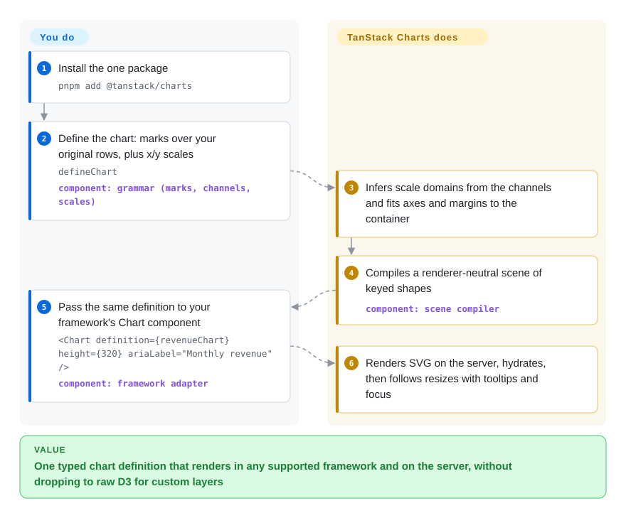

# TanStack Charts

Your dashboard started with a stock bar chart component, and now product wants a band behind the line, a custom annotation mark and server-rendered SVG — and the component library has no prop for any of it, so you either fork it or rewrite the chart in raw D3. TanStack Charts lets you describe a chart as layers of marks over your own data (a "grammar": bars, lines, dots, rules you stack yourself) and runs one typed definition through React, Vue, Solid, Svelte, Angular and more, with SVG server rendering, keyboard focus and optional Canvas built in — but it is a two-month-old Alpha.

## When to use

You are the front-end engineer on a SaaS product whose analytics pages ship in React today and in a Solid or Vue micro-frontend tomorrow. The first charts were Recharts `<BarChart>` / `<LineChart>` components; now a designer wants a forecast band under the line, a threshold rule with a label, and a custom mark that draws a bracket over two bars. Recharts has no component for the bracket, so the ticket ends in `// TODO: drop to d3 for this one` and a second charting codebase. On top of that, the page is server-rendered and the chart currently flashes in after hydration with an empty `
` in the HTML.

Reach for TanStack Charts here: you write one `defineChart({ marks: [...], scales: {...} })` definition over your original rows, layer built-in marks (`barY`, `lineY`, `areaY`, rules, text, …) or implement a custom mark against the same public scene protocol, and render it through the adapter for whatever framework hosts the page — with SVG output on the server, hydration in the browser, and focus/tooltip/keyboard behaviour included. Pick it over **Recharts** when you need framework neutrality and custom marks without leaving the chart's API; over **Apache ECharts** or **Chart.js** when the charts must be SVG-first, server-rendered and styled like the rest of your UI rather than a Canvas widget configured through a big options object; over **Observable Plot** (its closest API inspiration) when you need an application runtime — responsive resize, framework adapters, hydration, interaction state — rather than an exploratory plotting function. If you cannot absorb Alpha-grade breaking changes, read When NOT to use first.

## How it works

You describe a chart; the library does the drawing. A *mark* is one layer of shapes bound to your data (`barY(revenue, { x: 'month', y: 'value' })` means "one bar per row, height from `value`"), a *channel* is which field drives which visual property, and a *scale* is the ruler that turns a data value into pixels — TanStack ships small built-in rulers for the common numeric and category cases, and you can pass a real `d3-scale` function when you need time or log scales. From that definition TanStack Charts measures the container, fits axes and margins, and compiles a "scene" — a renderer-neutral list of keyed shapes, like a stage plan that any theatre can build — which a host then paints as SVG (default), Canvas (opt-in import), or static SVG on the server. The same definition object goes to `mountChart` in plain DOM or to `<Chart definition={...} />` in React / Vue / Solid / Svelte / Angular / Lit / Preact / Alpine / Octane adapters. What stays yours: data fetching, cleaning, binning/aggregation beyond its transforms, brush/zoom state, and memoizing the definition so it is only rebuilt when your data changes.

<!-- flow-steps:begin (generated from flows/tanstack-charts.json by tools/flow_card.py — do not edit) -->

Text version of the flow

1. **You**: Install the one package — `pnpm add @tanstack/charts`
2. **You**: Define the chart: marks over your original rows, plus x/y scales — `defineChart` — component: `grammar (marks, channels, scales)`
3. **TanStack Charts**: Infers scale domains from the channels and fits axes and margins to the container
4. **TanStack Charts**: Compiles a renderer-neutral scene of keyed shapes — component: `scene compiler`
5. **You**: Pass the same definition to your framework's Chart component — `<Chart definition={revenueChart} height={320} ariaLabel="Monthly revenue" />` — component: `framework adapter`
6. **TanStack Charts**: Renders SVG on the server, hydrates, then follows resizes with tooltips and focus

**Value**: One typed chart definition that renders in any supported framework and on the server, without dropping to raw D3 for custom layers

<!-- flow-steps:end -->

## When NOT to use

- **If you need a stable API you can upgrade blindly, use Recharts, Chart.js or Apache ECharts instead, because** TanStack Charts is an explicit Alpha: its own stability policy says minor `0.x` releases "may contain breaking API changes", tells you to "pin an exact version in production", and promises no minimum deprecation window; the `x`/`y` root options were already moved under `scales` between pre-Alpha and Alpha.
- **If you want a catalogue of ready chart types you configure (pie, gauge, candlestick, radar, map) with minimal code, use Apache ECharts instead, because** TanStack Charts deliberately has no "chart-type configuration model" — you compose marks, and its own comparison page recommends ECharts "for a broad built-in controller and chart catalog".
- **If you plot tens of thousands of independently interactive points or streaming time series, use uPlot, ECharts (Canvas/WebGL) or Plotly's WebGL traces instead, because** SVG is the default, and even the optional Canvas renderer "removes per-mark DOM cost, not scene memory or dense nearest-point work"; the large-data guide says to aggregate or bound the representation rather than render a million raw marks.
- **If your team only ships React and wants the largest community, examples and StackOverflow surface, use Recharts instead, because** Recharts has eleven years of history and about 66.9M weekly npm downloads (week of 2026-09-21), while TanStack Charts has two months of history and a single dominant author.
- **If you need exploratory, notebook-style plotting (Observable, one-off analysis, static figures), use Observable Plot instead, because** Plot is the mature original of the same mark/channel grammar with a far larger example corpus, and you do not need TanStack's framework adapters, hydration or interaction runtime there.
- **If you need BI dashboards over a SQL warehouse for analysts, use Apache Superset or Metabase instead, because** this is a front-end library you embed in code — there are no queries, users, saved dashboards or a server.
- **If you need server-side hydration under Angular or Lit, verify first or pick another adapter, because** the SSR guide lists Angular and Lit as "not yet a verified adapter contract" and Alpine as browser-only; the React Native adapter is marked experimental.
- **If your organisation restricts code written mainly by AI agents, check that policy first, because** the README and `ACKNOWLEDGEMENTS.md` state that "almost all of the implementation was produced with AI coding agents" under the author's supervision.

## Comparison

| Alternative | In index | Our verdict | Tradeoff |
| --- | --- | --- | --- |
| Recharts (`recharts/recharts`) | not indexed | For a React-only app with standard line/bar/area/pie charts and a need for stability, pick Recharts; pick TanStack Charts when one definition must serve several frameworks, render SVG on the server, and grow into custom marks. | Recharts gives a large, stable component API and community (27.6k stars, ~66.9M weekly downloads); you pay React lock-in, no Canvas renderer, and a bundle the TanStack comparison measured at 153–168 KiB vs 42–48 KiB for TanStack Charts. Not added in this tab-intake batch. |
| Apache ECharts (`apache/echarts`) | not indexed | When you need the widest built-in chart catalogue (maps, gauges, candlesticks, heavy data) configured by options, pick ECharts; pick TanStack Charts when you want typed mark composition with SVG-first output that looks like your own UI. | ECharts is an Apache Software Foundation project since 2013 with Canvas and SVG renderers and a huge catalogue; you pay a large options-object API and ~153–173 KiB in the same controlled comparison. Not added in this tab-intake batch. |
| Chart.js (`chartjs/Chart.js`) | not indexed | For Canvas-first standard charts with a mature plugin ecosystem and a stable 4.x API, pick Chart.js; pick TanStack Charts when you need SVG output, server rendering and keyboard-accessible focus. | Chart.js is small (44.7–58.2 KiB in the TanStack suite), MIT and 13 years old; you give up SVG/SSR (Canvas only) and custom mark composition. Not added in this tab-intake batch. |
| Observable Plot (`observablehq/plot`) | not indexed | When the job is exploratory or static plotting with a concise mark grammar, pick Observable Plot; pick TanStack Charts when the same grammar has to live inside an application with framework adapters, hydration, responsive resize and interaction state. | Plot is the direct conceptual ancestor (ISC, since 2020, ~793k weekly downloads) with a rich transform set; the TanStack comparison marks its selection, animation and resize as host-owned. Not added in this tab-intake batch. |
| visx (`airbnb/visx`) | not indexed | For React teams that want low-level D3-backed React components and are happy to assemble every chart themselves, pick visx; pick TanStack Charts when you want a higher-level grammar with axes, tooltips, focus and SSR included and non-React adapters. | visx is mature (since 2017) and composable but React-only with no Canvas renderer; its last push was 2026-06-22, and you write more code per chart. Not added in this tab-intake batch. |

TanStack Charts is the successor of the archived TanStack React Charts (`react-charts`, archived with its last push in 2025-03); its lessons are recorded in the new repo's `PLAN.md`. Other TanStack libraries such as [TanStack Table](../component-libraries/tanstack-table.md) and [TanStack Query](../data-fetching/tanstack-query.md) are companions (a data grid, a data fetcher), not substitutes.

## Tech stack

- **TypeScript** monorepo (pnpm 11 workspaces + Nx, changesets, Vitest, Playwright for browser benchmarks); Node.js 22+ for development.
- **`@tanstack/charts`** — one published package whose exact subpaths expose marks, compact scales (`/scales/linear`, `/scales/band`, …), renderers (`/canvas`), interactions (`/interaction/brush`, `/interaction/zoom`, …), layouts (`/network/sankey`, `/hierarchy/treemap`, …) and framework adapters (`/react`, `/vue`, `/solid`, `/svelte`, `/angular`, `/lit`, `/preact`, `/alpine`, `/octane`, `/react-native`).
- **Pinned granular D3 modules** as dependencies (`d3-array`, `d3-scale`, `d3-shape`, `d3-geo`, `d3-force`, `d3-sankey`, `d3-hierarchy`, `d3-contour`, `d3-delaunay`, `d3-brush`, `d3-zoom`, …), used only by the subpaths that import them.
- A renderer-neutral scene compiler with SVG (default), Canvas (opt-in) and static-SVG server output.

## Dependencies

- **Runtime:** the npm package plus the peer framework you render with (all framework peers are optional): React/React DOM `^18 || ^19`, Vue `>=3.5`, Svelte `^5.20`, Solid `>=1.8`, Angular `>=19`, Lit `>=3.1.3`, Preact `>=10`, Alpine `>=3.15`, or React Native `^0.86` with `react-native-svg` `>=15.15.4 <16`.
- **No server, no database, no hosted service.** Data arrives from your own code.
- **You bring:** data fetching and preparation, heavier statistics, brush/zoom application state, and definition memoization in your framework.

## Ops difficulty

**Low to deploy, medium to keep upgraded.** It is a front-end dependency with nothing to run. The burden is change management:
- Pin an exact version (the project's own advice) and read the changelog before each minor; the version went from 0.0.0 (2026-07-29) to 0.18.0 (2026-09-10) in six weeks.
- Treat SVG element count as your performance budget — past a few thousand interactive marks, switch to Canvas or aggregate, per the large-data guide.
- SSR needs a declared size (`width`/`initialWidth` + `height`/`aspectRatio`) or the server falls back to a 320px height.

## Health & viability

- **Maintenance (2026-09-28).** Very active but very young: repo created 2026-07-28, 34 npm versions from 0.0.0 (2026-07-29) to 0.18.0 (2026-09-10), last push to `main` 2026-09-15. The author's own PRs merge within hours to days, but outside issues wait longer — the health scorer measured a median first response of about 114 hours, and several feature requests filed on 2026-09-05/07 had no comment by 2026-09-28.
- **Governance / bus factor.** Weak. Tanner Linsley authored 291 of the commits counted by GitHub's contributor API (the next human has 11), and he states he designed it while AI agents wrote almost all the code. It sits under the TanStack organization, which adds brand, sponsorship and release infrastructure, but not yet a second maintainer on this repo [推断].
- **Backing & longevity.** Two months old, so the Lindy prior gives no support; the counterweight is TanStack's track record of maintaining Query, Table and Router for years. That same organization archived its previous charting library, React Charts (2017–2025), before starting this one.
- **Adoption & ecosystem.** 766 stars and 45 forks; npm reports 329,009 downloads for the week of 2026-09-21, and the health scorer counted 521,973 in its last-month window, against only 15 direct dependent packages listed by deps.dev for 0.18.0 and 0 dependent repositories in the scorer's graph — high for a two-month-old Alpha and possibly inflated by CI and mirrors [未验证]. Documentation is unusually thorough for its age (framework guides, SSR, accessibility, large-data, an `llms.txt` and an AI-authoring guide).
- **Risk flags.** MIT, no CLA. Main risks: Alpha API churn, a single human decision-maker, and an AI-generated codebase whose long-term maintainability is untested.

## Caveats (unverified)

- [未验证] The 329,009 weekly npm downloads (2026-09-21 to 2026-09-27) could not be attributed; with only 15 direct dependents on deps.dev (2026-09-28), CI installs and registry mirrors are a plausible share, but npm does not expose the breakdown.
- [推断] "No second maintainer yet" is inferred from the GitHub contributor API (tannerlinsley 291, gillkyle 11, others ≤1) and PR authorship, not from any governance document; TanStack's core team may review without committing.
- [未验证] Bundle-size figures (41.56–47.68 KiB for TanStack Charts, 153–168 KiB for Recharts, etc.) come from the project's own `docs/comparison.md` controlled suite (baseline 2026-09-10), not reproduced here; the project itself calls them "development evidence, not release claims".
- [未验证] The Canvas renderer's real performance ceiling (how many interactive points before frame drops) is not stated as a number by the project and was not measured.
- [未验证] Angular/Lit SSR and the experimental React Native adapter behaviour are taken from the docs, not tested.
- [未验证] The comparison cells for Recharts, ECharts, Chart.js, Observable Plot and visx rest on their GitHub metadata, npm download counts and TanStack's documentation-reviewed matrix, not on a full reading of those repositories in this batch.
