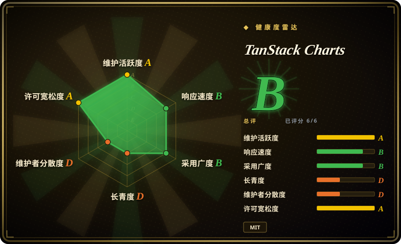
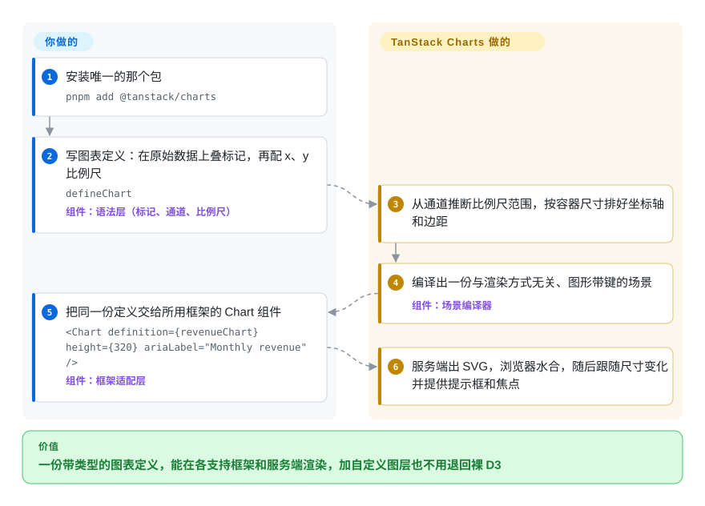

# TanStack Charts

仪表盘一开始用的是现成的柱状图组件，后来产品要在折线下面加一条预测带、加一个自定义标注、还要服务端直出 SVG——组件库没有对应的参数，你只能 fork 它，或者把这张图用裸 D3 重写一遍。TanStack Charts 让你把图表写成一层层叠在自己数据上的“标记”（柱、线、点、参考线，自己叠），同一份带类型的定义交给 React、Vue、Solid、Svelte、Angular 等框架渲染，服务端 SVG、键盘焦点和可选的 Canvas 都自带——但它是一个才两个月大的 Alpha。

## 何时使用

你是一个 SaaS 产品的前端工程师，分析页今天用 React 写，明天有一块要放进 Solid 或 Vue 的微前端。最早的图表是 Recharts 的 `<BarChart>`、`<LineChart>`；现在设计师要在折线下面画一条预测区间带、一条带文字的阈值线，再在两根柱子上方画一个括号。Recharts 没有画括号的组件，于是工单最后写成 `// TODO: drop to d3 for this one`，项目里多出第二套画图代码。更糟的是页面是服务端渲染的，HTML 里只有一个空 `
`，图表要等水合之后才闪出来。

这时就该想到 TanStack Charts：你在原始数据上写一份 `defineChart({ marks: [...], scales: {...} })`，叠内置标记（`barY`、`lineY`、`areaY`、参考线、文字……），或者按同一套公开的场景协议自己实现一个标记，然后交给页面所在框架的适配层渲染——服务端出 SVG，浏览器里水合，焦点、提示框、键盘操作都已经带上。和 **Recharts** 比，选它是因为要跨框架、要自定义标记又不想跳出图表 API；和 **Apache ECharts**、**Chart.js** 比，选它是因为图表必须以 SVG 为主、能服务端渲染、样式和你的界面一致，而不是一个靠大号配置对象驱动的 Canvas 部件；和它最直接的 API 灵感 **Observable Plot** 比，选它是因为你要的是应用运行时——自适应尺寸、框架适配、水合、交互状态——而不是一个探索式绘图函数。如果你承受不了 Alpha 级别的破坏性变更，先看“何时不用”。

## 怎么用起来

你负责描述图表，画由库来画。“标记”是绑定到数据上的一层图形（`barY(revenue, { x: 'month', y: 'value' })` 的意思是“每行一根柱子，高度取 `value`”），“通道”是哪个字段决定哪种视觉属性，“比例尺”是把数据值换算成像素的尺子——TanStack 为常见的数值和分类场景自带了小号尺子，需要时间轴、对数轴时可以直接传入真正的 `d3-scale` 函数。拿到定义后，TanStack Charts 量出容器尺寸、排好坐标轴和边距，编译出一份“场景”——一份与渲染方式无关、每个图形都带键的清单，好比一张任何剧场都能照着搭的舞台图——再由宿主画成 SVG（默认）、Canvas（按需引入），或在服务端输出静态 SVG。同一个定义对象，在原生 DOM 里交给 `mountChart`，在 React、Vue、Solid、Svelte、Angular、Lit、Preact、Alpine、Octane 里交给各自适配层的 `<Chart definition={...} />`。留给你的部分：取数和清洗、超出它内置变换的分箱与聚合、框选缩放的状态，以及在框架里把定义记忆化，只在数据变了时重建。

<!-- flow-steps:begin (generated from flows/tanstack-charts.json by tools/flow_card.py — do not edit) -->

流程文字版

1. **你**：安装唯一的那个包 — `pnpm add @tanstack/charts`
2. **你**：写图表定义：在原始数据上叠标记，再配 x、y 比例尺 — `defineChart` — 组件：`语法层（标记、通道、比例尺）`
3. **TanStack Charts**：从通道推断比例尺范围，按容器尺寸排好坐标轴和边距
4. **TanStack Charts**：编译出一份与渲染方式无关、图形带键的场景 — 组件：`场景编译器`
5. **你**：把同一份定义交给所用框架的 Chart 组件 — `<Chart definition={revenueChart} height={320} ariaLabel="Monthly revenue" />` — 组件：`框架适配层`
6. **TanStack Charts**：服务端出 SVG，浏览器水合，随后跟随尺寸变化并提供提示框和焦点

**价值**：一份带类型的图表定义，能在各支持框架和服务端渲染，加自定义图层也不用退回裸 D3

<!-- flow-steps:end -->

## 何时不用

- **如果你要一个可以放心直接升级的稳定 API，改用 Recharts、Chart.js 或 Apache ECharts，因为** TanStack Charts 明确处于 Alpha：它自己的稳定性说明写着 `0.x` 的小版本“可能包含破坏性 API 变更”，要求你“在生产环境锁定精确版本”，也不承诺最短的弃用过渡期；从 pre-Alpha 到 Alpha，根级 `x`、`y` 配置就已经被挪进了 `scales`。
- **如果你要一套现成的图表类型目录（饼图、仪表盘、K 线、雷达、地图），配几行就能出图，改用 Apache ECharts，因为** TanStack Charts 刻意不做“按图表类型配置”的模型——你要自己组合标记；它自己的对比页也建议需要“大量内置控件和图表目录”时选 ECharts。
- **如果你要画几万个可以单独交互的点，或者流式时间序列，改用 uPlot、ECharts（Canvas／WebGL）或 Plotly 的 WebGL 图层，因为** 默认是 SVG，而可选的 Canvas 渲染器按官方说法只“去掉每个标记的 DOM 开销，去不掉场景内存和密集的最近点计算”；大数据指南也要求先聚合或限制数据量，而不是画一百万个原始标记。
- **如果团队只写 React、最看重社区规模和能搜到的例子，改用 Recharts，因为** Recharts 已有十一年历史，npm 周下载约 6690 万（2026-09-21 那一周），而 TanStack Charts 只有两个月历史，代码基本出自一个作者。
- **如果你做的是探索式、笔记本式的绘图（Observable、一次性分析、静态配图），改用 Observable Plot，因为** 它是同一套“标记—通道”语法的成熟原型，示例多得多，而在那种场景里你用不上 TanStack 的框架适配、水合和交互运行时。
- **如果你要的是分析师在 SQL 数仓上看的 BI 仪表盘，改用 Apache Superset 或 Metabase，因为** 这是一个嵌进代码里的前端库——没有查询、用户、保存的看板，也没有服务端。
- **如果你要在 Angular 或 Lit 下做服务端水合，先自己验证，或者换一个适配层，因为** SSR 指南把 Angular 和 Lit 标为“尚未验证的适配契约”，Alpine 只能在浏览器里跑，React Native 适配层标注为实验性。
- **如果你的组织对“主要由 AI 智能体写成的代码”有限制，先查清政策，因为** README 和 `ACKNOWLEDGEMENTS.md` 都写明“几乎所有实现都由 AI 编码智能体产出”，由作者监督。

## 横向对比

| 替代品 | 是否收录 | 我们的评价 | 取舍 |
| --- | --- | --- | --- |
| Recharts（`recharts/recharts`） | 未收录 | 只做 React、画的是标准折线／柱状／面积／饼图、并且看重稳定时，选 Recharts；同一份定义要服务多个框架、要服务端出 SVG、以后还要长出自定义标记时，选 TanStack Charts。 | Recharts 换来大而稳的组件 API 和社区（2.76 万星，周下载约 6690 万）；代价是绑死 React、没有 Canvas 渲染器，TanStack 的对比测得它的包体 153–168 KiB，而 TanStack Charts 是 42–48 KiB。本批次按页签收录，没有新增它。 |
| Apache ECharts（`apache/echarts`） | 未收录 | 要最全的内置图表目录（地图、仪表盘、K 线、大数据量）、靠配置出图时，选 ECharts；要带类型的标记组合、以 SVG 为主、看起来像你自己界面的图表时，选 TanStack Charts。 | ECharts 是 Apache 软件基金会项目，始于 2013 年，Canvas 和 SVG 两种渲染器、图表目录庞大；代价是庞大的配置对象 API，同一组受控对比里包体 153–173 KiB。本批次按页签收录，没有新增它。 |
| Chart.js（`chartjs/Chart.js`） | 未收录 | 要 Canvas 为主的标准图表、成熟的插件生态和稳定的 4.x API，选 Chart.js；需要 SVG 输出、服务端渲染和可用键盘操作的焦点时，选 TanStack Charts。 | Chart.js 体积小（TanStack 测试里 44.7–58.2 KiB）、MIT、已有 13 年；代价是没有 SVG 和服务端渲染（只有 Canvas），也不能自由组合标记。本批次按页签收录，没有新增它。 |
| Observable Plot（`observablehq/plot`） | 未收录 | 做探索式或静态绘图、想要简洁的标记语法时，选 Observable Plot；同一套语法要放进应用里、需要框架适配、水合、自适应尺寸和交互状态时，选 TanStack Charts。 | Plot 是它的直接思想来源（ISC 许可，始于 2020 年，周下载约 79 万），变换能力丰富；TanStack 的对比把 Plot 的选择、动画和尺寸响应都标成“由宿主负责”。本批次按页签收录，没有新增它。 |
| visx（`airbnb/visx`） | 未收录 | React 团队想要底层的、基于 D3 的 React 组件、愿意每张图自己拼装时，选 visx；想要更高层、坐标轴／提示框／焦点／SSR 都自带、还要非 React 适配层时，选 TanStack Charts。 | visx 成熟（始于 2017 年）、可组合，但只支持 React、没有 Canvas 渲染器，最近一次推送是 2026-06-22，每张图要写的代码更多。本批次按页签收录，没有新增它。 |

TanStack Charts 是已归档的 TanStack React Charts（`react-charts`，最后一次推送在 2025-03）的继任者，旧项目的经验记在新仓库的 `PLAN.md` 里。TanStack 家族的其他库，比如 [TanStack Table](../component-libraries/tanstack-table.zh.md) 和 [TanStack Query](../data-fetching/tanstack-query.zh.md)，是搭档（数据表格、取数缓存），不是替代品。

## 技术栈

- **TypeScript** monorepo（pnpm 11 工作区 + Nx、changesets、Vitest，浏览器基准测试用 Playwright）；开发需要 Node.js 22 以上。
- **`@tanstack/charts`**——只发布一个包，通过精确子路径暴露标记、小号比例尺（`/scales/linear`、`/scales/band`……）、渲染器（`/canvas`）、交互（`/interaction/brush`、`/interaction/zoom`……）、布局（`/network/sankey`、`/hierarchy/treemap`……）和框架适配层（`/react`、`/vue`、`/solid`、`/svelte`、`/angular`、`/lit`、`/preact`、`/alpine`、`/octane`、`/react-native`）。
- **锁定版本的细粒度 D3 模块**作为依赖（`d3-array`、`d3-scale`、`d3-shape`、`d3-geo`、`d3-force`、`d3-sankey`、`d3-hierarchy`、`d3-contour`、`d3-delaunay`、`d3-brush`、`d3-zoom`……），只有引入对应子路径时才会用到。
- 一个与渲染方式无关的场景编译器，输出 SVG（默认）、Canvas（按需）和服务端静态 SVG。

## 依赖

- **运行时：** npm 包本身，加上你用来渲染的框架（所有框架都是可选 peer 依赖）：React／React DOM `^18 || ^19`、Vue `>=3.5`、Svelte `^5.20`、Solid `>=1.8`、Angular `>=19`、Lit `>=3.1.3`、Preact `>=10`、Alpine `>=3.15`，或 React Native `^0.86` 加 `react-native-svg` `>=15.15.4 <16`。
- **不需要服务端、数据库或托管服务。** 数据由你自己的代码提供。
- **你自己负责：** 取数和数据准备、更重的统计计算、框选缩放的应用状态，以及在框架里记忆化图表定义。

## 运维难度

**部署难度低，持续升级难度中等。** 它只是一个前端依赖，没有要运行的东西。负担在变更管理上：
- 按项目自己的建议锁定精确版本，每次升小版本前读 changelog；版本号在六周里从 0.0.0（2026-07-29）走到了 0.18.0（2026-09-10）。
- 把 SVG 元素数量当作性能预算——可交互标记超过几千个时，按大数据指南改用 Canvas 或先聚合。
- 服务端渲染要声明尺寸（`width`／`initialWidth` 加 `height`／`aspectRatio`），否则服务端会退回 320px 高度。

## 健康度与可持续性

- **维护（2026-09-28）。** 非常活跃，但非常年轻：仓库创建于 2026-07-28，npm 上从 0.0.0（2026-07-29）到 0.18.0（2026-09-10）共 34 个版本，`main` 最近一次推送是 2026-09-15。作者自己的 PR 几小时到几天内就合并，外部 issue 等得更久——健康度评分器测得首次回复的中位数约 114 小时，2026-09-05／07 提的几条功能请求到 2026-09-28 仍没有回复。
- **治理与巴士系数。** 偏弱。GitHub 贡献者接口统计的提交里，Tanner Linsley 占 291 次（第二名真人只有 11 次），他自己说设计由他定、代码几乎全由 AI 智能体写成。仓库挂在 TanStack 组织下，带来品牌、赞助和发布基础设施，但这个仓库上还看不到第二位维护者 [推断]。
- **背书与长期性。** 只有两个月，林迪先验帮不上忙；能抵消一部分的是 TanStack 多年维护 Query、Table、Router 的记录。但同一个组织在启动它之前，刚把自己上一个图表库 React Charts（2017–2025）归档了。
- **采用与生态。** 766 星、45 个 fork；npm 显示 2026-09-21 那一周下载 329,009 次，健康度评分器在它的近一月窗口里数到 521,973 次，而 deps.dev 只列出 0.18.0 的 15 个直接依赖包，评分器的依赖图里依赖仓库数是 0——对一个两个月大的 Alpha 来说偏高，可能被 CI 和镜像抬高了 [未验证]。以它的年龄看文档异常完整（各框架指南、SSR、无障碍、大数据、`llms.txt` 和一份写给 AI 的编写指南）。
- **风险信号。** MIT 许可，没有 CLA。主要风险：Alpha 期 API 变动、只有一个人拍板、以及一份主要由 AI 生成、长期可维护性尚未经过检验的代码库。

## 存疑（未验证）

- [未验证] 329,009 次周下载（2026-09-21 至 2026-09-27）无法归因；deps.dev 在 2026-09-28 只列出 15 个直接依赖包，CI 安装和镜像可能占了相当比例，但 npm 不提供明细。
- [推断] “还没有第二位维护者”是从 GitHub 贡献者接口（tannerlinsley 291、gillkyle 11、其余都不超过 1）和 PR 作者分布推断的，不是来自任何治理文档；TanStack 核心团队可能只审查不提交。
- [未验证] 包体数字（TanStack Charts 41.56–47.68 KiB、Recharts 153–168 KiB 等）来自项目自己 `docs/comparison.md` 的受控测试（基线 2026-09-10），这里没有复现；项目自己也说这些是“开发证据，不是发布承诺”。
- [未验证] Canvas 渲染器真实的性能上限（多少个可交互点之后开始掉帧）项目没有给出数字，这里也没有测。
- [未验证] Angular／Lit 的服务端渲染和实验性 React Native 适配层的表现取自文档，没有实测。
- [未验证] Recharts、ECharts、Chart.js、Observable Plot、visx 的对比单元格依据的是它们的 GitHub 元数据、npm 下载量和 TanStack 按文档整理的对比矩阵，本批次没有完整阅读这些仓库。
