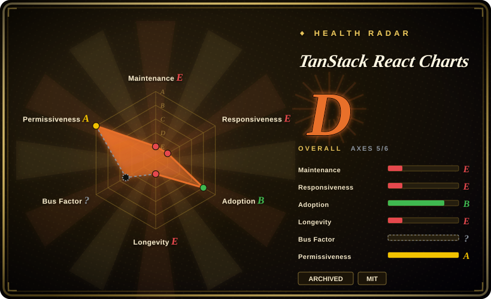
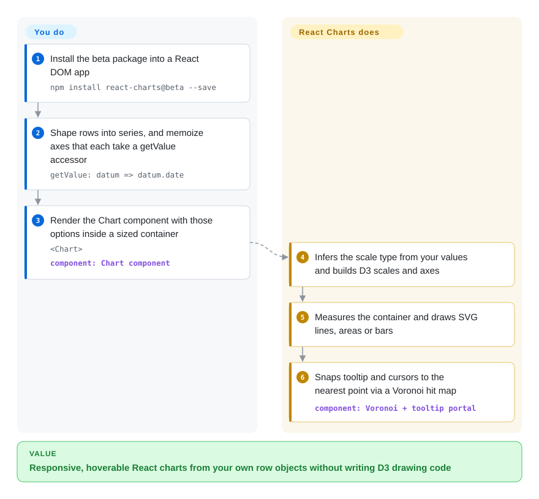

# TanStack React Charts

You inherited a React dashboard whose line and bar charts come from `react-charts`, and now tooltips jump to the top-left corner in Safari, a React upgrade breaks the tooltip portal, and every issue you find upstream is open with no reply. This page is about that library: a small React component that turned an array of series plus two axis accessor functions into responsive SVG line, area, bar and bubble charts — and that its owners archived in 2025 without ever shipping a stable v3.

## When to use

You are the engineer who owns an internal React app that already renders a dozen charts with `<Chart options={{ data, primaryAxis, secondaryAxes }} />`, pinned to `react-charts@3.0.0-beta.x`. The charts are plain time-series lines, stacked bars and a few sparklines; they work on your React version, and the product manager's ticket says "add one more series to the usage chart", not "rebuild the charts". Here the library is still the cheapest thing to touch: its model — an array of series, each with a `data` array of whatever rows you already have, and a `getValue: datum => datum.date` accessor per axis — lets you add the series in a few lines, with the Voronoi hover (the nearest-point hit map it draws invisibly over the plot) and synced cursors you already rely on.

That is the whole trigger: **keeping an existing react-charts integration alive while you plan its replacement**, or reading its source as a compact example of accessor-based D3 charting in React. For a new chart, pick a maintained library: **Recharts** for stable React-only components, **TanStack Charts** (the same organization's successor) when you want a grammar of marks across frameworks, **visx** or **nivo** when you want lower-level or more catalogue-style React charts. The deciding tradeoff is simple — react-charts gives you a small, familiar API you already use, and costs you all future fixes.

## How it works

You hand the component your data in one shape — an array of *series* (one line or bar group each), each carrying a `data` array of your own row objects — plus accessor functions that say which field of a row is the horizontal ("primary") value and which is the vertical ("secondary") value. From the first non-empty value it guesses the kind of axis (a *scale*: the ruler that turns a date, number or category into pixels — `time`, `linear`, `band`, `log`), builds D3 scales and axes, measures the size of the element it sits in, and draws SVG lines, areas or bars. For hovering it builds a Voronoi map — an invisible mosaic that assigns every pixel to its nearest data point, like the catchment area around each bus stop — so the tooltip and cursor lines snap to the closest point. What stays yours: shaping the data into series, **memoizing** the data and axis options with `React.useMemo` (the API docs warn that unstable options can cause "infinite change-detection loops"), and giving the chart's parent a real width and height, because it fills its container.

<!-- flow-steps:begin (generated from flows/tanstack-react-charts.json by tools/flow_card.py — do not edit) -->

Text version of the flow

1. **You**: Install the beta package into a React DOM app — `npm install react-charts@beta --save`
2. **You**: Shape rows into series, and memoize axes that each take a getValue accessor — `getValue: datum => datum.date`
3. **You**: Render the Chart component with those options inside a sized container — `<Chart>` — component: `Chart component`
4. **TanStack React Charts**: Infers the scale type from your values and builds D3 scales and axes
5. **TanStack React Charts**: Measures the container and draws SVG lines, areas or bars
6. **TanStack React Charts**: Snaps tooltip and cursors to the nearest point via a Voronoi hit map — component: `Voronoi + tooltip portal`

**Value**: Responsive, hoverable React charts from your own row objects without writing D3 drawing code

<!-- flow-steps:end -->

## When NOT to use

- **If you are starting a new chart in 2026, use Recharts or TanStack Charts instead of react-charts, because** the repository is archived and its README (2025-03-10) states "No further updates, bug fixes, or support will be provided"; open issues (72 on 2026-09-28) will never be triaged.
- **If you need a stable, semver-released version, use Recharts, visx or nivo instead, because** react-charts v3 never left beta (the last release is `3.0.0-beta.57`, 2023-11-02) and the npm `latest` dist-tag still points to `2.0.0-beta.7` from 2020 with a `react ^16.6.3` peer range — a plain `npm install react-charts` installs a different, older API than the docs describe (which say `npm install react-charts@beta`).
- **If you are on React 18/19 or Next.js, use Recharts or TanStack Charts instead, because** known React 18 problems were never fixed upstream: tooltips rendered through a portal land in the top-left corner (#256, #301 open), a React 18 tooltip fix PR (#336) was never merged, and "Can't get React charts running on Next.js" (#324) and beta build failures on Next.js/Vercel (#304) are still open. React 19 support was never tested upstream [未验证].
- **If your project pins modern type packages, use a maintained library instead, because** the published `3.0.0-beta.57` lists `@types/react ^17` and `@types/react-dom ^17` as *runtime dependencies*, so it can pull React 17 typings into a React 18/19 TypeScript project, and it depends on the older `d3-scale` 3 / `d3-shape` 2 lines.
- **If you need pie, donut, radar, heatmap, map or candlestick charts, use nivo or Apache ECharts instead, because** react-charts only draws line, area, bar/column and bubble (scatter) series on Cartesian axes; a candlestick request (#361) and vertical-line support (#379) were never addressed.
- **If you need framework-agnostic or server-rendered charts, use TanStack Charts instead, because** react-charts is React-DOM only (its docs say "compatible with ReactDOM only") and measures its container in the browser; its `initialWidth`/`initialHeight` are only fallbacks for SSR.
- **If you want deep styling control (fonts, cursor line styles, tooltip theme), use visx instead, because** users asked for font-size and cursor styling (#363, #367) and a dark-mode tooltip bug (#375) with no answer — you would be forking the library to get them.

## Comparison

| Alternative | In index | Our verdict | Tradeoff |
| --- | --- | --- | --- |
| [TanStack Charts](tanstack-charts.md) | ✅ | For any new chart where you would have reached for react-charts, pick TanStack Charts — the same organization's actively developed successor; keep react-charts only for code you cannot migrate yet. | TanStack Charts adds SVG SSR, keyboard focus, Canvas and adapters for many frameworks, and drops react-charts' "memoize or loop" requirement; you pay Alpha 0.x churn (pin exact versions) and a different, mark-based API that means rewriting each chart. |
| Recharts (`recharts/recharts`) | not indexed | For a React app that wants a maintained drop-in replacement for line/area/bar/scatter charts, pick Recharts; react-charts only wins where rewriting existing chart code is not yet affordable. | Recharts is MIT, active since 2015 and about 66.9M weekly npm downloads (week of 2026-09-21), with a component-per-element API (`<LineChart>`, `<XAxis>`, `<Tooltip>`); you pay a larger bundle and React-only lock-in, same as react-charts. Not added in this tab-intake batch. |
| visx (`airbnb/visx`) | not indexed | When you want to keep react-charts' D3-under-React approach but own every visual detail, pick visx; pick react-charts only if you need ready-made tooltips and axes with no assembly and accept no fixes. | visx gives maintained low-level D3 primitives as React components (MIT, since 2017, ~6.3M weekly downloads of `@visx/shape`); you write noticeably more code per chart, and its last push was 2026-06-22. Not added in this tab-intake batch. |
| nivo (`plouc/nivo`) | not indexed | When you need chart types react-charts never had (pie, heatmap, sunburst, choropleth) in React with themed defaults, pick nivo; react-charts has nothing to offer there. | nivo is MIT, since 2016, ~1.9M weekly downloads of `@nivo/core`, with SVG/Canvas/HTML renderers per chart; you pay a per-chart-package dependency tree and a config-heavy props API. Not added in this tab-intake batch. |

Other TanStack libraries — [TanStack Table](../component-libraries/tanstack-table.md) (data grid) and [TanStack Query](../data-fetching/tanstack-query.md) (server state) — are the usual companions of these charts, not substitutes. Note that the npm package `@tanstack/react-charts` is **not** this library: it is the React adapter of the new TanStack Charts (created 2026-07-29), while this archived library ships as unscoped `react-charts`.

## Tech stack

- **TypeScript + React** (function components and hooks; `src/components/Chart.tsx`, `src/seriesTypes/Line.tsx`, `Bar.tsx`). GitHub reports the repo language as HTML because of the bundled docs site.
- **D3 modules** for the math, not the DOM: `d3-scale`, `d3-shape`, `d3-array`, `d3-time`, `d3-time-format`, and `d3-delaunay` for the Voronoi hover map.
- **SVG** output with a tooltip rendered through a React portal and spring-based animation (`src/hooks/useSpring.ts`).
- Build: Babel + Rollup (CommonJS, ES and UMD bundles), `tsc` types, Jest; docs site in Next.js + Tailwind under `docs/`.

## Dependencies

- **Runtime:** the `react-charts` npm package (pin `3.0.0-beta.57`, installed with the `@beta` tag) and React + React DOM (`peerDependencies: react >=16, react-dom >=16`; the docs say React 16.8+ for hooks).
- Transitive: the D3 modules above, `@babel/runtime`, `ts-toolbelt`, and `@types/react`/`@types/react-dom` 17 pulled in as runtime dependencies.
- **No server, database or hosted service.** Data comes from your own code; the chart needs a parent element with a real width and height.

## Ops difficulty

**Low to run, rising to maintain.** There is nothing to deploy — it is a front-end dependency. The cost is ownership: every bug is now yours to patch (via `patch-package` or a fork), the dependency tree is frozen at 2023 versions (D3 3.x/2.x lines, React 17 types) so security or bundler updates may require overrides, and a React or Next.js upgrade is a re-test of every chart. Budget a migration to a maintained library rather than long-term upkeep.

## Health & viability

- **Maintenance (2026-09-28).** Ended. Last library commit 2023-11-02 (`3.0.0-beta.57`); the final commit (2025-03-10, PR #380) only added the "No Longer Maintained" banner, and the repository is archived (read-only). 72 issues/PRs were left open.
- **Governance / bus factor.** Single author in practice: Tanner Linsley made 436 of the commits counted by GitHub's contributor API, the next contributor 4. Being under the TanStack organization did not produce a second maintainer for this repo.
- **Backing & longevity.** Created 2017-02-24, so about 9.6 years old — but the Lindy prior does **not** help an archived project: age × still-active fails on the second factor. TanStack's investment moved to the new TanStack Charts (repo created 2026-07-28), whose `PLAN.md` lists the "React Charts lessons to retain" and explicitly drops required user memoization and the single large runtime.
- **Adoption.** Still installed: 190,118 npm downloads in the health scorer's last-month window and 52,907 in the week of 2026-09-21, of which 42,858 were `3.0.0-beta.57` — existing apps and lockfiles, not a sign of new adoption [推断]. 3,134 stars and 252 forks.
- **Risk flags.** MIT, no CLA, no relicense. The risks are abandonment (no security or compatibility fixes), a never-stable beta API, and a package name easily confused with `@tanstack/react-charts` (the successor's adapter).

## Caveats (unverified)

- [未验证] React 19 compatibility: the peer range is `>=16`, so npm will not block it, but nothing upstream tests React 19 and no issue reports either outcome; not reproduced here.
- [推断] The React 18 tooltip-position and Next.js problems are inferred from open issues #256, #301, #304, #324 and unmerged PR #336; whether they still reproduce on current React 18.3 was not tested.
- [推断] That most current downloads come from existing lockfiles rather than new projects is inferred from the version split (81% on `3.0.0-beta.57`, 2026-09-21 to 2026-09-27); npm does not expose who installs.
- [未验证] The exact archive date is not exposed by the GitHub API; the last push and the "no longer maintained" commit are both 2025-03-10, so archiving happened on or after that date.
- [未验证] The comparison cells for Recharts, visx and nivo rest on their GitHub metadata and npm download counts (2026-09-28), not on a full reading of those repositories in this batch.
- [未验证] The health radar's governance axis is `?` (reason `unattributable`): with no commits in the last 12 months the scorer had no active-maintainer window to measure; the single-author judgment above comes from the all-time contributor API instead.
