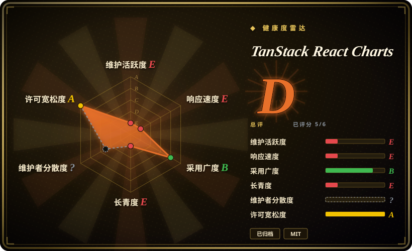
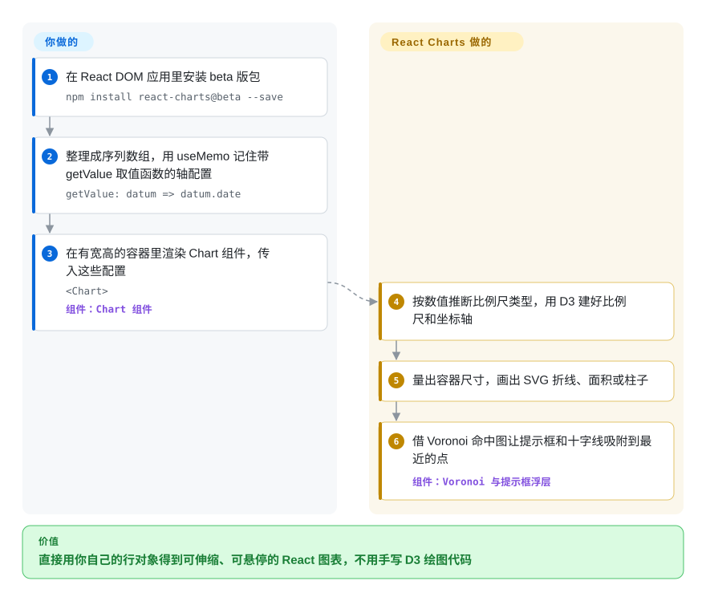

# TanStack React Charts

你接手了一个 React 看板，里面的折线图、柱状图都来自 `react-charts`：Safari 里提示框跑到页面左上角，升级 React 后提示框的浮层又坏了，去上游一搜，相关 issue 全都开着、没人回。本页讲的就是这个库——一个小巧的 React 组件，把“几条数据序列 + 两个取值函数”画成随容器伸缩的 SVG 折线、面积、柱状和气泡图；它的维护方在 2025 年把仓库归档，v3 始终没发正式版。

## 何时使用

你负责一个内部 React 应用，里面已经有十几张图用 `<Chart options={{ data, primaryAxis, secondaryAxes }} />` 渲染，版本钉在 `react-charts@3.0.0-beta.x`。图都很普通：时间序列折线、堆叠柱、几条迷你趋势线；它们在你当前的 React 版本上能跑，产品经理的工单写的是“用量图再加一条线”，不是“把图表重做”。这种时候，动它仍然最省事：它的数据模型是“若干条序列，每条带一个 `data` 数组，里面就是你手上现成的行对象”，每根轴配一个 `getValue: datum => datum.date` 取值函数，加一条线只要几行；你已经依赖的 Voronoi 悬停（它在图上隐形地画一张“离哪个点最近”的命中图）和联动十字线也都照旧。

触发场景只有这些：**在规划替换之前，先让已有的 react-charts 集成继续活着**；或者把它的源码当作“React 里用取值函数驱动 D3 画图”的紧凑样例来读。新图请选仍在维护的库：只做 React、要稳定组件选 **Recharts**；想要跨框架的“标记语法”选 **TanStack Charts**（同一组织的继任者）；想要更底层或图种更全的 React 图表选 **visx** 或 **nivo**。决定性的取舍很简单——react-charts 给你的是一个你已经在用的小而熟悉的 API，代价是往后再也没有修复。

## 怎么用起来

你按一种固定形状把数据交给组件：一个“序列”数组（每条序列是一条线或一组柱），每条序列带一个 `data` 数组，装你自己的行对象；再给几个取值函数，说明行里哪个字段是横向的“主轴”值、哪个是纵向的“副轴”值。它看第一个非空值来猜轴的类型——也就是“比例尺”，把日期、数字或类别换算成像素的那把尺子，有 `time`、`linear`、`band`、`log` 等——然后用 D3 建好比例尺和坐标轴，量出所在容器的尺寸，画出 SVG 折线、面积或柱子。悬停交互靠 Voronoi 图：一张看不见的马赛克，把每个像素分给离它最近的数据点，就像按“离哪个公交站最近”划分片区，于是提示框和十字线总能吸附到最近的点。留给你的活：把数据整理成序列；用 `React.useMemo` **记住**数据和轴配置（API 文档警告，不稳定的配置可能导致“无限的变更检测循环”）；以及给图表的父元素一个真实的宽高，因为它会撑满容器。

<!-- flow-steps:begin (generated from flows/tanstack-react-charts.json by tools/flow_card.py — do not edit) -->

流程文字版

1. **你**：在 React DOM 应用里安装 beta 版包 — `npm install react-charts@beta --save`
2. **你**：整理成序列数组，用 useMemo 记住带 getValue 取值函数的轴配置 — `getValue: datum => datum.date`
3. **你**：在有宽高的容器里渲染 Chart 组件，传入这些配置 — `<Chart>` — 组件：`Chart 组件`
4. **TanStack React Charts**：按数值推断比例尺类型，用 D3 建好比例尺和坐标轴
5. **TanStack React Charts**：量出容器尺寸，画出 SVG 折线、面积或柱子
6. **TanStack React Charts**：借 Voronoi 命中图让提示框和十字线吸附到最近的点 — 组件：`Voronoi 与提示框浮层`

**价值**：直接用你自己的行对象得到可伸缩、可悬停的 React 图表，不用手写 D3 绘图代码

<!-- flow-steps:end -->

## 何时不用

- **如果你在 2026 年要新画一张图，用 Recharts 或 TanStack Charts，别用 react-charts，因为**仓库已归档，README（2025-03-10）写明“不会再提供任何更新、缺陷修复或支持”；开着的 72 个 issue/PR（2026-09-28）永远不会再有人处理。
- **如果你需要稳定、按语义化版本发布的版本，用 Recharts、visx 或 nivo，因为** react-charts v3 从未脱离 beta（最后一个版本是 `3.0.0-beta.57`，2023-11-02），而 npm 的 `latest` 标签仍指向 2020 年的 `2.0.0-beta.7`，对等依赖是 `react ^16.6.3`——直接 `npm install react-charts` 装到的是另一套更老的 API，跟文档（文档让你装 `react-charts@beta`）对不上。
- **如果你用的是 React 18/19 或 Next.js，用 Recharts 或 TanStack Charts，因为**已知的 React 18 问题上游从未修复：经由浮层渲染的提示框跑到左上角（#256、#301 仍开着），一个 React 18 提示框修复 PR（#336）始终没合并，“在 Next.js 上跑不起来”（#324）和 beta 版在 Next.js/Vercel 上构建失败（#304）也都开着。上游从没测过 React 19 [未验证]。
- **如果你的项目锁定了较新的类型包，用仍在维护的库，因为**已发布的 `3.0.0-beta.57` 把 `@types/react ^17`、`@types/react-dom ^17` 列为**运行时依赖**，可能把 React 17 的类型带进 React 18/19 的 TypeScript 项目；它还依赖较老的 `d3-scale` 3、`d3-shape` 2 系列。
- **如果你要饼图、环形图、雷达图、热力图、地图或 K 线图，用 nivo 或 Apache ECharts，因为** react-charts 只会在直角坐标系上画折线、面积、柱/条和气泡（散点）；有人提过 K 线（#361）和竖线标注（#379），都没下文。
- **如果你要跨框架或在服务端渲染的图表，用 TanStack Charts，因为** react-charts 只支持 React DOM（文档原话“仅兼容 ReactDOM”），而且要在浏览器里量容器尺寸；`initialWidth`/`initialHeight` 只是服务端渲染时的兜底值。
- **如果你要深度控制样式（字号、十字线样式、提示框主题），用 visx，因为**有人问过字号和十字线样式（#363、#367），还有暗色模式下提示框看不清的缺陷（#375），都没人回——想要就只能自己 fork。

## 横向对比

| 替代品 | 是否收录 | 我们的评价 | 取舍 |
| --- | --- | --- | --- |
| [TanStack Charts](tanstack-charts.zh.md) | ✅ | 凡是原本会选 react-charts 的新图，都选 TanStack Charts——同一组织、仍在积极开发的继任者；react-charts 只留给暂时迁不动的旧代码。 | TanStack Charts 多了服务端 SVG、键盘焦点、Canvas 和多框架适配，也去掉了 react-charts“不记忆化就可能死循环”的要求；代价是 Alpha 0.x 的频繁变动（要锁定精确版本），以及基于“标记”的全新 API，每张图都得重写。 |
| Recharts（`recharts/recharts`） | 未收录 | 如果 React 应用要一个仍在维护、能直接顶替折线/面积/柱/散点图的库，选 Recharts；react-charts 只在“暂时付不起重写成本”时胜出。 | Recharts 是 MIT，2015 年起持续活跃，npm 周下载约 6690 万（2026-09-21 那周），API 是“一个元素一个组件”（`<LineChart>`、`<XAxis>`、`<Tooltip>`）；代价是包更大，同样锁死在 React。本次标签页收录批次未添加。 |
| visx（`airbnb/visx`） | 未收录 | 想保留 react-charts“React 外壳 + D3 计算”的思路、又要掌控每个视觉细节，选 visx；只有在需要现成提示框和坐标轴、不想自己拼、又接受没有修复时才留在 react-charts。 | visx 把 D3 底层能力做成仍在维护的 React 组件（MIT，2017 年起，`@visx/shape` 周下载约 630 万）；代价是每张图要多写不少代码，最近一次推送是 2026-06-22。本次标签页收录批次未添加。 |
| nivo（`plouc/nivo`） | 未收录 | 需要 react-charts 从来没有的图种（饼图、热力图、旭日图、分级地图）且想要带主题的默认样式时，选 nivo；这些场景 react-charts 无能为力。 | nivo 是 MIT，2016 年起，`@nivo/core` 周下载约 190 万，每种图有 SVG/Canvas/HTML 渲染；代价是按图种拆包带来的依赖树，以及配置项繁多的 props API。本次标签页收录批次未添加。 |

TanStack 的其他库——[TanStack Table](../component-libraries/tanstack-table.zh.md)（数据表格）和 [TanStack Query](../data-fetching/tanstack-query.zh.md)（服务端状态）——是这些图表常见的搭档，不是替代品。注意 npm 包 `@tanstack/react-charts` **不是**本库：它是新 TanStack Charts 的 React 适配层（2026-07-29 创建），而这个已归档的库发布名是不带作用域的 `react-charts`。

## 技术栈

- **TypeScript + React**（函数组件和 Hooks；`src/components/Chart.tsx`、`src/seriesTypes/Line.tsx`、`Bar.tsx`）。GitHub 把仓库语言标成 HTML，是因为仓库里带了文档站。
- **D3 模块**只负责计算、不碰 DOM：`d3-scale`、`d3-shape`、`d3-array`、`d3-time`、`d3-time-format`，以及用于 Voronoi 悬停命中图的 `d3-delaunay`。
- 输出 **SVG**，提示框经 React 浮层（portal）渲染，动画基于弹簧模型（`src/hooks/useSpring.ts`）。
- 构建：Babel + Rollup（CommonJS、ES、UMD 三种产物），`tsc` 出类型，Jest 测试；文档站在 `docs/`，用 Next.js + Tailwind。

## 依赖

- **运行时：** npm 包 `react-charts`（锁定 `3.0.0-beta.57`，用 `@beta` 标签安装）以及 React + React DOM（`peerDependencies: react >=16, react-dom >=16`；文档要求 React 16.8+ 以支持 Hooks）。
- 传递依赖：上述 D3 模块、`@babel/runtime`、`ts-toolbelt`，以及作为运行时依赖被带进来的 `@types/react`/`@types/react-dom` 17。
- **不需要服务器、数据库或托管服务。**数据由你的代码提供；图表的父元素必须有真实的宽高。

## 运维难度

**运行成本低，维护成本逐年上升。**没有东西要部署——它只是一个前端依赖。成本在“归你所有”：每个缺陷都得你自己打补丁（`patch-package` 或 fork）；依赖树冻结在 2023 年的版本（D3 3.x/2.x 系列、React 17 类型），安全或打包工具升级可能要加 overrides；每次升级 React 或 Next.js 都要把所有图重测一遍。与其长期养着，不如排期迁到仍在维护的库。

## 健康度与可持续性

- **维护（2026-09-28）。**已终止。最后一次库代码提交是 2023-11-02（`3.0.0-beta.57`）；最后一个提交（2025-03-10，PR #380）只是加上“不再维护”的横幅，仓库已归档（只读），留下 72 个未关闭的 issue/PR。
- **治理 / 巴士因子。**实际上是单人项目：GitHub 贡献者接口统计中 Tanner Linsley 有 436 次提交，第二名只有 4 次。挂在 TanStack 组织下，并没有给这个仓库带来第二位维护者。
- **背书与存续。**创建于 2017-02-24，约 9.6 年——但林迪先验（活得越久、越可能继续活）**救不了**已归档的项目：“年龄 × 仍活跃”在第二个因子上不成立。TanStack 的投入已转到新的 TanStack Charts（仓库 2026-07-28 创建），其 `PLAN.md` 列出了“要保留的 React Charts 经验”，并明确去掉了“用户必须记忆化”和“一个大而全的运行时”。
- **采用度。**仍有人在装：健康度评分器统计的近一个月窗口内 npm 下载 190,118 次，2026-09-21 那周 52,907 次，其中 42,858 次是 `3.0.0-beta.57`——来自已有应用和锁文件，不代表新增采用 [推断]。3,134 星、252 个 fork。
- **风险信号。**MIT，无 CLA，无改许可证历史。风险在于：已放弃维护（没有安全和兼容修复）、API 停在从未稳定的 beta，以及包名容易和 `@tanstack/react-charts`（继任者的适配层）混淆。

## 存疑（未验证）

- [未验证] React 19 兼容性：对等依赖是 `>=16`，npm 不会拦，但上游从没测过 React 19，也没有 issue 报告成败；本次未复现。
- [推断] React 18 下提示框错位和 Next.js 问题，是根据仍开着的 #256、#301、#304、#324 以及未合并的 PR #336 推断的；未在当前 React 18.3 上实测是否仍能复现。
- [推断] “当前下载主要来自已有锁文件而非新项目”是根据版本分布推断的（2026-09-21 至 2026-09-27，81% 落在 `3.0.0-beta.57`）；npm 不公开是谁在安装。
- [未验证] GitHub 接口不提供确切的归档日期；最后一次推送和“不再维护”提交都在 2025-03-10，因此归档发生在当天或之后。
- [未验证] Recharts、visx、nivo 的对比内容基于它们的 GitHub 元数据和 npm 下载量（2026-09-28），本批次未完整阅读这些仓库。
- [未验证] 健康度雷达的治理轴是 `?`（原因 `unattributable`）：近 12 个月没有提交，评分器没有可统计的活跃维护者窗口；上文“实际是单人项目”的判断改用的是全历史贡献者接口。
