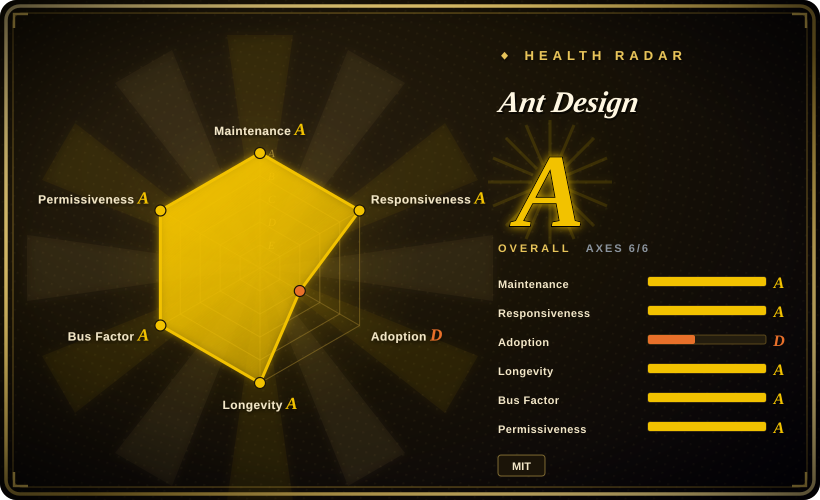
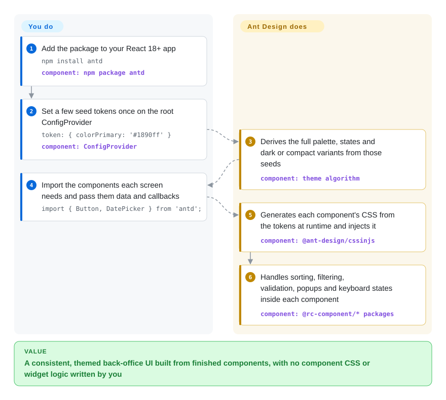

# Ant Design

Your internal admin app needs fifty screens of filterable tables, multi-step forms, date-range pickers, tree selectors and upload lists, and nobody on the team is a designer. Ant Design is a React library that ships all of those as ready, consistently styled components, so you assemble screens instead of building widgets and arguing about spacing.

## When to use

You are the front-end lead on a back-office product in React: an operations console, a CRM, an internal BI or approval tool. The pages are mostly data. That means a table with sorting, column filters, fixed columns, row selection and pagination; a form with dynamic field lists, async validation and cascading selects; and a drawer with details. With a headless kit or copy-paste components you would spend the first month wiring a data grid and form state before shipping a single screen. You reach for Ant Design because `Table`, `Form`, `DatePicker.RangePicker`, `TreeSelect`, `Cascader`, `Upload` and dozens of other components arrive already designed to work together, with built-in i18n (locale packs for dozens of languages) and one theme object that restyles everything from a few seed colors.

Pick it over [Material UI](material-ui.md) when your app is form- and table-heavy and you want those components complete in the free MIT package. MUI's advanced data grid features sit in paid tiers [未验证]. Pick it over [shadcn/ui](shadcn-ui.md) or [Radix UI](radix-ui.md) when you would rather accept Ant Design's look than own and maintain every component's source.

## How it works

Ant Design is an npm package of React components (`antd`) built on a layer of lower-level `@rc-component/*` packages that implement the behavior: keyboard handling, popups and virtual scrolling. Styling is CSS-in-JS: each component's CSS is generated in the browser at runtime from **design tokens**, named values like `colorPrimary` or `borderRadius`. You set a few "seed" tokens on a `ConfigProvider` at the root, and its algorithm derives the full palette, hover and active states, and dark or compact variants from them. You never write component CSS. Since v6 the generated styles use CSS variables by default, and an opt-in `zeroRuntime` mode lets you ship a prebuilt stylesheet instead of runtime generation. You decide which components go on each screen and feed them data and callbacks. Ant Design handles look, interaction states, i18n and the derived theme.

<!-- flow-steps:begin (generated from flows/ant-design.json by tools/flow_card.py — do not edit) -->

Text version of the flow

1. **You**: Add the package to your React 18+ app — `npm install antd` — component: `npm package antd`
2. **You**: Set a few seed tokens once on the root ConfigProvider — `token: { colorPrimary: '#1890ff' }` — component: `ConfigProvider`
3. **Ant Design**: Derives the full palette, states and dark or compact variants from those seeds — component: `theme algorithm`
4. **You**: Import the components each screen needs and pass them data and callbacks — `import { Button, DatePicker } from 'antd';`
5. **Ant Design**: Generates each component's CSS from the tokens at runtime and injects it — component: `@ant-design/cssinjs`
6. **Ant Design**: Handles sorting, filtering, validation, popups and keyboard states inside each component — component: `@rc-component/* packages`

**Value**: A consistent, themed back-office UI built from finished components, with no component CSS or widget logic written by you

<!-- flow-steps:end -->

## When NOT to use

- **Your app is Vue or Angular.** `antd` is React-only. Use the community ports Ant Design Vue or NG-ZORRO (not indexed), or Element Plus for Vue, rather than wrapping React components.
- **You are stuck on React 17 or older.** antd v6 requires React ≥ 18 and drops older versions. Stay on antd 5 (last release 5.29.3, 2025-12) only as a stopgap, or upgrade React first. For a library that still targets your React version, check [Material UI](material-ui.md)'s support matrix.
- **The product needs a distinctive brand look.** Tokens re-color and re-shape Ant Design, but the layout, density and component anatomy still read as "Ant Design". For a consumer-brand UI, own the components with [shadcn/ui](shadcn-ui.md) or build on [Radix UI](radix-ui.md) primitives.
- **You want unstyled primitives or a Tailwind-first workflow.** Ant Design is fully styled with its own CSS-in-JS engine. Theming fights Tailwind utility classes. Use Radix UI (headless) or shadcn/ui (Radix plus Tailwind) instead.
- **Bundle weight or runtime style cost is a hard budget** (marketing pages, low-end mobile). Even with tree-shaking you ship the component runtime, the rc-component layer and `dayjs`, plus CSS-in-JS work unless you enable `zeroRuntime`. Use shadcn/ui, where you ship only what you copied, or plain CSS.
- **Mobile-first consumer app.** The main library targets desktop-density screens. Use Ant Design Mobile (separate repo, not indexed), or a native or hybrid framework.
- **Your styles reach into component internals.** v6 changed the DOM structure of many components, and the migration guide warns that selectors targeting internal nodes may break. If your codebase overrides internals heavily, budget the migration or prefer owned components (shadcn/ui).

## Comparison

| Alternative | In index | Our verdict | Tradeoff |
| --- | --- | --- | --- |
| [Material UI (MUI)](material-ui.md) | ✅ | For data-dense admin apps where the full table and form set must be free, choose Ant Design. Choose MUI when you want Material Design styling and its larger Western ecosystem of templates and hires. | MUI's look and docs are more familiar in Western teams, but advanced grid features are commercial. Ant Design's Table and Form are complete under MIT, but its look is harder to escape. |
| [shadcn/ui](shadcn-ui.md) | ✅ | When the UI is your brand and you want to own every component's code, choose shadcn/ui. Choose Ant Design when you want the widgets finished and upgraded for you. | shadcn/ui means no runtime dependency and full styling freedom, but you maintain the copied code. Ant Design starts you faster but locks you into its look and upgrade path. |
| [Chakra UI](chakra-ui.md) | ✅ | For SaaS product UIs styled through props and tokens, choose Chakra UI. For enterprise back-office screens built around tables and complex forms, choose Ant Design. | Chakra is lighter-weight and easier to restyle, but it has no Ant-level data table or form engine. Ant Design ships those but is heavier and more opinionated. |
| [Radix UI](radix-ui.md) | ✅ | If you are building your own design system, choose Radix primitives. If you need a finished one today, choose Ant Design. | Radix gives you accessible behavior with zero styling, so you design everything. Ant Design gives you both behavior and design, so you change little. |
| [TanStack Table](tanstack-table.md) | ✅ | When the data grid is the core of the product and needs a fully custom look or headless control, choose TanStack Table under your own UI. Choose Ant Design's `Table` when a styled, ready table is enough. | TanStack Table is headless and framework-agnostic, so all markup is yours. Ant Design's Table is ready-made but tied to its styling and React. |

## Tech stack

- **TypeScript + React:** all components are typed, and React ≥ 18 is a peer dependency (v6).
- **CSS-in-JS via `@ant-design/cssinjs`:** runtime style generation from design tokens. CSS variables are on by default in v6, and `zeroRuntime` mode imports a static `antd/dist/antd.css` instead. Less is no longer used (removed in v5).
- **Design tokens:** three layers (Seed → Map → Alias) plus per-component tokens, with preset algorithms (default, dark, compact).
- **`@rc-component/*`:** the underlying behavior packages (table, form, picker, select, tree and more) maintained by the same org.
- **`dayjs`:** the date library behind DatePicker and TimePicker.
- **dumi:** generates the documentation site (ant.design).

## Dependencies

- **Peer:** `react` ≥ 18 and `react-dom` ≥ 18.
- **Bundled runtime deps (installed automatically):** `@ant-design/cssinjs`, `@ant-design/icons` (v6 requires icons v6), `@ant-design/colors`, about 40 `@rc-component/*` packages, `dayjs`, `clsx` and a few utilities.
- **Build:** any modern bundler (Vite, webpack, Next.js). No Less loader is needed.
- **Not included:** charts (AntV / `@ant-design/charts`), the pro layout and admin templates (`@ant-design/pro-components`), and mobile components (Ant Design Mobile) are separate packages.
- **Browsers:** modern browsers only. v6 relies on CSS variables and does not support IE.

## Ops difficulty

**Low.** It is a client library with no service to run. The recurring cost is major upgrades. v5 → v6 needs React 18+, a matching `@ant-design/icons@6`, and a pass over custom CSS that targeted internal DOM nodes. Many props are deprecated with console warnings ahead of removal in v7 (for example `Alert.message` → `title`, `Table` `pagination.position` → `placement`). The official migration guide and the Ant Design CLI help, but plan it as a project. Server-side rendering needs the documented style-extraction setup so CSS-in-JS styles reach the first paint.

## Health & viability

- **Maintenance (A), as of 2026-10-08:** commits daily (13 of 13 recent weeks active, last commit 0 days ago) and patch releases roughly weekly (6.6.1 → 6.6.5 between 2026-08-17 and 2026-09-20). v6.0.0 shipped 2025-11-22.
- **Responsiveness (A):** median first response 0.5 hours across 46 recent issues. A bot plus maintainers triage almost immediately.
- **Governance (A):** 76 active contributors in the trailing year, and the top three account for 47.8% of recent commits. The `ant-design` GitHub org is run by a core team that originated at Ant Group / Alibaba, with OpenCollective sponsorship. Roadmap influence from Ant Group's internal products is not documented.
- **Longevity (A) and Lindy:** created 2015-04, 4185 days old, three major rewrites (v4 → v5 CSS-in-JS → v6) without losing momentum. A strong Lindy prior.
- **Adoption (A):** the npm `antd` package had 15,539,584 downloads in the last month and 113,307 dependent repositories on the scorer's 2026-10-09 reading, and the repo has ~99.7k stars — top-tier adoption.
- **Risk / License (A):** MIT, no relicense, no paid tier inside `antd` itself. The main risk is upgrade churn between majors.

## Caveats (unverified)

- [未验证] MUI's advanced data-grid features being commercial-tier is based on general knowledge of MUI X licensing, not re-read for this page.
- [未验证] The share of Ant Design users in China versus elsewhere was not measured.
- [未验证] Per-component accessibility (ARIA, keyboard support) was not audited. Complex components such as Table and Cascader may need manual fixes.
- [推断] How long antd 5 keeps receiving fixes after v6 is not stated in the docs read here. The last 5.x release seen on npm is 5.29.3 (2025-12-18).
- [推断] Runtime CSS-in-JS cost in very large apps with many dynamic theme changes was not benchmarked. v6's CSS variables and `zeroRuntime` mode exist to reduce it.
- [未验证] Download and dependent counts come from the health scorer (ecosyste.ms data); they include CI and mirror traffic and indicate scale, not user counts.
