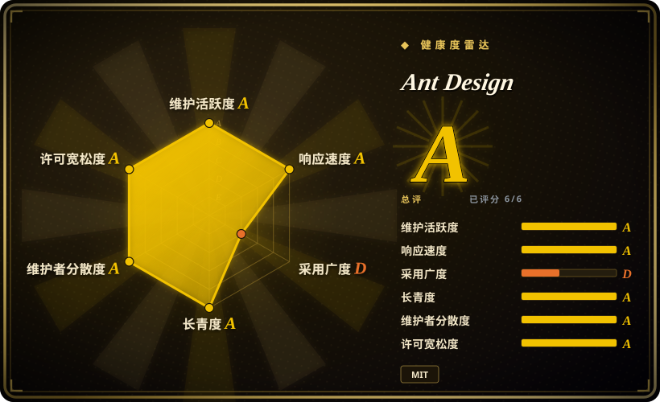
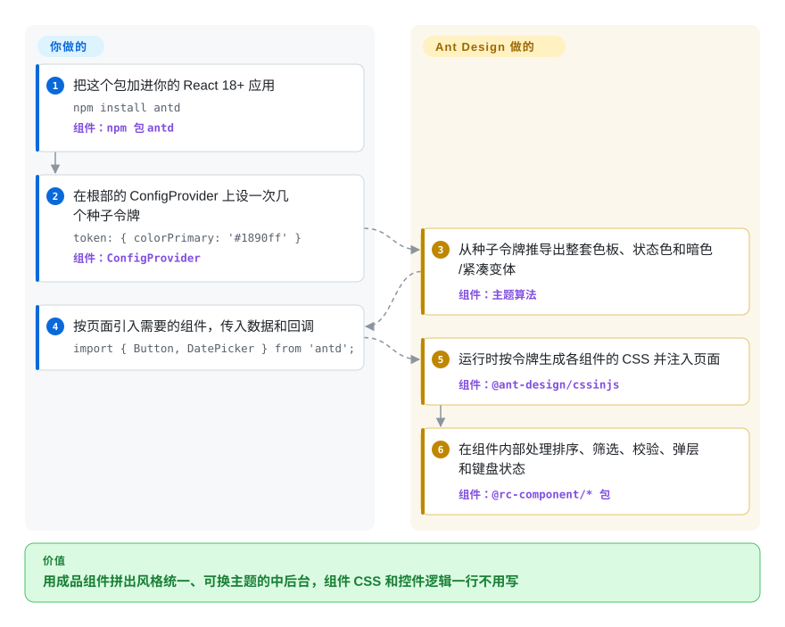

# Ant Design

你的内部管理系统要做五十个页面：可筛选的表格、多步表单、日期范围选择、树形选择、上传列表，可团队里没有设计师。Ant Design 是一个 React 组件库，把这些都做成了现成、风格统一的组件，你拼页面就行，不用自己造控件，也不用为间距争论。

## 何时使用

你是一个 React 中后台产品的前端负责人，做的是运营控制台、CRM、内部 BI 或审批工具。页面基本都是数据：一张能排序、列筛选、固定列、勾选行、分页的表格，一个带动态字段列表、异步校验和级联选择的表单，再加一个展示详情的抽屉。用 headless 组件或复制粘贴式组件，你头一个月都在搭表格和表单状态，一个页面都没上线。这时你会想到 Ant Design：`Table`、`Form`、`DatePicker.RangePicker`、`TreeSelect`、`Cascader`、`Upload` 以及另外几十个组件，生来就是配套设计的，自带国际化（几十种语言的语言包），一个主题对象从几个种子色出发就能改掉全部样式。

应用以表单和表格为主，并且你想在免费的 MIT 包里就拿到完整的组件时，选它而不是 [Material UI](material-ui.zh.md)。MUI 的高级数据表格功能在付费档里 [未验证]。宁可接受 Ant Design 的外观，也不想自己持有并维护每个组件的源码时，选它而不是 [shadcn/ui](shadcn-ui.zh.md) 或 [Radix UI](radix-ui.zh.md)。

## 怎么用起来

Ant Design 是一个 React 组件的 npm 包（`antd`），底下一层是负责行为的 `@rc-component/*` 包：键盘交互、弹层、虚拟滚动都在那一层。样式走 CSS-in-JS：每个组件的 CSS 在浏览器里运行时生成，依据的是**设计令牌**，也就是 `colorPrimary`、`borderRadius` 这类有名字的取值。你在根部的 `ConfigProvider` 上设几个“种子”令牌，它的算法会推导出整套色板、悬停和按下状态，以及暗色或紧凑变体，组件 CSS 你一行都不用写。从 v6 起，生成的样式默认用 CSS 变量，另有一个可选的 `zeroRuntime` 模式，让你改为引入预生成的样式表，不在运行时生成。每个页面放哪些组件、喂什么数据和回调由你决定，外观、交互状态、国际化和推导出的主题由 Ant Design 负责。

<!-- flow-steps:begin (generated from flows/ant-design.json by tools/flow_card.py — do not edit) -->

流程文字版

1. **你**：把这个包加进你的 React 18+ 应用 — `npm install antd` — 组件：`npm 包 antd`
2. **你**：在根部的 ConfigProvider 上设一次几个种子令牌 — `token: { colorPrimary: '#1890ff' }` — 组件：`ConfigProvider`
3. **Ant Design**：从种子令牌推导出整套色板、状态色和暗色/紧凑变体 — 组件：`主题算法`
4. **你**：按页面引入需要的组件，传入数据和回调 — `import { Button, DatePicker } from 'antd';`
5. **Ant Design**：运行时按令牌生成各组件的 CSS 并注入页面 — 组件：`@ant-design/cssinjs`
6. **Ant Design**：在组件内部处理排序、筛选、校验、弹层和键盘状态 — 组件：`@rc-component/* 包`

**价值**：用成品组件拼出风格统一、可换主题的中后台，组件 CSS 和控件逻辑一行不用写

<!-- flow-steps:end -->

## 何时不用

- **你的应用是 Vue 或 Angular。** `antd` 只支持 React。用社区移植的 Ant Design Vue 或 NG-ZORRO（未收录），或者 Vue 下的 Element Plus，别去包装 React 组件。
- **你卡在 React 17 或更老的版本。** antd v6 要求 React ≥ 18，不再支持旧版。antd 5（最后一版 5.29.3，2025-12）只能当过渡，或者先升级 React。需要仍支持你那个 React 版本的库时，去看 [Material UI](material-ui.zh.md) 的支持矩阵。
- **产品需要有辨识度的品牌外观。** 令牌能改 Ant Design 的颜色和圆角，但布局、密度和组件结构一看就是“Ant Design”。面向消费者的品牌界面，用 [shadcn/ui](shadcn-ui.zh.md) 自己持有组件，或基于 [Radix UI](radix-ui.zh.md) 原语来搭。
- **你要无样式原语，或以 Tailwind 为主的工作流。** Ant Design 是全套带样式的，用的是自己的 CSS-in-JS 引擎，主题和 Tailwind 工具类会互相打架。改用 Radix UI（headless）或 shadcn/ui（Radix + Tailwind）。
- **包体积或运行时样式开销是硬预算**（营销页、低端手机）。即使做了 Tree-shaking，你仍要带上组件运行时、rc-component 层和 `dayjs`，不开 `zeroRuntime` 还有 CSS-in-JS 的计算。用 shadcn/ui（只打包你复制的部分）或纯 CSS。
- **移动优先的 C 端应用。** 主库面向桌面端的信息密度。用 Ant Design Mobile（独立仓库，未收录），或原生/混合框架。
- **你的样式深入改了组件内部节点。** v6 调整了许多组件的 DOM 结构，迁移指南提醒：针对内部节点的选择器可能失效。如果代码库大量覆盖内部样式，要为迁移留出预算，或者改用自己持有的组件（shadcn/ui）。

## 横向对比

| 替代品 | 是否收录 | 我们的评价 | 取舍 |
| --- | --- | --- | --- |
| [Material UI (MUI)](material-ui.zh.md) | ✅ | 数据密集的中后台、要求整套表格和表单都免费时，选 Ant Design。想要 Material Design 风格以及更大的西方模板和人才生态时，选 MUI。 | MUI 的外观和文档在西方团队里更熟悉，但高级表格功能是商业版。Ant Design 的 Table 和 Form 在 MIT 下就是完整的，但它的外观更难摆脱。 |
| [shadcn/ui](shadcn-ui.zh.md) | ✅ | 界面就是你的品牌、你想持有每个组件的代码时，选 shadcn/ui。想要控件现成、升级也有人负责时，选 Ant Design。 | shadcn/ui 没有运行时依赖、样式完全自由，但复制来的代码要自己维护。Ant Design 起步更快，但外观和升级路径都被它锁定。 |
| [Chakra UI](chakra-ui.zh.md) | ✅ | 用 props 和令牌来做样式的 SaaS 产品界面，选 Chakra UI。围绕表格和复杂表单的企业后台，选 Ant Design。 | Chakra 更轻、更容易改样式，但没有 Ant 那个级别的数据表格和表单引擎。Ant Design 有这些，但更重、更有主见。 |
| [Radix UI](radix-ui.zh.md) | ✅ | 要搭自己的设计系统，选 Radix 原语。今天就要一套成品，选 Ant Design。 | Radix 只给无障碍行为、零样式，设计全靠你。Ant Design 行为和设计一起给，你改得很少。 |
| [TanStack Table](tanstack-table.zh.md) | ✅ | 数据表格是产品核心、需要完全自定义外观或 headless 控制时，在你自己的 UI 下用 TanStack Table。一张带样式的现成表格就够时，用 Ant Design 的 `Table`。 | TanStack Table 是 headless、跨框架的，所有标记都归你。Ant Design 的 Table 开箱即用，但绑定它的样式和 React。 |

## 技术栈

- **TypeScript + React：** 所有组件都带类型，v6 的 peer 依赖是 React ≥ 18。
- **CSS-in-JS（`@ant-design/cssinjs`）：** 运行时根据设计令牌生成样式。v6 默认开启 CSS 变量，`zeroRuntime` 模式改为引入静态的 `antd/dist/antd.css`。已不再使用 Less（v5 起移除）。
- **设计令牌：** 三层（Seed → Map → Alias）外加组件级令牌，预置算法有默认、暗色、紧凑三种。
- **`@rc-component/*`：** 底层行为包（table、form、picker、select、tree 等），由同一组织维护。
- **`dayjs`：** DatePicker 和 TimePicker 背后的日期库。
- **dumi：** 生成文档站（ant.design）。

## 依赖

- **Peer：** `react` ≥ 18、`react-dom` ≥ 18。
- **随包安装的运行时依赖：** `@ant-design/cssinjs`、`@ant-design/icons`（v6 要求 icons v6）、`@ant-design/colors`、约 40 个 `@rc-component/*` 包、`dayjs`、`clsx` 和少量工具库。
- **构建：** 任意现代打包工具（Vite、webpack、Next.js），不需要 Less loader。
- **不包含：** 图表（AntV / `@ant-design/charts`）、Pro 布局与后台模板（`@ant-design/pro-components`）、移动端组件（Ant Design Mobile）都是独立的包。
- **浏览器：** 只支持现代浏览器。v6 依赖 CSS 变量，不支持 IE。

## 运维难度

**低。** 它是客户端库，没有要跑的服务。反复出现的成本是大版本升级。v5 → v6 需要 React 18+、配套的 `@ant-design/icons@6`，还要把针对内部 DOM 节点的自定义 CSS 过一遍。许多属性已经标为废弃，会在控制台告警，v7 时移除（例如 `Alert.message` → `title`，`Table` 的 `pagination.position` → `placement`）。官方迁移指南和 Ant Design CLI 能帮忙，但要当作一个项目来排期。服务端渲染要按文档配置样式抽取，CSS-in-JS 生成的样式才能出现在首屏。

## 健康度与可持续性

- **维护（A，截至 2026-10-08）：** 每天都有提交（近 13 周 13 周活跃，最后一次提交在 0 天前），补丁版本大约每周一个（2026-08-17 到 2026-09-20 之间从 6.6.1 发到 6.6.5）。v6.0.0 于 2025-11-22 发布。
- **响应速度（A）：** 近期 46 个 issue 的首次响应中位数是 0.5 小时，机器人加维护者几乎立刻分诊。
- **治理（A）：** 过去一年有 76 名活跃贡献者，前三名只占近期提交的 47.8%。`ant-design` GitHub 组织由源自蚂蚁集团/阿里巴巴的核心团队运营，并有 OpenCollective 赞助。蚂蚁内部产品对路线图有多大影响，没有公开说明。
- **存续（A）与 Lindy：** 2015-04 创建，仓库 4185 天，经历三次大改（v4 → v5 CSS-in-JS → v6）仍保持势头。Lindy 先验很强。
- **采用（雷达上是 D，属于评分器误判）：** 评分器匹配到的是 NuGet 上一个同名 `antd` 包（7513 次下载），不是 npm 包。真正的 npm `antd` 在截至 2026-10-04 的 30 天里下载约 1550 万次，仓库约 9.97 万 star，实际采用是顶级的。把这个 D 当作数据错误，不是信号。
- **风险/许可（A）：** MIT，没有改过许可，`antd` 本身没有付费档。主要风险是大版本之间的升级成本。

## 存疑（未验证）

- [未验证] “MUI 高级数据表格功能属于商业档”依据的是对 MUI X 许可的一般了解，本页没有重新核对。
- [未验证] Ant Design 用户在中国与其他地区的比例没有测量。
- [未验证] 各组件的无障碍情况（ARIA、键盘支持）没有审计，Table、Cascader 这类复杂组件可能需要手动补。
- [推断] v6 发布后 antd 5 还会修多久，本页读过的文档没有写明。npm 上能看到的最后一个 5.x 是 5.29.3（2025-12-18）。
- [推断] 超大应用里频繁动态换主题时 CSS-in-JS 的运行时开销没有做基准测试。v6 的 CSS 变量和 `zeroRuntime` 模式就是为了降低这部分开销。
- [推断] 采用轴的 D 来自健康评分器把 `antd` 解析到了 nuget.org。上面的 npm 数字取自 2026-10-08 的 npm 下载 API，雷达数据块本身没有改动。
