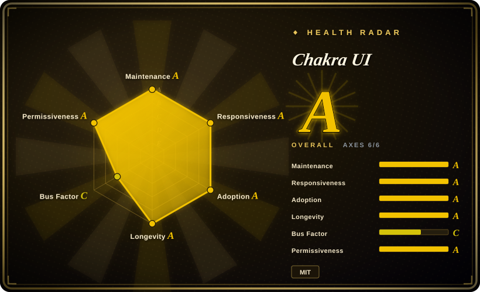
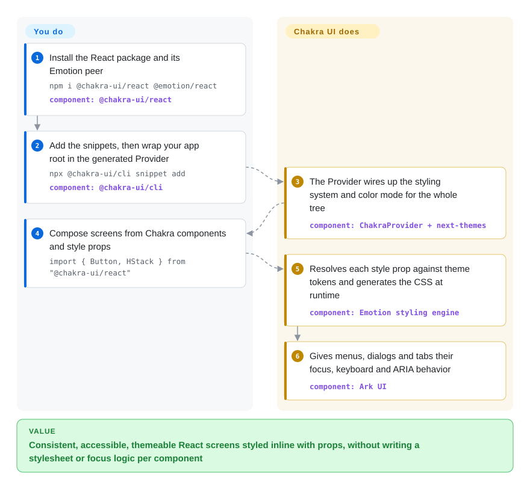

# Chakra UI

Every new screen in your React product means re-typing the same paddings, hex colors and dark-mode overrides, and the dropdown you built by hand still loses keyboard focus when it closes. Chakra UI gives you accessible React components that you style by passing props like `p="4"` or `colorPalette="teal"`, all reading from one theme, so spacing, color and dark mode stay consistent without a stylesheet per component.

## When to use

You are a small team building a SaaS product in React or Next.js: settings pages, dashboards, onboarding flows, marketing-adjacent screens. You want to move fast without a designer, but you also want the app to look like *your* product, not like a stock admin template. Dialogs, menus, tabs and popovers must work with keyboard and screen readers, because a customer's accessibility audit is coming. You reach for Chakra UI because layout and styling happen right in JSX through **style props** (`<Box p="4" bg="bg.muted">`), every value resolves against a token theme you can change in one place, dark mode is a built-in convention, and the interactive components get their keyboard and ARIA behavior from Ark UI, a headless component layer built by the same team.

Pick it over [Ant Design](ant-design.md) when the product is a branded SaaS rather than a table-and-form back office, and you want an easier visual identity to reshape. Pick it over [shadcn/ui](shadcn-ui.md) when you would rather install and upgrade a library than own copied component source, and you prefer props over Tailwind class strings. Pick it over [Radix UI](radix-ui.md) when you want a styled system out of the box, not bare primitives.

## How it works

Chakra UI v3 is a React package (`@chakra-ui/react`) with two halves. The **styling system** turns props into CSS: you write `p="4"` or `colorPalette="teal"`, and Chakra looks up those names in the theme's design tokens (named spacing, color and radius values) and generates the matching CSS at runtime through Emotion, a CSS-in-JS library. The **components** wrap Ark UI, which drives open/close, focus and ARIA state, the plumbing that makes a menu or dialog accessible, so you do not hand-roll it. A CLI copies "snippets" (pre-composed components such as the app `Provider`, toaster and color-mode toggle) into your repo, where you own and edit them. You wrap the app in that `Provider` once, then compose screens from Chakra components and style props. Chakra does the token lookup, CSS generation, color mode and accessibility behavior. The docs state the long-term plan is a zero-runtime styling model inspired by Panda CSS; today it is Emotion at runtime.

<!-- flow-steps:begin (generated from flows/chakra-ui.json by tools/flow_card.py — do not edit) -->

Text version of the flow

1. **You**: Install the React package and its Emotion peer — `npm i @chakra-ui/react @emotion/react` — component: `@chakra-ui/react`
2. **You**: Add the snippets, then wrap your app root in the generated Provider — `npx @chakra-ui/cli snippet add` — component: `@chakra-ui/cli`
3. **Chakra UI**: The Provider wires up the styling system and color mode for the whole tree — component: `ChakraProvider + next-themes`
4. **You**: Compose screens from Chakra components and style props — `import { Button, HStack } from "@chakra-ui/react"`
5. **Chakra UI**: Resolves each style prop against theme tokens and generates the CSS at runtime — component: `Emotion styling engine`
6. **Chakra UI**: Gives menus, dialogs and tabs their focus, keyboard and ARIA behavior — component: `Ark UI`

**Value**: Consistent, accessible, themeable React screens styled inline with props, without writing a stylesheet or focus logic per component

<!-- flow-steps:end -->

## When NOT to use

- **You need zero-runtime CSS, or want to avoid runtime CSS-in-JS in React Server Components.** Chakra v3 still generates styles at runtime with Emotion, and the zero-runtime model is only a stated roadmap. Use [shadcn/ui](shadcn-ui.md) (Tailwind, static CSS), or Panda CSS (not indexed) from the same team, if static extraction is a hard requirement.
- **Your app is an enterprise back office built around data grids and complex forms.** Chakra has tables and form fields, but no Ant-level sortable, filterable, fixed-column table or form engine. Use [Ant Design](ant-design.md), or pair Chakra with [TanStack Table](tanstack-table.md) and a form library.
- **You have a large Chakra v2 codebase and no migration budget.** v3 was a rewrite: Ark UI-based components, compound-component APIs, `framer-motion` and `@emotion/styled` dropped, snippets instead of built-ins. The `npx @chakra-ui/codemod upgrade` codemod helps, but plan it as a project. v2 still gets occasional releases (2.10.10 in 2026-06), but new work lands on v3.
- **You need Material Design or a design language your organization already standardized on.** Use [Material UI](material-ui.md) for Material Design rather than restyling Chakra to imitate it.
- **You are not on React.** `@chakra-ui/react` is React-only. For Vue, Solid or Svelte, use Ark UI (not indexed), the same team's headless layer, which supports those frameworks, and style it yourself.
- **Bus factor matters to your procurement.** One maintainer, Segun Adebayo, authored about 71% of recent commits (governance C). If you need company- or foundation-backed continuity, prefer MUI (company-backed) or Radix UI (maintained by WorkOS).

## Comparison

| Alternative | In index | Our verdict | Tradeoff |
|---|---|---|---|
| [shadcn/ui](shadcn-ui.md) | ✅ | If you want Tailwind and full ownership of component source, choose shadcn/ui. If you want a versioned dependency you upgrade with npm and style with props, choose Chakra UI. | shadcn/ui has no runtime styling cost and no upstream lock-in, but every fix is yours to merge. Chakra ships fixes centrally but carries Emotion at runtime. |
| [Ant Design](ant-design.md) | ✅ | For branded SaaS product screens, choose Chakra UI. For data-heavy enterprise back offices with complex tables and forms, choose Ant Design. | Chakra is easier to make look like your brand. Ant Design ships far more finished data components but with a strong default look. |
| [Material UI (MUI)](material-ui.md) | ✅ | When you need Material Design or a company-backed library with a large ecosystem, choose MUI. When you want a neutral, prop-styled system that is easy to rebrand, choose Chakra UI. | MUI has more components, templates and corporate backing, but a heavier Material identity. Chakra is lighter-touch visually but more dependent on one lead maintainer. |
| [Radix UI](radix-ui.md) | ✅ | If you are building your own design system and want only accessible behavior, choose Radix primitives. If you want behavior and styling together, choose Chakra UI. | Radix leaves all styling to you, with maximum freedom and maximum work. Chakra bundles Ark UI behavior with a token-driven style system. |
| Mantine | not indexed | When you want a batteries-included React library with many hooks and form, date and notification packages, evaluate Mantine. Choose Chakra UI when style props and Ark UI-based accessibility matter more. | Mantine covers more application-level utilities in one ecosystem. Chakra is narrower but centered on its styling system. |

## Tech stack

- **TypeScript + React:** React ≥ 18 peer dependency. Works with Next.js (App Router), Vite and other React setups. Node.js 20+ is required for the tooling.
- **Emotion:** runtime CSS-in-JS engine (`@emotion/react` is a peer dependency).
- **Ark UI (`@ark-ui/react`):** headless, accessible component logic underneath Chakra's interactive components.
- **Panda CSS-derived pieces:** `@pandacss/is-valid-prop` for style-prop detection, plus a `@chakra-ui/panda-preset` package for teams moving to Panda.
- **Monorepo packages:** `@chakra-ui/react`, `@chakra-ui/cli` (snippets, typegen), `@chakra-ui/charts`, `@chakra-ui/codemod`, and an MCP server app for AI assistants.

## Dependencies

- **Peer:** `react` ≥ 18, `react-dom` ≥ 18, `@emotion/react` ≥ 11.
- **Installed with it:** `@ark-ui/react` and a few `@emotion/*` utilities.
- **Snippets you add via the CLI:** the generated `Provider` composes `ChakraProvider` with `next-themes` for color mode, so `next-themes` becomes a dependency of your app.
- **TypeScript setup:** the docs require `moduleResolution: "Bundler"` and an `@/*` path alias for the snippet imports.
- **No backend or service:** it is a client-side library.

## Ops difficulty

**Low.** No service to run. Costs are front-end ones. You keep the CLI-generated snippets in your repo up to date yourself, because they are copied code and do not update with the package. You regenerate theme types with the CLI after token changes. And you plan major migrations, as v2 → v3 showed. Server rendering works with the Next.js App Router guide, but Emotion's runtime styles mean components that use them render on the client.

## Health & viability

- **Maintenance (A), as of 2026-10-08:** active weekly (13 of 13 recent weeks, last commit 2 days ago). Minor releases arrive every one to two months (3.34 in 2026-03 through 3.37.0 on 2026-08-28) across the `@chakra-ui/*` packages.
- **Responsiveness (A):** median first response 32.9 hours across 23 recent issues, and the open-issue count is low for a project this size.
- **Adoption (A):** `@chakra-ui/react` had 6,998,958 npm downloads in the last month, and 42120 dependent repositories. Widely used in React SaaS.
- **Longevity (A) and Lindy:** created 2019-08, 2609 days old, through a full v3 rewrite (2024-10) and still active. A good Lindy prior.
- **Governance (C) is the weak axis:** 26 active contributors in the trailing year, but the top contributor (Segun Adebayo, also creator of Ark UI, Zag.js and Panda CSS) accounts for 71.2% of recent commits and the top three for 83.6%. The org is backed by OpenCollective sponsorship rather than a company or foundation [推断]. The roadmap effectively follows one person.
- **Risk / License (A):** MIT, no relicense. The open styling roadmap (Emotion → zero-runtime) means another migration is likely in the future.

## Caveats (unverified)

- [推断] The funding model (OpenCollective sponsorship, no company or foundation owning the repo) is inferred from the README's "Support Chakra UI" section and the org ownership. Commercial add-ons or paid templates around Chakra were not reviewed.
- [未验证] The claim that Segun Adebayo created Ark UI, Zag.js and Panda CSS comes from general ecosystem knowledge, not from a source read for this page.
- [未验证] How fully v3 components meet WAI-ARIA patterns was not audited. Accessibility depends on Ark UI's implementation.
- [推断] The "client components for Emotion styles" note for Next.js App Router is inferred from Emotion being a runtime CSS-in-JS library. The exact RSC behavior per component was not tested.
- [未验证] Mantine's current feature set and license were not re-read for this page. The comparison row is based only on its general positioning.
