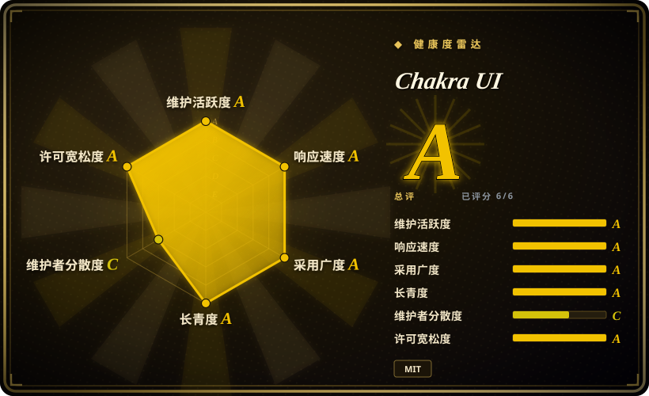
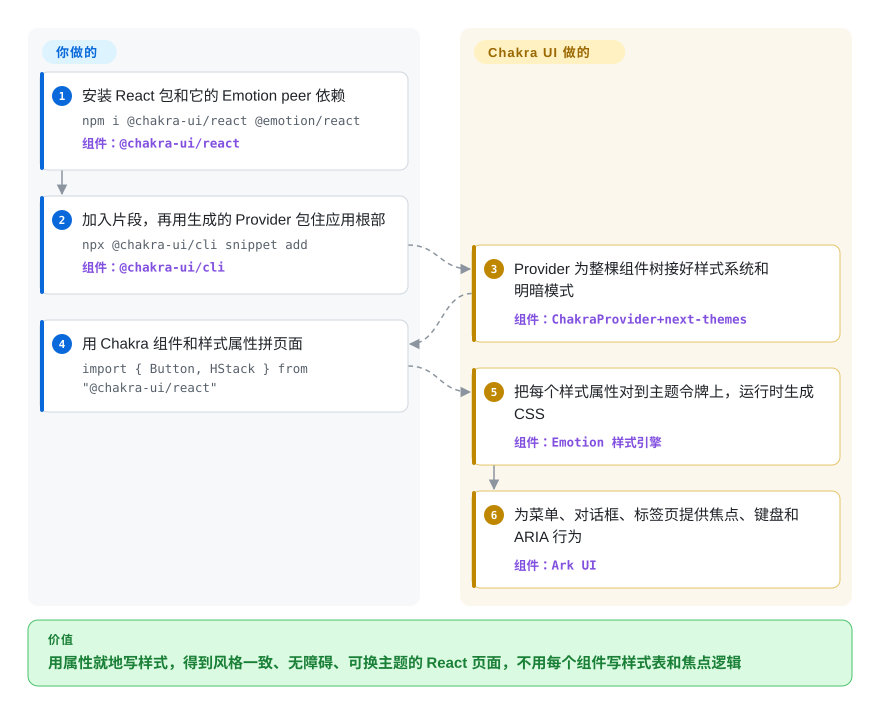

# Chakra UI

React 产品里每加一个页面，就要把同样的内边距、十六进制颜色和暗色模式覆盖再敲一遍，自己手写的下拉菜单关上后键盘焦点还是会丢。Chakra UI 给你一套无障碍的 React 组件，样式直接用 `p="4"`、`colorPalette="teal"` 这样的属性写，全都从同一套主题取值，于是间距、颜色和暗色模式保持一致，不用给每个组件配一份样式表。

## 何时使用

你是一个用 React 或 Next.js 做 SaaS 产品的小团队，要做设置页、仪表盘、引导流程和贴近营销的页面。你想在没有设计师的情况下跑得快，又希望应用看起来是“你的”产品，而不是一套现成的后台模板。对话框、菜单、标签页、气泡卡片都必须能用键盘和读屏器操作，因为客户的无障碍审计快来了。这时你会想到 Chakra UI：布局和样式直接在 JSX 里用**样式属性**写（`<Box p="4" bg="bg.muted">`），每个取值都对应一套能在一处改掉的令牌主题，暗色模式是内置约定，交互组件的键盘和 ARIA 行为来自同一团队做的 headless 组件层 Ark UI。

产品是有品牌的 SaaS，而不是以表格和表单为主的后台，而且你想要更容易改出自己的视觉风格时，选它而不是 [Ant Design](ant-design.zh.md)。宁可安装、升级一个库，也不想持有复制来的组件源码，并且更喜欢写属性而不是 Tailwind 类名串时，选它而不是 [shadcn/ui](shadcn-ui.zh.md)。想要开箱即用的带样式系统，而不是裸原语时，选它而不是 [Radix UI](radix-ui.zh.md)。

## 怎么用起来

Chakra UI v3 是一个 React 包（`@chakra-ui/react`），分两半。**样式系统**把属性变成 CSS：你写 `p="4"` 或 `colorPalette="teal"`，Chakra 去主题的设计令牌里查这些名字（有名字的间距、颜色、圆角取值），再通过 CSS-in-JS 库 Emotion 在运行时生成对应的 CSS。**组件**包在 Ark UI 外面，由 Ark UI 驱动开合、焦点和 ARIA 状态，也就是让菜单或对话框可无障碍使用的那些管线，你不用自己手写。一个命令行工具会把“片段”（预先组合好的组件，比如应用的 `Provider`、toaster、明暗切换按钮）复制进你的仓库，由你持有和修改。你在应用外层包一次这个 `Provider`，之后就用 Chakra 组件和样式属性拼页面。查令牌、生成 CSS、明暗模式和无障碍行为由 Chakra 负责。文档写明长期方向是一种受 Panda CSS 启发的零运行时样式模型，眼下仍是运行时的 Emotion。

<!-- flow-steps:begin (generated from flows/chakra-ui.json by tools/flow_card.py — do not edit) -->

流程文字版

1. **你**：安装 React 包和它的 Emotion peer 依赖 — `npm i @chakra-ui/react @emotion/react` — 组件：`@chakra-ui/react`
2. **你**：加入片段，再用生成的 Provider 包住应用根部 — `npx @chakra-ui/cli snippet add` — 组件：`@chakra-ui/cli`
3. **Chakra UI**：Provider 为整棵组件树接好样式系统和明暗模式 — 组件：`ChakraProvider+next-themes`
4. **你**：用 Chakra 组件和样式属性拼页面 — `import { Button, HStack } from "@chakra-ui/react"`
5. **Chakra UI**：把每个样式属性对到主题令牌上，运行时生成 CSS — 组件：`Emotion 样式引擎`
6. **Chakra UI**：为菜单、对话框、标签页提供焦点、键盘和 ARIA 行为 — 组件：`Ark UI`

**价值**：用属性就地写样式，得到风格一致、无障碍、可换主题的 React 页面，不用每个组件写样式表和焦点逻辑

<!-- flow-steps:end -->

## 何时不用

- **你需要零运行时 CSS，或想在 React Server Components 里避开运行时 CSS-in-JS。** Chakra v3 仍用 Emotion 在运行时生成样式，零运行时模型只是公开的路线图。静态抽取是硬性要求时，用 [shadcn/ui](shadcn-ui.zh.md)（Tailwind，静态 CSS），或同一团队的 Panda CSS（未收录）。
- **你的应用是围绕数据表格和复杂表单的企业后台。** Chakra 有表格和表单字段，但没有 Ant 那个级别的可排序、可筛选、可固定列的表格和表单引擎。用 [Ant Design](ant-design.zh.md)，或者给 Chakra 配上 [TanStack Table](tanstack-table.zh.md) 和一个表单库。
- **你有一个很大的 Chakra v2 代码库，又没有迁移预算。** v3 是重写：组件改为基于 Ark UI、采用复合组件 API、去掉了 `framer-motion` 和 `@emotion/styled`、用片段替代部分内置组件。`npx @chakra-ui/codemod upgrade` 能帮忙，但要当作一个项目来排期。v2 仍偶尔发版（2026-06 发了 2.10.10），但新功能都在 v3。
- **你需要 Material Design，或组织已经统一了某种设计语言。** 要 Material Design 就用 [Material UI](material-ui.zh.md)，别把 Chakra 改造成它的样子。
- **你不用 React。** `@chakra-ui/react` 只支持 React。Vue、Solid、Svelte 用同一团队的 headless 层 Ark UI（未收录），它支持这些框架，样式自己写。
- **采购时在意巴士因子。** 一位维护者 Segun Adebayo 写了近期约 71% 的提交（治理评级 C）。需要公司或基金会背书的延续性时，选 MUI（有公司支持）或 Radix UI（由 WorkOS 维护）。

## 横向对比

| 替代品 | 是否收录 | 我们的评价 | 取舍 |
|---|---|---|---|
| [shadcn/ui](shadcn-ui.zh.md) | ✅ | 想用 Tailwind 并完全持有组件源码，选 shadcn/ui。想要一个用 npm 升级、用属性写样式的版本化依赖，选 Chakra UI。 | shadcn/ui 没有运行时样式开销，也不受上游锁定，但每个修复都得你自己合进来。Chakra 由上游统一发修复，但要背着运行时的 Emotion。 |
| [Ant Design](ant-design.zh.md) | ✅ | 有品牌感的 SaaS 产品页面，选 Chakra UI。表格和表单复杂的数据型企业后台，选 Ant Design。 | Chakra 更容易做出你自己的品牌外观。Ant Design 的成品数据组件多得多，但默认外观很强势。 |
| [Material UI (MUI)](material-ui.zh.md) | ✅ | 需要 Material Design，或需要有公司支持、生态庞大的库时，选 MUI。想要中性、用属性写样式、容易换品牌的系统时，选 Chakra UI。 | MUI 的组件、模板更多，也有公司背书，但 Material 风格更重。Chakra 视觉上更克制，但更依赖一位主维护者。 |
| [Radix UI](radix-ui.zh.md) | ✅ | 要搭自己的设计系统、只要无障碍行为，选 Radix 原语。行为和样式都要，选 Chakra UI。 | Radix 把样式全留给你，自由最大，活也最多。Chakra 把 Ark UI 的行为和令牌驱动的样式系统打包在一起。 |
| Mantine | 未收录 | 想要一个电池齐全、带大量 hooks 以及表单、日期、通知等配套包的 React 库，评估 Mantine。更看重样式属性和基于 Ark UI 的无障碍时，选 Chakra UI。 | Mantine 在一个生态里覆盖更多应用层工具。Chakra 更窄，重心在它的样式系统。 |

## 技术栈

- **TypeScript + React：** peer 依赖 React ≥ 18，支持 Next.js（App Router）、Vite 等 React 环境，工具链要求 Node.js 20+。
- **Emotion：** 运行时 CSS-in-JS 引擎（`@emotion/react` 是 peer 依赖）。
- **Ark UI（`@ark-ui/react`）：** Chakra 交互组件底下的 headless、无障碍组件逻辑。
- **源自 Panda CSS 的部件：** 用 `@pandacss/is-valid-prop` 识别样式属性，另有给迁往 Panda 的团队用的 `@chakra-ui/panda-preset` 包。
- **Monorepo 里的包：** `@chakra-ui/react`、`@chakra-ui/cli`（片段、类型生成）、`@chakra-ui/charts`、`@chakra-ui/codemod`，以及一个给 AI 助手用的 MCP 服务器应用。

## 依赖

- **Peer：** `react` ≥ 18、`react-dom` ≥ 18、`@emotion/react` ≥ 11。
- **随包安装：** `@ark-ui/react` 和几个 `@emotion/*` 工具包。
- **用命令行加入的片段：** 生成的 `Provider` 把 `ChakraProvider` 和负责明暗模式的 `next-themes` 组合在一起，所以 `next-themes` 会成为你应用的依赖。
- **TypeScript 配置：** 文档要求 `moduleResolution: "Bundler"`，并为片段导入配置 `@/*` 路径别名。
- **没有后端或服务：** 它是纯客户端库。

## 运维难度

**低。** 没有服务要跑，成本都在前端。命令行生成的片段在你自己的仓库里，是复制来的代码，不会随包升级，要你自己保持更新。改了令牌后要用命令行重新生成主题类型。大版本迁移要排期，v2 → v3 就是例子。服务端渲染按 Next.js App Router 指南能用，但 Emotion 的运行时样式意味着用到它的组件在客户端渲染。

## 健康度与可持续性

- **维护（A，截至 2026-10-08）：** 每周都活跃（近 13 周 13 周有提交，最后一次提交在 2 天前）。小版本每一到两个月一次，覆盖各个 `@chakra-ui/*` 包（2026-03 的 3.34 到 2026-08-28 的 3.37.0）。
- **响应速度（A）：** 近期 23 个 issue 的首次响应中位数是 32.9 小时，对这个体量的项目来说，未关闭 issue 数也很低。
- **采用（A）：** `@chakra-ui/react` 近一个月 npm 下载 6,998,958 次，依赖它的仓库有 42120 个，在 React SaaS 里用得很广。
- **存续（A）与 Lindy：** 2019-08 创建，仓库 2609 天，经历了一次完整的 v3 重写（2024-10）仍然活跃。Lindy 先验不错。
- **治理（C）是短板：** 过去一年有 26 名活跃贡献者，但第一名（Segun Adebayo，也是 Ark UI、Zag.js、Panda CSS 的作者）占近期提交的 71.2%，前三名占 83.6%。组织靠 OpenCollective 赞助，而不是公司或基金会 [推断]。路线图实际上跟着一个人走。
- **风险/许可（A）：** MIT，没有改过许可。样式路线图（Emotion → 零运行时）意味着将来很可能还有一次迁移。

## 存疑（未验证）

- [推断] 资金模式（OpenCollective 赞助，没有公司或基金会持有仓库）是根据 README 的“Support Chakra UI”一节和组织归属推断的。围绕 Chakra 的商业插件或付费模板没有审视。
- [未验证] “Segun Adebayo 是 Ark UI、Zag.js、Panda CSS 的作者”来自对生态的一般了解，不是本页读过的来源。
- [未验证] v3 组件对 WAI-ARIA 模式的符合程度没有审计，无障碍质量取决于 Ark UI 的实现。
- [推断] “在 Next.js App Router 下用到 Emotion 样式的组件需在客户端渲染”是根据 Emotion 属于运行时 CSS-in-JS 推断的，没有逐个组件测试 RSC 行为。
- [未验证] 本页没有重新阅读 Mantine 当前的功能和许可，对比行只基于它的大致定位。
