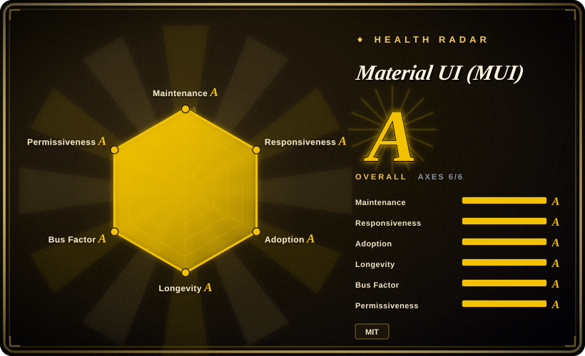
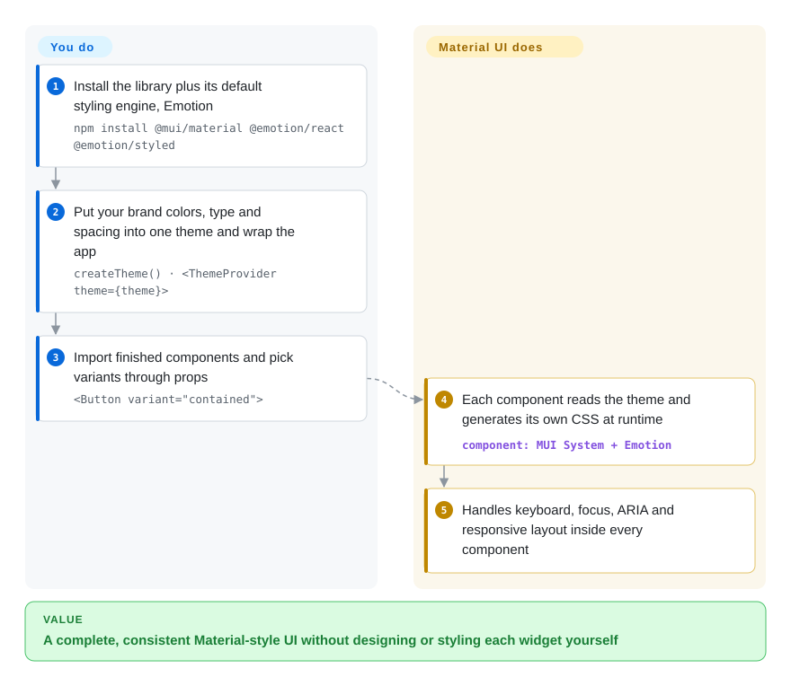

# Material UI (MUI)

Your React app needs forty screens of forms, tables, dialogs and menus by next quarter, nobody on the team is a designer, and every hand-built dropdown ships with a different focus bug. Material UI hands you a finished, themeable set of those widgets in Google's Material Design look, so you assemble screens instead of drawing them.

## When to use

You lead a small team building an internal admin console or a B2B dashboard in React. The backlog is mostly CRUD: a filterable list, an edit form with date pickers and autocomplete, a confirm dialog, a side navigation. Without a library, the first review already shows the cost — the custom `<Select>` does not close on `Escape`, the modal lets `Tab` escape behind the overlay, and three engineers have written three slightly different button paddings. You reach for Material UI because it ships those components finished: styled, keyboard-accessible, responsive, and driven by one theme object where you set your brand color and font once.

The deciding tradeoff against its neighbours is *finished look versus ownership*. Against [shadcn/ui](shadcn-ui.md) you give up owning the component source and a Tailwind-native look, and get a versioned npm dependency you upgrade instead of patch. Against headless libraries such as [Radix UI](radix-ui.md) you give up a blank visual slate and get days of styling work already done. Against [Ant Design](ant-design.md) the choice is mostly visual language and ecosystem: Material's look and the MUI X add-ons (data grid, date pickers, charts) versus Ant's denser enterprise widgets.

## How it works

Material UI is a regular npm package of React components. Out of the box each component is already styled: when it renders, it reads the current *theme* — one JavaScript object holding your palette, typography, spacing and breakpoints — and Emotion, a CSS-in-JS library (CSS written in JavaScript and injected into the page as it runs), turns those values into the component's styles. Your job is to install it, write the theme once with `createTheme()`, wrap the app in `<ThemeProvider>`, and then compose screens from components like `Button`, `TextField`, `Dialog` and `Autocomplete`, choosing variants and overrides through props (`variant`, `color`, `sx`). The library does the rest: focus management, keyboard handling, ARIA attributes, positioning of popovers, and responsive behavior live inside each component. Think of it as furnished rental housing — you pick the paint colors and rearrange the furniture, but you do not build the chairs. Swapping Emotion for styled-components, or wiring server rendering with Next.js through `@mui/material-nextjs`, are documented side paths, not the main road.

<!-- flow-steps:begin (generated from flows/material-ui.json by tools/flow_card.py — do not edit) -->

Text version of the flow

1. **You**: Install the library plus its default styling engine, Emotion — `npm install @mui/material @emotion/react @emotion/styled`
2. **You**: Put your brand colors, type and spacing into one theme and wrap the app — `createTheme() · <ThemeProvider theme={theme}>`
3. **You**: Import finished components and pick variants through props — `<Button variant="contained">`
4. **Material UI (MUI)**: Each component reads the theme and generates its own CSS at runtime — component: `MUI System + Emotion`
5. **Material UI (MUI)**: Handles keyboard, focus, ARIA and responsive layout inside every component

**Value**: A complete, consistent Material-style UI without designing or styling each widget yourself

<!-- flow-steps:end -->

## When NOT to use

- **If your design must not look like Material Design, use [shadcn/ui](shadcn-ui.md) or a headless library like [Radix UI](radix-ui.md) instead of Material UI, because** every component starts from Material's shapes, elevation and motion; matching a distinctive brand means overriding theme slots and `styleOverrides` component by component, and that override layer is what breaks on the next major upgrade.
- **If your stack is Tailwind-first, use [shadcn/ui](shadcn-ui.md) instead of Material UI, because** Material UI's default styling runs through Emotion at runtime; it can coexist with Tailwind (there is a documented CSS-layers integration) but you then maintain two styling systems on one page.
- **If you need an advanced data grid (pivoting, row grouping, Excel export) without a commercial license, use [TanStack Table](tanstack-table.md) instead of the MUI X Data Grid, because** MUI X is open-core: the Community tier is MIT, but Pro and Premium features require a paid license per developer. Material UI itself stays MIT.
- **If you are not on React, use Vuetify (Vue, not indexed) or Angular Material (not indexed) instead of Material UI, because** Material UI is React-only; there is no official port to other frameworks.
- **If you cannot absorb a breaking upgrade roughly every year, prefer a smaller headless layer you wrap yourself (for example [Radix UI](radix-ui.md)) over Material UI, because** v5, v6, v7 and v9 all shipped breaking majors between 2021 and 2026, and v9 (2026-04) raised the default browser targets to Chrome 117 / Safari 17 — budget migration time per major.
- **If you render mostly on the server with React Server Components and want zero runtime CSS, use a compile-time styling stack (Tailwind-based [shadcn/ui](shadcn-ui.md)) instead of Material UI's default setup, because** Emotion generates styles in the browser at runtime, so styled components have to run as client components in the Next.js App Router; an optional Pigment CSS path exists but is not the default.

## Comparison

| Alternative | In index | Our verdict | Tradeoff |
|---|---|---|---|
| [shadcn/ui](shadcn-ui.md) | ✅ | When you want to own and freely restyle every component in a Tailwind codebase, pick shadcn/ui; pick Material UI when you would rather upgrade a maintained package than patch copied source. | shadcn/ui gains full control and zero runtime CSS but makes you the maintainer of every copied file; Material UI keeps fixes flowing through `npm update` at the price of a fixed visual language. |
| [Ant Design](ant-design.md) | ✅ | For dense enterprise back-office UIs, especially for teams already in the Ant ecosystem, pick Ant Design; pick Material UI when the Material look and MUI X's grid and pickers fit your product better. | Ant Design ships more built-in enterprise widgets in one package; Material UI has a broader English-language ecosystem and a separately licensed advanced-component tier. |
| [Chakra UI](chakra-ui.md) | ✅ | When you want a neutral-looking styled kit with a lighter visual footprint, pick Chakra UI; pick Material UI when you need the larger component catalogue and long-term maturity. | Chakra is easier to restyle away from a recognizable look; Material UI has more components and a longer track record of maintained majors. |
| [Radix UI](radix-ui.md) | ✅ | When you are building your own design system and want only behavior and accessibility, pick Radix UI; pick Material UI when you want the styling work already done. | Radix leaves every pixel to you, so no visual lock-in; Material UI saves the styling effort but every component arrives with Material's opinions. |
| Mantine | not indexed | When you want a batteries-included React kit with many hooks and a neutral default theme, evaluate Mantine; pick Material UI when its ecosystem size and MUI X grid matter more. | Mantine bundles hooks, forms and notifications in one MIT project; Material UI has a longer history and a company behind it, but splits advanced components into a paid tier. |

## Tech stack

- **Language:** JavaScript and TypeScript source in a pnpm monorepo; ships type definitions.
- **Packages:** `@mui/material` (components), built on `@mui/system` (theme + `sx` styling engine) and `@mui/utils`; icons in `@mui/icons-material`; Next.js helpers in `@mui/material-nextjs`.
- **Styling:** Emotion (`@emotion/react`, `@emotion/styled`) by default; styled-components through `@mui/styled-engine-sc`; optional Pigment CSS integration (`@mui/material-pigment-css`).
- **Runtime libraries:** `@popperjs/core` for popover positioning, `react-transition-group` for transitions, `clsx`, `prop-types`, `react-is`.
- **Version (2026-10-08):** v9.4.0 (2026-08-28); v9.0.0 shipped 2026-04-08, and the repo already carries an upgrade-to-v10 guide.

## Dependencies

- **Peer dependencies:** `react` and `react-dom` 17, 18 or 19. On React 18 and below, the docs require pinning `react-is` to your React version through `overrides`/`resolutions`, because Material UI ships with `react-is@19`.
- **Styling engine:** `@emotion/react` and `@emotion/styled` (or styled-components with the `@mui/styled-engine-sc` adapter).
- **Browsers:** v9 targets Chrome 117, Edge 121, Firefox 121 and Safari 17 by default; older browsers need your own transpile/polyfill setup.
- **No backend or service:** it is a client-side library; nothing to host. MUI X Pro/Premium needs a license key only if you use those paid components.

## Ops difficulty

**Low to deploy, medium to maintain.** There is nothing to run — it bundles into your app like any React library. The real cost is upgrades: majors land roughly yearly with codemods and migration guides, and the more theme `styleOverrides` and `sx` overrides you accumulate, the more each major costs you. Server rendering needs the documented Emotion cache setup (`AppRouterCacheProvider` for the Next.js App Router) or styles flash on first paint. Bundle size and runtime styling cost grow with the number of components on a page, which matters for lightweight marketing pages but rarely for dashboards.

## Health & viability

- **Maintenance (2026-10-08):** very active — every one of the past 13 weeks saw commits, and stable minors ship about monthly (v9.2 → v9.4 between July and August 2026). Radar grade A.
- **Governance & backing:** owned by MUI, a company that funds full-time engineers through MUI X commercial licenses, the MUI Store and sponsorships; the founder is still the top contributor, but contributions are spread across a large team (governance grade A). The roadmap is the company's.
- **Age & Lindy:** first published in 2014 and still shipping majors twelve years later — old *and* active, the strongest Lindy position among React component kits. Grade A on longevity.
- **Adoption:** one of the most depended-on React UI libraries on npm (adoption grade A), with a deep ecosystem of templates, community answers and third-party integrations.
- **Risk flags:** open-core, not relicensing — MUI X's README states anything released as MIT stays MIT, while advanced grid, pickers and charts features are commercial. The practical risk is upgrade churn across majors, not abandonment.

## Caveats (unverified)

- [推断] The claim that heavy `styleOverrides` customization is what breaks on major upgrades is inferred from the breaking-change lists in the v6/v7/v9 migration guides, not measured across real codebases.
- [推断] That Emotion-styled components must run as client components in the Next.js App Router follows from Emotion's runtime style injection and MUI's Next.js integration guide; it was not checked component by component.
- [未验证] Runtime CSS-in-JS cost in large pages is not benchmarked here; it is the common criticism of Emotion-based libraries, and Pigment CSS is MUI's answer to it.
- [未验证] The exact split of MUI X features between Community, Pro and Premium changes between releases; check the MUI X licensing page before planning around a specific feature.
- [推断] The repo carries an upgrade-to-v10 guide on `master`, so another breaking major is likely in preparation; its timing is not announced in the sources read.
- [未验证] ~99.1k GitHub stars as of 2026-10-08; stars are a noisy adoption signal.
