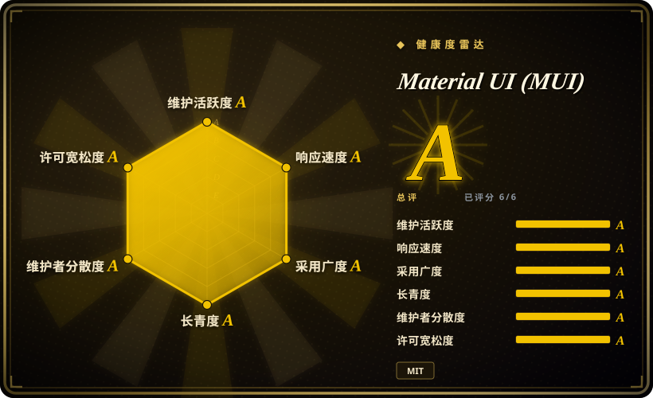
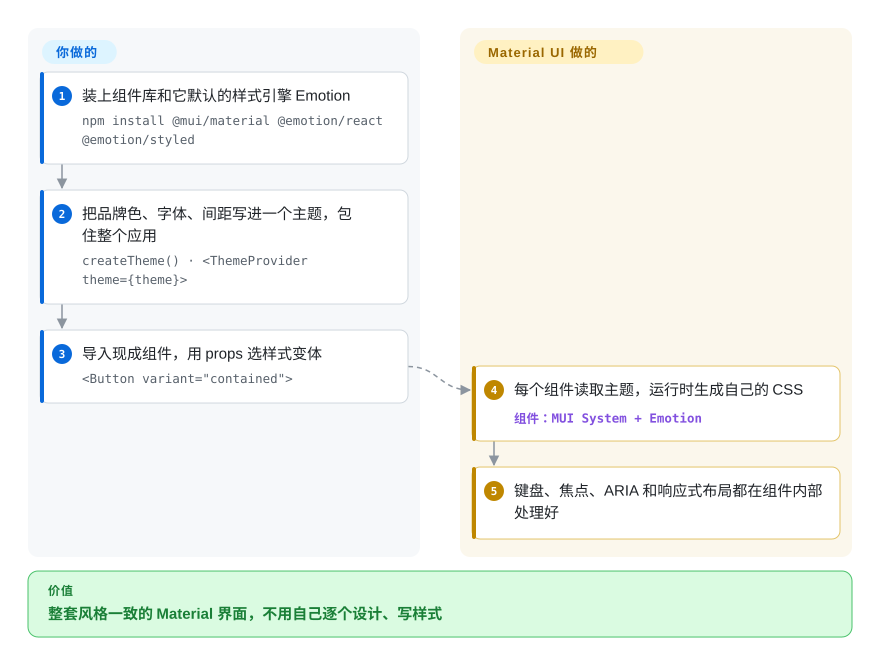

# Material UI (MUI)

下个季度要交四十个表单、表格、弹窗页面，团队里没有设计师，每个手写的下拉框都带着不一样的焦点 bug。Material UI 直接给你一整套做好的、可换主题的组件，长着 Google Material Design 的样子，你只管拼页面，不用从头画控件。

## 何时使用

你带一个小团队，用 React 做内部管理后台或 B2B 仪表盘，需求基本是增删改查：一个可筛选的列表、一个带日期选择和自动补全的编辑表单、一个确认弹窗、一条侧边导航。不用组件库的话，第一次评审就能看到代价：自己写的 `<Select>` 按 `Escape` 关不掉，弹窗里按 `Tab` 焦点会跑到遮罩后面，三个工程师写出了三种略有差别的按钮内边距。你选 Material UI，是因为这些组件它都做完了：有样式、能用键盘操作、自适应屏幕，而且全由一个主题对象驱动，品牌色和字体只设一次。

和邻居比，关键取舍是“现成外观”还是“自己拥有代码”。对比 [shadcn/ui](shadcn-ui.zh.md)，你放弃了拥有组件源码和 Tailwind 原生的外观，换来一个能靠升级版本拿修复的 npm 依赖，而不是自己打补丁。对比 [Radix UI](radix-ui.zh.md) 这类无样式库，你放弃了一张白纸，换来好几天已经做完的样式活。对比 [Ant Design](ant-design.zh.md)，主要是视觉语言和生态之争：Material 的外观加上 MUI X 扩展（数据表格、日期选择器、图表），还是 Ant 更密集的企业级控件。

## 怎么用起来

Material UI 就是一个普通的 npm 包，里面是 React 组件，而且每个组件开箱就带样式：渲染时它读取当前的“主题”（一个 JavaScript 对象，装着调色板、字体、间距和断点），再由 Emotion（一种 CSS-in-JS 库，即在 JavaScript 里写 CSS，运行时注入页面）把这些值变成组件的样式。你要做的是：安装，用 `createTheme()` 写一次主题，用 `<ThemeProvider>` 包住应用，然后拿 `Button`、`TextField`、`Dialog`、`Autocomplete` 这些组件拼页面，通过 props（`variant`、`color`、`sx`）选变体、做局部覆盖。剩下的归它：焦点管理、键盘操作、ARIA 属性、弹出层定位、响应式行为都在组件内部。可以把它想成精装修的出租房：墙刷什么颜色、家具怎么摆你说了算，但椅子不用你自己做。把 Emotion 换成 styled-components，或者通过 `@mui/material-nextjs` 接 Next.js 服务端渲染，都是文档里写好的旁路，不是主路。

<!-- flow-steps:begin (generated from flows/material-ui.json by tools/flow_card.py — do not edit) -->

流程文字版

1. **你**：装上组件库和它默认的样式引擎 Emotion — `npm install @mui/material @emotion/react @emotion/styled`
2. **你**：把品牌色、字体、间距写进一个主题，包住整个应用 — `createTheme() · <ThemeProvider theme={theme}>`
3. **你**：导入现成组件，用 props 选样式变体 — `<Button variant="contained">`
4. **Material UI (MUI)**：每个组件读取主题，运行时生成自己的 CSS — 组件：`MUI System + Emotion`
5. **Material UI (MUI)**：键盘、焦点、ARIA 和响应式布局都在组件内部处理好

**价值**：整套风格一致的 Material 界面，不用自己逐个设计、写样式

<!-- flow-steps:end -->

## 何时不用

- **如果设计稿明确不能长得像 Material Design，用 [shadcn/ui](shadcn-ui.zh.md) 或 [Radix UI](radix-ui.zh.md) 这类无样式库，而不是 Material UI，因为**每个组件都从 Material 的形状、阴影层级和动效出发；要贴合一个辨识度强的品牌，就得一个组件一个组件地改主题插槽和 `styleOverrides`，而这层覆盖正是下次大版本升级时最容易坏的地方。
- **如果技术栈以 Tailwind 为主，用 [shadcn/ui](shadcn-ui.zh.md) 而不是 Material UI，因为** Material UI 默认的样式走 Emotion 运行时生成；它能和 Tailwind 共存（文档有 CSS layers 集成方案），但同一个页面上你就要维护两套样式体系。
- **如果需要高级数据表格（透视、行分组、导出 Excel）又不想买商业授权，用 [TanStack Table](tanstack-table.zh.md) 而不是 MUI X Data Grid，因为** MUI X 是 open-core：Community 层是 MIT，Pro 和 Premium 功能按开发者收费授权。Material UI 本体仍是 MIT。
- **如果不是 React 项目，用 Vuetify（Vue，未收录）或 Angular Material（未收录）而不是 Material UI，因为** Material UI 只支持 React，没有官方的其他框架版本。
- **如果承受不了大约每年一次的破坏性升级，优先选一个自己包一层的轻量无样式库（如 [Radix UI](radix-ui.zh.md)），而不是 Material UI，因为** 2021 到 2026 年间 v5、v6、v7、v9 都是带破坏性变更的大版本，v9（2026-04）还把默认浏览器目标提到了 Chrome 117 / Safari 17——每个大版本都要预留迁移时间。
- **如果主要靠 React Server Components 在服务端渲染、又想要零运行时 CSS，用编译期样式方案（基于 Tailwind 的 [shadcn/ui](shadcn-ui.zh.md)），而不是 Material UI 的默认配置，因为** Emotion 在浏览器运行时生成样式，带样式的组件在 Next.js App Router 里得作为客户端组件运行；可选的 Pigment CSS 路线存在，但不是默认。

## 横向对比

| 替代品 | 是否收录 | 我们的评价 | 取舍 |
|---|---|---|---|
| [shadcn/ui](shadcn-ui.zh.md) | 已收录 | 想在 Tailwind 代码库里拥有并随意改每个组件，选 shadcn/ui；宁愿升级一个有人维护的包、也不想给拷进来的源码打补丁，选 Material UI。 | shadcn/ui 换来完全掌控和零运行时 CSS，代价是你成了每个拷贝文件的维护者；Material UI 靠 `npm update` 就能拿到修复，代价是视觉语言固定。 |
| [Ant Design](ant-design.zh.md) | 已收录 | 做信息密集的企业后台，尤其团队已经在 Ant 生态里，选 Ant Design；Material 外观和 MUI X 的表格、日期选择器更贴合产品时，选 Material UI。 | Ant Design 一个包里内置的企业级控件更多；Material UI 的英文生态更大，高级组件单独收费授权。 |
| [Chakra UI](chakra-ui.zh.md) | 已收录 | 想要外观更中性、视觉包袱更轻的带样式组件库，选 Chakra UI；需要更大的组件目录和更长的成熟记录，选 Material UI。 | Chakra 更容易改成看不出出处的样子；Material UI 组件更多，持续维护大版本的历史更长。 |
| [Radix UI](radix-ui.zh.md) | 已收录 | 在自建设计系统、只要行为和无障碍能力，选 Radix UI；想让样式活已经做完，选 Material UI。 | Radix 每个像素都交给你，没有视觉锁定；Material UI 省掉样式工作，但每个组件都带着 Material 的主张。 |
| Mantine | 未收录 | 想要一个自带大量 hooks、默认主题更中性的全家桶 React 组件库，可以评估 Mantine；更看重生态规模和 MUI X 表格时，选 Material UI。 | Mantine 把 hooks、表单、通知放在一个 MIT 项目里；Material UI 历史更长、背后有公司，但高级组件拆成了付费层。 |

## 技术栈

- **语言：** pnpm monorepo 中的 JavaScript 和 TypeScript 源码，自带类型声明。
- **包结构：** `@mui/material`（组件）构建在 `@mui/system`（主题 + `sx` 样式引擎）和 `@mui/utils` 之上；图标在 `@mui/icons-material`；Next.js 辅助在 `@mui/material-nextjs`。
- **样式：** 默认 Emotion（`@emotion/react`、`@emotion/styled`）；通过 `@mui/styled-engine-sc` 可换 styled-components；可选 Pigment CSS 集成（`@mui/material-pigment-css`）。
- **运行时库：** 弹出层定位用 `@popperjs/core`，过渡动画用 `react-transition-group`，另有 `clsx`、`prop-types`、`react-is`。
- **版本（2026-10-08）：** v9.4.0（2026-08-28）；v9.0.0 于 2026-04-08 发布，仓库里已经有 upgrade-to-v10 迁移指南。

## 依赖

- **对等依赖：** `react` 和 `react-dom` 17、18 或 19。React 18 及以下时，文档要求用 `overrides`/`resolutions` 把 `react-is` 钉到和 React 相同的版本，因为 Material UI 自带的是 `react-is@19`。
- **样式引擎：** `@emotion/react` 和 `@emotion/styled`（或配 `@mui/styled-engine-sc` 适配器用 styled-components）。
- **浏览器：** v9 默认目标是 Chrome 117、Edge 121、Firefox 121、Safari 17；更老的浏览器要自己配转译和 polyfill。
- **无后端、无服务：** 纯客户端库，不需要托管任何东西。只有用到 MUI X Pro/Premium 付费组件时才需要授权密钥。

## 运维难度

**部署低，维护中等。** 没有任何要运行的服务，像普通 React 库一样打进应用。真正的成本在升级：大版本大约一年一次，配有 codemod 和迁移指南，而你积累的主题 `styleOverrides` 和 `sx` 覆盖越多，每次大版本就越贵。服务端渲染需要按文档配置 Emotion 缓存（Next.js App Router 用 `AppRouterCacheProvider`），否则首屏会闪样式。包体积和运行时样式开销随页面上组件数量增长，对轻量营销页有影响，对仪表盘一般不是问题。

## 健康度与可持续性

- **维护（2026-10-08）：** 非常活跃——过去 13 周每周都有提交，稳定版小版本大约每月一次（2026 年 7 到 8 月从 v9.2 到 v9.4）。雷达评级 A。
- **治理与背书：** 归属 MUI 公司，靠 MUI X 商业授权、MUI Store 和赞助养全职工程师；创始人仍是头号贡献者，但贡献分散在一个较大的团队里（治理评级 A）。路线图由公司掌握。
- **年龄与 Lindy：** 2014 年首发，十二年后仍在发大版本——既老又活跃，是 React 组件库里 Lindy 位置最强的之一。长期性评级 A。
- **采用度：** npm 上被依赖最多的 React UI 库之一（采用评级 A），模板、社区问答和第三方集成的生态都很深。
- **风险信号：** 是 open-core，不是改协议——MUI X 的 README 写明已经以 MIT 发布的东西永远是 MIT，高级表格、日期选择器和图表功能则是商业授权。实际风险是跨大版本的升级成本，而不是被弃坑。

## 存疑（未验证）

- [推断] “大量 `styleOverrides` 定制是大版本升级时最容易坏的地方”这一判断，来自 v6/v7/v9 迁移指南里的破坏性变更清单，没有在真实代码库里测量过。
- [推断] Emotion 组件在 Next.js App Router 里需要作为客户端组件运行，依据是 Emotion 运行时注入样式的机制和 MUI 的 Next.js 集成文档，没有逐个组件核对。
- [未验证] 大页面里运行时 CSS-in-JS 的性能开销本页没有做基准测试；这是基于 Emotion 的组件库常见的批评点，Pigment CSS 是 MUI 给出的应对。
- [未验证] MUI X 功能在 Community、Pro、Premium 之间的划分会随版本变化；依赖某个具体功能前，先查 MUI X 授权页面。
- [推断] `master` 上已有 upgrade-to-v10 指南，说明下一个破坏性大版本可能在准备中；读到的资料里没有公布时间。
- [未验证] 截至 2026-10-08 约 9.91 万 GitHub star；star 只是嘈杂的采用信号。
