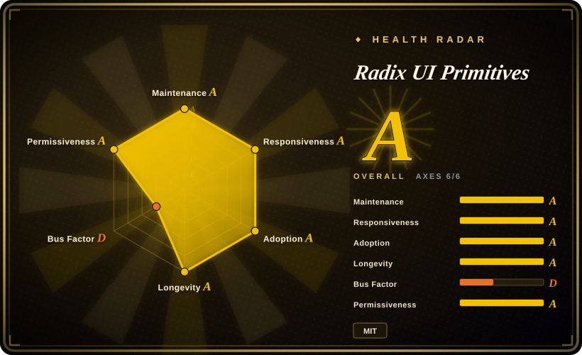
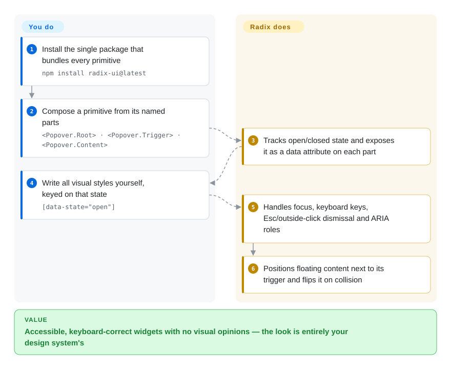

# Radix UI Primitives

Your designer hands you a custom dropdown, dialog and tooltip, and the hand-rolled versions keep failing review: `Esc` does nothing, focus escapes the modal, a screen reader announces "button, button". Radix gives you those widgets with all the behavior and accessibility done and zero styling, so you paint them in your own design system without re-solving keyboard and focus.

## When to use

You are the front-end engineer building your company's own React design system. The brand has its own look, so a pre-styled kit like [Material UI](material-ui.md) would mean fighting its visuals on every component. But writing a dropdown menu from scratch turns into weeks of edge cases: arrow-key navigation, typeahead, submenus that open on hover but not on accidental mouse passes, focus returning to the trigger after close, a menu that flips upward when it hits the bottom of the viewport. You reach for Radix Primitives because it solves exactly that layer — behavior, focus, keyboard and ARIA — and leaves rendering to you: every part takes your `className`, exposes its state as `data-state="open"`, and can render as your own element through `asChild`.

The choice against its neighbours is *who owns the pixels and whose behavior model you adopt*. Against [shadcn/ui](shadcn-ui.md) you get only the primitives, not pre-styled copies — pick shadcn/ui if you want a starting look, and note that it now offers Base UI and React Aria as alternative foundations. Against Base UI (from the original Radix team, now with MUI) and React Aria (Adobe), Radix's edge is maturity and installed base: it has been the most common headless layer in React projects for years, with the widest set of tutorials and existing components built on it.

## How it works

Radix Primitives is a set of React components with no styles at all. Each widget is split into named parts — a `Popover` is `Root`, `Trigger`, `Portal`, `Content`, `Arrow` — which you compose in JSX; the parts share state through React context, so the `Trigger` knows to open the `Content` without you wiring anything. The library owns the hard parts: open/closed state (controlled or uncontrolled — you either hold the state yourself or let Radix hold it), focus management, keyboard interactions, dismiss on `Esc` or outside click, layering of nested popovers, ARIA roles following the WAI-ARIA authoring patterns (the W3C's recipes for how each widget should behave with assistive tech), and positioning floating content with collision handling. You own everything visual: class names, CSS, animations keyed on `data-state` and `data-side` attributes. It is like buying a car chassis with engine and brakes already tested — the body you weld on is yours. The getting-started docs now install one `radix-ui` package that bundles every primitive (the individual `@radix-ui/react-*` packages are still published), with per-primitive subpaths such as `radix-ui/popover` for tree-shaking.

<!-- flow-steps:begin (generated from flows/radix-ui.json by tools/flow_card.py — do not edit) -->

Text version of the flow

1. **You**: Install the single package that bundles every primitive — `npm install radix-ui@latest`
2. **You**: Compose a primitive from its named parts — `<Popover.Root> · <Popover.Trigger> · <Popover.Content>`
3. **Radix UI Primitives**: Tracks open/closed state and exposes it as a data attribute on each part
4. **You**: Write all visual styles yourself, keyed on that state — `[data-state="open"]`
5. **Radix UI Primitives**: Handles focus, keyboard keys, Esc/outside-click dismissal and ARIA roles
6. **Radix UI Primitives**: Positions floating content next to its trigger and flips it on collision

**Value**: Accessible, keyboard-correct widgets with no visual opinions — the look is entirely your design system's

<!-- flow-steps:end -->

## When NOT to use

- **If you want components that already look finished, use [shadcn/ui](shadcn-ui.md) (styled copies you own) or [Material UI](material-ui.md) (a styled package) instead of bare Radix, because** Radix ships zero visual styles — every button, menu and dialog needs your CSS before it is presentable.
- **If you need a combobox, date picker or calendar primitive, use React Aria (Adobe, not indexed) instead of Radix, because** Radix's package list has no combobox, date picker or calendar; you would assemble them from third-party libraries on top.
- **If you are starting a new design system in late 2026 and weigh long-term maintenance heavily, evaluate Base UI (not indexed) alongside Radix, because** the original Radix authors now build Base UI at MUI, shadcn/ui made Base UI its default foundation on 2026-07-02, and Radix's own history shows a roughly ten-month gap between releases (August 2025 to June 2026) with one maintainer authoring most recent commits.
- **If your app is Vue or Svelte, use Reka UI (Vue, formerly Radix Vue, not indexed) or Bits UI (Svelte, not indexed) instead of Radix, because** Radix Primitives is React-only; those are the community ports of the same idea.
- **If you want a ready-made Radix look rather than raw primitives, use Radix Themes (not indexed) instead of Primitives, because** Themes is the styled layer from the same maintainers; note that its repository has been far quieter (last push 2026-04) than Primitives.

## Comparison

| Alternative | In index | Our verdict | Tradeoff |
|---|---|---|---|
| [shadcn/ui](shadcn-ui.md) | ✅ | When you want a styled starting point you own as source, pick shadcn/ui (which can sit on Radix); pick bare Radix when your design system already defines every visual and you only need behavior. | shadcn/ui saves the styling pass and adds a CLI and registry, but new projects default to Base UI underneath; bare Radix keeps one dependency and no visual opinions. |
| Base UI | not indexed | For a brand-new headless design system where future maintenance weighs most, pick Base UI; pick Radix when you need its larger installed base and existing ecosystem today. | Base UI has the original Radix authors, MUI's funding and shadcn's default slot; Radix has years of production use and far more tutorials, but a thinner and burstier maintainer pipeline. |
| React Aria | not indexed | When you need the broadest accessibility coverage, including combobox, date and calendar widgets and internationalization, pick React Aria; pick Radix for a smaller, simpler compound-component API. | React Aria offers hooks plus components backed by Adobe and covers more widget types; Radix is easier to learn but has gaps in complex form widgets. |
| Headless UI | not indexed | When you are deep in the Tailwind ecosystem and need only a few common widgets, Headless UI is enough; pick Radix when you need the wider primitive set (context menu, navigation menu, toast, slider). | Headless UI is maintained by the Tailwind team but covers fewer primitives and its repo has been quiet since 2026-04; Radix covers far more widgets. |
| [Material UI](material-ui.md) | ✅ | When you want finished Material-styled components and do not need your own visual identity, pick Material UI; pick Radix when the design system's look must be entirely yours. | Material UI removes styling work but brings Material's visual opinions; Radix removes behavior work but leaves all styling to you. |

## Tech stack

- **Language:** TypeScript, built as a pnpm monorepo with changesets for versioning.
- **Packages:** one `radix-ui` package re-exporting every primitive (accordion, alert dialog, checkbox, context menu, dialog, dropdown menu, form, hover card, menubar, navigation menu, one-time-password field, password toggle field, popover, progress, radio group, scroll area, select, slider, switch, tabs, toast, toggle group, toolbar, tooltip, and more), plus per-primitive `@radix-ui/react-*` packages and internal utilities (focus scope, dismissable layer, popper, roving focus).
- **API style:** compound components (`Root`/`Trigger`/`Content`), `asChild` slot composition, controlled or uncontrolled state, `data-*` state attributes for styling.
- **Version (2026-10-08):** `radix-ui` 1.7.0 on npm; release notes on radix-ui.com list releases on 2026-06-06, 06-30, 07-06 and 07-20.

## Dependencies

- **Peer dependencies:** `react` and `react-dom` from 16.8 through 19 (`@types/react` optional for TypeScript).
- **Styling:** none bundled — bring your own CSS, CSS modules, Tailwind, or CSS-in-JS.
- **No backend or service:** pure client-side library; works with server rendering (the docs carry an SSR guide).

## Ops difficulty

**Low.** It bundles into your app like any React library and has nothing to deploy. The maintenance cost sits in *your* design-system layer: you own the styles, the variants and any wrapper API, so visual bugs are yours to fix. Upgrades are usually additive within 1.x, but bursty release timing means you may wait months for a fix and then receive many at once — pin versions and read the release notes before bumping.

## Health & viability

- **Maintenance (2026-10-08):** active right now — maintenance grade A, with commits in the current week and four releases between June and July 2026 — but the history is bursty: the release notes jump from August 2025 to June 2026, and weekly commit counts were near zero for most of that stretch. Treat the current activity as a recovery, not a long steady record.
- **Governance & bus factor:** governance grade D. WorkOS owns the project, but one maintainer authored the large majority of the past year's commits, and the original creators left to build Base UI at MUI. The project depends heavily on a single person's time.
- **Age & Lindy:** first commit in 2020 and still shipping — about six years, longevity grade A. Lindy favors it, but read it together with the governance concentration above.
- **Adoption:** adoption grade A — the per-primitive packages are among the most-installed React UI dependencies on npm, much of it pulled in through shadcn/ui projects. That installed base gives WorkOS a reason to keep it alive, but shadcn's switch to Base UI as the default means new projects add to it more slowly.
- **Risk flags:** MIT, no relicensing history. The risk is succession, not license: a thin maintainer bench and a credible successor (Base UI) backed by the same people who built Radix.

## Caveats (unverified)

- [推断] "Most recent commits come from one maintainer" is read from the scorer's contributor-share data and the latest commit list on 2026-10-08, not from an official governance statement.
- [推断] The claim that much of Radix's npm volume comes through shadcn/ui is inferred from shadcn/ui's Radix-based history and its scale; no dependency breakdown was measured.
- [未验证] Whether the 2025–2026 release gap reflects staffing changes at WorkOS is not stated in any source read; only the gap itself is visible in the release notes and commit activity.
- [未验证] Radix Themes' maintenance status beyond its last push date (2026-04-11) was not checked.
- [未验证] ~19.4k GitHub stars as of 2026-10-08; stars understate usage for a library mostly consumed indirectly.
