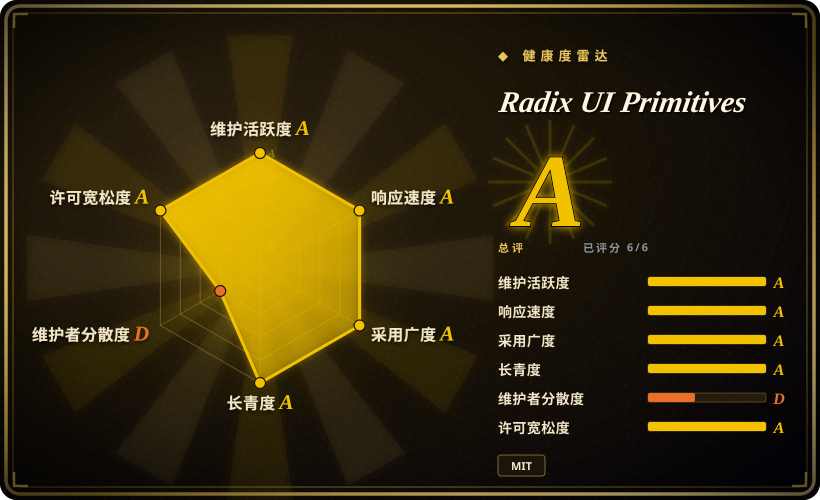
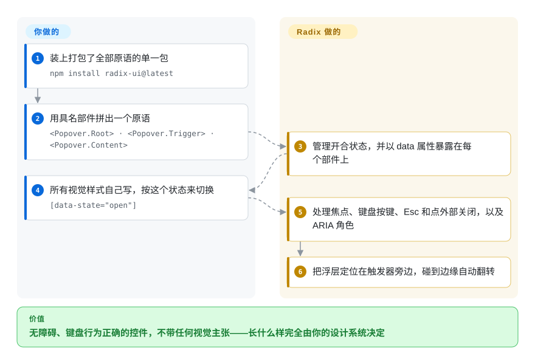

# Radix UI Primitives

设计师给了你一套定制的下拉菜单、弹窗和提示框，你手写的版本却一次次过不了评审：按 `Esc` 没反应，焦点跑出了弹窗，读屏软件只念出“按钮，按钮”。Radix 把这些控件的行为和无障碍能力全部做好、样式一点不带，你用自己设计系统的样式去“上色”，不用再从头解决键盘和焦点问题。

## 何时使用

你是负责公司自有 React 设计系统的前端工程师。品牌有自己的长相，用 [Material UI](material-ui.zh.md) 这种带样式的组件库意味着每个组件都要和它的视觉对着干。可从零写一个下拉菜单，又会变成好几周的边界情况：方向键导航、输入首字母跳转、鼠标悬停打开但误划过不打开的子菜单、关闭后焦点回到触发按钮、碰到视口底部时自动往上翻。你选 Radix Primitives，是因为它正好解决这一层——行为、焦点、键盘和 ARIA——渲染则完全交给你：每个部件都接受你的 `className`，用 `data-state="open"` 暴露状态，还能通过 `asChild` 渲染成你自己的元素。

和邻居比，取舍在于“像素归谁、采用谁的行为模型”。对比 [shadcn/ui](shadcn-ui.zh.md)，你只拿到原语，没有带样式的拷贝——想要一个起点外观就选 shadcn/ui，而且它现在也提供 Base UI 和 React Aria 作为可选底座。对比 Base UI（Radix 原班人马现在在 MUI 做的新库）和 React Aria（Adobe），Radix 的优势是成熟度和装机量：多年来它一直是 React 项目里最常见的无样式层，教程和基于它的现成组件最多。

## 怎么用起来

Radix Primitives 是一组完全不带样式的 React 组件。每个控件被拆成具名部件——一个 `Popover` 由 `Root`、`Trigger`、`Portal`、`Content`、`Arrow` 组成——你在 JSX 里把它们拼起来；部件之间通过 React context 共享状态，所以 `Trigger` 知道去打开 `Content`，不用你连线。难的部分归它：开合状态（受控或非受控——状态由你自己持有，或者交给 Radix 持有）、焦点管理、键盘交互、按 `Esc` 或点外部关闭、嵌套弹层的层级、按 WAI-ARIA 编写模式（W3C 给出的“每种控件在辅助技术下该怎么表现”的规范）设置的 ARIA 角色，以及带碰撞处理的浮层定位。视觉的一切归你：类名、CSS、按 `data-state` 和 `data-side` 属性写的动画。就像买了一副发动机和刹车都已经测过的底盘——焊上去的车身是你的。入门文档现在让你装一个打包了全部原语的 `radix-ui` 包（单独的 `@radix-ui/react-*` 包仍在发布），并提供 `radix-ui/popover` 这样的按原语子路径导入，方便 tree-shaking。

<!-- flow-steps:begin (generated from flows/radix-ui.json by tools/flow_card.py — do not edit) -->

流程文字版

1. **你**：装上打包了全部原语的单一包 — `npm install radix-ui@latest`
2. **你**：用具名部件拼出一个原语 — `<Popover.Root> · <Popover.Trigger> · <Popover.Content>`
3. **Radix UI Primitives**：管理开合状态，并以 data 属性暴露在每个部件上
4. **你**：所有视觉样式自己写，按这个状态来切换 — `[data-state="open"]`
5. **Radix UI Primitives**：处理焦点、键盘按键、Esc 和点外部关闭，以及 ARIA 角色
6. **Radix UI Primitives**：把浮层定位在触发器旁边，碰到边缘自动翻转

**价值**：无障碍、键盘行为正确的控件，不带任何视觉主张——长什么样完全由你的设计系统决定

<!-- flow-steps:end -->

## 何时不用

- **如果想要开箱就好看的组件，用 [shadcn/ui](shadcn-ui.zh.md)（你拥有源码的带样式拷贝）或 [Material UI](material-ui.zh.md)（带样式的包），而不是裸用 Radix，因为** Radix 不带任何视觉样式——每个按钮、菜单、弹窗都要先写 CSS 才能见人。
- **如果需要组合框（combobox）、日期选择器或日历原语，用 React Aria（Adobe，未收录）而不是 Radix，因为** Radix 的包列表里没有 combobox、日期选择器和日历，只能在它上面再拼第三方库。
- **如果你在 2026 年末新起一个设计系统、又很看重长期维护，把 Base UI（未收录）和 Radix 一起评估，因为** Radix 的原作者现在在 MUI 做 Base UI，shadcn/ui 在 2026-07-02 把默认底座换成了 Base UI，而 Radix 自己的记录里有大约十个月没发版（2025 年 8 月到 2026 年 6 月），最近的提交大多出自同一位维护者。
- **如果应用是 Vue 或 Svelte，用 Reka UI（Vue，原 Radix Vue，未收录）或 Bits UI（Svelte，未收录）而不是 Radix，因为** Radix Primitives 只支持 React，那两个是同一思路的社区移植。
- **如果想要现成的 Radix 风格外观而不是原语，用 Radix Themes（未收录）而不是 Primitives，因为** Themes 是同一批维护者做的带样式层；注意它的仓库比 Primitives 冷清得多（最近一次推送是 2026-04）。

## 横向对比

| 替代品 | 是否收录 | 我们的评价 | 取舍 |
|---|---|---|---|
| [shadcn/ui](shadcn-ui.zh.md) | 已收录 | 想要一个以源码形式归你所有的带样式起点，选 shadcn/ui（它可以架在 Radix 上）；设计系统已经定义好全部视觉、只缺行为，选裸 Radix。 | shadcn/ui 省掉样式这一轮，还带 CLI 和组件注册表，但新项目底下默认是 Base UI；裸 Radix 只有一个依赖，没有视觉主张。 |
| Base UI | 未收录 | 全新的无样式设计系统、最看重未来维护，选 Base UI；眼下就需要更大装机量和现成生态，选 Radix。 | Base UI 有 Radix 原作者、MUI 的资金和 shadcn 的默认位；Radix 有多年生产使用和多得多的教程，但维护梯队更薄、节奏更不稳。 |
| React Aria | 未收录 | 需要最广的无障碍覆盖，包括组合框、日期、日历控件和国际化，选 React Aria；想要更小、更简单的复合组件 API，选 Radix。 | React Aria 由 Adobe 支撑，提供 hooks 加组件，覆盖的控件类型更多；Radix 更好上手，但复杂表单控件有空缺。 |
| Headless UI | 未收录 | 深度使用 Tailwind 生态、只需要几个常见控件时，Headless UI 够用；需要更全的原语（右键菜单、导航菜单、toast、滑块）时选 Radix。 | Headless UI 由 Tailwind 团队维护，但原语更少，仓库自 2026-04 起较冷清；Radix 覆盖的控件多得多。 |
| [Material UI](material-ui.zh.md) | 已收录 | 想要做好的 Material 风格组件、不需要自己的视觉识别，选 Material UI；设计系统的长相必须完全归你，选 Radix。 | Material UI 省掉样式工作，但带来 Material 的视觉主张；Radix 省掉行为工作，但样式全部留给你。 |

## 技术栈

- **语言：** TypeScript，pnpm monorepo，用 changesets 管理版本。
- **包结构：** 一个 `radix-ui` 包重新导出全部原语（accordion、alert dialog、checkbox、context menu、dialog、dropdown menu、form、hover card、menubar、navigation menu、one-time-password field、password toggle field、popover、progress、radio group、scroll area、select、slider、switch、tabs、toast、toggle group、toolbar、tooltip 等），另有按原语拆分的 `@radix-ui/react-*` 包和内部工具（focus scope、dismissable layer、popper、roving focus）。
- **API 风格：** 复合组件（`Root`/`Trigger`/`Content`）、`asChild` 插槽组合、受控或非受控状态、用于写样式的 `data-*` 状态属性。
- **版本（2026-10-08）：** npm 上 `radix-ui` 为 1.7.0；radix-ui.com 的发布说明列出 2026-06-06、06-30、07-06、07-20 几次发布。

## 依赖

- **对等依赖：** `react` 和 `react-dom`，16.8 到 19 都支持（TypeScript 项目可选 `@types/react`）。
- **样式：** 不内置——自带 CSS、CSS modules、Tailwind 或 CSS-in-JS。
- **无后端、无服务：** 纯客户端库；支持服务端渲染（文档有 SSR 指南）。

## 运维难度

**低。** 像普通 React 库一样打进应用，没有要部署的东西。维护成本落在“你自己的”设计系统层：样式、变体和任何封装 API 都归你，视觉 bug 也归你修。1.x 内的升级通常是增量的，但发版节奏不均匀，你可能等好几个月等一个修复，然后一次收到一大批——锁定版本，升级前读发布说明。

## 健康度与可持续性

- **维护（2026-10-08）：** 眼下很活跃——维护评级 A，本周有提交，2026 年 6 到 7 月发了四次版——但历史上是一阵一阵的：发布说明从 2025 年 8 月直接跳到 2026 年 6 月，那段时间每周提交数大多接近零。把当前的活跃看作一次恢复，而不是长期稳定的记录。
- **治理与巴士系数：** 治理评级 D。项目归 WorkOS 所有，但过去一年绝大多数提交出自一位维护者，原作者已经离开去 MUI 做 Base UI。项目严重依赖一个人的时间。
- **年龄与 Lindy：** 2020 年第一次提交，至今仍在发版——大约六年，长期性评级 A。Lindy 站在它这边，但要和上面的治理集中度放在一起看。
- **采用度：** 采用评级 A——按原语拆分的那些包是 npm 上安装量最大的 React UI 依赖之一，很大一部分是通过 shadcn/ui 项目带进来的。这个装机量给了 WorkOS 继续维护的理由，但 shadcn 把默认换成 Base UI 之后，新项目给它带来的增量会变慢。
- **风险信号：** MIT，没有改协议的历史。风险在接班而不在许可：维护梯队很薄，而一个可信的继任者（Base UI）恰好由当初做 Radix 的人支撑。

## 存疑（未验证）

- [推断] “最近的提交大多出自同一位维护者”来自评分器的贡献者占比数据和 2026-10-08 的最新提交列表，不是官方治理声明。
- [推断] “Radix 的 npm 量很大一部分来自 shadcn/ui”是根据 shadcn/ui 早期基于 Radix 的历史和它的规模推出来的，没有测过依赖来源拆分。
- [未验证] 2025—2026 年的发版空档是否和 WorkOS 的人员变动有关，读到的资料都没说；能看到的只有发布说明和提交活动里的空档本身。
- [未验证] Radix Themes 除最近推送日期（2026-04-11）之外的维护状况没有核查。
- [未验证] 截至 2026-10-08 约 1.94 万 GitHub star；对一个主要被间接使用的库，star 会低估实际使用量。
