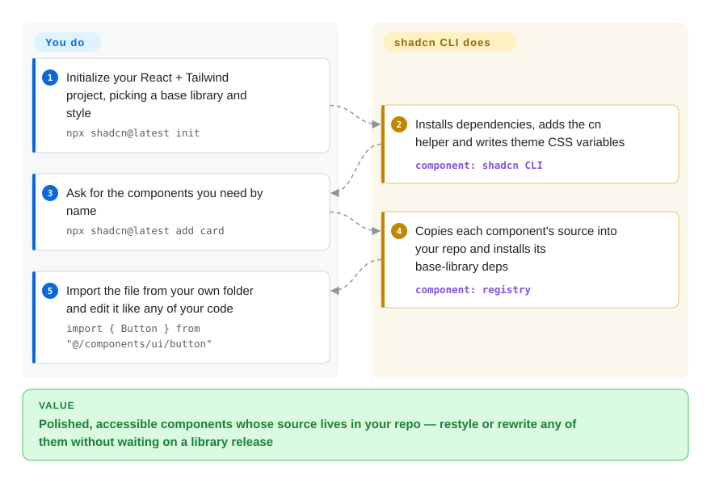

# shadcn/ui

You installed a component library, and now half your time goes into overriding its styles: a `!important` here, a wrapper there, a theme slot that does not exist for the one thing the designer changed. shadcn/ui hands you the component *source* instead of a package — a CLI copies polished, accessible React components into your repo, where you edit them like your own code.

## When to use

You're a React developer starting a product on Tailwind CSS and you need a solid, accessible UI foundation. You consider [Material UI](material-ui.md), but its theming forces you to override layers you don't control, and its visual language is unmistakably Google. You consider [Radix UI](radix-ui.md), but it is only unstyled primitives — every button, dialog and dropdown would still need styling from zero. shadcn/ui splits the difference: you run `npx shadcn@latest add dialog`, and a finished `dialog.tsx` lands in `components/ui/`, styled with Tailwind classes and built on a headless library (Base UI by default since July 2026, Radix or React Aria if you pick them) that supplies keyboard handling, focus and ARIA. When the designer wants the dialog's close button moved, you open the file and move it.

You also reach for it when you want the design system to live in your repo, not in `node_modules`, and when coding agents work on your UI: the component code is plain files they can read and edit, and the project ships an MCP server and agent skills for exactly that. The deciding tradeoff against MUI or [Chakra UI](chakra-ui.md) is ownership versus upkeep — you can change every pixel, but upstream fixes no longer arrive through `npm update`.

## How it works

shadcn/ui is two things: a collection of component source files (a *registry* — a catalogue of JSON entries describing each component, its files and its dependencies) and a CLI that installs entries from it. `npx shadcn@latest init` sets your project up: it records your choices in `components.json` (base library, style, icon set, path aliases), installs dependencies, adds a `cn` helper that merges Tailwind class names, and writes the theme as CSS variables. From then on `npx shadcn@latest add <name>` copies that component's source into your `components/ui/` folder and installs whatever it needs underneath — for example `@base-ui/react` for behavior. The headless layer stays an ordinary npm dependency that gets fixes by updating; only the top, visual layer is copied and yours. Think of it as a recipe card rather than a ready meal: the kitchen tools (the headless library) are bought, but the dish is cooked in your kitchen and you can change the seasoning. The same CLI can also publish your own registry, so a company can distribute its internal components the same way.

<!-- flow-steps:begin (generated from flows/shadcn-ui.json by tools/flow_card.py — do not edit) -->

Text version of the flow

1. **You**: Initialize your React + Tailwind project, picking a base library and style — `npx shadcn@latest init`
2. **shadcn/ui**: Installs dependencies, adds the cn helper and writes theme CSS variables — component: `shadcn CLI`
3. **You**: Ask for the components you need by name — `npx shadcn@latest add card`
4. **shadcn/ui**: Copies each component's source into your repo and installs its base-library deps — component: `registry`
5. **You**: Import the file from your own folder and edit it like any of your code — `import { Button } from "@/components/ui/button"`

**Value**: Polished, accessible components whose source lives in your repo — restyle or rewrite any of them without waiting on a library release

<!-- flow-steps:end -->

## When NOT to use

- **If you use Vue or Svelte, use the community ports shadcn-vue (not indexed) or shadcn-svelte (not indexed), or a native kit such as Vuetify, instead of shadcn/ui, because** shadcn/ui itself is React-only; the ports follow the same copy-and-own model but are maintained by other people on their own schedules.
- **If you want a zero-touch UI kit where you never open component code, use [Material UI](material-ui.md) or [Chakra UI](chakra-ui.md) instead of shadcn/ui, because** shadcn/ui makes you the owner and maintainer of every copied file. Importing `<Button>` and never looking at its implementation is not how this model works.
- **If you need a strict, governed design system across many teams, use [Ant Design](ant-design.md) or [Material UI](material-ui.md) as a versioned package instead of shadcn/ui, because** each team's copies drift independently; shadcn/ui gives you a starting point and a registry mechanism, not enforced tokens or usage rules — that governance you build yourself.
- **If you are already committed to another component library, stay on it rather than migrating to shadcn/ui, because** switching from Material UI, Ant Design or Chakra means replacing components one by one and rebuilding your theme in Tailwind. The payoff is ownership, but the migration cost is real.
- **If you need heavy data grids or charts out of the box, use [TanStack Table](tanstack-table.md), AG Grid (not indexed) or a charting library instead of relying on shadcn/ui, because** its table and chart components are styled wrappers around those engines (the data table is built on TanStack Table, charts on Recharts), not a full grid product.
- **If you don't use Tailwind CSS, use [Chakra UI](chakra-ui.md) or [Material UI](material-ui.md) instead of shadcn/ui, because** every component is styled with Tailwind utility classes; with CSS-in-JS, Styled Components or plain CSS you would rewrite the styling of every file.

## Comparison

| Alternative | In index | Our verdict | Tradeoff |
| --- | --- | --- | --- |
| [Material UI (MUI)](material-ui.md) | ✅ | When you want a maintained package with a fixed Material look and enterprise add-ons (MUI X), pick MUI; pick shadcn/ui when you must restyle everything and are on Tailwind. | MUI delivers fixes through version bumps but its visual language is hard to escape; shadcn/ui gives full control at the price of maintaining copied files. |
| [Chakra UI](chakra-ui.md) | ✅ | When the team prefers a prop-driven styling API over Tailwind classes and wants a library it simply imports, pick Chakra UI; pick shadcn/ui when file-level ownership matters more than a stable package API. | Chakra keeps components behind a consistent theme API you upgrade as one unit; shadcn/ui lets you edit any component directly, but each copy becomes your code to keep in sync. |
| [Ant Design](ant-design.md) | ✅ | For a dense enterprise back-office with many built-in widgets and a governed look, pick Ant Design; pick shadcn/ui for a product UI where brand look and Tailwind integration come first. | Ant Design ships a larger widget set and consistent rules out of the box; shadcn/ui is lighter and Tailwind-native but leaves governance to you. |
| [Radix UI](radix-ui.md) | ✅ | When your design system already defines every visual and you only need behavior, use Radix directly; pick shadcn/ui when you want styled starting components on top of a headless layer. | Radix is one of shadcn/ui's possible foundations (Base UI is now the default); going direct removes the copied styling layer but leaves all styling work to you. |
| Headless UI | not indexed | When you need only a handful of unstyled widgets from the Tailwind team, Headless UI is enough; pick shadcn/ui when you want a broad set of finished components plus a CLI and registry. | Headless UI is smaller and unstyled, and its repo has been quiet since 2026-04; shadcn/ui covers far more components and keeps adding them. |

## Tech stack

- **Language:** TypeScript (components are `.tsx` source files you own; a JavaScript output option exists).
- **Styling:** Tailwind CSS utility classes; new projects start on Tailwind v4 with theme colors as CSS variables (OKLCH). A small `shadcn/tailwind.css` import supplies shared variants, and `npx shadcn eject` inlines it.
- **Behavior layer (pick one per project):** Base UI (`--base base`, the default since 2026-07-02), Radix (`--base radix`), or React Aria (`--base aria`, added 2026-07-17).
- **Distribution:** the `shadcn` CLI (`init`, `add`, `view`, `search`, `build`, `migrate`, `apply`, `eject`) plus a registry schema; `shadcn build` publishes your own registry, and GitHub-hosted (including private) registries are supported.
- **Frameworks:** project templates for Next.js, Vite, TanStack Start, React Router, Laravel and Astro; also documented for Remix and Gatsby.
- **Version (2026-10-08):** `shadcn` CLI 4.21.4 (2026-10-07), released several times a week.

## Dependencies

- **Runtime:** React (new projects target React 19; existing React 18 + Tailwind v3 projects keep working) and a Tailwind CSS build.
- **Library deps the CLI installs:** the chosen headless library (`@base-ui/react`, `radix-ui` or `react-aria-components`), `clsx` + `tailwind-merge` for `cn`, `tw-animate-css`, an icon library you choose (lucide, tabler, hugeicons, phosphor or remixicon), and per-component extras (for example `sonner` for toasts, `recharts` for charts).
- **The `shadcn` package itself:** only for the `shadcn/tailwind.css` import; `npx shadcn eject` removes it.
- **No backend:** client-side UI code; no server, database or service required. The hosted shadcn/create site is optional — it only generates an `init` command.

## Ops difficulty

**Low.** There is nothing to deploy beyond your normal React build. The burden is maintaining the copied components: when upstream improves a component, you merge the change into your file yourself (`shadcn add` with `--dry-run` previews what would be written, and `migrate` covers some bulk changes like the Radix import rewrite or icon-library swaps), because you cannot just bump a version for that layer. Behavior fixes in the headless library still arrive through normal dependency updates. For a small team this is low-friction; for a large organization with many apps, you will want your own registry to keep variants consistent.

## Health & viability

- **Maintenance (2026-10-08):** very active — maintenance grade A, commits every week of the past quarter, CLI releases several times a week, and a monthly changelog of real features (Base UI default, React Aria base, private registries).
- **Governance & bus factor:** re-scored on 2026-10-08, the governance axis is C: 74 active maintainers in 12 months, but the top contributor alone holds 78.3% of commits (top three 80.6%). The project is steered by its creator (GitHub user `shadcn`), who writes the changelog and sets direction, so it leans on one person's judgment even though many contributors send components and fixes. [推断]
- **Age & Lindy:** launched in January 2023, so under four years old — longevity grade B. Young for a UI foundation, but it already absorbed a large shift (adding Base UI and React Aria alongside Radix) without breaking existing projects.
- **Adoption:** adoption grade A on the scorer's npm package, and the `shadcn` CLI itself is among the most-downloaded React tooling packages; over 125k GitHub stars and a large ecosystem of third-party registries and ports (shadcn-vue, shadcn-svelte).
- **Risk flags:** MIT, no relicensing. The structural risk is lower than for an ordinary library, because your components are your own files — if the project stalled, your app keeps working and you lose only new components and CLI updates.

## Caveats (unverified)

- [推断] The governance verdict (single creator steering) is based on the changelog's first-person authorship and public project history, not a governance document; the commit-share numbers (top contributor 78.3%) support concentration but not who sets direction.
- [未验证] ~125.3k GitHub stars as of 2026-10-08; star counts are approximate and time-sensitive.
- [未验证] The scorer's adoption axis measures `@shadcn/react`, a newer package; the CLI package `shadcn` is the better proxy for real usage, and its figures were read separately from npm's download API.
- [推断] Merging upstream changes into already-copied components remains manual; the CLI helps preview and migrate specific changes but does not three-way merge your edits.
- [推断] Large organizations may struggle with consistency across teams that each copy and modify components; a private registry mitigates this but is your system to run.
- [推断] While the underlying primitives are accessible, the final accessibility of your app depends on how you modify and compose the copied components.
