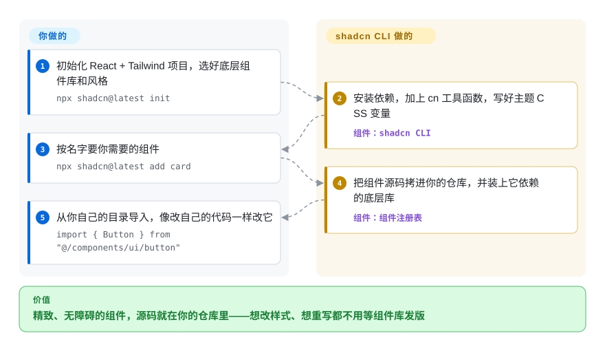

# shadcn/ui

装了一个组件库，结果一半时间花在覆盖它的样式上：这里一个 `!important`，那里包一层，设计师改的那一处偏偏没有对应的主题插槽。shadcn/ui 给你的不是一个包，而是组件“源码”——一个 CLI 把精致、无障碍的 React 组件拷进你的仓库，你像改自己的代码一样改它们。

## 何时使用

你是一名 React 开发者，正在用 Tailwind CSS 起一个新产品，需要一个靠谱、无障碍的 UI 底座。你考虑过 [Material UI](material-ui.zh.md)，但它的主题系统逼你去覆盖自己控制不了的层，视觉语言也一眼就是 Google。你考虑过 [Radix UI](radix-ui.zh.md)，但它只是无样式原语——每个按钮、弹窗、下拉框的样式都得从零写。shadcn/ui 正好折中：运行 `npx shadcn@latest add dialog`，一个做好的 `dialog.tsx` 就落进 `components/ui/`，用 Tailwind 类写好了样式，底下架在一个无样式库上（2026 年 7 月起默认是 Base UI，也可以选 Radix 或 React Aria），由它提供键盘操作、焦点和 ARIA。设计师想把弹窗的关闭按钮挪个位置，你打开文件挪就是了。

当你希望设计系统住在自己的仓库里而不是 `node_modules` 里，或者有编码 agent 在改你的界面时，也会想到它：组件就是普通文件，agent 能直接读和改，项目还为此专门提供了 MCP 服务和 agent skills。和 MUI 或 [Chakra UI](chakra-ui.zh.md) 相比，决定性的取舍是“拥有”还是“省心”——每个像素都能改，但上游的修复不再能靠 `npm update` 拿到。

## 怎么用起来

shadcn/ui 是两样东西：一套组件源码（一个“注册表”，即描述每个组件的文件和依赖的 JSON 条目目录），加上一个从里面安装条目的 CLI。`npx shadcn@latest init` 负责初始化项目：把你的选择记进 `components.json`（底层库、风格、图标集、路径别名），安装依赖，加一个合并 Tailwind 类名的 `cn` 工具函数，并把主题写成 CSS 变量。之后 `npx shadcn@latest add <名字>` 会把该组件的源码拷进你的 `components/ui/` 目录，并装上它底下需要的东西——比如负责行为的 `@base-ui/react`。无样式那一层始终是普通的 npm 依赖，靠升级拿修复；只有最上面的视觉层被拷过来、归你所有。可以把它想成一张菜谱卡而不是一份成品饭：厨具（无样式库）是买来的，菜在你自己的厨房里做，咸淡你说了算。同一个 CLI 还能发布你自己的注册表，公司可以用同样的方式分发内部组件。

<!-- flow-steps:begin (generated from flows/shadcn-ui.json by tools/flow_card.py — do not edit) -->

流程文字版

1. **你**：初始化 React + Tailwind 项目，选好底层组件库和风格 — `npx shadcn@latest init`
2. **shadcn/ui**：安装依赖，加上 cn 工具函数，写好主题 CSS 变量 — 组件：`shadcn CLI`
3. **你**：按名字要你需要的组件 — `npx shadcn@latest add card`
4. **shadcn/ui**：把组件源码拷进你的仓库，并装上它依赖的底层库 — 组件：`组件注册表`
5. **你**：从你自己的目录导入，像改自己的代码一样改它 — `import { Button } from "@/components/ui/button"`

**价值**：精致、无障碍的组件，源码就在你的仓库里——想改样式、想重写都不用等组件库发版

<!-- flow-steps:end -->

## 何时不用

- **如果用的是 Vue 或 Svelte，用社区移植版 shadcn-vue（未收录）、shadcn-svelte（未收录），或者 Vuetify 这类原生组件库，而不是 shadcn/ui，因为** shadcn/ui 本身只支持 React；移植版沿用同样的“拷贝即拥有”模式，但由别人按自己的节奏维护。
- **如果想要一个永远不用打开组件代码的现成 UI 套件，用 [Material UI](material-ui.zh.md) 或 [Chakra UI](chakra-ui.zh.md) 而不是 shadcn/ui，因为** shadcn/ui 让你成为每个拷贝文件的拥有者和维护者。导入 `<Button>` 之后再也不看它的实现，不是这个模式的用法。
- **如果需要在很多团队之间执行一套严格、受管控的设计系统，用 [Ant Design](ant-design.zh.md) 或 [Material UI](material-ui.zh.md) 这类带版本的包，而不是 shadcn/ui，因为**各团队的拷贝会各自漂移；shadcn/ui 给你的是起点和注册表机制，不会强制 token 或使用规则——那层管控要你自己建。
- **如果已经深度绑定了另一个组件库，就留在原库上，不要迁到 shadcn/ui，因为**从 Material UI、Ant Design 或 Chakra 迁过来意味着逐个替换组件、用 Tailwind 重建主题。回报是拥有权，但迁移成本是实打实的。
- **如果开箱就需要重型数据表格或图表，用 [TanStack Table](tanstack-table.zh.md)、AG Grid（未收录）或图表库，而不是指望 shadcn/ui，因为**它的表格和图表组件只是这些引擎外面的一层样式封装（数据表格基于 TanStack Table，图表基于 Recharts），不是完整的表格产品。
- **如果不用 Tailwind CSS，用 [Chakra UI](chakra-ui.zh.md) 或 [Material UI](material-ui.zh.md) 而不是 shadcn/ui，因为**每个组件都用 Tailwind 工具类写样式；换成 CSS-in-JS、Styled Components 或纯 CSS，你得重写每个文件的样式。

## 横向对比

| 替代品 | 是否收录 | 我们的评价 | 取舍 |
| --- | --- | --- | --- |
| [Material UI (MUI)](material-ui.zh.md) | ✅ | 想要一个有人维护、外观固定为 Material、还有企业级扩展（MUI X）的包，选 MUI；必须全面改样式且已经用 Tailwind，选 shadcn/ui。 | MUI 靠升级版本交付修复，但视觉语言很难摆脱；shadcn/ui 给你完全的控制权，代价是维护拷贝来的文件。 |
| [Chakra UI](chakra-ui.zh.md) | ✅ | 团队更喜欢用 props 驱动样式而不是 Tailwind 类、只想导入一个库就用，选 Chakra UI；文件级的拥有权比稳定的包 API 更重要，选 shadcn/ui。 | Chakra 把组件放在一致的主题 API 后面，整体一起升级；shadcn/ui 让你直接改任何组件，但每份拷贝都成了你要保持同步的代码。 |
| [Ant Design](ant-design.zh.md) | ✅ | 做信息密集、内置控件多、外观受管控的企业后台，选 Ant Design；做品牌外观和 Tailwind 集成优先的产品界面，选 shadcn/ui。 | Ant Design 开箱就有更大的控件集和一致的规则；shadcn/ui 更轻、Tailwind 原生，但管控留给你自己。 |
| [Radix UI](radix-ui.zh.md) | ✅ | 设计系统已经定义好全部视觉、只缺行为，直接用 Radix；想在无样式层之上要一套带样式的起步组件，选 shadcn/ui。 | Radix 是 shadcn/ui 可选的底座之一（现在默认是 Base UI）；直接用它省掉了拷贝来的样式层，但所有样式活都留给你。 |
| Headless UI | 未收录 | 只需要 Tailwind 团队出的几个无样式控件，Headless UI 就够；想要一大套做好的组件外加 CLI 和注册表，选 shadcn/ui。 | Headless UI 更小、无样式，仓库自 2026-04 起较冷清；shadcn/ui 覆盖的组件多得多，而且还在持续增加。 |

## 技术栈

- **语言：** TypeScript（组件是归你所有的 `.tsx` 源文件；也有输出 JavaScript 的选项）。
- **样式：** Tailwind CSS 工具类；新项目从 Tailwind v4 起步，主题色以 CSS 变量（OKLCH）表示。一个小小的 `shadcn/tailwind.css` 导入提供共享的变体，`npx shadcn eject` 可以把它内联掉。
- **行为层（每个项目选一个）：** Base UI（`--base base`，2026-07-02 起为默认）、Radix（`--base radix`）或 React Aria（`--base aria`，2026-07-17 加入）。
- **分发：** `shadcn` CLI（`init`、`add`、`view`、`search`、`build`、`migrate`、`apply`、`eject`）加一套注册表 schema；`shadcn build` 可以发布你自己的注册表，也支持托管在 GitHub 上的注册表（包括私有的）。
- **框架：** 提供 Next.js、Vite、TanStack Start、React Router、Laravel、Astro 的项目模板；Remix 和 Gatsby 也有文档。
- **版本（2026-10-08）：** `shadcn` CLI 4.21.4（2026-10-07），每周发好几次版。

## 依赖

- **运行时：** React（新项目以 React 19 为目标；已有的 React 18 + Tailwind v3 项目继续可用）和一套 Tailwind CSS 构建。
- **CLI 会装的库依赖：** 你选的无样式库（`@base-ui/react`、`radix-ui` 或 `react-aria-components`），用于 `cn` 的 `clsx` + `tailwind-merge`，`tw-animate-css`，你选的图标库（lucide、tabler、hugeicons、phosphor 或 remixicon），以及各组件自己的额外依赖（如 toast 用 `sonner`，图表用 `recharts`）。
- **`shadcn` 包本身：** 只为 `shadcn/tailwind.css` 这个导入；`npx shadcn eject` 能把它去掉。
- **无后端：** 客户端 UI 代码，不需要服务器、数据库或任何服务。托管的 shadcn/create 网站是可选的——它只帮你生成一条 `init` 命令。

## 运维难度

**低。** 除了正常的 React 构建，没有要部署的东西。负担在维护拷贝来的组件：上游改进了某个组件，你得自己把改动合进你的文件（`shadcn add` 加 `--dry-run` 可以预览会写入什么，`migrate` 能处理一些批量变更，比如 Radix 导入改写或换图标库），因为这一层没法靠升级版本号解决。无样式库里的行为修复仍然通过正常的依赖升级拿到。对小团队来说摩擦很小；对有很多应用的大组织，你会需要一个自己的注册表来保持变体一致。

## 健康度与可持续性

- **维护（2026-10-08）：** 非常活跃——维护评级 A，过去一个季度每周都有提交，CLI 每周发好几次版，每月的更新日志里都是实打实的功能（Base UI 设为默认、React Aria 底座、私有注册表）。
- **治理与巴士系数：** 2026-10-08 重新评分后治理轴为 C：12 个月内有 74 名活跃维护者，但第一名一人就占提交的 78.3%（前三名 80.6%）。项目由创建者（GitHub 用户 `shadcn`）掌舵，更新日志由他撰写、方向由他决定，所以尽管有很多贡献者提交组件和修复，项目仍然倚重一个人的判断。[推断]
- **年龄与 Lindy：** 2023 年 1 月发布，不到四年——长期性评级 B。作为 UI 底座还年轻，但它已经消化了一次大转向（在 Radix 之外加入 Base UI 和 React Aria），没有弄坏已有项目。
- **采用度：** 按评分器选的 npm 包，采用评级 A；`shadcn` CLI 本身也是安装量最大的 React 工具包之一；GitHub star 超过 12.5 万，第三方注册表和移植版（shadcn-vue、shadcn-svelte）的生态很大。
- **风险信号：** MIT，没有改协议。结构性风险比普通库低，因为组件就是你自己的文件——即便项目停滞，你的应用照样运行，损失的只是新组件和 CLI 更新。

## 存疑（未验证）

- [推断] 治理判断（由创建者一人掌舵）依据的是更新日志的第一人称写法和公开的项目历史，不是治理文档；提交占比（第一名 78.3%）能说明集中，但说明不了方向由谁定。
- [未验证] 截至 2026-10-08 约 12.53 万 GitHub star；star 数是近似值，会随时间变化。
- [未验证] 评分器的采用轴量的是 CLI 包 `shadcn`（2026-10-09 读数：上月下载 42,548,414 次）；复制进项目的组件不经过任何注册表，真实使用量很可能更高。
- [推断] 把上游改动合进已经拷贝过来的组件仍然要手工做；CLI 能预览和迁移特定变更，但不会对你的修改做三方合并。
- [推断] 大组织里每个团队各自拷贝、修改组件，可能难以保持一致；私有注册表能缓解，但那是你自己要运营的系统。
- [推断] 底层原语是无障碍的，但应用最终的无障碍程度取决于你怎么修改和组合拷贝来的组件。
