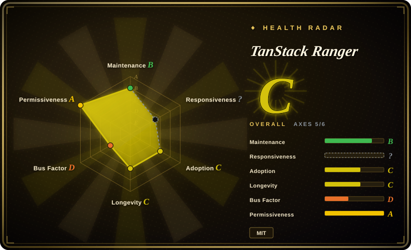
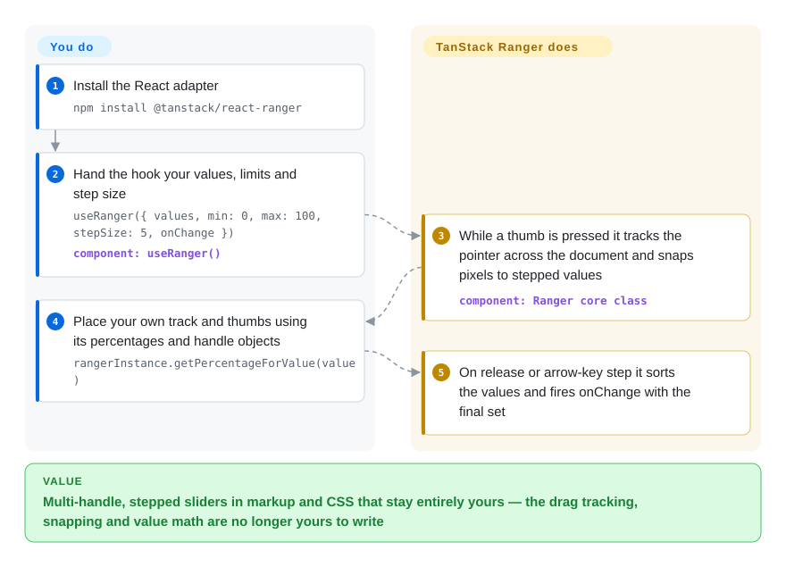

# TanStack Ranger

HTML gives you `<input type="range">` — one thumb, browser-drawn, and a two-thumb price filter built by overlaying two of them turns into z-index hacks — while every ready-made slider you try (MUI, Ant Design, rc-slider) ships its own DOM and class names you then fight through to hit your design. TanStack Ranger ships only the slider's value math — one or many thumbs, snapping to fixed or arbitrary steps, pixel-to-value mapping you can swap for a logarithmic scale — and renders nothing at all: you write the track, the thumbs and all the CSS yourself.

## When to use

You are building a React UI in which a slider is not a plain slider: a price filter needs two thumbs and a bounded range, a mixing-console fader needs a logarithmic scale — because perceived loudness does not double in equal increments — and a timeline scrubber must snap to your irregular marker points, not to a uniform `step`. Stacking native range inputs is a hack, and the component-library sliders that do support multiple thumbs also hand you a DOM tree, a theme and an ARIA structure that are theirs, not yours.

Ranger is the opposite trade: it owns exactly the math and none of the pixels. You hand the hook `values` (an array — one entry is a single-thumb slider, three entries a three-thumb one), `min`/`max`, and either a fixed `stepSize` or an explicit `steps` array of allowed values; it hands back per-thumb values plus event props, segment widths (`getSteps()`), tick positions (`getTicks()`) and `getPercentageForValue()` for placement. Pick it over **rc-slider** or **MUI Slider** when owning the markup is a requirement rather than a preference, and over **Radix Slider** when your hard requirement is the value model (custom step arrays, pluggable interpolator) rather than turnkey accessibility — Radix covers the a11y and orientation cases Ranger leaves to you, which is the first thing to check in *When NOT to use*. It is the slider-shaped sibling of [TanStack Table](tanstack-table.md)'s headless recipe: the library computes state, you write the markup.

## How it works

Ranger is one class with a hook welded onto it. You call `useRanger({ getRangerElement, values, min, max, stepSize, onChange })` and the hook keeps a long-lived `Ranger` instance fed with your latest options; you stay the source of truth for the values, because nothing renders without your markup. On the `onMouseDownHandler`/`onTouchStart` props that `handles()` returns for each thumb, the instance attaches `mousemove`/`touchmove` listeners on the whole `document`, so dragging keeps tracking even when the pointer leaves the thin track. Every pointer position is converted into a value through the **interpolator** — the pair of functions that maps value to track-percentage and a client x-pixel back to a value — which defaults to linear but is swappable, and a few lines of a log-scale interpolator are the whole trick behind its logarithmic-fader example; the result snaps to `stepSize` or to the nearest allowed point of your custom `steps` array. The library renders nothing: you place each thumb with `getPercentageForValue(value)` and use `getSteps()`/`getTicks()` for segment widths and label positions. `onChange` fires on commit — drag released, or arrow key pressed — with `sortedValues` (the values sorted ascending); pass `onDrag` to get live values while the pointer moves instead. Think of it as the slider's engine without a body: it does state math and event plumbing, you do DOM, CSS and even the ARIA — `role="slider"` and `aria-valuenow` are markup you write yourself, as the quick-start example does.

<!-- flow-steps:begin (generated from flows/tanstack-ranger.json by tools/flow_card.py — do not edit) -->

Text version of the flow

1. **You**: Install the React adapter — `npm install @tanstack/react-ranger`
2. **You**: Hand the hook your values, limits and step size — `useRanger({ values, min: 0, max: 100, stepSize: 5, onChange })` — component: `useRanger()`
3. **TanStack Ranger**: While a thumb is pressed it tracks the pointer across the document and snaps pixels to stepped values — component: `Ranger core class`
4. **You**: Place your own track and thumbs using its percentages and handle objects — `rangerInstance.getPercentageForValue(value)`
5. **TanStack Ranger**: On release or arrow-key step it sorts the values and fires onChange with the final set

**Value**: Multi-handle, stepped sliders in markup and CSS that stay entirely yours — the drag tracking, snapping and value math are no longer yours to write

<!-- flow-steps:end -->

## When NOT to use

- **If you need turnkey accessibility, vertical sliders or RTL, use [Radix UI Slider](radix-ui.md) instead of Ranger, because** Radix's documented Slider features include multiple thumbs, a minimum distance between thumbs, horizontal/vertical `orientation` and `dir` support with ARIA managed for you; Ranger's core has no orientation or min-distance option at all — its bundled interpolator reads `clientX` only (verified in `packages/ranger/src/index.ts`, 2026-09-28), keyboard support is just the left/right arrow keys, and the ARIA attributes are your job.
- **If one linear thumb is the whole requirement, use the native `<input type="range">` instead of any library, because** the browser control ships keyboard, accessibility and zero bundle; Ranger gives you no DOM, so reaching for it for a plain slider means writing the markup the browser already gives you.
- **If your app already speaks Material or Ant Design and a conventional-looking slider is the deliverable, use [Material UI Slider](material-ui.md) (or AntD's Slider) instead, because** they take a value array and render rails, marks and tooltips out of the box; Ranger spends your afternoon on markup to buy control those components will never give you.
- **If you need React-only multi-thumb plus ready-made marks/tooltips and can accept styling someone else's DOM, use rc-slider instead of Ranger, because** it is the mature, feature-rich battery-included option — Ranger is still `0.0.x` with five example pages of docs.
- **If you are on Vue, Solid, Svelte, Preact or Angular, do not expect an adapter to arrive from this repo, because** `docs/installation.md` lists everything except React as "coming soon!" and only `@tanstack/ranger` (vanilla core) + `@tanstack/react-ranger` exist under `packages/` (2026-09-28) — the GitHub description's multi-framework claim outruns what is shipped; use your framework's native slider ecosystem, or drive the dependency-free core class yourself with your framework's render callback.
- **If you need thumbs that cannot cross or maintain a minimum gap, plan to implement it yourself, because** during a drag a thumb's new value simply replaces its slot and the array is sorted at commit — values swap roles at release rather than clamping (read from `handleDrag`/`handleRelease`, 2026-09-28); no min-distance option exists in the config.
- **If you require a stable API guarantee or React 19 support from the published package, wait or pin, because** the npm line is 0.0.1 (2023-01) → 0.0.5 (2025-12) with no 1.0, the published peer set is `^16.8.0 || ^17.0.0 || ^18.0.0` (React 19 peer PR #104 open since 2026-05-10), and a "Not compatible with react compiler" issue (#106) is open as of 2026-09-28.

## Comparison

| Alternative | In index | Our verdict | Tradeoff |
| --- | --- | --- | --- |
| [Radix UI Primitives](radix-ui.md) (Slider) | ✅ | When the hard requirements are behavioral — multiple thumbs, min distance between thumbs, vertical or RTL, managed ARIA — pick Radix Slider; pick TanStack Ranger when the requirement is the value model, because custom step arrays and a pluggable pixel↔value interpolator are Ranger's documented surface while Radix exposes a fixed linear min/max/step-style numeric model. | Radix gives parts that already behave correctly with no accessibility homework; Ranger gives you fewer guarantees but solves the fader/irregular-step problems Radix does not express. |
| [Material UI (MUI)](material-ui.md) (Slider) | ✅ | When the app already renders Material and a conventional slider must simply appear, pick MUI Slider — value arrays give it a range mode in one prop; pick TanStack Ranger when the Material DOM and visual language are exactly what the design rejects, because Ranger inherits zero styling by construction. | MUI is minutes to a working slider at the price of its DOM and theme system; Ranger is an afternoon of markup at the price of nothing being given. |
| rc-slider (`react-component/slider`) | not indexed | When you want multi-thumb, marks and tooltips as a ready component and styling its DOM is acceptable, pick rc-slider; pick TanStack Ranger when owning every element is the product requirement, because rc-slider's API richness lives inside a component tree it renders for you. | rc-slider is the mature batteries-included option (it powers Ant Design's Slider [推断]); you pay in inherited DOM and CSS overrides. Not added in this tab-intake batch. |
| react-range (`twoy/react-range`) | not indexed | When you want a headless React slider and a tick/segment generator plus a documented logarithmic-interpolator path are not part of your problem, pick react-range for the smaller surface; pick TanStack Ranger when that step/tick/interpolator math is precisely the work you want handed over. | Both ship no DOM [推断: general knowledge, not re-verified]; Ranger adds stateful instance APIs (`handles()`, `getSteps()`, `getTicks()`) at 0.x maturity; not added in this tab-intake batch. |
| HTML `<input type="range">` | not a repo | When one linear thumb and browser-default styling satisfy the requirement, use the native control; reach for Ranger the moment you need multiple thumbs, arbitrary step arrays or non-uniform snapping — native range inputs have no multi-thumb mode, and two overlaid inputs is the hack Ranger exists to replace. | Native costs zero bundle and ships accessibility; its thumb rendering is browser-controlled and its single-value model is the ceiling. |

Ranger is a small library in the TanStack family and is compared here against non-TanStack substitutes on purpose; within the family its recipe is shared with [TanStack Table](tanstack-table.md) and [TanStack Virtual](../virtualization/tanstack-virtual.md) — headless state for one UI concern — which makes them companions in one app, not alternatives to each other.

## Tech stack

- **TypeScript monorepo** — pnpm workspaces + Nx, Vitest unit tests (`packages/*/tests/core.test.tsx`), changesets-gated releases; the build moved from Rollup to `tsdown` in Dec 2025 (commit "chore: replace rollup build with tsdown", #102).
- **`@tanstack/ranger` (core)** — the framework-agnostic `Ranger` class (~7.6 KB `index.ts` + ~0.8 KB `utils.ts` in source) with **zero runtime dependencies** (its `package.json` declares none, verified 2026-09-28).
- **`@tanstack/react-ranger`** — a ~0.8 KB adapter: one `useRanger` hook that wraps the class in `useState` + a `useReducer` force-rerender and syncs options per render.
- **Packaging** — ESM output (`"type": "module"`); published peer range `react ^16.8.0 || ^17.0.0 || ^18.0.0` — React 19 not included as of v0.0.5.

## Dependencies

- **Runtime:** none beyond the React peer for the adapter; the core imports nothing outside itself. No services, no network calls, no storage.
- **Browser assumptions:** the track element must have a measurable `getBoundingClientRect`; value mapping is horizontal (`clientX`) unless you write a custom interpolator; drags attach temporary listeners to `document`.
- **You bring:** all markup and CSS, the `role="slider"`/`aria-value*` attributes, your own state store (React `useState` in the adapter path, or any rerender callback if you drive the core directly), and framework glue if you are outside React.

## Ops difficulty

**Low** to operate, **medium** to author — it is an npm dependency in your front-end build with nothing to deploy or babysit.

- The library's whole operational surface is `npm install`; there is no server, no worker, no configuration file.
- The authoring cost is the headless tax: track, thumbs, ticks, segment fills, ARIA and focus styling are code you write and maintain — the quick-start example is already ~90 lines of JSX for a basic three-thumb slider.
- Staying on 0.x means upgrades are not semver-guaranteed: read diffs between releases (there were four npm releases across ~35 months) rather than assuming drop-in.
- Docs are thin (an overview, concepts, quick-start, FAQ stub, five API pages mirroring five examples) — behavioral questions often end with reading `packages/ranger/src/index.ts`, which is short enough for that to be practical.

## Health & viability

- **Maintenance (as of 2026-09-28).** Slow rather than dead: the last default-branch commit is 2025-12-06 (~9.7 months before verification, zero active weeks in the last 13 — the radar grants it a `mature_library_lindy` carve-out for its age), and the latest releases — `@tanstack/react-ranger` 0.0.5, `@tanstack/ranger` 0.0.4 — shipped that same day. GitHub's `pushed_at` (2026-08-03) is a non-default-branch push: open PR #107 was created the same day. Three 2026 PRs sit unmerged — React 19 peer (#104, since May), CODEOWNERS (#105) and a docs header fix (#107); the React Compiler compatibility issue (#106, May 2026) is unanswered. Responsiveness could not be graded at all: the measurement window found no qualifying answered issue or PR (`no_window_signal`) — itself the stall, not a tooling gap.
- **Governance / bus factor.** The TanStack GitHub organization owns it, but Ranger carries no governance artifacts: no CODEOWNERS (the PR adding one is open), no GOVERNANCE.md, no SECURITY.md. Contribution totals are rkulinski 55, tannerlinsley 45, lachlancollins 12 — and across the 12 months ending 2026-09-28 the only active contributor is Lachlan Collins, so day-to-day custody is one person within an org whose attention is dominated by query/table/router.
- **Backing & longevity.** Repo created 2018-06-23, the same repository as the original react-ranger (2018 commits already discuss log interpolation); the current `@tanstack/*` package line restarted at npm 0.0.1 on 2023-01-25. Lindy reads both ways here: the codebase is 8 years old and still reachable, but the current API has been at 0.x for three and a half years, and the legacy npm `react-ranger` was abandoned at 2.1.0 (2020-09) before the rewrite — one restart already happened in this lineage [推断: the package-history/commit correlation is verified, the "same code continued" relationship is inferred].
- **Adoption & ecosystem.** Niche even inside its own family: ~32.1k weekly downloads for `@tanstack/react-ranger` — 134,681 in the last month per the registry snapshot — and 33.0k for the core (npm, week of 2026-09-21–27), 838 stars, 79 forks, 6 watchers — and GitHub's dependents graph records just **1 dependent repository**. TanStack Table's react adapter moves tens of millions weekly by comparison. Five official examples (basic, custom-styles, custom-steps, logarithmic-interpolator, update-on-drag) and a docs set partly copy-pasted from Table (concepts.md still says "render your own table markup").
- **Risk flags.** MIT with no relicense history (LICENSE file read 2026-09-28) and no CLA. The material risks are maturity-shaped, not legal: 0.x API, published React peer capped at 18, the shipped-vs-promised framework gap (one adapter where the repo description lists six), and months-long quiet spells on the default branch.

## Caveats (unverified)

- [未验证] The "Lightweight (10kb)" claim in `docs/overview.md` is author-reported; no bundle measurement was run in this batch.
- [推断] The rc-slider cell (multi-thumb maturity, powering Ant Design's Slider) and the react-range cell (render-props surface, smaller API) come from general knowledge; those repositories were not read in this batch.
- [推断] No vertical/RTL support and the thumb-crossing behavior are read from `packages/ranger/src/index.ts` (interpolator uses `clientX`; no orientation/min-distance option; `handleRelease` sorts rather than clamps); neither was exercised in a browser.
- [未验证] Radix Slider's full prop surface was not enumerated — only the features captured from its docs page on 2026-09-28 (multiple thumbs, min distance between thumbs, orientation, dir); its numeric model beyond min/max/step was not checked exhaustively.
- [推断] The 2018 repo ↔ abandoned 2020 `react-ranger@2.1.0` ↔ 2023 `@tanstack/ranger` continuity is based on first-commit messages and npm publish dates; no migration document was read.
- [推断] Weekly npm downloads include CI and transitive installs, so the adoption reading leans on the star/watcher/fork counts alongside them.
- [未验证] Whether the three open 2026 PRs are abandoned or pending maintainer attention was not determinable from the threads.
