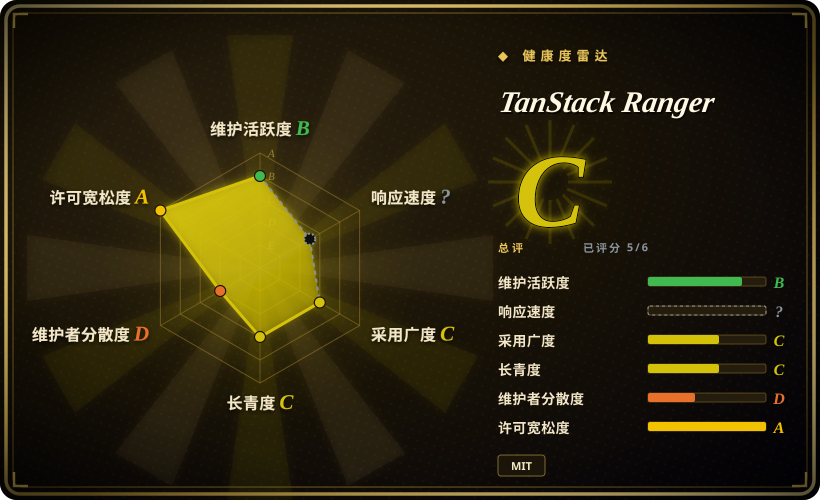
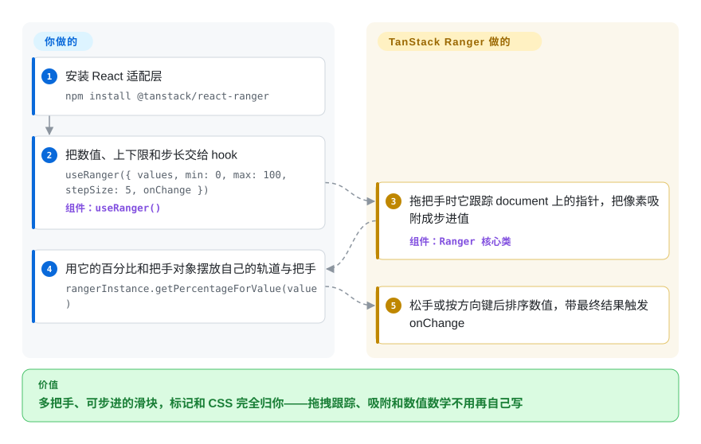

# TanStack Ranger

HTML 只给你 `<input type="range">`——一个滑块、浏览器绘制，叠两个做价格区间筛选就会陷入 z-index 纠缠；而组件库里现成的滑块（MUI、Ant Design、rc-slider）又会连 DOM 带类名一起塞给你，之后整个项目都在和它的设计打架。TanStack Ranger 只交付滑块的数值计算——单个或多个把手、按固定步长或任意离散值吸附、像素到数值的映射可以换成对数刻度——渲染完全不做：轨道、把手和全部 CSS 由你自己写。

## 何时使用

你在用 React 做一个「普通滑块不够用」的界面：价格筛选要两个把手围出一个区间，调音台的音量推子要走对数刻度——因为响度翻倍并不是等量递增——时间轴拖拽要吸附到你自己的不规则标记点，而不是均匀的 `step`。叠原生 range 控件是 hack，而支持多把手的组件库滑块连 DOM 树、主题和 ARIA 结构一起交付，那些是你的设计不想要的东西。

Ranger 是反向的交易：它只拥有数学，一个像素都不碰。你把 `values`（数组——一个元素就是单滑块，三个元素就是三滑块）、`min`/`max`，以及固定 `stepSize` 或显式的 `steps` 离散值数组交给它的 hook，它返回每个把手的值与事件属性、分段宽度（`getSteps()`）、刻度位置（`getTicks()`）和用于摆放的 `getPercentageForValue()`。当「markup 必须归我」是硬性要求而不是偏好时，选它而不是 **rc-slider** 或 **MUI Slider**；当你的硬需求是数值模型（自定义步长数组、可替换插值器）而非开箱可访问性时，选它而不是 **Radix Slider**——Radix 恰好覆盖 Ranger 交给你的无障碍与方向场景，动手前先看「何时不用」。它与 [TanStack Table](tanstack-table.zh.md) 是同一条 TanStack 无头配方应用在不同 UI 关注点上：库算状态，你写标记。

## 怎么用起来

Ranger 是一个类，外面焊了一个 hook。你调用 `useRanger({ getRangerElement, values, min, max, stepSize, onChange })`，hook 维持一个长生命周期的 `Ranger` 实例并把最新配置同步进去；数值的事实源始终是你，因为不写标记就没有渲染。每个把手从 `handles()` 拿到 `onMouseDownHandler`/`onTouchStart`，按下后实例把 `mousemove`/`touchmove` 监听挂到整个 `document` 上，指针离开细轨道也能继续跟拖。每个像素位置都经过**插值器**换算成数值——那是一对「数值↔轨道百分比」的映射函数——默认线性、可整体替换，它的对数音量推子示例就是几行自定义插值器；结果再按 `stepSize` 或自定义 `steps` 数组里最近的允许值吸附。库什么都不渲染：每个把手用 `getPercentageForValue(value)` 摆放，分段宽度和刻度位置用 `getSteps()`/`getTicks()` 取。`onChange` 只在提交时触发——松手，或按方向键——回调里给的是升序排好的 `sortedValues`；想要拖动过程中的实时数值，就改传 `onDrag`。可以把它想成「滑块的发动机、没有车身」：状态计算和事件管线归它，DOM、CSS 甚至 ARIA 归你——连 `role="slider"` 和 `aria-valuenow` 都要你自己写，快速上手的示例就是这么做的。

<!-- flow-steps:begin (generated from flows/tanstack-ranger.json by tools/flow_card.py — do not edit) -->

流程文字版

1. **你**：安装 React 适配层 — `npm install @tanstack/react-ranger`
2. **你**：把数值、上下限和步长交给 hook — `useRanger({ values, min: 0, max: 100, stepSize: 5, onChange })` — 组件：`useRanger()`
3. **TanStack Ranger**：拖把手时它跟踪 document 上的指针，把像素吸附成步进值 — 组件：`Ranger 核心类`
4. **你**：用它的百分比和把手对象摆放自己的轨道与把手 — `rangerInstance.getPercentageForValue(value)`
5. **TanStack Ranger**：松手或按方向键后排序数值，带最终结果触发 onChange

**价值**：多把手、可步进的滑块，标记和 CSS 完全归你——拖拽跟踪、吸附和数值数学不用再自己写

<!-- flow-steps:end -->

## 何时不用

- **如果你要的是开箱即用的无障碍、纵向或 RTL，选 [Radix UI Slider](radix-ui.zh.md) 而不是 Ranger，因为** Radix Slider 文档列出的能力包括多把手、把手间最小间距、横/纵 `orientation` 与 `dir` 支持且 ARIA 由它托管；Ranger 内核根本没有方向和最小间距选项——自带插值器只读 `clientX`（2026-09-28 核对 `packages/ranger/src/index.ts`），键盘只有左右方向键，ARIA 属性全是你的作业。
- **如果需求就是一个线性单把手，别引任何库，用原生 `<input type="range">`，因为**浏览器控件自带键盘、无障碍和零体积；Ranger 不给 DOM，为普通滑块选它等于自己重写浏览器已经给你的标记。
- **如果你的应用本来就渲染 Material 或 Ant Design，一个常规样子的滑块就能交差，选 [Material UI Slider](material-ui.zh.md)（或 AntD Slider），因为**传个数组它就出轨道、刻度和提示；Ranger 要用一下午的标记去换那些组件永远不会给你的控制权。
- **如果你接受「别人渲染好、你只改样式」的 React 多把手滑块，选 rc-slider，因为**它是成熟、功能齐备的电池全含选项——Ranger 还停在 `0.0.x`，文档只有五个示例页。
- **如果你在 Vue、Solid、Svelte、Preact 或 Angular 上，别指望这个仓库会给你适配器，因为**`docs/installation.md` 把 React 之外全部标注为 `coming soon!`，`packages/` 下只有 `@tanstack/ranger`（纯核心）和 `@tanstack/react-ranger`（2026-09-28 核对）——仓库简介里的多框架承诺跑在了交付前面；用你框架原生的滑块生态，或者拿零依赖的核心类自己接渲染回调。
- **如果你要求把手不能互相越过、或保持最小间隔，得自己实现，因为**拖动时把手新值直接顶掉它槽位里的旧值，松手提交时数组排序——数值是交换角色而不是被夹住（读自 `handleDrag`/`handleRelease`，2026-09-28）；配置里不存在最小间距选项。
- **如果你需要稳定 API 承诺或 React 19 支持，请等待或钉死版本，因为**npm 线上只有 0.0.1（2023-01）到 0.0.5（2025-12），没有 1.0；已发布的 peer 是 `^16.8.0 || ^17.0.0 || ^18.0.0`（React 19 peer 的 PR #104 从 2026-05-10 开着）；「Not compatible with react compiler」issue（#106）截至 2026-09-28 仍未处理。

## 横向对比

| 替代品 | 是否收录 | 我们的评价 | 取舍 |
| --- | --- | --- | --- |
| [Radix UI Primitives](radix-ui.zh.md)（Slider） | ✅ | 当硬性要求是行为——多把手、把手最小间距、纵向或 RTL、托管 ARIA——选 Radix Slider；当要求是数值模型时选 TanStack Ranger，因为自定义步长数组和可替换的像素↔数值插值器是 Ranger 的文档能力，而 Radix 暴露的是固定的线性 min/max/step 数值模型。 | Radix 给出行为已经正确的无样式 parts，无障碍零作业；Ranger 给的保证更少，但解决了 Radix 表达不了的推子/不规则吸附问题。 |
| [Material UI (MUI)](material-ui.zh.md)（Slider） | ✅ | 应用本来就渲染 Material、一个常规滑块能直接交差时选 MUI Slider——传数组就有区间模式；当 Material 的 DOM 和视觉语言恰好是设计否决的对象时选 TanStack Ranger，因为它的「零继承样式」是构造性保证而不是配置项。 | MUI 几分钟出可用滑块，代价是它的 DOM 和主题体系；Ranger 一下午写标记，代价是什么也没人替你做。 |
| rc-slider（`react-component/slider`） | 未收录 | 想要现成多把手、刻度标记和气泡提示、且接受给别人的 DOM 调样式，选 rc-slider；当「每个元素都归我」是产品要求时选 TanStack Ranger，因为 rc-slider 的 API 丰富性长在它替你渲染的组件树里。 | rc-slider 成熟、电池全含（Ant Design 的 Slider 底层就是它[推断]）；代价是继承的 DOM 和 CSS 覆盖战。本批 tab-intake 未收录。 |
| react-range（`twoy/react-range`） | 未收录 | 无头 React 滑块二选一：当刻度/分段生成器和文档化的对数插值路线不是你的问题时，选 react-range 换更小表面积；当这些数学恰好是你想交出去的工作时，选 TanStack Ranger。 | 两者都不发 DOM[推断：凭通识，未复核]；Ranger 多出 `handles()`、`getSteps()`、`getTicks()` 等带状态实例 API，但成熟度仍是 0.x；本批未收录。 |
| HTML `<input type="range">` | 非仓库 | 一个线性把手加浏览器默认样式就够用时用原生控件；一旦需要多把手、任意步长数组或非均匀吸附就换 Ranger——原生 range 没有多把手模式，叠两个输入框正是 Ranger 为取代这个 hack 而生。 | 原生零体积且自带无障碍；代价是把手渲染归浏览器，单值模型是天花板。 |

Ranger 是 TanStack 家族里的小库，这里刻意拿非 TanStack 的替代品与它对比；家族内部它与 [TanStack Table](tanstack-table.zh.md)、[TanStack Virtual](../virtualization/tanstack-virtual.zh.md) 共享同一条「无头状态」配方——一个管表格、一个管长列表、一个管滑块——它们是同一应用里的同伴，不是彼此的替代。

## 技术栈

- **TypeScript monorepo**——pnpm workspaces + Nx，Vitest 单测（`packages/*/tests/core.test.tsx`），changesets 管发布；2025 年 12 月构建从 Rollup 迁到 `tsdown`（提交「chore: replace rollup build with tsdown」，#102）。
- **`@tanstack/ranger`（核心）**——框架无关的 `Ranger` 类（源码 `index.ts` 约 7.6 KB + `utils.ts` 约 0.8 KB），**零运行时依赖**（其 `package.json` 未声明任何依赖，2026-09-28 核对）。
- **`@tanstack/react-ranger`**——约 0.8 KB 的适配层：一个 `useRanger` hook，用 `useState` 持有实例、`useReducer` 强刷渲染，并在每次 render 同步配置。
- **打包产物**——ESM（`"type": "module"`）；已发布的 peer 范围是 `react ^16.8.0 || ^17.0.0 || ^18.0.0`——v0.0.5 不含 React 19。

## 依赖

- **运行时：**适配层只要求 React 这个 peer；核心除自身外不 import 任何东西。无服务、无网络请求、无存储。
- **浏览器前提：**轨道元素要有可测的 `getBoundingClientRect`；数值映射默认只走水平方向（`clientX`），除非你写自定义插值器；拖拽期间会在 `document` 上临时挂监听。
- **你要自备：**全部标记和 CSS、`role="slider"`/`aria-value*` 属性、自己的状态存储（适配层路径用 React `useState`，直驱核心就用任意重渲染回调），以及在 React 之外自接框架的胶水。

## 运维难度

**运维低、写作中等**——它只是前端构建里的一个 npm 依赖，没有要部署或看护的东西。

- 这个库的全部运维面就是 `npm install`：没有服务器、没有 worker、没有配置文件。
- 无头的税在写作侧：轨道、把手、刻度、区间填充、ARIA 和焦点样式全是你写、你维护的代码——快速上手示例做一个三把手基础滑块就已有约 90 行 JSX。
- 停在 0.x 意味着升级没有 semver 承诺：约 35 个月里一共发过 4 个 npm 版本，跨版本要读 diff，别假设可以无痛替换。
- 文档很薄（overview、concepts、quick-start、一个 FAQ 空壳、五个与五个示例一一对应的 API 页）——行为问题常常要回去读 `packages/ranger/src/index.ts`，好在它短到读得动。

## 健康度与可持续性

- **维护状态（2026-09-28 核对）。**是慢，不是死：默认分支最后一次提交在 2025-12-06（距核对约 9.7 个月，近 13 周零活跃——雷达因它的年龄给了 `mature_library_lindy` 豁免），同日发布了 `@tanstack/react-ranger` 0.0.5 和 `@tanstack/ranger` 0.0.4。GitHub 的 `pushed_at`（2026-08-03）来自非默认分支推送：开着的 PR #107 创建在同一天。三个 2026 年的 PR 挂着未合并——React 19 peer（#104，5 月起）、CODEOWNERS（#105）和 README 头图修正（#107）；React Compiler 兼容 issue（#106，2026-05）无人回应。响应性干脆无法评级：测量窗口内找不到一条达标的已答复 issue 或 PR（`no_window_signal`）——这个空白本身就是停摆的信号，不是工具的锅。
- **治理 / 巴士因子。**挂在 TanStack GitHub 组织下，但 Ranger 没有任何治理文件：无 CODEOWNERS（添加它的 PR 还开着）、无 GOVERNANCE.md、无 SECURITY.md。贡献数 rkulinski 55、tannerlinsley 45、lachlancollins 12——而截至 2026-09-28 的过去 12 个月里，唯一活跃的贡献者只有 Lachlan Collins，也就是说日常监护落在一个人肩上，而这个组织的注意力大头在 query/table/router。
- **背书与寿命。**仓库创建于 2018-06-23，就是初代 react-ranger 的那个仓库（2018 年的提交已在讨论对数插值）；当前 `@tanstack/*` 包线从 npm 0.0.1（2023-01-25）重启。Lindy 在这里双向读：代码库 8 年且仍可触达，但现行 API 已在 0.x 待了三年半，而旧 npm 包 `react-ranger` 停在 2.1.0（2020-09）后无人维护——这条血统里已经发生过一次重启[推断：包发布时间线与早期提交已核实，「同一份代码延续」是推断]。
- **采用与生态。**即便在自家家族里也是小众：`@tanstack/react-ranger` 周下载约 3.21 万——注册表快照里最近一月 134,681 次——核心包 3.30 万（npm，2026-09-21 至 09-27 一周），star 838、fork 79、watcher 6——而 GitHub 依赖图上只有 **1 个依赖仓库**；对比 TanStack Table 的 react 适配层每周千万级下载。官方示例五个（basic、custom-styles、custom-steps、logarithmic-interpolator、update-on-drag），文档还有从 Table 复制的残留（concepts.md 里写着「render your own table markup」）。
- **风险信号。**MIT、无改许可证史（LICENSE 文件 2026-09-28 已读）、无 CLA。实质性风险都是成熟度形态而非法律形态：0.x API、已发布 peer 封顶 React 18、承诺六个框架实际交付一个的落差，以及默认分支以月计的静默期。

## 存疑（未验证）

- [未验证] `docs/overview.md` 里的 `Lightweight (10kb)` 是作者自述，本批没有做 bundle 测量。
- [推断] rc-slider 一行（多把手成熟度、AntD Slider 的底层）和 react-range 一行（render-props 形态、更小 API）出自通识；这两个仓库本批未读。
- [推断]「不支持纵向/RTL」和把手可互相越过的行为，读自 `packages/ranger/src/index.ts`（插值器只取 `clientX`；无 orientation/min-distance 选项；`handleRelease` 排序而非夹取），未在浏览器里实际跑过。
- [未验证] Radix Slider 的完整 props 面未穷举——只采集了 2026-09-28 其文档页可见的特性（多把手、把手最小间距、orientation、dir）；min/max/step 之外的数值模型未逐条核对。
- [推断] 2018 仓库 ↔ 2020 停更的 `react-ranger@2.1.0` ↔ 2023 `@tanstack/ranger` 的延续关系，依据是早期提交信息与 npm 发布日期；没有读到任何迁移文档。
- [推断] 周下载数包含 CI 与传递依赖安装，「小众采用」的判断同时依赖 star/watcher/fork 计数。
- [未验证] 三个 2026 年开着的 PR 是被弃置还是在等维护者，无法从现有信息判定。
