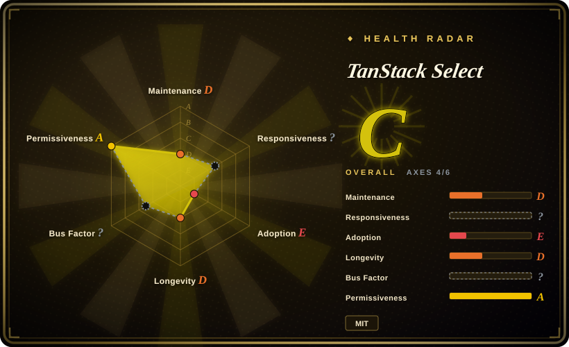
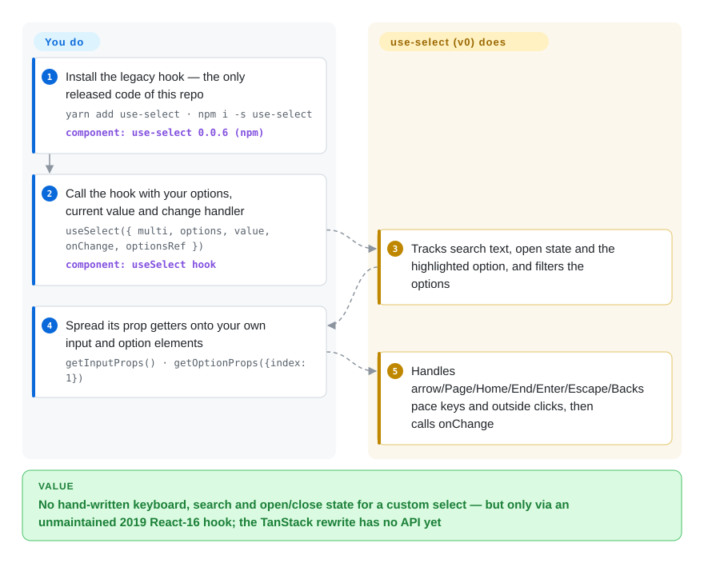

# TanStack Select

Your design system needs a searchable, multi-value dropdown with its own look, and every ready-made select either paints its own DOM or leaves you hand-writing keyboard handling, filtering and open/close state. TanStack Select is meant to be the headless engine for that job — but at verification it is a name with no product: `main` is an empty monorepo whose core exports the string `'select'`, the rewrite exists only as an RFC issue, and the only code that ever shipped is the 2019 `use-select` React hook, which its own maintainers call practically deprecated.

## When to use

You are building a React (or Solid) app on your own design system and the product asks for a tag-style multi-select with type-to-filter, "create new value", maybe 10,000 remote options in a virtualized list. You have already tried the two obvious routes: a styled select that fights your CSS, and a hand-rolled `<input>` + `<ul>` where ArrowDown past the last item throws `Cannot read properties of undefined (reading 'label')` and the screen reader announces nothing. You know TanStack Table and would like the same deal for selects — a framework-agnostic core that owns the data and behavior while every element stays yours.

That is exactly what this repo *intends* to be, and today it is only worth reaching for in two narrow ways. First, as a **watch-list item**: issue #30 (2026-08-05) is a detailed rewrite RFC — stable option IDs, feature objects in the style of [TanStack Table](tanstack-table.md) v9, controlled state slices, accessible prop getters, bridges to [TanStack Virtual](../virtualization/tanstack-virtual.md) and [TanStack Query](../data-fetching/tanstack-query.md) — so if you are choosing a select stack for a project that starts in a year, it is a candidate to re-check. Second, as a **design reference**: the 2019 `use-select` hook (branch `old`, ~540 lines) shows a compact prop-getter pattern with `multi`, `create`, `duplicates` and a `stateReducer`. For anything you must ship now, the deciding tradeoff is simple: every substitute below is published, documented and accessible, and this is not.

## How it works

Today there are two things behind the name, and neither is the headless engine the README promises. On `main`, the TypeScript monorepo has `@tanstack/select`, `@tanstack/react-select` and `@tanstack/solid-select` packages whose entire core is one line — `export const select = 'select'` — with adapters that re-export it, a test that asserts `true`, docs pages that say "Coming soon…" and "TODO", and none of it published to npm. The code that actually works is the predecessor on the `old` branch, published as `use-select` 0.0.6: you give the hook your `options` (`{ value, label }` objects), the current `value` and an `onChange`; the hook keeps the transient state — search text, open/closed, which option is highlighted — filters the list as you type, and handles the keys (arrows, Page Up/Down, Home/End, Enter, Escape, Tab, Backspace to remove the last tag). You render everything, spreading its "prop getters" — functions that return the event handlers and value your own `<input>` and option `
`s need — onto your markup. It is like hiring a stagehand who moves the scenery on cue but never builds the set; what it does *not* do is tell a screen reader anything, since the hook emits no ARIA roles or attributes at all. The planned rewrite keeps that split (you own markup, it owns behavior) and adds the accessibility layer, but it has no code yet.

<!-- flow-steps:begin (generated from flows/tanstack-select.json by tools/flow_card.py — do not edit) -->

Text version of the flow

1. **You**: Install the legacy hook — the only released code of this repo — `yarn add use-select · npm i -s use-select` — component: `use-select 0.0.6 (npm)`
2. **You**: Call the hook with your options, current value and change handler — `useSelect({ multi, options, value, onChange, optionsRef })` — component: `useSelect hook`
3. **TanStack Select**: Tracks search text, open state and the highlighted option, and filters the options
4. **You**: Spread its prop getters onto your own input and option elements — `getInputProps() · getOptionProps({index: 1})`
5. **TanStack Select**: Handles arrow/Page/Home/End/Enter/Escape/Backspace keys and outside clicks, then calls onChange

**Value**: No hand-written keyboard, search and open/close state for a custom select — but only via an unmaintained 2019 React-16 hook; the TanStack rewrite has no API yet

<!-- flow-steps:end -->

## When NOT to use

- **If you need a headless select or combobox in production now, use Downshift instead, because** it is the published, maintained hook library `use-select` itself credits as its inspiration (`useSelect`, `useCombobox`, `useMultipleSelection`, WAI-ARIA-compliant), while `@tanstack/select`, `@tanstack/react-select` and `@tanstack/solid-select` are all absent from the npm registry (checked 2026-09-28) and `main` contains no select logic.
- **If accessibility is a requirement (it should be), use React Aria's `ComboBox`/`Select` or Headless UI's `Combobox`/`Listbox` instead of `use-select`, because** the old hook's source contains zero `aria-*` or `role` attributes — a screen-reader user gets an unlabeled text box — and its own roadmap left "Improve Accessibility (Hopefully to the level of Downshift)" unchecked.
- **If you are on React 17, 18 or 19, do not install `use-select`, because** its peer range is `react: ^16.8.0-beta.0`, which excludes every React major after 16; npm 7+ refuses the install with a peer-dependency conflict unless you force it, and the hook has not been touched since 2020. Use Downshift or react-select, whose peer ranges cover React 16.8–19.
- **If you just want a finished, styled select with search, multi-value tags and async loading, use react-select (`JedWatson/react-select`) instead, because** it ships the whole widget. Do not confuse it with the `@tanstack/react-select` name this repo's README advertises — that package does not exist on npm, so an agent or developer typing `npm install react-select` gets the unrelated JedWatson library.
- **If you use Radix Primitives already, its `Select` covers the select-only case, but not type-to-filter — pair it with Downshift or cmdk for a searchable combobox, because** Radix ships a `select` package but no combobox primitive (its tree has none as of 2026-09-28).
- **If you are evaluating the RFC as a roadmap commitment, treat dates as absent, because** a maintainer wrote in 2025-05 that it "might be rewritten from the ground up by the end of the year", the year passed without code, and the 2026-08 RFC is explicitly "not a final API".
- **If your docs pipeline or agent follows the README's link to `tanstack.com/select`, expect a 404** (verified 2026-09-28; issue #29 reported the dead docs in 2023) — there is no documentation beyond the old README in git history.

## Comparison

| Alternative | In index | Our verdict | Tradeoff |
| --- | --- | --- | --- |
| Downshift (`downshift-js/downshift`) | not indexed | When you want a headless select/combobox hook in React today, pick Downshift over TanStack Select, because it is published (v9.4.0), WAI-ARIA-oriented and has been maintained since 2017, while TanStack Select has no released package at all. | Downshift gives prop-getter hooks with accessibility built in and React ≥16.12 support; you still write all markup and styling, and it is React-only. TanStack Select promises framework-agnostic cores later, but offers nothing installable now. Not added in this tab-intake batch. |
| react-select (`JedWatson/react-select`) | not indexed | When the job is "a searchable multi-select that works this afternoon" and its look is acceptable or themeable, pick react-select; pick a headless option only when you must own every element, because react-select renders its own DOM and styles. | You get search, tags, async options and creatable values out of the box (v5.10.2, React 16.8–19 peers) at the cost of its component/styling model; its npm name collides with the non-existent `@tanstack/react-select` in this repo's README. Not added in this tab-intake batch. |
| React Aria (`adobe/react-spectrum`) | not indexed | When accessibility across screen readers, touch and internationalization is the hard requirement, pick React Aria's `ComboBox`/`Select` hooks or components; it is the closest real match to what TanStack Select's RFC describes, already shipped. | Adobe-backed, Apache-2.0, very thorough ARIA and i18n behavior; the API surface is larger and more opinionated about structure than a bare hook. TanStack Select's advantage — Table-style option pipelines and Virtual/Query bridges — exists only on paper. Not added in this tab-intake batch. |
| Headless UI (`tailwindlabs/headlessui`) | not indexed | When your stack is Tailwind with React 18+ or Vue and you need unstyled but accessible `Combobox` and `Listbox` components, pick Headless UI; choose a hook library instead only if you need to reach into the state machine. | Components (not hooks) with accessibility handled and Tailwind-friendly styling; React peers start at 18 and the widget set is small. TanStack Select would offer lower-level control if it existed. Not added in this tab-intake batch. |
| [Radix UI Primitives](radix-ui.md) | ✅ | When you need an accessible select-only dropdown inside a Radix/shadcn design system, pick Radix `Select`; it does not cover type-to-filter comboboxes, so pair it with a combobox library for search. | Radix gives polished accessible primitives across many widgets and a large ecosystem; its select has no search input and there is no Radix combobox. TanStack Select targets comboboxes specifically but is unreleased. |

TanStack Select sits in the TanStack family alongside [TanStack Ranger](tanstack-ranger.md) (sliders — explicitly out of Select's scope per the RFC), [TanStack Form](../forms/tanstack-form.md) and [TanStack Store](../state-management/tanstack-store.md); these are companions the RFC plans to interoperate with, not substitutes for a select widget.

## Tech stack

- **Current `main` (placeholder).** pnpm workspace + Nx, Vite library builds, Vitest, ESLint/Prettier, changesets and `publint`; packages `@tanstack/select` (core), `@tanstack/react-select`, `@tanstack/solid-select`, each at `0.0.1`, TypeScript source. Core content: one exported string constant.
- **Legacy `use-select` (branch `old`, npm `use-select` 0.0.6).** A single ~540-line JavaScript React hook built with Rollup/Babel; internal state via `useState` wrapped in a reducer so a `stateReducer` can intercept transitions; debounced filtering (0/200/1000 ms by option count) through a Promise-based debounce.
- **Planned (RFC #30).** Framework-agnostic core with feature objects and per-slice Store atoms modelled on TanStack Table v9, framework adapters exposing accessible prop getters, no rendering, positioning or fetching in the core.

## Dependencies

- **Legacy hook:** peer `react ^16.8.0-beta.0`; no runtime dependencies. You bring the markup, styling, the options container ref (`optionsRef`, used to close the panel on outside clicks), and any windowing library via the `scrollToIndex` callback.
- **Current packages:** declared peers `react >=16.8` / `react-dom >=16.8` for the React adapter and Solid for the Solid adapter; Node ≥18 for building. Nothing to install from npm, so "depending on it" means vendoring a workspace that contains no logic.
- **No services** — it is (or will be) a browser-side library.

## Ops difficulty

**Low as a library, but moot today.** There is nothing to operate: no server, no build step beyond your bundler. The real cost is elsewhere — the legacy hook is frozen against React 16 and lacks accessibility, and the rewrite has no API to depend on, so the "ops" burden is the migration you would owe when (if) it ships.

## Health & viability

- **Maintenance (2026-09-28).** Dormant in code, alive in intent. `main` was replaced by a blank monorepo on 2025-04-27 and has had no further commit; the only 2026 activity is a docs-heading branch (2026-09-10) and the rewrite RFC (issue #30, 2026-08-05). No git tags, no GitHub releases, no `@tanstack/*` package publishes.
- **Governance / bus factor.** Owned by the TanStack GitHub organization; the RFC is authored by founder Tanner Linsley and folds in an assessment by Kevin Van Cott, who maintains other TanStack libraries. Per the contributors API, Tanner Linsley has 17 of 19 commits — historically a one-person side project.
- **Backing & longevity.** Created 2019-01 as `tannerlinsley/use-select` (the old URL redirects to `TanStack/select`), so the repo is seven years old — but age here is not Lindy evidence: the last functional release was 2020-09 and the maintainers described it as deprecated in 2025. Treat it as a young, unbuilt project that inherits TanStack's track record (Table, Query, Router) rather than its own.
- **Adoption & ecosystem.** Only the legacy package has any: `use-select` saw 774 npm downloads in the month to 2026-09-27. 278 stars and 23 forks mostly reflect the brand and the 2019 hook.
- **Risk flags.** MIT, no relicense history. The README advertises `npm install @tanstack/react-select` and a docs site that both 404/do not exist; five Dependabot/older PRs and issues sit open since 2023. The name collision with `react-select` is a practical install-mistake hazard for agents.

## Caveats (unverified)

- [推断] npm 7+ refusing to install `use-select` next to React 17–19 is derived from the semver range `^16.8.0-beta.0` and npm's documented strict peer-dependency behavior; the install was not actually run in this batch.
- [未验证] `use-select` 0.0.5 and 0.0.6 were published in September 2020, but the `old` branch's `package.json` still says 0.0.4, so the exact source of the last two published versions was not located in the repo; the page assumes they are close to the `old` branch code.
- [推断] Reading the RFC as "no committed date" rests on the RFC's own "not a final API" status and the missed "by the end of the year" estimate from 2025-05; the TanStack team may have unpublished plans.
- [未验证] The Downshift, react-select, React Aria and Headless UI cells rest on repo metadata and npm `latest` manifests fetched 2026-09-28 (version, license, peer ranges) plus general ecosystem knowledge; their accessibility claims were not audited in this batch.
- [推断] The claim that the legacy default filter needs string `value`s comes from reading `defaultFilterFn` (it calls `option.value.toLowerCase()`, while the README says it compares labels); it was not executed.
- [推断] The health radar reads the default branch, where the newest commit is the 2025-04 scaffold; any rewrite work happening on unpushed or private branches would not be reflected.
