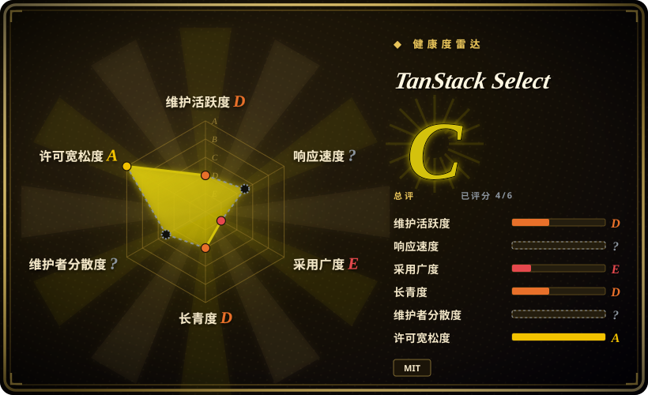
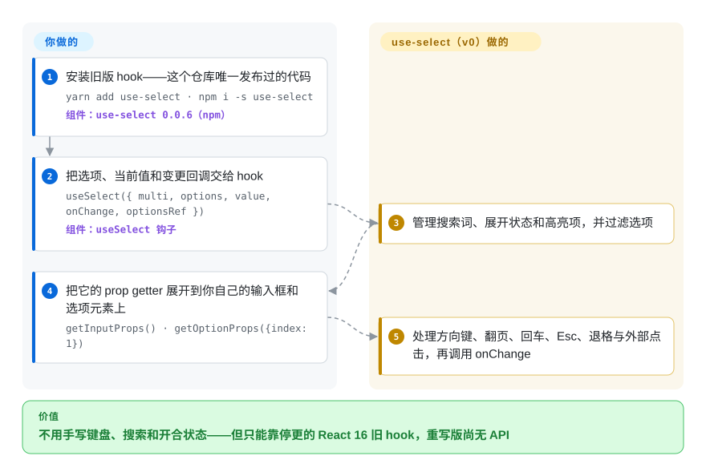

# TanStack Select

设计系统要一个能搜索、能多选、外观完全自定义的下拉框，现成的下拉组件要么自带一套 DOM 和样式，要么逼你自己手写键盘、过滤和开合状态。TanStack Select 想做的正是这件事的无头引擎——但核实时它只有名字没有产品：`main` 是个空的 monorepo，核心包只导出字符串 `'select'`，重写方案只存在于一个 RFC issue 里，唯一发布过的代码是 2019 年的 React hook `use-select`，连维护者自己都说它“实际上已废弃”。

## 何时使用

你在做一个 React（或 Solid）应用，用的是自己的设计系统，产品要一个标签式多选：边打字边过滤、能“创建新值”，也许还要在虚拟列表里挂一万个远程选项。两条显而易见的路你都走过了：带样式的下拉组件和你的 CSS 打架；自己拼 `<input>` 加 `<ul>`，按方向键越过最后一项就抛 `Cannot read properties of undefined (reading 'label')`，屏幕阅读器什么都不念。你用过 TanStack Table，希望下拉框也有同样的分工：一个与框架无关的核心管数据和行为，每个元素都归你。

这正是这个仓库“打算”成为的东西，而今天值得想到它的只有两种窄场景。其一是**观察名单**：issue #30（2026-08-05）是一份详尽的重写 RFC——稳定的选项 ID、仿 [TanStack Table](tanstack-table.zh.md) v9 的特性对象、可受控的状态切片、带无障碍属性的 prop getter，以及与 [TanStack Virtual](../virtualization/tanstack-virtual.zh.md)、[TanStack Query](../data-fetching/tanstack-query.zh.md) 的桥接——如果你在为一年后才启动的项目挑下拉框方案，可以把它列为到时再看的候选。其二是**设计参考**：2019 年的 `use-select`（`old` 分支，约 540 行）展示了一个紧凑的 prop getter 写法，支持 `multi`、`create`、`duplicates` 和 `stateReducer`。凡是现在就要上线的，决定因素很简单：下面每个替代品都已发布、有文档、有无障碍支持，而它没有。

## 怎么用起来

今天这个名字背后有两样东西，哪一样都不是 README 承诺的无头引擎。`main` 上是一个 TypeScript monorepo，含 `@tanstack/select`、`@tanstack/react-select`、`@tanstack/solid-select` 三个包，核心的全部内容只有一行 `export const select = 'select'`；适配层只是转手导出它，测试只断言 `true`，文档页写着“Coming soon…”和“TODO”，而且都没有发布到 npm。真正能跑的是 `old` 分支上的前身，以 `use-select` 0.0.6 发布在 npm：你把 `options`（`{ value, label }` 对象）、当前 `value` 和 `onChange` 交给这个 hook；它替你保管临时状态——搜索词、展开与否、哪一项高亮——边输入边过滤列表，并处理按键（方向键、翻页、Home/End、回车、Esc、Tab，以及用退格删掉最后一个标签）。所有东西由你渲染：把它的“prop getter”——返回你的 `<input>` 和选项 `
` 所需事件处理器与取值的函数——展开到你自己的标记上。它像一个按提示挪布景的舞台工，但从不搭布景；它“不”做的是告诉屏幕阅读器任何信息，因为这个 hook 完全不输出 ARIA 角色或属性。计划中的重写保留同样的分工（标记归你，行为归它），再补上无障碍层，只是目前还没有代码。

<!-- flow-steps:begin (generated from flows/tanstack-select.json by tools/flow_card.py — do not edit) -->

流程文字版

1. **你**：安装旧版 hook——这个仓库唯一发布过的代码 — `yarn add use-select · npm i -s use-select` — 组件：`use-select 0.0.6（npm）`
2. **你**：把选项、当前值和变更回调交给 hook — `useSelect({ multi, options, value, onChange, optionsRef })` — 组件：`useSelect 钩子`
3. **TanStack Select**：管理搜索词、展开状态和高亮项，并过滤选项
4. **你**：把它的 prop getter 展开到你自己的输入框和选项元素上 — `getInputProps() · getOptionProps({index: 1})`
5. **TanStack Select**：处理方向键、翻页、回车、Esc、退格与外部点击，再调用 onChange

**价值**：不用手写键盘、搜索和开合状态——但只能靠停更的 React 16 旧 hook，重写版尚无 API

<!-- flow-steps:end -->

## 何时不用

- **如果你现在就要在生产环境用无头下拉或组合框，用 Downshift，因为**它是 `use-select` 自己致谢的灵感来源，已发布、仍在维护（提供 `useSelect`、`useCombobox`、`useMultipleSelection`，遵循 WAI-ARIA）；而 `@tanstack/select`、`@tanstack/react-select`、`@tanstack/solid-select` 在 npm 上都不存在（2026-09-28 查过），`main` 里也没有任何下拉逻辑。
- **如果无障碍是硬要求（它本该是），用 React Aria 的 `ComboBox`/`Select` 或 Headless UI 的 `Combobox`/`Listbox`，别用 `use-select`，因为**旧 hook 的源码里一个 `aria-*` 或 `role` 属性都没有——屏幕阅读器用户只会遇到一个无标签的文本框——它自己的路线图里“Improve Accessibility”那一项也一直没勾上。
- **如果你用的是 React 17、18 或 19，不要装 `use-select`，因为**它的 peer 范围是 `react: ^16.8.0-beta.0`，把 16 之后的每个大版本都排除在外；npm 7 及以上默认会因 peer 依赖冲突拒绝安装，除非强制，而且这个 hook 自 2020 年起就没人动过。改用 peer 范围覆盖 React 16.8–19 的 Downshift 或 react-select。
- **如果你只想要一个成品下拉：带搜索、多选标签和异步加载、样式现成，用 react-select（`JedWatson/react-select`），因为**它交付的是整个组件。别把它和本仓库 README 宣传的 `@tanstack/react-select` 搞混——后者在 npm 上不存在，agent 或开发者敲 `npm install react-select` 装到的是那个无关的 JedWatson 库。
- **如果你已经在用 Radix Primitives，它的 `Select` 能覆盖“只选不搜”的场景，但不支持边打边过滤——要搜索就搭配 Downshift 或 cmdk，因为**Radix 有 `select` 包却没有组合框原语（2026-09-28 查其包目录确认）。
- **如果你把这份 RFC 当成路线图承诺，请当作没有日期，因为**维护者在 2025-05 说它“可能在年底前从头重写”，那一年过去了没有代码，2026-08 的 RFC 也明写“不是最终 API”。
- **如果你的文档流水线或 agent 顺着 README 去 `tanstack.com/select`，会拿到 404**（2026-09-28 核实；issue #29 在 2023 年就报告了文档失效）——除了 git 历史里的旧 README，没有任何文档。

## 横向对比

| 替代品 | 是否收录 | 我们的评价 | 取舍 |
| --- | --- | --- | --- |
| Downshift（`downshift-js/downshift`） | 未收录 | 今天要在 React 里用无头下拉或组合框 hook，选 Downshift 而不是 TanStack Select，因为它已发布（v9.4.0）、面向 WAI-ARIA、自 2017 年起持续维护，而 TanStack Select 连一个已发布的包都没有。 | Downshift 给你内置无障碍的 prop getter hook，支持 React ≥16.12；标记和样式仍全由你写，而且只支持 React。TanStack Select 许诺以后有框架无关的核心，但眼下什么都装不了。本批次（tab-intake）未新增该页。 |
| react-select（`JedWatson/react-select`） | 未收录 | 需求是“今天下午就能用的可搜索多选”，而且它的外观可以接受或能换主题，选 react-select；只有必须掌控每个元素时才选无头方案，因为 react-select 自带 DOM 和样式。 | 搜索、标签、异步选项、可创建值开箱即用（v5.10.2，peer 覆盖 React 16.8–19），代价是接受它的组件与样式模型；它的 npm 名和本仓库 README 里并不存在的 `@tanstack/react-select` 撞名。本批次（tab-intake）未新增该页。 |
| React Aria（`adobe/react-spectrum`） | 未收录 | 屏幕阅读器、触屏和国际化上的无障碍是硬要求时，选 React Aria 的 `ComboBox`/`Select` hook 或组件；它是 TanStack Select 那份 RFC 描述的东西里最接近、且已经交付的现成品。 | Adobe 支持、Apache-2.0，ARIA 与 i18n 行为非常完备；API 面更大，对结构也比单个 hook 更有主张。TanStack Select 的优势——仿 Table 的选项管道、与 Virtual/Query 的桥接——目前只停留在纸面。本批次（tab-intake）未新增该页。 |
| Headless UI（`tailwindlabs/headlessui`） | 未收录 | 技术栈是 Tailwind 加 React 18+ 或 Vue，需要无样式但无障碍的 `Combobox` 和 `Listbox` 组件，选 Headless UI；只有需要深入状态机内部时才改用 hook 库。 | 以组件（而非 hook）形式交付，无障碍已处理，适合 Tailwind 样式；React peer 从 18 起，组件种类少。TanStack Select 若存在会提供更底层的控制。本批次（tab-intake）未新增该页。 |
| [Radix UI Primitives](radix-ui.zh.md) | 已收录 | 在 Radix/shadcn 设计系统里只需要一个无障碍的“只选不搜”下拉，选 Radix `Select`；它不覆盖边打边过滤的组合框，要搜索就得另配组合框库。 | Radix 提供覆盖许多控件的精致无障碍原语和庞大生态；它的 select 没有搜索输入，也没有 Radix 组合框。TanStack Select 专门瞄准组合框，但尚未发布。 |

TanStack Select 属于 TanStack 家族，同族有 [TanStack Ranger](tanstack-ranger.zh.md)（滑块——RFC 明确划在 Select 范围之外）、[TanStack Form](../forms/tanstack-form.zh.md) 和 [TanStack Store](../state-management/tanstack-store.zh.md)；它们是 RFC 计划互通的伙伴，不是下拉控件的替代品。

## 技术栈

- **当前 `main`（占位）。** pnpm workspace 加 Nx、Vite 库构建、Vitest、ESLint/Prettier、changesets 和 `publint`；包有 `@tanstack/select`（核心）、`@tanstack/react-select`、`@tanstack/solid-select`，版本都是 `0.0.1`，源码为 TypeScript。核心内容：一个导出的字符串常量。
- **旧版 `use-select`（`old` 分支，npm `use-select` 0.0.6）。** 单个约 540 行的 JavaScript React hook，用 Rollup/Babel 构建；内部状态用 `useState` 外包一层 reducer，让 `stateReducer` 能拦截状态迁移；过滤按选项数量做防抖（0/200/1000 毫秒），防抖基于 Promise 实现。
- **计划中（RFC #30）。** 与框架无关的核心，采用仿 TanStack Table v9 的特性对象和按切片划分的 Store 原子，框架适配层暴露带无障碍属性的 prop getter，核心不负责渲染、定位和数据获取。

## 依赖

- **旧 hook：** peer 为 `react ^16.8.0-beta.0`，无运行时依赖。标记、样式、选项容器的 ref（`optionsRef`，用于点击外部时收起面板）都由你提供；虚拟列表库通过 `scrollToIndex` 回调接入。
- **当前各包：** React 适配层声明 peer `react >=16.8` / `react-dom >=16.8`，Solid 适配层依赖 Solid；构建需要 Node ≥18。npm 上无包可装，所以“依赖它”意味着引入一个不含任何逻辑的 workspace。
- **无服务端组件**——它是（或将是）浏览器端库。

## 运维难度

**作为库本身很低，但眼下无从谈起。** 没有要运维的东西：没有服务器，除了你的打包器也没有额外构建步骤。真正的成本在别处——旧 hook 冻结在 React 16 且缺无障碍，重写版没有可依赖的 API，所以“运维”负担就是它（若有一天）发布时你要付出的迁移。

## 健康度与可持续性

- **维护（2026-09-28）。** 代码层面休眠，意图层面还活着。`main` 在 2025-04-27 被替换成空 monorepo，之后再无提交；2026 年仅有的动静是一个改文档标题的分支（2026-09-10）和重写 RFC（issue #30，2026-08-05）。没有 git 标签、没有 GitHub release、没有任何 `@tanstack/*` 包发布。
- **治理与巴士系数。** 归 TanStack GitHub 组织所有；RFC 由创始人 Tanner Linsley 撰写，并吸收了维护其他 TanStack 库的 Kevin Van Cott 的评估。按 contributors 接口，19 次提交里 Tanner Linsley 占 17 次——历史上是一个人的副业项目。
- **背书与长期性。** 2019-01 以 `tannerlinsley/use-select` 创建（旧地址重定向到 `TanStack/select`），仓库已有七年——但这里的年龄不算林迪效应的证据：最后一次有功能的发布在 2020-09，维护者 2025 年称其已废弃。应把它当作一个年轻、尚未动工的项目，押的是 TanStack 的过往记录（Table、Query、Router），而不是它自己的历史。
- **采用与生态。** 只有旧包有数据：截至 2026-09-27 的一个月里 `use-select` 下载 774 次。278 个 star、23 个 fork 主要来自品牌和 2019 年那个 hook。
- **风险信号。** MIT，无改许可证历史。README 宣传的 `npm install @tanstack/react-select` 和文档站都不存在或返回 404；五个 Dependabot 及更早的 PR/issue 自 2023 年起一直开着。与 `react-select` 撞名，对 agent 来说是实实在在的装错包风险。

## 存疑（未验证）

- [推断] “npm 7+ 与 React 17–19 同装时拒绝安装 `use-select`”是从 semver 范围 `^16.8.0-beta.0` 和 npm 文档化的严格 peer 依赖行为推出的；本批次没有实际执行安装。
- [未验证] `use-select` 0.0.5 和 0.0.6 于 2020 年 9 月发布，但 `old` 分支的 `package.json` 仍写 0.0.4，所以最后两个发布版本的确切源码在仓库里没有找到；本页假设它们与 `old` 分支代码接近。
- [推断] 把 RFC 解读为“没有承诺日期”，依据是 RFC 自称“不是最终 API”以及 2025-05 那句“年底前”的估计落空；TanStack 团队可能有未公开的计划。
- [未验证] Downshift、react-select、React Aria、Headless UI 各格依据 2026-09-28 取得的仓库元数据和 npm `latest` 清单（版本、许可证、peer 范围）加上一般生态知识；本批次没有审计它们的无障碍实现。
- [推断] “旧版默认过滤要求 `value` 为字符串”来自阅读 `defaultFilterFn`（它调用 `option.value.toLowerCase()`，而 README 说比较的是 label）；没有实际运行。
- [推断] 健康度雷达读取的是默认分支，那里最新的提交是 2025-04 的脚手架；如果重写工作在未推送或私有分支上进行，雷达不会反映。
