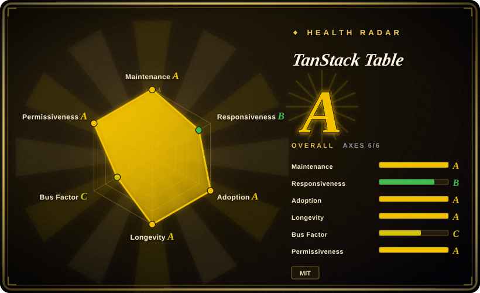
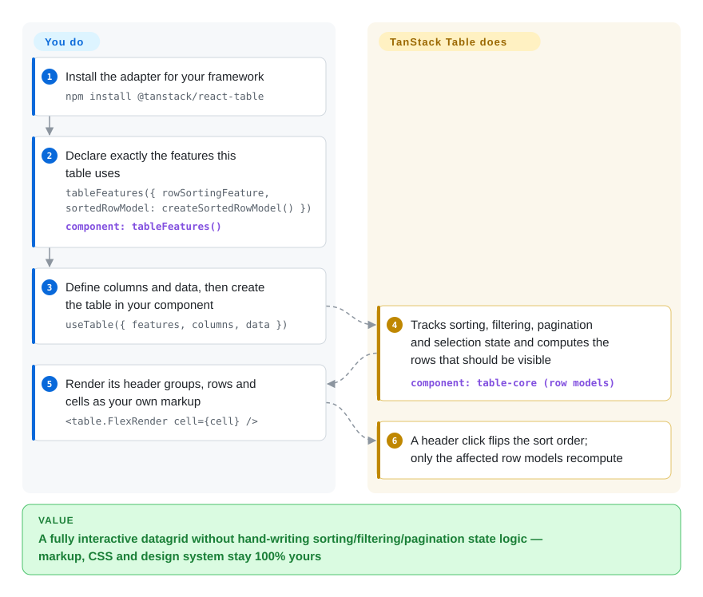

# TanStack Table

Every app with a data table re-implements the sorting comparator, the filter state, the page math and the row-selection set from scratch, and every pre-built `<Table>` you try imposes its DOM structure and class names on your design system. TanStack Table is the headless half of the problem: it computes and tracks the table state — which column is sorted, which rows match the filter, which page is showing — while you render the `<table>` markup, styles and interactions yourself in whatever design system you already use.

## When to use

You are building an admin dashboard or analytics screen in React (or Vue, Solid, Svelte, Angular, and the other official adapters) and the product asks for a "real" table: click-to-sort headers, a filter box, pagination, grouped rows with column totals, pinning and resizing, row checkboxes driving a bulk action. You have tried the component library's `<Table>` and hit its ceiling — grouping and pinning are props that don't exist, and overriding its DOM fights the theme. You have also written the state logic by hand at least twice, and each copy has an off-by-one in the page math or a stale selection after data refetch.

This is where TanStack Table earns its place: you declare columns and data plus, since v9, the exact features that table uses (`tableFeatures({ rowSortingFeature, sortedRowModel: createSortedRowModel(), … })`), and the library runs the state machine and the memoized row-model pipeline while your JSX stays plain `<table>` markup. Pick it over **AG Grid** or **MUI X Data Grid** when owning the markup and design is a requirement, not a preference — they ship finished grids whose DOM and theme you style around; you pay for control by writing the render loop and wiring interactions yourself. Pick it over **Material React Table** when MUI is not your design system (MRT is in fact this library wrapped in pre-built MUI components). Pick it over **Ant Design Table** or **MUI Table** when the feature surface goes past what their props expose — grouping, aggregation, faceting, header groups, column pinning — while your Tailwind/shadcn look stays untouched; in fact shadcn/ui's data-table pattern builds directly on it. And unlike those React-only suites, the same framework-agnostic core runs under ten official adapters.

## How it works

You describe the table, the library drives it. You pass `useTable()` (React adapter) a list of column definitions — each names its data with an `accessorKey` (a row field) or an `accessorFn`, plus `header`/`cell` renderers — and a `data` array, plus a `features` object that lists exactly which capabilities this table uses: a feature object (e.g. `rowSortingFeature`) contributes the state and APIs, and a row-model factory (e.g. `createSortedRowModel()`) contributes the client-side computation that actually reorders your rows. Omit the factory and keep the feature when your server does the sorting: the table still tracks "sorted by age, desc" as state that you read and forward to your query, and its own docs call this the manual/server-side mode. From there the library owns the bookkeeping — sort column and direction, filter values, page index, selection set, column visibility — and recomputes the visible row list (the "row model") on each change, memoizing so only affected stages reprocess. What you write is markup: map `table.getHeaderGroups()` and `table.getRowModel().rows` into your own `<thead>`/`<tr>`/`<td>` and let `<table.FlexRender>` invoke your column renderers. Think of it as an engine and transmission rather than a finished car — AG Grid delivers the whole car and you paint it; here you bolt the drivetrain onto whatever chassis your design system builds. All of that lives in one framework-agnostic `@tanstack/table-core` (its only runtime dependency is the tiny `@tanstack/store`), with thin adapters for React, Preact, Vue, Solid, Svelte, Angular, Ember, Lit, Alpine and Octane sharing it.

<!-- flow-steps:begin (generated from flows/tanstack-table.json by tools/flow_card.py — do not edit) -->

Text version of the flow

1. **You**: Install the adapter for your framework — `npm install @tanstack/react-table`
2. **You**: Declare exactly the features this table uses — `tableFeatures({ rowSortingFeature, sortedRowModel: createSortedRowModel() })` — component: `tableFeatures()`
3. **You**: Define columns and data, then create the table in your component — `useTable({ features, columns, data })`
4. **TanStack Table**: Tracks sorting, filtering, pagination and selection state and computes the rows that should be visible — component: `table-core (row models)`
5. **You**: Render its header groups, rows and cells as your own markup — `<table.FlexRender cell={cell} />`
6. **TanStack Table**: A header click flips the sort order; only the affected row models recompute

**Value**: A fully interactive datagrid without hand-writing sorting/filtering/pagination state logic — markup, CSS and design system stay 100% yours

<!-- flow-steps:end -->

## When NOT to use

- **If you want a batteries-included datagrid that just appears — built-in virtualization, Excel-style copy/paste, dozens of cell renderers — use AG Grid or MUI X Data Grid instead of TanStack Table, because** TanStack Table ships zero DOM: the render loop, cell editing, keyboard handling and ARIA attributes are all code you write and get wrong before you get them right.
- **If your app is already Material UI and you want a good table without writing table markup, use Material React Table (built on this library) instead, because** you get the same sorting/filtering engine pre-wired into MUI components; reaching for the raw library here only buys you a boilerplate layer MRT already deleted.
- **If the deliverable is spreadsheet UX — paste blocks from Excel, per-cell validation, merged cells, formulas — use [Handsontable](../../office-editors/handsontable.md) instead, because** v9 adds rectangular cell selection and cell spanning, but there is no editing engine, validation pipeline or formula system in the docs' feature set; you would hand-roll what Handsontable spent 15 years building.
- **If the table is a plain static display — a few columns, no sort/filter/pagination — use your design system's Table component (Ant Design, MUI) or a plain `<table>` instead, because** declaring features, row models and a FlexRender pipeline is more machinery than the requirement; even shadcn/ui's pre-built table works fine until the data gets interactive.
- **If you still need to fetch and cache the data, reach for [TanStack Query](../data-fetching/tanstack-query.md) (or your server) as well, because** this library never makes a network request — it processes and tracks state over the data you hand it; table state plus query state are two separate pieces you must wire together.
- **If you render tens of thousands of rows or columns, know that virtualization is not built in — add a virtualizer or pick a grid that ships one, because** the official guide explicitly says the packages contain no virtualization APIs and integrates TanStack Virtual (or any other) at the render layer; AG Grid, react-data-grid and MUI X render windows natively.
- **If your toolchain is pre-ESM or your stack is on the v8 line, pin versions or wait, because** v9 (2026-08-04) dropped CJS/UMD builds (ESM-only, ES2022 target), requires Svelte 5 runes and Angular 19+, and renamed the core hook (`useReactTable` → `useTable`) — the `useLegacyTable` bridge is documented as deprecated and bundles every feature, i.e. larger than v8.

## Comparison

| Alternative | In index | Our verdict | Tradeoff |
| --- | --- | --- | --- |
| AG Grid (`ag-grid/ag-grid`) | not indexed | When you need a finished enterprise grid — virtualization, pivoting, Excel-like behaviors out of the box — pick AG Grid; pick TanStack Table when the exact DOM and per-feature bundle size are product requirements, because you register only the capabilities you use and own every element rendered. | AG Grid gives depth of features and vendor support; you pay a large bundle, a theming API you work within, and commercial Enterprise tiers for the marquee grid features. Not added in this tab-intake batch. |
| MUI X Data Grid (`mui/mui-x`) | not indexed | If the app is already Material UI and a polished virtualized grid must work in an afternoon, pick MUI X; pick TanStack Table when the design system is yours or the framework is not React, because X Data Grid is React+MUI-shaped and TanStack Table is headless multi-framework. | MUI X ships visuals and built-in virtualization with an MIT core; premium features sit behind paid license tiers and the grid stays Material-styled. Not added in this tab-intake batch. |
| Material React Table (`KevinVandy/material-react-table`) | not indexed | When you want TanStack Table's engine without writing any table markup and MUI-flavored defaults are acceptable, pick Material React Table — it is this library wrapped in ready components; pick TanStack Table directly when the markup itself is the deliverable. | MRT removes the whole render-boilerplate layer; you inherit its component opinions and version coupling to the underlying engine. Not added in this tab-intake batch. |
| react-data-grid (`adodev/react-data-grid`) | not indexed | For an Excel-like editable grid with rows/columns virtualization built in and a DOM you accept, pick react-data-grid; pick TanStack Table when you need grouping, aggregation, faceting or markup freedom, which it largely does not offer. | react-data-grid is the shorter path to a dense editable grid; you give up headless control and most analytics-shaped features. Not added in this tab-intake batch. |
| [Handsontable](../../office-editors/handsontable.md) | ✅ | If the product is a spreadsheet — paste, validation, formulas, merged cells — pick Handsontable; pick TanStack Table when the requirement is an application table in your own design, because Handsontable's production use needs a commercial license while TanStack Table is MIT. | Handsontable brings ready-made editing semantics; the price is licensing and its own DOM. TanStack Table keeps the license clean but leaves editing/validation/formulas entirely to you. |

TanStack Table is one of several TanStack libraries; the official guide composes it with TanStack Virtual (virtualization) and ships a TanStack Query example for server-side data — those are companions, not substitutes.

## Tech stack

- **TypeScript monorepo** — pnpm workspaces + Nx, built with `tsdown`, unit-tested with Vitest and end-to-end tested with Playwright (`tests/` + `playwright.config.ts`), versioned via changesets.
- **`@tanstack/table-core`** — the framework-agnostic engine (column/row/cell models, state, memoized row-model pipeline); its only runtime dependency is `@tanstack/store`, which v9 adopted for fine-grained subscriptions and React Compiler compatibility.
- **Adapters** — `@tanstack/react-table` (peer `react >=18`, depends on `@tanstack/react-store`), plus preact / vue (>=3.2) / solid (>=1.3) / svelte (v5 runes) / angular (>=19, signals-based) / ember (5.8+ v2 addon) / lit (3.x, needs `@lit/context`) / alpine / octane, or the core directly in vanilla JS.
- **v9 output** — ESM-only packages, ES2022 compile target; features are separate registered objects (`tableFeatures()`) rather than a fixed API surface.

## Dependencies

- **Runtime:** only your framework as a peer dependency; the core pulls the small `@tanstack/store`. Nothing is installed outside the browser bundle.
- **You bring:** the data — the library makes no network calls, so fetch/TanStack Query/websockets feed it rows; the markup and CSS — any Tailwind, MUI, Chakra, Mantine or custom design system; a virtualization library (official guide uses TanStack Virtual) if the DOM gets large.
- **Optional tooling:** `@tanstack/table-devtools` for state inspection; from v9, adapter packages ship TanStack Intent agent skills wired via `npx @tanstack/intent@latest install`.

## Ops difficulty

**Low** in operations, **medium** in authoring — there is nothing to deploy or babysit; it is an npm dependency inside your front-end build.

- Each table's render loop is code you write once and reuse (map header groups and rows into JSX and delegate to `<table.FlexRender>`), plus the accessibility attributes are yours to add — headless means you own ARIA and keyboard semantics.
- v9's feature-registration model is the new learning curve: knowing which feature object and which row-model factory each capability needs (and omitting the factory in server-side mode).
- Migration is a real event: v8 → v9 renamed the entry hook and moved row models into `tableFeatures()`; the deprecated `useLegacyTable` bridge helps incrementally but ships all features, i.e. a bigger bundle than v8.
- ESM-only output means older CJS-only toolchains must stay on v8 or add interop.

## Health & viability

- **Maintenance (2026-09-28).** Very active: last default-branch commit 2026-09-16, and at least 100 commits landed since 2026-06-28 (GitHub's page window filled). The v9 line shipped fast — 9.0.0 on 2026-08-04, 9.2.4 patches across the adapter packages on 2026-08-28, with all 100 most recent GitHub releases dated on/after 2026-07-01.
- **Governance / bus factor.** The TanStack GitHub organization (an `Organization`, not a foundation) owns the repo, with CODEOWNERS present but no GOVERNANCE.md and no CLA. Founder Tanner Linsley holds 1,527 of the contributions, but the recent commits and releases are driven almost entirely by Kevin Van Cott (KevinVandy, 551 contributions, also the author of Material React Table) — day-to-day throughput leans on one or two people rather than a committee.
- **Backing & longevity.** Created 2016-10-20 — roughly ten years old under its successive names (react-table → TanStack Table) and still shipping multiple times a month, which is a strong Lindy signal in a fast-churning front-end field. Funding is GitHub Sponsors plus README partner placements (CodeRabbit, Cloudflare — and AG Grid, one of its closest substitutes, is a listed partner; no evidence the sponsorship touches the roadmap).
- **Adoption & ecosystem.** About 24.5M weekly npm downloads for `@tanstack/react-table` and 26.1M for `@tanstack/table-core` (week of 2026-09-21) — together with shadcn/ui's data-table pattern and the in-repo kitchen-sink examples (Chakra, HeroUI, Mantine, MUI, react-aria), it is the de facto headless-table standard. Docs are extensive across ten adapters; semver is enforced by changesets/semantic-release badges.
- **Risk flags.** MIT with no relicense history. The main one is recency of the v9 rewrite: 9.0.0 is under two months old at verification time, so the ecosystem (wrapper libraries, tutorials, agent training data) still assumes v8 APIs — the project even ships versioned agent skills to counteract that. ESM-only drops CJS consumers; experimental surfaces (worker row models) are explicitly excluded from the stable API.

## Caveats (unverified)

- [未验证] The AG Grid, MUI X, Material React Table and react-data-grid cells (built-in virtualization, license tiers, feature gaps) come from TanStack's own overview page and general knowledge of those projects; their repositories were not read in this batch, and TanStack's page is written by an interested party — one that also takes money from AG Grid as a sponsor.
- [推断] The bus-factor reading comes from GitHub contributor aggregates and the last weeks' commit authors; it does not capture review load, issue triage or who holds npm publish rights.
- [推断] Weekly npm downloads overstate direct adoption — they include CI installs and template/transitive usage.
- [未验证] The growth of total potential bundle size "about 14 kB in v8 to about 25 kB in v9" is maintainer-reported in `docs/guide/features.md`; the tree-shaking savings were not independently measured here.
- [未验证] The migration guide's performance claims (up to 90% memory savings in large-table scenarios, 40–70% row-model speedups) are author-reported; no benchmark was reproduced, though `perf-*.md` files in the repo root suggest the work was measured internally.
- [未验证] Whether Material React Table supports v9 at verification time was not checked; it was built on v8's API, which is why the migration-risk note is worded as ecosystem-wide rather than naming MRT's status.
