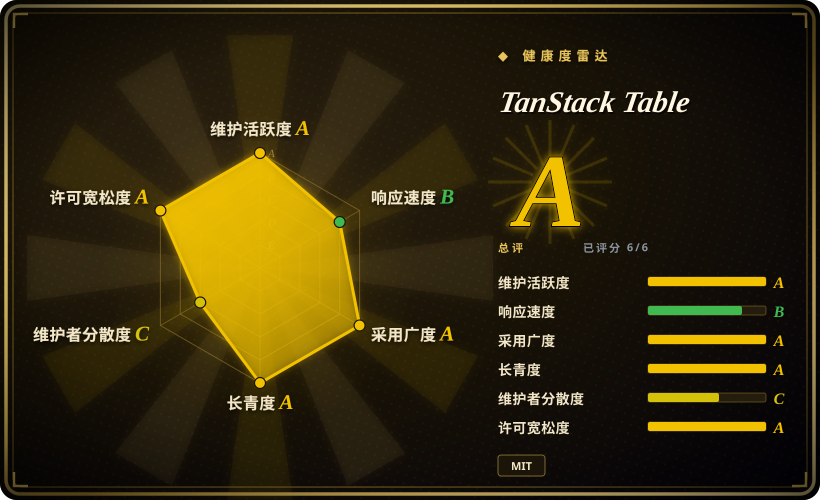
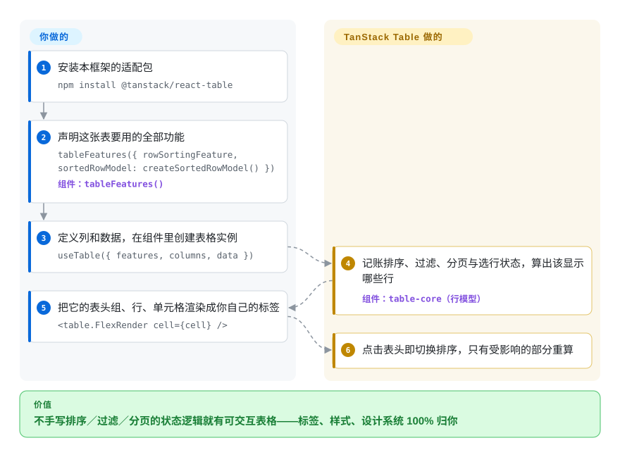

# TanStack Table

每个带数据表格的应用都在重造同一批轮子：排序比较器、过滤状态、页码算术、勾选行集合；而你想试的现成 `<Table>` 组件又会把它的 DOM 结构和类名强加给你的设计系统。TanStack Table 只解决这个问题“无头”的那一半：它替你算好并维护表格状态——哪列在排序、哪些行匹配过滤、当前第几页——`<table>` 标签、样式和交互全部由你按自己的设计系统来写。

## 何时使用

你在用 React（或 Vue、Solid、Svelte、Angular 等官方适配）做后台或分析页，产品要的是一张“像样”的表格：点击表头排序、过滤框、分页、分组行带列合计、钉住和拖宽列、勾选多行做批量操作。你试过组件库自带的 `<Table>`，很快撞上它的天花板——分组、钉列根本没有对应 prop，想改它的 DOM 就得跟主题系统打架。你也已经手写过至少两次这套状态逻辑，每一次的页码算术里都藏着 off-by-one，或者数据重拉之后勾选状态变成了幽灵行。

这正是 TanStack Table 的位置：你声明列和数据，再加上 v9 起必须显式登记的功能清单（`tableFeatures({ rowSortingFeature, sortedRowModel: createSortedRowModel(), … })`），库负责状态机和带记忆化的行模型管道，你的 JSX 还是朴素的 `<table>` 标签。和 **AG Grid**、**MUI X Data Grid** 比，当“亲手拥有每一个 DOM 节点”是需求而不是偏好时选它——那两家交付成品网格，你只能绕着它的 DOM 和主题做样式；代价是渲染循环和交互接线都得你自己写。和 **Material React Table** 比，当 MUI 不是你的设计系统时直接用它（MRT 其实就是这个库套上现成 MUI 组件的壳）。和 **Ant Design Table**、**MUI Table** 比，当功能面超出它们的 props——分组、聚合、分面过滤、多级表头、列钉住——而你的 Tailwind／shadcn 外观一点都不想动时选它；shadcn/ui 的 data-table 样板正是直接建在它上面。而且和这些 React 专属套件不同，同一个框架无关内核跑在十个官方适配层之下。

## 怎么用起来

你描述表格，库驱动表格。你把列定义（每列用 `accessorKey` 指向行数据的字段、或改用 `accessorFn`，外加 `header`／`cell` 渲染器）和 `data` 数组交给 `useTable()`（React 适配层），再用 `features` 对象声明这张表用到哪些能力：功能对象（如 `rowSortingFeature`）负责状态和 API，行模型工厂（如 `createSortedRowModel()`）负责真正在浏览器里重排行数据的计算。只要功能、不要工厂，就是服务端处理模式：表格照样维护“按年龄倒序”这个状态，你读出来转发给查询接口——官方文档把这叫 manual／server-side 模式。此后库接管全部记账：按哪列排、往哪排、过滤词、页码、勾选集合、列可见性——每次变更重算“该显示的行”（即行模型），并且逐层记忆化，只重跑受影响的部分。你写的只剩渲染：把 `table.getHeaderGroups()` 和 `table.getRowModel().rows` 铺成自己的 `<thead>`／`<tr>`／`<td>`，让 `<table.FlexRender>` 回调你的列渲染器。可以把它想成发动机加变速箱，而不是整车——AG Grid 交付整辆车让你喷漆；这里你把传动系装进设计系统自备的底盘。全部逻辑都在框架无关的 `@tanstack/table-core` 里（唯一运行时依赖是小型的 `@tanstack/store`），React、Preact、Vue、Solid、Svelte、Angular、Ember、Lit、Alpine、Octane 各挂一层薄适配共用它。

<!-- flow-steps:begin (generated from flows/tanstack-table.json by tools/flow_card.py — do not edit) -->

流程文字版

1. **你**：安装本框架的适配包 — `npm install @tanstack/react-table`
2. **你**：声明这张表要用的全部功能 — `tableFeatures({ rowSortingFeature, sortedRowModel: createSortedRowModel() })` — 组件：`tableFeatures()`
3. **你**：定义列和数据，在组件里创建表格实例 — `useTable({ features, columns, data })`
4. **TanStack Table**：记账排序、过滤、分页与选行状态，算出该显示哪些行 — 组件：`table-core（行模型）`
5. **你**：把它的表头组、行、单元格渲染成你自己的标签 — `<table.FlexRender cell={cell} />`
6. **TanStack Table**：点击表头即切换排序，只有受影响的部分重算

**价值**：不手写排序／过滤／分页的状态逻辑就有可交互表格——标签、样式、设计系统 100% 归你

<!-- flow-steps:end -->

## 何时不用

- **你要的是开箱即现的企业级网格——内置虚拟滚动、Excel 式复制粘贴、几十种单元格渲染器——就用 AG Grid 或 MUI X Data Grid，别用 TanStack Table，因为** 它一行 DOM 都不交付：渲染循环、单元格编辑、键盘操作、ARIA 属性全是你自己写、写错了也没人兜底的代码。
- **你的应用已经是 Material UI，想不写表格标记就有一张好表，就用 Material React Table（建在本库之上），因为** 同一套排序过滤引擎已经预接线到 MUI 组件里；此时直接用底层库只是把 MRT 已经删掉的样板层再写一遍。
- **交付物是电子表格体验——从 Excel 粘贴成块、逐格校验、合并单元格、公式——就用 [Handsontable](../../office-editors/handsontable.zh.md)，因为** v9 虽然新增了矩形区域选择和跨行跨列合并，但功能清单里没有编辑引擎、校验管道和公式系统；Handsontable 用 15 年磨出来的东西你得手工重造。
- **表格只是静态展示——几列数据、无排序过滤分页——就用设计系统自带的 Table 组件（Ant Design、MUI）或一个朴素 `<table>`，因为** 登记功能、装配行模型、走 FlexRender 管道，这套机器比需求重得多；数据不交互时连 shadcn/ui 的现成表格都够用。
- **数据本身还没人取和缓存，就同时上 [TanStack Query](../data-fetching/tanstack-query.zh.md) 或走服务端，因为** 这个库从不发网络请求——它只对你递进去的行做处理和状态记账；表格状态和取数状态是两块，得你自己接线。
- **要渲染几万行或几万列时，虚拟滚动没有内置——得配虚拟化库或选自带它的网格，因为** 官方指南明说包里没有任何虚拟化 API，只在渲染层对接 TanStack Virtual（或任意虚拟库）；AG Grid、react-data-grid、MUI X 则原生渲染窗口。
- **工具链还离不开 CJS、或栈停在 v8 线上时，锁版本或等一等，因为** v9（2026-08-04）删掉了 CJS／UMD 产物（仅 ESM、编译目标 ES2022），要求 Svelte 5 runes 和 Angular 19+，核心 hook 也改了名（`useReactTable` → `useTable`）——过渡桥 `useLegacyTable` 官方标注为已废弃，而且默认打包全部功能，体积比 v8 还大。

## 横向对比

| 替代品 | 是否收录 | 我们的评价 | 取舍 |
| --- | --- | --- | --- |
| AG Grid (`ag-grid/ag-grid`) | `未收录` | 要一张功能齐备的企业网格——虚拟滚动、透视、类 Excel 行为开箱即得——选 AG Grid；当精确掌控 DOM 和按功能付费的包体积是硬需求时选 TanStack Table，因为你登记什么才打包什么，渲染出的每个元素都归你。 | AG Grid 换来功能纵深与厂商支持；付出的是大块头 bundle、只能在它主题 API 里打转的样式，以及王牌网格功能背后的企业版收费。本批 tab-intake 未收录。 |
| MUI X Data Grid (`mui/mui-x`) | `未收录` | 应用本来就在 Material UI 上、要求一下午交出一张精致且带虚拟滚动的网格，选 MUI X；设计系统是你自己的、或框架不是 React 时选 TanStack Table，因为 X Data Grid 是 React＋MUI 形状的，而 TanStack Table 无头且多框架。 | MUI X 带着 MIT 核心的外观和内置虚拟滚动；高级功能压在付费授权层级后面，网格长相始终是 Material 味。本批 tab-intake 未收录。 |
| Material React Table (`KevinVandy/material-react-table`) | `未收录` | 想要 TanStack Table 的引擎但一行表格标记都不想写、也接受 MUI 风格的默认值，选 Material React Table——它就是给这个库套上现成组件；当标记本身就是交付物时，直接用 TanStack Table。 | MRT 抹平整层渲染样板；换来的是继承它的组件主张，以及与底层引擎的版本耦合。本批 tab-intake 未收录。 |
| react-data-grid (`adodev/react-data-grid`) | `未收录` | 要一张类 Excel 的可编辑网格、行列虚拟滚动内置、且接受它的 DOM，选 react-data-grid；要分组、聚合、分面过滤或标记自由度——它基本都没有——选 TanStack Table。 | react-data-grid 是通往密集可编辑网格的更短路；代价是让出无头掌控权和大多数分析型功能。本批 tab-intake 未收录。 |
| [Handsontable](../../office-editors/handsontable.zh.md) | ✅ | 产品就是电子表格——粘贴、逐格校验、公式、合并单元格——选 Handsontable；需求只是自家设计里的一张应用表格时选 TanStack Table，因为 Handsontable 生产使用要商业授权，而 TanStack Table 是 MIT。 | Handsontable 交付现成的编辑语义；付的是授权管理和它自己的 DOM。TanStack Table 授权干净，但编辑、校验、公式一律留给你手写。 |

TanStack Table 是 TanStack 家族的一员；官方指南把它和 TanStack Virtual（虚拟滚动）组合，并提供 TanStack Query 的服务端示例——那些是搭档，不是替代品。

## 技术栈

- **TypeScript monorepo** —— pnpm workspaces + Nx，用 `tsdown` 构建，Vitest 做单测、Playwright 做端到端测试（`tests/` + `playwright.config.ts`），版本发布走 changesets。
- **`@tanstack/table-core`** —— 框架无关引擎（列／行／单元格模型、状态、记忆化行模型管道）；唯一运行时依赖是 `@tanstack/store`，v9 借它做细粒度订阅并兼容 React Compiler。
- **适配层** —— `@tanstack/react-table`（peer 依赖 `react >=18`，运行时依赖 `@tanstack/react-store`），另有 preact／vue（>=3.2）／solid（>=1.3）／svelte（v5 runes）／angular（>=19，基于 signals）／ember（5.8+ 的 v2 addon）／lit（3.x，另需 `@lit/context`）／alpine／octane，或直接用核心写原生 JS。
- **v9 产物** —— 仅 ESM，编译目标 ES2022；功能是各自独立、显式登记的对象（`tableFeatures()`），不再是一整块固定 API 面。

## 依赖

- **运行时：** 只有你的框架（peer 依赖）；核心多带一个小型 `@tanstack/store`。浏览器 bundle 之外什么都不用装。
- **自带：** 数据——库从不发请求，取数由 fetch／TanStack Query／websocket 喂给它；标记和 CSS——Tailwind、MUI、Chakra、Mantine 或自研设计系统皆可；行数大时的虚拟化库（官方指南用 TanStack Virtual）。
- **可选工具：** 状态检查用 `@tanstack/table-devtools`；从 v9 起适配包内附带 TanStack Intent 的 agent skills，用 `npx @tanstack/intent@latest install` 接线。

## 运维难度

**运维低，编写中** —— 没有任何要部署或看守的东西，它只是前端构建里的一个 npm 依赖。

- 每张表的渲染循环要你自己写一遍再复用（把表头组和行映射成 JSX，交给 `<table.FlexRender>`），可访问性属性也归你补——无头意味着 ARIA 和键盘语义自负。
- v9 的功能登记制是新的学习成本：每项能力各需要哪个功能对象、哪个行模型工厂，服务端模式时又该省掉哪个工厂。
- 升级是个真事件：v8 → v9 改了入口 hook 名、把行模型挪进 `tableFeatures()`；标注废弃的 `useLegacyTable` 桥可以渐进迁移，但它默认打全功能、体积比 v8 更大。
- 仅 ESM 意味着老的纯 CJS 工具链要么留在 v8，要么自己加 interop。

## 健康度与可持续性

- **维护（2026-09-28）。** 极度活跃：默认分支最后提交 2026-09-16，2026-06-28 以来落地提交不少于 100 个（GitHub 分页窗口被填满）。v9 线推进很快——9.0.0 发布于 2026-08-04，2026-08-28 各适配包同步补丁到 9.2.4；仓库最近 100 个 GitHub release 全部落在 2026-07-01 之后。
- **治理／巴士因子。** 仓库归 TanStack 这个 GitHub 组织（是 Organization，不是基金会），有 CODEOWNERS，但没有 GOVERNANCE.md、CONTRIBUTING.md 里也没有 CLA 条款。创始人 Tanner Linsley 累计 1,527 次提交占大头，但近期提交和发布几乎全部由 Kevin Van Cott（KevinVandy，551 次提交，也是 Material React Table 的作者）一人推动——日常吞吐压在一两个人身上，而不是委员会。
- **背书与寿命。** 仓库建于 2016-10-20——以 react-table → TanStack Table 的连续血脉算约十年，且每月多次发版，在更新极快的前端领域是很强的 Lindy 信号。资金来自 GitHub Sponsors 加 README 合作伙伴位（CodeRabbit、Cloudflare——还有 AG Grid，它最接近的替代品之一也挂在赞助位上，没有证据表明赞助影响路线图）。
- **采用与生态。** `@tanstack/react-table` 周下载约 2,450 万、`@tanstack/table-core` 约 2,610 万（2026-09-21 那一周）；再叠加 shadcn/ui 的 data-table 样板和仓库内的多设计系统 kitchen-sink 示例（Chakra、HeroUI、Mantine、MUI、react-aria），它是无头表格的事实标准。十套适配的文档都算详尽；版本纪律由 changesets 和 semantic-release 徽章约束。
- **风险旗。** MIT，无改授权历史。最大的一条是 v9 重写的“新”：验证时 9.0.0 上线不到两个月，生态（包装库、教程、模型训练数据）仍按 v8 API 假设——项目甚至为此随包发布版本化的 agent skills。仅 ESM 会伤到 CJS 用户；worker 行模型等实验面被明确排除在稳定 API 之外。

## 存疑（未验证）

- [未验证] AG Grid、MUI X、Material React Table、react-data-grid 各对比格（内置虚拟滚动、授权层级、功能缺口）依据 TanStack 自己的 overview 文档和通用印象写成；本批没有读它们的仓库，而 TanStack 文档是利益相关方所写——它同时还收着 AG Grid 的赞助位。
- [推断] 巴士因子判读来自 GitHub 贡献者汇总和近几周提交作者，未覆盖评审负载、issue 分流，也没有 npm 发布权限的记录。
- [推断] 周 npm 下载量高估真实采用——其中包含 CI 安装和模板／传递依赖的使用。
- [未验证] 全功能打包体积“v8 约 14 kB、v9 约 25 kB”出自维护者在 `docs/guide/features.md` 的报告，本批未独立测量 tree-shaking 后的实际收益。
- [未验证] 迁移指南的性能承诺（大表场景最多省 90% 内存、行模型提速 40–70%）为作者自报；本批未复现基准，但仓库根目录的 `perf-*.md` 文件说明内部确实做过测量。
- [未验证] Material React Table 在验证时点是否已支持 v9 未做检查；它按 v8 API 构建，因此迁移风险的表述落在整个生态而非 MRT 的具体状态。
