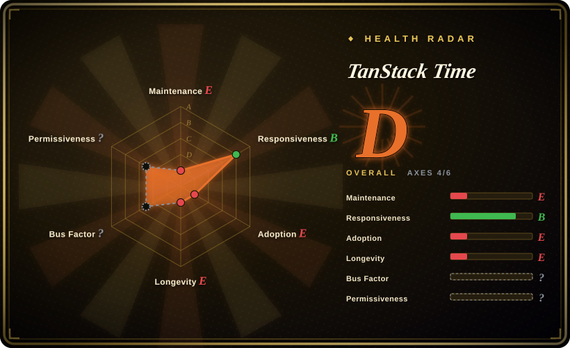
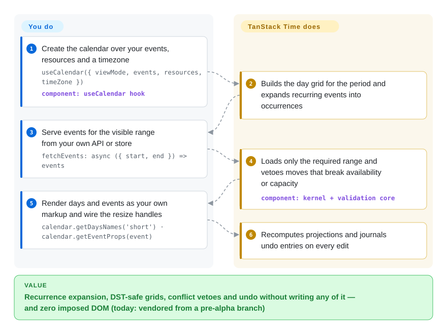

# TanStack Time

Your product calendar needs recurring events, drag-to-resize and double-booking checks, and every calendar component you drop in brings its own DOM, styles and theme that fight your design system. TanStack Time is the headless answer from the TanStack org — it computes the day grid, expands recurrence and validates conflicts while you render every pixel — but at verification time it is a construction site: no npm package, no release, no docs site, with all code living on pre-alpha side branches of an otherwise-empty `main`.

## When to use

You are building a scheduling surface in React — a resource-booking screen, a team calendar, a planning timeline — inside a design system you own (Tailwind/shadcn-style), and you have already felt the two walls: ready-made calendars like FullCalendar or react-big-calendar render their own DOM that fights your CSS, while assembling one from date primitives leaves you hand-writing recurrence expansion, DST-safe week grids and overlap detection for the third time. Worse, your domain has rules no calendar component models: "Room A holds 4 concurrent bookings", "this task cannot start until that one finishes" (FS/SS/FF/SF dependencies), working-hours calendars per resource.

TanStack Time targets exactly that gap, in the same headless style as [TanStack Table](tanstack-table.md): a stateful core (`CalendarCore`) owns the viewport (period + view mode), the event collection and a projection pipeline — recurrence expansion, conflict/availability validation, timeline layout, undo/redo — and hands you state plus prop getters (`getEventProps`, `getResizeHandleProps`); all markup, styling and ARIA stay yours. Internally it is built on the Temporal date/time API (via a polyfill), so timezone and calendar-correctness is a design given rather than an afterthought, and it also ships a small pure date-function layer positioned as a date-fns alternative. The decisive tradeoff against every substitute below: **nothing is published yet** — no `@tanstack/time` on npm, no release tag, docs site 404 — so you reach for it only if headless ownership plus its validation model is worth vendoring a pre-alpha branch and absorbing promised pre-1.0 breaking changes.

## How it works

You describe the calendar; the kernel drives it. In the React adapter you call `useCalendar(options)` once with a viewport (`viewMode: { value: 1, unit: 'month' }`), your resources and a `timeZone`, and either an `events` array or a `fetchEvents` callback that your API serves for a given `{ start, end }` range. From there the core owns the bookkeeping: it computes the day grid for the current period, expands recurring "master events" into individual occurrences, fetches only the range the viewport requires, and runs every move/resize/write through validation stages (availability, capacity, dependencies, constraints) that can veto it. State lives in a TanStack store (the same `@tanstack/store` the sibling libraries use), and the hook subscribes React to it — `useSyncExternalStore` for resize gestures, transitions for period navigation — so you read `calendar.days`, `calendar.getEventsByDate(date)` and friends and render them as your own markup; interaction handlers come back as prop getters you spread onto your elements (`{...getResizeHandleProps(…)}`). Dates cross the public boundary only as native `Date` objects or ISO `YYYY-MM-DD` strings; Temporal objects (the modern TC39 date/time API it computes with internally) never leak out, which is a deliberate architecture decision (ADR 0002). Edits are journaled as command diffs, so undo/redo costs the touched operations rather than a copy of every event. Think of it as an engine and drivetrain for calendars the way TanStack Table is for tables — except the car is not yet for sale: today the only way in is cloning the repo and building the workspace, or pointing your package manager at a git branch.

<!-- flow-steps:begin (generated from flows/tanstack-time.json by tools/flow_card.py — do not edit) -->

Text version of the flow

1. **You**: Create the calendar over your events, resources and a timezone — `useCalendar({ viewMode, events, resources, timeZone })` — component: `useCalendar hook`
2. **TanStack Time**: Builds the day grid for the period and expands recurring events into occurrences
3. **You**: Serve events for the visible range from your own API or store — `fetchEvents: async ({ start, end }) => events`
4. **TanStack Time**: Loads only the required range and vetoes moves that break availability or capacity — component: `kernel + validation core`
5. **You**: Render days and events as your own markup and wire the resize handles — `calendar.getDaysNames('short') · calendar.getEventProps(event)`
6. **TanStack Time**: Recomputes projections and journals undo entries on every edit

**Value**: Recurrence expansion, DST-safe grids, conflict vetoes and undo without writing any of it — and zero imposed DOM (today: vendored from a pre-alpha branch)

<!-- flow-steps:end -->

## When NOT to use

- **If you need a working calendar this sprint, use FullCalendar, schedule-x or react-big-calendar instead, because** TanStack Time has nothing to install: no npm package (`@tanstack/time`, `@tanstack/react-time`, `@tanstack/solid-time` all absent from the registry at verification), no git release, a `main` branch that contains only a one-line README, and a docs site that 404s. Every substitute below is published and documented today.
- **If you only need date math — format, parse, add, diff — use date-fns, Day.js or Luxon instead, because** those are mature, published, tree-shakeable utilities; TanStack Time's date-primitive layer (16 functions like `add`, `format`, `since`) is the "date-fns alternative" in its own words, but it ships inside the same unreleased workspace, so adopting it means adopting the whole pre-alpha bet.
- **If you want a styled calendar out of the box — default skins, print views, mobile layouts — use schedule-x or FullCalendar instead, because** headless here means literally zero DOM: the render loop, the CSS, keyboard handling and ARIA attributes are all yours to write and get wrong before you get them right.
- **If you must interoperate with iCal/.ics feeds or full RFC 5545 RRULE strings, keep them out of scope, because** ADR 0005 explicitly defers `.ics`/full-RRULE interop from v1 (its recurrence model is a structured UI-builder subset); an rrule/ics-native pipeline serves that need today.
- **If your stack is Vue, Svelte or Angular, use your ecosystem's calendar instead, because** despite the README's five-framework tagline, only a React adapter exists (Solid is kept as framework-agnostic proof); the project's own roadmap still carries the unchecked item to fix that "aspirational" messaging.
- **If you are buying a production scheduling engine with a solver, SLAs and support contracts, buy Bryntum rather than waiting, because** the roadmap names Bryntum Scheduler Pro as its north star for feature parity — the scheduling solver is Phase 2, not shipped.
- **If you need QA-backed non-Gregorian calendar systems (Hijri, Hebrew, …), verify against Temporal yourself, because** v1 is explicitly QA'd only on Gregorian + ISO-week + IANA timezones/DST; other calendars "keep working" via Temporal but carry no support promise.

## Comparison

| Alternative | In index | Our verdict | Tradeoff |
| --- | --- | --- | --- |
| FullCalendar (`fullcalendar/fullcalendar`) | not indexed | When the calendar must ship now and plugin breadth (resource views, drag, iCal-adjacent ecosystems) matters, pick FullCalendar; pick TanStack Time only when owning every rendered element is a hard requirement and pre-alpha churn is acceptable, because FullCalendar is 15+ years of shipped code versus zero releases here. | FullCalendar gives you a finished interactive component and a plugin marketplace; you accept its DOM/theming model and paid tiers for several standard plugins. TanStack Time promises all-MIT headless with a validation kernel, but installs nothing today. Not added in this tab-intake batch. |
| schedule-x (`schedule-x/schedule-x`) | not indexed | When you want a good-looking modern calendar or scheduler rendered for you in React (or Vue et al.) within a day, pick schedule-x; pick TanStack Time when capacity/availability/dependency validation logic matters more than looks, because schedule-x ships styled components while TanStack Time ships state machinery you wrap your own UI around. | schedule-x removes the entire rendering job; you inherit its visual opinions and its feature surface. TanStack Time leaves rendering entirely to you — and is currently not installable from npm. Not added in this tab-intake batch. |
| react-big-calendar (`bigcalendar/react-big-calendar`) | not indexed | For the long-standing React workhorse — a broad, adoption-proven month/week/day calendar with its own DOM — pick react-big-calendar; pick TanStack Time when Temporal-native timezone correctness and conflict vetoes are the point, because the big calendar renders and styles for you but has no equivalent validation pipeline. | react-big-calendar trades headless control for immediacy and a decade of community usage; TanStack Time bets on correctness machinery that is still pre-release. Not added in this tab-intake batch. |
| date-fns (`date-fns/date-fns`) | not indexed | If the job is immutable date/time functions only, pick date-fns — it has been the functional standard since 2014; pick TanStack Time's primitive layer only as part of the larger calendar bet, because those 16 functions are the same layer bundled with a stateful kernel you may not want. | date-fns is published, granular and battle-tested with nothing stateful attached; TanStack Time's primitives are unreleased and inseparable (for now) from the pre-alpha workspace. Not added in this tab-intake batch. |
| Bryntum Scheduler Pro (`bryntum`) | not a repo | When the deliverable is an enterprise Gantt/scheduler with a real solver, support and a vendor behind it, buy Bryntum — it is the closed-source commercial product TanStack Time's own roadmap names as the parity target; pick TanStack Time when headless + MIT + no license server matters more than having any of it today. | Bryntum sells proven scheduling depth and support at a commercial price and closed source; TanStack Time aims at its headless feature set for free, currently returning an unbuilt repo for the solver phases. |

TanStack Time is one of several TanStack libraries: its state layer is the indexed [TanStack Store](../state-management/tanstack-store.md), and its headless philosophy matches [TanStack Table](tanstack-table.md) — companions, not substitutes.

## Tech stack

- **TypeScript monorepo** — pnpm 11 workspaces + Nx orchestration, `tsdown` builds, Vitest tests, changesets versioning, oxlint/prettier + zizmor + autofix CI (all verified on the `alpha` branch, 2026-09-28).
- **`@tanstack/time` (core)** — `CalendarCore` (viewport + event collection + projection pipeline), 16 pure date primitives (`add`, `format`, `since`, …), recurrence expansion, availability/capacity/dependency validation, undo/redo as command diffs, timeline layout; computed internally with `@js-temporal/polyfill` (Temporal), while the public boundary returns native `Date` / ISO strings (ADR 0002).
- **Adapters & tooling packages** — `@tanstack/react-time` (`useCalendar` hook on `@tanstack/react-store`) and `@tanstack/solid-time`, plus `time-devtools` / `react-time-devtools` / `solid-time-devtools` inspection packages; Vue/Svelte/Angular are advertised in the description but no packages exist.
- **Development process** — unusually doc-heavy for a pre-alpha: `.ai/` spec-kit, `.specify/` scripts, 11 ADRs, per-phase plans and a roadmap file; a shadcn/ui-based example app (`examples/react/calendar`) exercises the hook.

## Dependencies

- **Runtime (planned packages):** the core depends on `@tanstack/store` (^0.8) and `@tanstack/devtools-event-client`; the Temporal polyfill it imports is declared at the workspace root rather than in the package manifest — harmless in-repo, a packaging question mark for the eventual publish. Node >= 18, browser-side library.
- **You bring:** the data — `events` plus `resources` (with availability rules), or a `fetchEvents` range adapter over your API; and 100% of the rendering — markup, CSS, keyboard handling, ARIA.
- **Today specifically:** nothing is on npm, so "installing" means vendoring from a git branch (`alpha` / `v0.1`) and building the pnpm workspace yourself; there is no docs site (tanstack.com/time 404s at verification).

## Ops difficulty

**Low** as a library (once published, it is an npm dependency inside your front-end build — nothing to operate), **medium-high today** — you vendor a moving pre-alpha workspace and track its promised breaking changes by reading ADRs.

- No services, no server component to babysit (the planned server package reuses the same validation core, not a deployment).
- The real ongoing cost is churn: the roadmap states "breaking changes are fine pre-1.0", the feature-composition API was still landing at verification, and the v0.1 line was actively reshaping the event model (solver fields, calendar hierarchy).

## Health & viability

- **Maintenance (2026-09-28).** Actively developed pre-alpha: the `v0`/`v0.1` lines show 100+ commits through 2026-08-28 (recurrence, solver and working-time work), the `alpha` branch was refreshed 2026-09-22, and issues #25–#42 are a live phase plan. But zero releases, zero npm publishes, a docs site that 404s, and a default branch that is still a one-line README — the project ships nothing yet.
- **Governance / bus factor.** Owned by the TanStack GitHub organization (founder Tanner Linsley, GitHub-Sponsors funded). Recent implementation on `v0.1` is almost entirely one developer (Bartłomiej Krakowski, 72 of the last 100 commits) plus an autofix bot [推断] — a single-implementer project with the brand attached, not yet a team.
- **Backing & longevity.** Repo created 2024-03 but dormant until 2025 (issue #16 in April 2025 asks "is this component available?"); substantive development only since ~May 2026. Age × still-active says: young in substance, so no Lindy protection — bet on TanStack's track record (Table, Query), not on this repo's history.
- **Adoption & ecosystem.** None measurable: no published packages means no download or dependent-repos signal; 622 stars on an unreleased repo reflect the TanStack brand, not usage. In-repo evidence is an example app and devtools packages; docs exist only as markdown in the branch.
- **Risk flags.** MIT with no relicense history — but note the LICENSE file lives on the development branches; `main` carries none, so GitHub reports "no license" (verified 2026-09-28). The five-framework claim contradicts the repo's own roadmap (unchecked item to fix the messaging). The AI-agent-heavy workflow (`.ai/`, `.specify/`, `opencode/*` branches) is unusual; whether its review discipline holds is unproven [推断].

## Caveats (unverified)

- [未验证] The FullCalendar, schedule-x, react-big-calendar and date-fns cells rest on repo metadata fetched 2026-09-28 (stars, license, cadence, positioning) plus general ecosystem knowledge; their sources were not read in full in this batch, and each is an interested party in its own comparison.
- [推断] The single-implementer reading comes from commit authorship on the `v0.1` branch (72/100 by one author); whether that developer is contracted, sponsored, or volunteer was not established.
- [推断] The `alpha` branch's two-commit history reads as a squash/force-push; the actual development history lives on `v0`/`v0.1`, but no source documents why `main` and `alpha` diverged this way.
- [未验证] Roadmap checked-boxes (kernel decomposition done, working-time hierarchy landed) are the team's own status claims; no source-level audit was performed in this batch.
- [未验证] date-fns's GitHub license field returned no license at fetch time; its actual license file was not read, so no license claim is made for it.
- [推断] The Temporal-polyfill dependency placement (workspace root instead of the core package manifest) is read as unfinished packaging on a `0.0.0` workspace; pnpm resolution behavior was not tested.
- [推断] The embedded health radar understates this repo's maintenance and longevity: its `maintenance`/`longevity` axes read the default branch (`main`), which is the dormant two-commit stub (`last_commit_age_days: 941` in the raw values), while the actual development cadence lives on the `alpha`/`v0.1` branches (pushed 2026-09-22 / 2026-08-28) that the scorer does not read.
