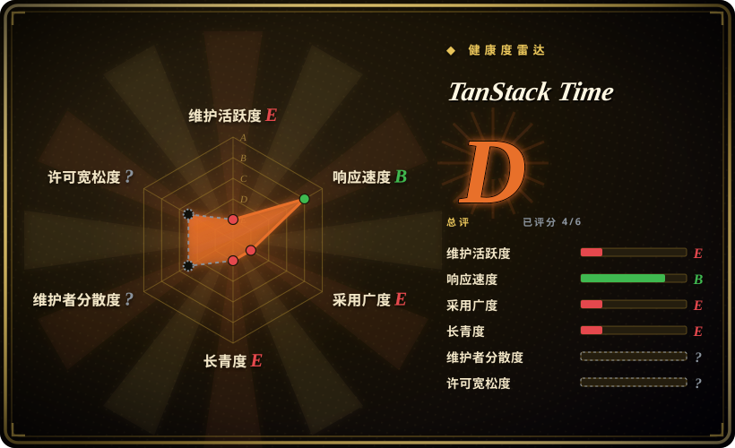
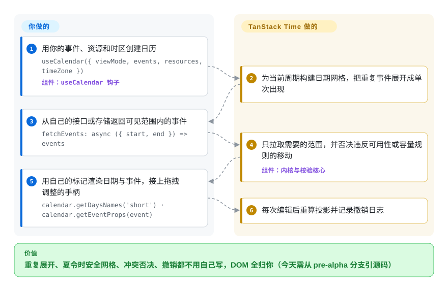

# TanStack Time

产品里的日历要支持重复日程、拖拽改时长、超订/冲突校验，而你能找到的日历组件都带着自己的 DOM、样式和主题，跟你的设计系统打架。TanStack Time 是 TanStack 系给出的无头解法：日期网格、重复展开、冲突校验都由它算，每个像素都归你画——但截至核验日它还是一片工地：npm 上没有包、没有 release、文档站 404，全部代码都活在几乎空白的 `main` 之外的 pre-alpha 分支上。

## 何时使用

你在 React 里做一个排期类界面——资源预订页、团队日历、计划时间线——设计系统是自己的（Tailwind/shadcn 这一路），而且你已经撞过两堵墙：现成日历（FullCalendar、react-big-calendar）渲染自己的 DOM，跟你的 CSS 较劲；而拿日期工具函数自己攒，重复展开、夏令时安全的周网格、重叠检测这些逻辑你已经手写过第三遍。更麻烦的是你的领域有现成组件根本不建模的规则：「A 会议室最多 4 个并发预订」、FS/SS/FF/SF 依赖（这个任务没结束那个不能开始）、按资源区分的工作时间。

TanStack Time 瞄准的正是这个缝隙，路数与 [TanStack Table](tanstack-table.zh.md) 一致：一个有状态的核心（`CalendarCore`）持有视口（周期 + 视图模式）、事件集合和投影管线——重复展开、冲突/可用性校验、时间线布局、撤销重做——把状态和 prop getter（`getEventProps`、`getResizeHandleProps`）交给你，标记、样式、无障碍全是你的。内部用 Temporal 日期时间 API（经 polyfill）计算，时区和历法正确性是设计前提而不是补丁；另带一层小的纯日期函数，官方定位就是「date-fns 的替代」。与下面每个替代品相比，决定性取舍都一样：**它什么都还没发布**——npm 上没有 `@tanstack/time`、没有 release tag、文档站 404——只有当「无头 + 校验内核」这个匹配值得你从 pre-alpha 分支引源码、并承受官方明说的 1.0 前破坏性变更时，才轮到它。

## 怎么用起来

你描述日历，内核驱动它。在 React 适配层里调用一次 `useCalendar(options)`，给一个视口（`viewMode: { value: 1, unit: 'month' }`）、资源和 `timeZone`，再加一个 `events` 数组、或一个由你的接口按 `{ start, end }` 范围供数的 `fetchEvents` 回调。此后簿记全归核心：算出当前周期的日期网格，把重复的「主事件」展开成单次出现，只拉取视口需要的范围，并把每次移动/缩放/写入送进校验阶段（可用性、容量、依赖、约束），任何一步不合格都会被否决。状态放在 TanStack store 里（兄弟库共用的那个 `@tanstack/store`），钩子用它把 React 订阅上去——拖拽手势走 `useSyncExternalStore`，翻周期走 transition——于是你读 `calendar.days`、`calendar.getEventsByDate(date)` 之类的值渲染自己的标记；交互处理器以 prop getter 的形式回来，展开到你的元素上（`{...getResizeHandleProps(…)}`）。日期穿过公开边界时只以原生 `Date` 或 ISO `YYYY-MM-DD` 字符串出现；它内部计算所用的 Temporal 对象（TC39 的新日期时间 API）绝不外泄——这是有意的架构决定（ADR 0002）。编辑按命令差异记账，撤销/重做的开销只是被改动的操作，而不是整个事件集的快照。可以把它理解为日历界的发动机和传动系统，正如 TanStack Table 之于表格——只是这台车还没开卖：今天唯一的引入方式是克隆仓库自己构建 workspace，或让包管理器指向某个 git 分支。

<!-- flow-steps:begin (generated from flows/tanstack-time.json by tools/flow_card.py — do not edit) -->

流程文字版

1. **你**：用你的事件、资源和时区创建日历 — `useCalendar({ viewMode, events, resources, timeZone })` — 组件：`useCalendar 钩子`
2. **TanStack Time**：为当前周期构建日期网格，把重复事件展开成单次出现
3. **你**：从自己的接口或存储返回可见范围内的事件 — `fetchEvents: async ({ start, end }) => events`
4. **TanStack Time**：只拉取需要的范围，并否决违反可用性或容量规则的移动 — 组件：`内核与校验核心`
5. **你**：用自己的标记渲染日期与事件，接上拖拽调整的手柄 — `calendar.getDaysNames('short') · calendar.getEventProps(event)`
6. **TanStack Time**：每次编辑后重算投影并记录撤销日志

**价值**：重复展开、夏令时安全网格、冲突否决、撤销都不用自己写，DOM 全归你（今天需从 pre-alpha 分支引源码）

<!-- flow-steps:end -->

## 何时不用

- **这个迭代周期就要能用的日历，改用 FullCalendar、schedule-x 或 react-big-calendar，因为** TanStack Time 没有任何可装的东西：核验日 npm 上没有 `@tanstack/time`、`@tanstack/react-time`、`@tanstack/solid-time`，没有 git release，`main` 分支只有一行 README，文档站 404。下面每个替代品今天都已发布、有文档。
- **只做日期运算——格式化、解析、加减、差值——改用 date-fns、Day.js 或 Luxon，因为**那些是成熟、已发布、可摇树的工具函数；TanStack Time 的日期原语层（16 个函数：`add`、`format`、`since` 等）自述是「date-fns 的替代」，但它装在同一个未发布的 workspace 里，用它就等于接受整个 pre-alpha 赌注。
- **想要开箱即用带皮肤的日历——默认外观、打印视图、移动端布局——改用 schedule-x 或 FullCalendar，因为**这里的无头是真·零 DOM：渲染循环、CSS、键盘处理、ARIA 全归你写，写错几次才能写对。
- **要和 iCal/.ics 源或完整 RFC 5545 RRULE 字符串互通，先把它排除在外，因为** ADR 0005 明确把 `.ics`/完整 RRULE 互操作从 v1 延后（它的重复模型是一个结构化的 UI 构建子集）；今天用 rrule/ics 原生的管线更稳。
- **技术栈是 Vue、Svelte 或 Angular，用各自生态的日历，因为**尽管 README 标题写着五个框架，实际只有 React 适配器（Solid 仅作为框架无关性的证明）；项目自己的 roadmap 还挂着一条未勾选项，要修正这种「愿景式」宣传。
- **要买一个带求解器、SLA 和支持合同的成熟排期引擎，直接买 Bryntum，别等，因为** roadmap 把 Bryntum Scheduler Pro 列为功能对齐的北极星——排期求解器是 Phase 2，尚未交付。
- **需要经 QA 背书的非公历历法（伊斯兰历、希伯来历等），先自己对照 Temporal 验证，因为** v1 明确只在公历 + ISO 周 + IANA 时区/夏令时上做过 QA；其他历法靠 Temporal「保持工作」，但没有支持承诺。

## 横向对比

| 替代品 | 是否收录 | 我们的评价 | 取舍 |
| --- | --- | --- | --- |
| FullCalendar（`fullcalendar/fullcalendar`） | 未收录 | 日历必须现在上线、且插件广度（资源视图、拖拽、iCal 邻近生态）重要时，选 FullCalendar；只有当「拥有每一个渲染出来的元素」是硬性要求、且能承受 pre-alpha 动荡时才选 TanStack Time，因为 FullCalendar 是十五年以上已发布的代码，而后者发布数为零。 | FullCalendar 给你成品交互组件和插件市场；代价是接受它的 DOM/主题模型，若干标准插件还要付费。TanStack Time 承诺全 MIT 的无头方案加校验内核，但今天什么都装不了。本批 tab-intake 未收录。 |
| schedule-x（`schedule-x/schedule-x`） | 未收录 | 想在一天内拿到一个好看、现代、React（及 Vue 等）里渲染好的日历或排程器，选 schedule-x；当容量/可用性/依赖校验逻辑比外观更重要时选 TanStack Time，因为 schedule-x 交付带样式的组件，而 TanStack Time 交付让你包上自己 UI 的状态机器。 | schedule-x 免掉整个渲染工作；代价是继承它的视觉 opinion 和功能边界。TanStack Time 把渲染全留给你——而且当前无法从 npm 安装。本批 tab-intake 未收录。 |
| react-big-calendar（`bigcalendar/react-big-calendar`） | 未收录 | 要 React 圈的老牌主力——采用广泛、自带 DOM 的月/周/日日历——选 react-big-calendar；当 Temporal 级时区正确性和冲突否决才是重点时选 TanStack Time，因为大日历替你渲染和样式化，却没有等价的校验管线。 | react-big-calendar 用放弃无头控制换来即拿即用和十年社区使用量；TanStack Time 押注的是至今未发布的正确性机器。本批 tab-intake 未收录。 |
| date-fns（`date-fns/date-fns`） | 未收录 | 若只做不可变的日期时间函数，选 date-fns——它自 2014 年起就是函数式标准；TanStack Time 的原语层只应作为更大日历赌注的一部分，因为那 16 个函数与一个你可能并不想要的有状态内核捆在同一个 workspace 里。 | date-fns 已发布、粒度细、久经考验，不带任何状态；TanStack Time 的原语未发布，且（眼下）无法与 pre-alpha workspace 拆开。本批 tab-intake 未收录。 |
| Bryntum Scheduler Pro（`bryntum`） | 非仓库 | 交付物是要有真求解器、有支持、有厂商背书的企业级甘特/排程器时，买 Bryntum——它是 TanStack Time 自己 roadmap 里点名的对齐目标，闭源商业产品；当「无头 + MIT + 无许可证服务器」比「今天就能用」更重要时才选 TanStack Time。 | Bryntum 卖的是已证明的排期深度和支持，价格是商业付费加闭源；TanStack Time 想免费对齐它的无头功能集，目前求解器各阶段还是未建成的仓库。 |

TanStack Time 是 TanStack 系的一员：状态层用的是已收录的 [TanStack Store](../state-management/tanstack-store.zh.md)，无头哲学与 [TanStack Table](tanstack-table.zh.md) 一脉相承——它们是同伴，不是替代品。

## 技术栈

- **TypeScript monorepo**——pnpm 11 workspaces 加 Nx 编排，`tsdown` 构建，Vitest 测试，changesets 版本管理，oxlint/prettier 加 zizmor、autofix 的 CI（以上均在 `alpha` 分支核验，2026-09-28）。
- **`@tanstack/time`（核心）**——`CalendarCore`（视口 + 事件集合 + 投影管线）、16 个纯日期原语（`add`、`format`、`since` 等）、重复展开、可用性/容量/依赖校验、以命令差异实现的撤销重做、时间线布局；内部用 `@js-temporal/polyfill`（Temporal）计算，公开边界只返回原生 `Date` 和 ISO 字符串（ADR 0002）。
- **适配层与工具包**——`@tanstack/react-time`（基于 `@tanstack/react-store` 的 `useCalendar` 钩子）与 `@tanstack/solid-time`，另有 `time-devtools`、`react-time-devtools`、`solid-time-devtools` 检查工具包；描述里宣传的 Vue/Svelte/Angular 并没有对应包。
- **开发过程**——对一个 pre-alpha 项目而言文档密度异常高：`.ai/` 规格套件、`.specify/` 脚本、11 篇 ADR、逐阶段计划和 roadmap 文件；一个基于 shadcn/ui 的示例应用（`examples/react/calendar`）跑通整个钩子。

## 依赖

- **运行时（规划中的包）**：核心依赖 `@tanstack/store`（^0.8）与 `@tanstack/devtools-event-client`；它 import 的 Temporal polyfill 声明在 workspace 根而不是包清单里——仓库内无害，对 eventual 发布是个打包问号。要求 Node >= 18，浏览器端库。
- **你要自备**：数据——`events` 加 `resources`（含可用性规则），或套在你 API 上的 `fetchEvents` 范围适配器；以及百分之百的渲染——标记、CSS、键盘处理、ARIA。
- **特指今天**：npm 上什么都没有，「安装」意味着从 git 分支（`alpha` 或 `v0.1`）引源码并自己构建 pnpm workspace；没有文档站（核验时 tanstack.com/time 返回 404）。

## 运维难度

**低**——作为库（发布后只是前端构建里的一个 npm 依赖，没有任何要运维的东西）；**今天中偏高**——你引入的是一个移动中的 pre-alpha workspace，官方承诺的破坏性变更要靠读 ADR 来跟踪。

- 没有服务、没有要值守的服务端组件（规划中的 server 包复用同一个校验核心，不是部署物）。
- 真正的持续成本是动荡：roadmap 明说「1.0 前破坏性变更没问题」，核验时 feature-composition API 还在落地，v0.1 线还在重塑事件模型（求解器字段、日历层级）。

## 健康度与可持续性

- **维护（2026-09-28）。** 活跃的 pre-alpha 开发：`v0`/`v0.1` 线到 2026-08-28 累计 100+ 提交（重复、求解器、工作时间方向），`alpha` 分支 2026-09-22 刚刷新，issue #25–#42 是一份活着的阶段计划。但零 release、零 npm 发布、文档站 404、默认分支仍是一行 README——项目至今没有交付任何东西。
- **治理 / 巴士因子。** 仓库属 TanStack GitHub 组织（创始人 Tanner Linsley，靠 GitHub Sponsors 出资）。`v0.1` 上的近期实现几乎全由一位开发者完成（Bartłomiej Krakowski，最近 100 次提交中的 72 次）外加一个 autofix 机器人 [推断]——挂着品牌，实质是单人实现的项目，还不是团队。
- **背书与寿命。** 仓库 2024 年 3 月创建，但直到 2025 年都处于休眠（2025 年 4 月的 issue #16 在问「这个组件存在吗」）；实质开发从 2026 年 5 月前后才开始。按「年龄 × 仍在活跃」算：实质上年轻，没有 Lindy 保护——下注的是 TanStack 的既往战绩（Table、Query），不是这个仓库的历史。
- **采用与生态。** 无法度量：没有发布的包，就没有下载量和依赖方信号；一个未发布仓库上的 622 颗星反映的是 TanStack 品牌，不是使用量。仓库内证据是一个示例应用和几个 devtools 包；文档只是分支里的 markdown。
- **风险信号。** MIT、历史上没有更换过许可证——但注意 LICENSE 文件在开发分支上，`main` 上没有，所以 GitHub 显示「无许可证」（2026-09-28 核验）。五框架宣传与它自己的 roadmap 相矛盾（未勾选的「修正宣传」条目）。重度依赖 AI 代理的工作流（`.ai/`、`.specify/`、`opencode/*` 分支）并不常见，其评审纪律能否扛住尚无证明 [推断]。

## 存疑（未验证）

- [未验证] FullCalendar、schedule-x、react-big-calendar、date-fns 四行对比基于 2026-09-28 抓取的仓库元数据（星数、许可证、节奏、定位）和一般生态知识；本批没有通读它们的源码，而每一方在对比里都是利益相关者。
- [推断] 「单一实现者」的判断来自 `v0.1` 分支的提交署名（100 次里 72 次属同一作者）；该开发者是受聘、受赞助还是志愿，未能核实。
- [推断] `alpha` 分支只有两次提交的历史，读起来像 squash/force-push；真实开发史在 `v0`/`v0.1` 上，但没有任何来源解释 `main` 与 `alpha` 为何如此分叉。
- [未验证] roadmap 的勾选项（内核分解已完成、工作时间层级已落地）是团队自己的状态声明；本批未做源码级审计。
- [未验证] date-fns 的 GitHub 许可证字段在抓取时返回空；未读它的许可证文件，故对它不做许可证断言。
- [推断] Temporal polyfill 依赖的位置（workspace 根而非核心包清单）被解读为 `0.0.0` workspace 的未完成打包；未实测 pnpm 的解析行为。
- [推断] 页内嵌的健康度雷达低估了本仓库的维护与寿命：其 `maintenance`/`longevity` 轴读取默认分支 `main`——那是个休眠的双提交空壳（原始值里 `last_commit_age_days: 941`），而真实开发节奏在 `alpha`/`v0.1` 分支上（2026-09-22 / 2026-08-28 有推送），评分器不读它们。
