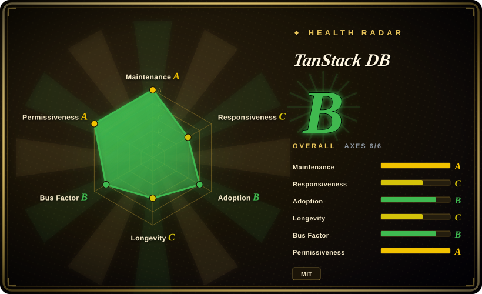
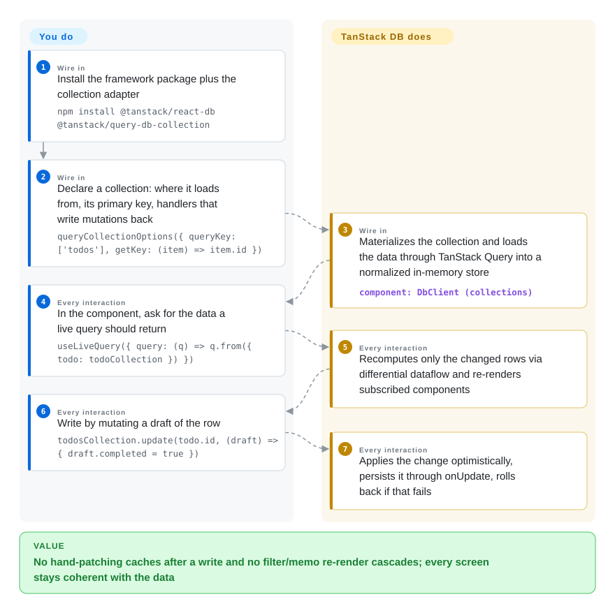

# TanStack DB

One toggled checkbox re-renders a 10,000-row list, every screen demands its own bespoke API endpoint, and after each save you hand-patch the query cache in three places. TanStack DB loads your API data into in-memory collections and, when a row changes, recomputes only the queries that row actually affects — so reads stay sub-millisecond and writes apply instantly, local-first, with automatic rollback if the server rejects them.

## When to use

You maintain a React (or Vue, Svelte, Solid) app on TanStack Query with thousands of rows loaded — a project tracker, a catalog, an admin console. The pain is structural: the sidebar needs todos joined with their projects, so someone wrote `/api/todos-with-projects`, then `/api/todos-with-users` for another view, and the endpoint list keeps growing; every mutation is twenty lines of `onMutate` cache-patching and rollback boilerplate; and filtering that 10k-row list re-runs `filter()` plus a `useMemo` chain on every keystroke, making the UI jank. You have read the Linear/Figma postmortems about loading everything into the client and want that architecture without writing a custom indexing engine.

Reach for TanStack DB here: you declare typed **collections** (loaded through the TanStack Query you already run, or a sync engine, or local-only), query them with a typed builder that supports joins, and call `collection.update(id, draft => ...)` — the library overlays the optimistic change on the synced data, every live query affected by that row updates incrementally, and your `onUpdate` handler persists to the backend, rolling back on failure. You pick it over staying on plain [TanStack Query](tanstack-query.md) when you need reactive joins across data from different sources and optimistic writes without hand-written cache patching; over **TinyBase** or **Legend-State** when the data is server data arriving via Query or a sync engine rather than client-only state; over **RxDB** when you want the reactive query layer without owning a full local database engine and replication protocol.

## How it works

You declare a **collection** — a typed set of rows with a primary key (`getKey`), optionally a schema (any Standard Schema: Zod, Valibot, ArkType, Effect), and mutation handlers (`onInsert`/`onUpdate`/`onDelete`) that write to your backend. TanStack DB does the rest: it populates the collection (the query adapter loads it through a TanStack Query `queryFn`, so Query's cache, retries and stale policies still apply; sync-engine adapters stream deltas in instead), keeps a normalized in-memory store, and runs **live queries** over it. A live query is compiled into a differential-dataflow graph — a technique from streaming databases where data carries +1/-1 multiplicities, so when one row changes, only the affected rows of every dependent query are recomputed instead of re-running the whole filter/join/sort. When you call `collection.update(id, draft => {...})`, the change applies to an optimistic overlay instantly (the network leaves the interaction path), the handler persists it in the background, and a throw rolls the overlay back. Think of it as Materialize-style streaming SQL embedded in the browser, except you define the streams with a TypeScript builder instead of SQL text. Collections default to loading everything up front (eager); `syncMode: 'on-demand'` flips it so the live query's predicates push down into the fetch and only requested rows load.

<!-- flow-steps:begin (generated from flows/tanstack-db.json by tools/flow_card.py — do not edit) -->

Text version of the flow

1. **You** (Wire in): Install the framework package plus the collection adapter — `npm install @tanstack/react-db @tanstack/query-db-collection`
2. **You** (Wire in): Declare a collection: where it loads from, its primary key, handlers that write mutations back — `queryCollectionOptions({ queryKey: ['todos'], getKey: (item) => item.id })`
3. **TanStack DB** (Wire in): Materializes the collection and loads the data through TanStack Query into a normalized in-memory store — component: `DbClient (collections)`
4. **You** (Every interaction): In the component, ask for the data a live query should return — `useLiveQuery({ query: (q) => q.from({ todo: todoCollection }) })`
5. **TanStack DB** (Every interaction): Recomputes only the changed rows via differential dataflow and re-renders subscribed components
6. **You** (Every interaction): Write by mutating a draft of the row — `todosCollection.update(todo.id, (draft) => { draft.completed = true })`
7. **TanStack DB** (Every interaction): Applies the change optimistically, persists it through onUpdate, rolls back if that fails

**Value**: No hand-patching caches after a write and no filter/memo re-render cascades; every screen stays coherent with the data

<!-- flow-steps:end -->

## When NOT to use

- **If you need a frozen, stable public API for a long-lived product today, wait or pin exact versions, because** the README labels the project BETA and the API has already churned within 0.x — the 0.1 launch post used `createCollection(...)` while current docs use `collectionOptions(...)` materialized through a `DbClient` (checked 2026-09-28); for a mature reactive local store pick **TinyBase** (since 2021) or **Dexie** with `liveQuery` for IndexedDB-backed data.
- **If the state is client-only (form drafts, UI toggles, editor documents), use Zustand, Redux, or TanStack Store instead, because** TanStack DB's value is server-data coherence — loading, joining and writing back — and an in-memory collection is overhead for state that never touches a backend.
- **If the app fetches two endpoints and renders them once, stay on plain [TanStack Query](tanstack-query.md) (or framework loaders), because** a collection layer, live-query builder and mutation handlers buy nothing when there is nothing to join or keep reactively consistent.
- **If you need durable offline-first storage with conflict-replicating sync out of the box, use RxDB or a full sync stack (ElectricSQL, PowerSync) instead, because** TanStack DB's store is in-memory by default and its SQLite persistence add-ons are themselves 0.x; RxDB ships a local database plus replication protocol as one tested unit.
- **If your dataset is genuinely huge (millions of rows) and lives server-side, keep server-driven pagination (tRPC, React Router loaders, Server Components), because** the core model loads rows into client memory — on-demand mode pushes predicates down, but you are still buying a client-side database for a problem the server already solves.
- **If your API is GraphQL and the same entity appears across many queries, Apollo Client or Relay with a normalized cache already solve entity coherence, because** TanStack DB's collections are data-source-agnostic but give you no GraphQL-specific normalization, and adding DB on top of a normalized GraphQL cache duplicates the job.
- **If your team has not internalized what "load the collection" costs, watch memory, because** eager mode (the default) loads an entire collection per `queryKey` — fine for reference tables, a problem when someone points it at an unbounded table.

## Comparison

| Alternative | In index | Our verdict | Tradeoff |
| --- | --- | --- | --- |
| TinyBase (`tinyplex/tinybase`) | not indexed | For a purely client-side reactive store with built-in persistence and sync (mature since 2021), pick TinyBase; pick TanStack DB when the data arrives through TanStack Query or a sync engine and you need typed cross-collection joins plus optimistic writes to a backend. | TinyBase is smaller, stable and persistable out of the box; it has no answer for "my REST cache lives in Query" and no per-source mutation handlers. Not added in this tab-intake batch. |
| RxDB (`pubkey/rxdb`) | not indexed | If offline-first with durable local storage and conflict-aware replication is the requirement, pick RxDB; pick TanStack DB when you want reactive queries and optimistic UI without operating a local database engine. | RxDB (Apache-2.0, since 2016) ships storage, replication and encryption as one unit; you pay a heavier runtime, its query reactivity model, and replication setup versus collections over an existing cache. Not added in this tab-intake batch. |
| ElectricSQL (`electric-sql/electric`) | not indexed | When the goal is Postgres-to-client realtime sync, Electric is the data plane to pick — and it pairs with TanStack DB rather than competing (an official `electric-db-collection` exists); use Electric alone if you only need synced data where it lands. | Electric solves sync and delta delivery; it does not give you cross-collection joins or optimistic-transaction UI semantics — that is the layer TanStack DB adds. Not added in this tab-intake batch. |
| PowerSync (`powersync-ja/powersync-service`) | not indexed | If your backend is MongoDB/MySQL (not only Postgres) and you want SQLite-based offline sync, pick PowerSync's stack — again commonly paired via `powersync-db-collection`; pick TanStack DB over building on it directly when you still need the reactive join/optimistic layer. | PowerSync's server component is source-available with a non-SPDX license (checked 2026-09-28) and the hosted/self-hosted split adds ops; TanStack DB itself stays an MIT client library either way. Not added in this tab-intake batch. |
| Legend-State (`LegendApp/legend-state`) | not indexed | For fine-grained reactive client state with optional persistence, pick Legend-State — it is a state library, not a data layer; pick TanStack DB when multiple components must stay coherent over shared server data with joins. | Legend-State optimizes rendering granularity; you would hand-build loading, joining and write-back on top of it, which is exactly what TanStack DB's collections provide. Not added in this tab-intake batch. |

TanStack DB is designed as a layer above [TanStack Query](tanstack-query.md) (indexed) — Query owns fetching and caching, DB owns coherence, joins and optimistic transactions; the `@tanstack/query-db-collection` package is the bridge, and TanStack Router/Start integrate with it. Other TanStack siblings (Store, Virtual, Table) are companions, not substitutes.

## Tech stack

- **TypeScript** monorepo (pnpm workspaces), built with Vite, tested with Vitest — including an unusually deep suite of property-based "oracle" tests covering transaction settlement, subscription lifecycle and query reconciliation.
- **`@tanstack/db`** — framework-agnostic core (`DbClient`, collections, transactions, query builder with `from`/`where`/`join`/`select`/`groupBy`/`orderBy`), runtime deps only `@standard-schema/spec`, `@tanstack/db-ivm` and `@tanstack/pacer-lite`.
- **`@tanstack/db-ivm`** — the incremental-view-maintenance engine: a differential-dataflow implementation forked from ElectricSQL's `d2ts` (deps: `fractional-indexing`, `sorted-btree`).
- **Framework adapters** — `react-db`, `vue-db`, `svelte-db`, `solid-db`, `angular-db`; `react-router-with-db` integrates it with React Router.
- **Collection adapters** — `query-db-collection` (REST via TanStack Query), sync engines (`electric-db-collection`, `powersync-db-collection`, `trailbase-db-collection`, `rxdb-db-collection`), and local ones (`local-storage-collection`, local-only in-memory).
- **Persistence add-ons (all 0.x)** — SQLite persistence for browser, Electron, Tauri, React Native/Expo, Capacitor, Node, and Cloudflare Durable Objects.
- The npm package even ships a bundled agent skill pack (`skills/db-core`) teaching coding agents the collection/live-query/mutation APIs.

## Dependencies

- **Runtime:** the core has three small dependencies (Standard Schema spec, the in-repo IVM engine, Pacer-lite) plus a `typescript >= 4.7` peer; the query-collection adapter requires `@tanstack/query-core`; sync adapters add their engine's client (e.g. PowerSync pulls `@powersync/*` and a SQLite WASM build).
- **You bring:** the backend — REST endpoints (or a sync engine) the mutation handlers call; TanStack Query if you use query collections. On React Native, a `react-native-random-uuid` polyfill is required for `crypto.randomUUID()`.
- **No server component, no hosted service** — it is a client-side library; data lives in memory unless you add a persistence package.

## Ops difficulty

**Low to operate, medium to adopt well.** Nothing to deploy — an npm dependency. The real costs are architectural:
- Designing collections well (`getKey`, schema, which sync mode: eager / on-demand / progressive) decides whether you get the promised performance or an over-loaded client.
- It is a beta 0.x library: APIs churned between 0.1 and the current docs, so pin exact versions and budget for migrations until 1.0.
- Memory is the capacity ceiling: eager collections live fully in the heap; SSR adds `DbClient` dehydration/hydration steps on top of Query's own SSR story.

## Health & viability

- **Maintenance (2026-09-28).** Very active for its age: ~175 commits between 2026-06-28 and 2026-09-28, pushes on the verification day, and coordinated releases across ~15 packages on 2026-09-14 (core `@tanstack/db` 0.9.2, `react-db` 0.4.1).
- **Governance / bus factor.** Lives in the TanStack GitHub organization; the driving authors are Kyle Mathews (Gatsby founder, top committer, 465 commits) and Sam Willis (ElectricSQL co-founder), with Tanner Linsley as org owner. Roadmap is effectively two to three core people plus partners (ElectricSQL, PowerSync, Prisma, Cloudflare listed in the README) — no foundation, no CLA.
- **Backing & longevity.** About 1.5 years old (created 2025-03-11, first npm publish 2025-05-12, 0.1 beta announced 2025-07-30) — a young project whose Lindy signal is weak on age but strong on activity; it carries the TanStack organization's track record (Query, Router, Table) rather than its own decade. Pre-1.0 beta is the honest status.
- **Adoption & ecosystem.** ~3.9k GitHub stars; npm downloads ~3.5M/month for `@tanstack/db` and ~3.2M/month for `@tanstack/react-db` (2026-08-29→2026-09-27 window) — high for an 18-month-old beta, inflated by CI and transitive installs. Docs are extensive with per-framework references; first-party adapters exist for four sync engines and seven persistence targets.
- **Risk flags.** MIT (held by Kyle Mathews), no relicense history. The material risks are beta churn (breaking API changes documented above) and sync-engine partner coupling in the docs — the Electric/PowerSync integration pages double as partner marketing, though the adapters themselves are MIT in-repo.

## Caveats (unverified)

- [未验证] Performance claims ("~0.7 ms to update one row in a sorted 100,000-item collection on an M1 Pro") are the authors' own benchmark from the launch post and docs; not reproduced in this verification.
- [推断] npm download figures are interpreted as an adoption signal; they include CI installs, mirrors and transitive dependencies, so direct production use is lower than the raw numbers suggest.
- [推断] The bus-factor reading comes from commit counts and the launch-post byline; it does not capture npm publish rights, review load or paid maintainer time.
- [未验证] Comparison verdicts for TinyBase, RxDB, ElectricSQL, PowerSync and Legend-State rest on their repo metadata/descriptions and TanStack's own docs, not on reading those codebases in this batch.
- [未验证] "Beta churn" is evidenced by the 0.1 blog (`createCollection`) versus current docs (`collectionOptions` + `DbClient`); a full changelog review of every breaking rename between 0.x releases was not done.
- [未验证] The bundled `skills/db-core` pack was read from the repo tree, not exercised in a coding agent.
