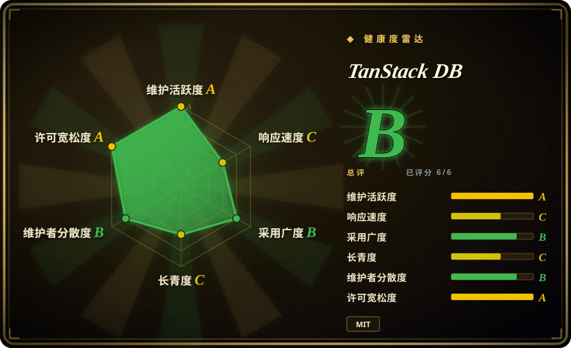
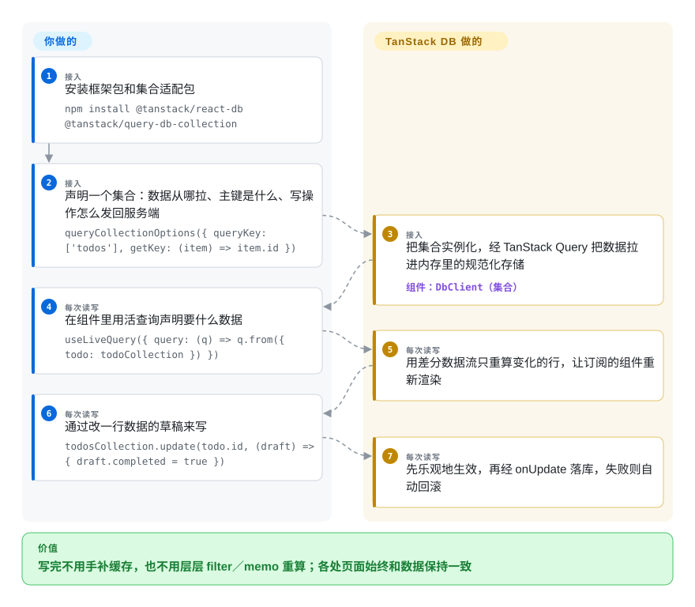

# TanStack DB

勾掉一个待办，一万行的列表整页重渲染；每个界面都要求后端单开一个接口；每次保存之后你还要到三处手动补查询缓存。TanStack DB 把 API 数据装进内存里的集合（按主键规范存储），某一行变化时只重算真正受影响的那些查询——读取保持亚毫秒，写入先在本地立刻生效、后台再落服务端，失败自动回滚。

## 何时使用

你在一个跑着 TanStack Query 的 React（或 Vue、Svelte、Solid）应用里维护几千行数据——项目追踪台、商品目录、管理后台。痛点是结构性的：侧边栏要「待办＋所属项目」的联表结果，于是有人写了 `/api/todos-with-projects`，接着又为另一个视图写了 `/api/todos-with-users`，接口清单越拉越长；每个写操作都是二十行 `onMutate` 手补缓存加回滚的样板代码；在十万行列表上敲一个字，`filter()` 加一串 `useMemo` 全部重跑，界面直接卡住。你读过 Linear、Figma 把数据全量装进客户端的实践文章，想要那套架构，但不想自己写索引引擎。

这时用 TanStack DB：声明带类型的**集合**（数据可以走你现有的 TanStack Query 拉取，也可以接同步引擎，或者纯本地），用带类型的查询构造器做联表查询，写的时候调 `collection.update(id, draft => ...)`——乐观变更立刻叠加到已同步数据上，所有受影响的活查询增量更新，你的 `onUpdate` 处理器在后台落库，失败自动回滚。和继续用纯 [TanStack Query](tanstack-query.zh.md) 相比，选它是因为你需要跨数据源的响应式联表和不用手补缓存的乐观写入；和 **TinyBase**、**Legend-State** 相比，选它是因为数据来自 Query 或同步引擎的服务端数据，而不是纯客户端状态；和 **RxDB** 相比，选它是因为你只想要响应式查询层，不想维护一个完整的本地数据库引擎和复制协议。

## 怎么用起来

你声明一个**集合**——一组带类型的行，指定主键（`getKey`），可选挂一个 schema（任何 Standard Schema 实现：Zod、Valibot、ArkType、Effect），再配上把写操作发回后端的处理器（`onInsert`／`onUpdate`／`onDelete`）。其余由 TanStack DB 接管：它填充集合（query 适配器经由 TanStack Query 的 `queryFn` 加载，Query 的缓存、重试与过期策略照常生效；同步引擎适配器则改为流式写入增量），维护一份按主键规范存储的内存数据，并在其上运行**活查询**。每个活查询被编译成一张差分数据流图——这是流式数据库里的技术，数据带着 ＋1／−1 的出现次数传播，所以一行变化时只重算受影响的行，而不是整段 filter／join／sort 重跑。你调 `collection.update(id, draft => {...})` 时，变更立刻落在乐观覆盖层上（网络被移出交互路径），处理器后台落库，抛错则回滚覆盖层。可以把它理解为嵌进浏览器的 Materialize 式流式 SQL，只是流用 TypeScript 构造器而不是 SQL 文本来定义。集合默认全量加载（eager）；把 `syncMode: 'on-demand'` 设为按需后，活查询的谓词会下推到拉取请求里，只加载被查到的行。

<!-- flow-steps:begin (generated from flows/tanstack-db.json by tools/flow_card.py — do not edit) -->

流程文字版

1. **你**（接入）：安装框架包和集合适配包 — `npm install @tanstack/react-db @tanstack/query-db-collection`
2. **你**（接入）：声明一个集合：数据从哪拉、主键是什么、写操作怎么发回服务端 — `queryCollectionOptions({ queryKey: ['todos'], getKey: (item) => item.id })`
3. **TanStack DB**（接入）：把集合实例化，经 TanStack Query 把数据拉进内存里的规范化存储 — 组件：`DbClient（集合）`
4. **你**（每次读写）：在组件里用活查询声明要什么数据 — `useLiveQuery({ query: (q) => q.from({ todo: todoCollection }) })`
5. **TanStack DB**（每次读写）：用差分数据流只重算变化的行，让订阅的组件重新渲染
6. **你**（每次读写）：通过改一行数据的草稿来写 — `todosCollection.update(todo.id, (draft) => { draft.completed = true })`
7. **TanStack DB**（每次读写）：先乐观地生效，再经 onUpdate 落库，失败则自动回滚

**价值**：写完不用手补缓存，也不用层层 filter／memo 重算；各处页面始终和数据保持一致

<!-- flow-steps:end -->

## 何时不用

- **如果长线产品现在就需要冻结稳定的公开 API，先观望或锁死精确版本号**，因为 README 明确标注 BETA，且 0.x 内 API 已经换过一轮——0.1 发布文用的是 `createCollection(...)`，现行文档改成了经 `DbClient` 实例化的 `collectionOptions(...)`（2026-09-28 核对）；要成熟的响应式本地存储，选 **TinyBase**（2021 年起）或配 `liveQuery` 的 **Dexie**（落 IndexedDB）。
- **如果状态是纯客户端的（表单草稿、界面开关、编辑器文档），改用 Zustand、Redux 或 TanStack Store**，因为 TanStack DB 的价值在服务端数据的一致性——加载、联表、写回——对不碰后端的状态来说，内存集合纯属开销。
- **如果应用只请求两个接口、各渲染一次，继续用纯 [TanStack Query](tanstack-query.zh.md)（或框架自带的 loader）**，因为没有联表、没有要保持一致的共享数据时，集合层、活查询构造器和变更处理器什么都换不来。
- **如果需要开箱即用的持久离线存储和带冲突处理的复制同步，改用 RxDB 或整套同步栈（ElectricSQL、PowerSync）**，因为 TanStack DB 的存储默认在内存里，SQLite 持久化扩展包自己也还是 0.x；RxDB 把本地数据库和复制协议作为一个整体交付并久经考验。
- **如果数据集真有百万行且天然属于服务端，保留服务端分页（tRPC、React Router loader、Server Components）**，因为核心模型是把行装进客户端内存——按需模式能把谓词下推，但你仍是在为一个服务端早已解决的问题引入客户端数据库。
- **如果 API 是 GraphQL 且同一实体散布在多个查询里，Apollo Client 或 Relay 的规范化缓存已经解决了实体一致性**，因为 TanStack DB 的集合与数据源无关，但不做 GraphQL 专属的规范化，叠在规范化 GraphQL 缓存之上就是重复造同一段轮子。
- **如果团队没算过「把集合整个加载进来」的代价，盯住内存**，因为默认的 eager 模式会按 `queryKey` 把整个集合装进堆——参照表没问题，指到一张无上限的表就是事故。

## 横向对比

| 替代品 | 是否收录 | 我们的评价 | 取舍 |
| --- | --- | --- | --- |
| TinyBase（`tinyplex/tinybase`） | 未收录 | 纯客户端的响应式存储、自带持久化和同步（2021 年起已成熟），选 TinyBase；数据经由 TanStack Query 或同步引擎到达、需要带类型的跨集合联表加乐观写回时，选 TanStack DB。 | TinyBase 更小、更稳、开箱可持久化；但它不解决「我的 REST 缓存在 Query 里」，也没有按数据源分设的变更处理器。本批次未收录。 |
| RxDB（`pubkey/rxdb`） | 未收录 | 需求是离线优先、本地持久存储加冲突感知复制时，选 RxDB；只想要响应式查询和乐观 UI、不想运维本地数据库引擎时，选 TanStack DB。 | RxDB（Apache-2.0，2016 年起）把存储、复制、加密作为一个整体交付；代价是更重的运行时、自有查询响应模型和复制配置。本批次未收录。 |
| ElectricSQL（`electric-sql/electric`） | 未收录 | 目标是 Postgres 到客户端的实时同步时，选 Electric 这块数据面——它与 TanStack DB 是搭配而非竞争（官方就有 `electric-db-collection`）；只要同步到位、不需要联表层时可以单用 Electric。 | Electric 解决同步和增量下发，不提供跨集合联表和乐观事务的 UI 语义——那正是 TanStack DB 补的一层。本批次未收录。 |
| PowerSync（`powersync-ja/powersync-service`） | 未收录 | 后端是 MongoDB／MySQL（不只是 Postgres）、想要基于 SQLite 的离线同步时，选 PowerSync 一套——同样常经 `powersync-db-collection` 与本页项目搭配；若还需要响应式联表／乐观层，在其上加 TanStack DB。 | PowerSync 的服务端组件是源码可得但非标准 SPDX 许可（2026-09-28 核对），托管／自托管的切分带来运维；而 TanStack DB 本身始终是 MIT 的客户端库。本批次未收录。 |
| Legend-State（`LegendApp/legend-state`） | 未收录 | 要细粒度响应式客户端状态、可选持久化时选 Legend-State——它是状态库不是数据层；多个组件必须在共享服务端数据（含联表）上保持一致时，选 TanStack DB。 | Legend-State 优化渲染粒度；加载、联表、写回都得你在其上手工搭建，而这恰是 TanStack DB 集合层提供的东西。本批次未收录。 |

TanStack DB 的定位是叠在 [TanStack Query](tanstack-query.zh.md)（已收录）之上的一层——Query 负责「怎么取」，DB 负责「取来之后怎么保持一致、联表和乐观事务」；`@tanstack/query-db-collection` 是桥接包，TanStack Router／Start 也有集成。其余 TanStack 家族库（Store、Virtual、Table）是同伴，不是替代品。

## 技术栈

- **TypeScript** monorepo（pnpm workspaces），Vite 构建，Vitest 测试——并带一套少见的深度属性化「oracle」测试，覆盖事务结算、订阅生命周期和查询对账。
- **`@tanstack/db`**——框架无关核心（`DbClient`、集合、事务、支持 `from`／`where`／`join`／`select`／`groupBy`／`orderBy` 的查询构造器），运行时依赖仅 `@standard-schema/spec`、`@tanstack/db-ivm` 和 `@tanstack/pacer-lite`。
- **`@tanstack/db-ivm`**——增量视图维护引擎：从 ElectricSQL 的 `d2ts` 分叉而来的差分数据流实现（依赖 `fractional-indexing`、`sorted-btree`）。
- **框架适配**——`react-db`、`vue-db`、`svelte-db`、`solid-db`、`angular-db`；另有 `react-router-with-db` 与 React Router 集成。
- **集合适配**——`query-db-collection`（经 TanStack Query 的 REST）、同步引擎（`electric-db-collection`、`powersync-db-collection`、`trailbase-db-collection`、`rxdb-db-collection`）以及本地类（`local-storage-collection`、纯内存 local-only）。
- **持久化扩展（均为 0.x）**——面向 browser、Electron、Tauri、React Native／Expo、Capacitor、Node 和 Cloudflare Durable Objects 的 SQLite 持久化。
- npm 包里甚至内置了一套给编码代理用的技能包（`skills/db-core`），教代理使用集合／活查询／变更 API。

## 依赖

- **运行时：**核心只有三个小依赖（Standard Schema 规范、仓内 IVM 引擎、Pacer-lite），外加 `typescript >= 4.7` 的 peer 依赖；query 集合适配器要求 `@tanstack/query-core`；同步适配器会带上对应引擎的客户端（如 PowerSync 要拉 `@powersync/*` 和一个 SQLite WASM 构建）。
- **你自己带：**后端——变更处理器去调的 REST 接口（或同步引擎）；用 query 集合就需要 TanStack Query。React Native 上还需 `react-native-random-uuid` 补丁包来提供 `crypto.randomUUID()`。
- **没有服务端组件、没有托管服务**——它是客户端库；不加持久化包时数据只在内存里。

## 运维难度

**部署无负担，用好要功力。**没有东西要运维——就是一个 npm 依赖。真实成本在架构层：
- 集合设计（`getKey`、schema、选哪种同步模式：eager／on-demand／progressive）直接决定你拿到的是宣传里的性能，还是一个被塞爆的客户端。
- 这是 0.x beta 库：0.1 到现行文档之间 API 已换过一轮，锁死精确版本号，并在 1.0 之前为迁移留出预算。
- 内存是容量天花板：eager 集合整份驻留堆中；SSR 则要在 Query 自己的 SSR 方案之上再加 `DbClient` 的脱水／注水步骤。

## 健康度与可持续性

- **维护（2026-09-28）。**以它的年纪算非常活跃：2026-06-28 到 09-28 约 175 次提交，核对当天仍有推送，2026-09-14 对约 15 个包做了协同发版（核心 `@tanstack/db` 0.9.2、`react-db` 0.4.1）。
- **治理／巴士因子。**隶属 TanStack GitHub 组织；主笔是 Kyle Mathews（Gatsby 创始人、提交数第一，465 次）和 Sam Willis（ElectricSQL 联合创始人），Tanner Linsley 是组织所有者。路线图实际掌握在两三位核心人物加合作伙伴（README 列有 ElectricSQL、PowerSync、Prisma、Cloudflare）手里——无基金会、无 CLA。
- **背书与寿命。**约一岁半（仓库建于 2025-03-11，npm 首发 2025-05-12，0.1 beta 发布于 2025-07-30）——年轻项目，年龄上的林迪信号弱、活跃度上的强；它背靠的是 TanStack 组织（Query、Router、Table）的往绩而非自己的十年积累。诚实的现状就是 pre-1.0 beta。
- **采用与生态。**GitHub 约 3.9k 星；npm 下载 `@tanstack/db` 约 350 万次／月、`@tanstack/react-db` 约 322 万次／月（2026-08-29 至 09-27 窗口）——对一个一岁半的 beta 来说很高，但含 CI 与传递依赖的水分。文档详尽、按框架分列参考；对四种同步引擎和七种持久化目标有官方适配。
- **风险标记。**MIT（版权人为 Kyle Mathews），无换证历史。实质性风险是 beta 演进期的破坏性改动（见上）以及文档与同步引擎伙伴的耦合——Electric／PowerSync 的集成页同时是伙伴推广位，不过适配器本身都是仓内 MIT 代码。

## 存疑（未验证）

- [未验证] 性能主张（「M1 Pro 上更新有序 10 万行集合中的一行约 0.7 毫秒」）出自作者在发布文和文档里给出的基准，本次核对未复现。
- [推断] npm 下载数被当作采用信号解读；其中含 CI 安装、镜像和传递依赖，直接生产使用低于原始数字。
- [推断] 巴士因子的判断来自提交数和发布文署名；未覆盖 npm 发布权、评审负荷或维护者的有偿投入。
- [未验证] 对 TinyBase、RxDB、ElectricSQL、PowerSync、Legend-State 的对比结论基于它们的仓库元数据／描述和 TanStack 自家文档，本批次未读这些代码库。
- [未验证]「beta 演进换 API」的证据是 0.1 博文（`createCollection`）与现行文档（`collectionOptions` 加 `DbClient`）的差异；未逐一核对 0.x 各版本的全部破坏性重命名。
- [未验证] 内置的 `skills/db-core` 技能包只从仓库树里读过，未在编码代理中实际运行。
