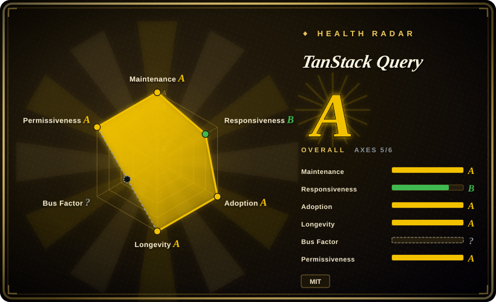
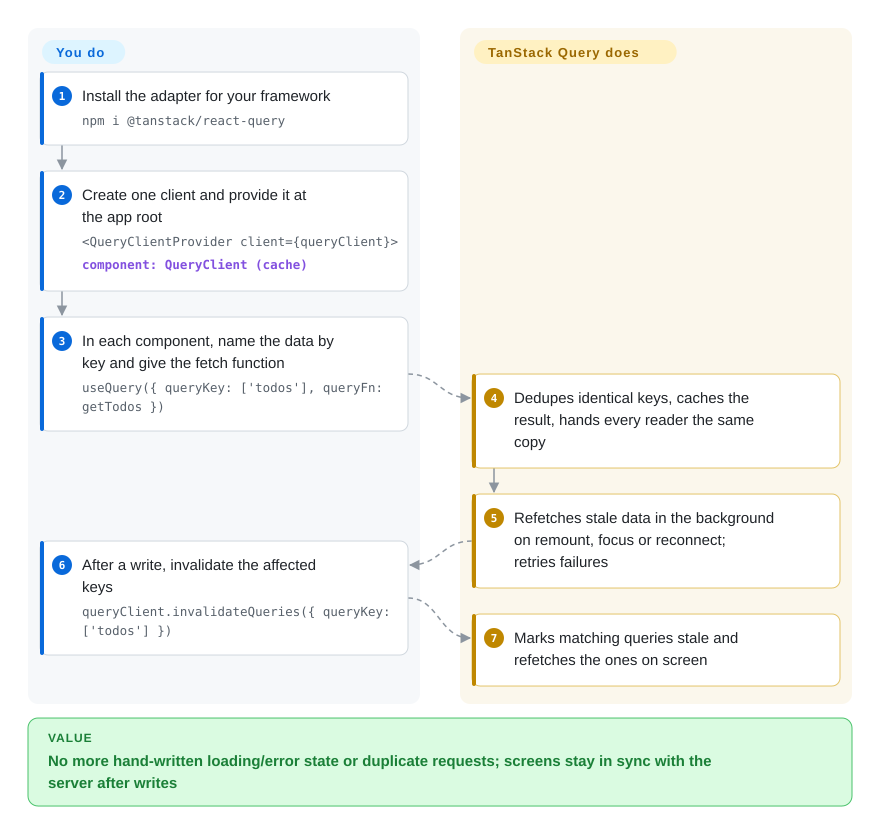

# TanStack Query

Every screen in your front-end app hand-writes the same `useEffect` + `isLoading` + `error` dance, two components fetch the same list twice, and after a save the table still shows the old row until someone reloads. TanStack Query keeps one shared cache of server data keyed by what you asked for, so components read from it, stale entries refetch in the background, and a mutation marks the affected keys dirty.

## When to use

You are a front-end engineer on a React (or Vue, Solid, Svelte, Angular) dashboard that talks to a REST or GraphQL backend you do not control. Your code is full of hooks like `const [todos, setTodos] = useState(); useEffect(() => { fetch('/api/todos').then(...) }, [])`, each with its own loading flag. The sidebar and the main table both load `/api/todos` on mount, so the network tab shows two identical requests; after `POST /api/todos` the sidebar still says "3 items" because nobody told it to reload. You have started building a global store just to hold server responses — reducers, action creators, loading states — and it is becoming the biggest file in the repo.

Reach for TanStack Query here: you declare `useQuery({ queryKey: ['todos'], queryFn: getTodos })` wherever the data is needed, and the library dedupes requests, caches by key, refetches stale data on remount/window focus/reconnect, retries failures, and lets a mutation invalidate `['todos']` so every reader refreshes. You pick it over **SWR** when you want explicit `staleTime`, garbage collection, query cancellation, offline mutations and a framework-agnostic core (SWR is React-only and leaner); over **RTK Query** when you are not already on Redux and want per-component query definitions instead of a central API slice; over **Apollo Client** when your API is not GraphQL-first, or you do not need a normalized entity cache.

## How it works

You put one `QueryClient` — the cache and scheduler — at the root of the app, and then each component names the data it wants with a **query key** (a JSON array like `['todos', { page: 2 }]`) plus a **query function** that returns a promise. The library does everything between those two points: it stores the result under that key, returns the cached copy to every other component asking for the same key, decides when the copy is "stale" (by default immediately — stale data is still shown, just re-fetched in the background on the next mount, window refocus or network reconnect), retries failed requests three times with back-off, and garbage-collects entries nobody has used for five minutes. You still own the network call itself (fetch, axios, a GraphQL client) and you decide what to invalidate after a write: a mutation's `onSuccess` calling `invalidateQueries({ queryKey: ['todos'] })` marks every key starting with `todos` dirty, and the mounted readers refetch. Think of it as a library's lending desk rather than a warehouse: you tell it which book you need and how long a copy counts as fresh, it hands out the shared copy and quietly re-orders a new one when yours expires — but it never writes the book for you. The same core (`@tanstack/query-core`) sits under thin per-framework adapters, so the React hooks, Vue composables, Svelte and Solid bindings share one caching engine.

<!-- flow-steps:begin (generated from flows/tanstack-query.json by tools/flow_card.py — do not edit) -->

Text version of the flow

1. **You**: Install the adapter for your framework — `npm i @tanstack/react-query`
2. **You**: Create one client and provide it at the app root — `<QueryClientProvider client={queryClient}>` — component: `QueryClient (cache)`
3. **You**: In each component, name the data by key and give the fetch function — `useQuery({ queryKey: ['todos'], queryFn: getTodos })`
4. **TanStack Query**: Dedupes identical keys, caches the result, hands every reader the same copy
5. **TanStack Query**: Refetches stale data in the background on remount, focus or reconnect; retries failures
6. **You**: After a write, invalidate the affected keys — `queryClient.invalidateQueries({ queryKey: ['todos'] })`
7. **TanStack Query**: Marks matching queries stale and refetches the ones on screen

**Value**: No more hand-written loading/error state or duplicate requests; screens stay in sync with the server after writes

<!-- flow-steps:end -->

## When NOT to use

- **If your API is GraphQL and many screens show the same entity from different queries, use Apollo Client or Relay instead of TanStack Query, because** TanStack Query caches whole responses by key — its own comparison page marks normalized caching as not supported — so editing a user in one query does not update the same user embedded in another; you invalidate and refetch instead.
- **If you are already on Redux Toolkit, use RTK Query instead, because** it keeps server data in the same store, devtools and middleware you already run; adding TanStack Query alongside means two caches and two mental models for the same app.
- **If you are on Next.js App Router and most data is read once in Server Components, use the framework's own `fetch` caching / Server Component data loading instead, because** TanStack Query cannot revalidate a Server Component — its advanced SSR guide warns that data rendered on the server and refetched on the client drifts out of sync unless you set `staleTime: Infinity`, which defeats the point.
- **If the state is client-only (form drafts, UI toggles, a canvas editor's document), use a client-state store such as Zustand, Redux or the framework's signals instead, because** the docs state explicitly that TanStack Query is a server-state library and "not a replacement for local/client state management".
- **If you only fetch a couple of endpoints once and never revisit them, use plain `fetch` in an effect or your router's loaders (React Router, Remix) instead, because** adding a provider, cache client and devtools buys little when there is nothing to dedupe or keep fresh.
- **If you build on Angular or Lit and need API stability, pin versions or wait before adopting, because** `@tanstack/angular-query-experimental` documents that "breaking changes will happen in minor AND patch releases", and `@tanstack/lit-query` is v0.x and labeled experimental (checked 2026-09-28).
- **If your team does not know the defaults, expect surprise traffic,** because out of the box every query is stale immediately and refetches on window focus, remount and reconnect, and failures retry 3 times silently — a stale-while-revalidate cache that looks like "extra requests" until `staleTime` is tuned.

## Comparison

| Alternative | In index | Our verdict | Tradeoff |
| --- | --- | --- | --- |
| SWR (`vercel/swr`) | not indexed | For a React-only app that wants the smallest stale-while-revalidate hook and little configuration, pick SWR; pick TanStack Query when you need `staleTime`, cache GC, query cancellation, offline mutations or a non-React framework. | SWR is lighter and simpler; you give up per-query stale control, automatic garbage collection and the framework-agnostic core. Not added in this tab-intake batch. |
| RTK Query (`reduxjs/redux-toolkit`) | not indexed | If the app already runs Redux Toolkit, pick RTK Query so server data lives in the same store and devtools; pick TanStack Query when there is no Redux to reuse. | RTK Query gives one store and codegen-friendly central API definitions; you pay Redux as a dependency and define endpoints in a slice rather than at the call site. Not added in this tab-intake batch. |
| Apollo Client (`apollographql/apollo-client`) | not indexed | For a GraphQL-first app where the same entity appears in many queries, pick Apollo for its normalized cache; for REST or mixed backends pick TanStack Query. | Apollo updates entities everywhere after a mutation without manual invalidation; you pay a heavier client, cache-policy configuration and a GraphQL-shaped API. Not added in this tab-intake batch. |
| Relay (`facebook/relay`) | not indexed | Choose Relay only when you control a Relay-compliant GraphQL server and want compiler-enforced fragment colocation; choose TanStack Query for any other API shape. | Relay gives compile-time data-dependency checks and a normalized store; you pay a build-time compiler and strict server conventions. Not added in this tab-intake batch. |
| urql (`urql-graphql/urql`) | not indexed | For a GraphQL app that wants a smaller client than Apollo with optional normalized caching via an exchange, pick urql; pick TanStack Query when the API is not GraphQL. | urql's document cache is simple and its Graphcache exchange adds normalization; it is GraphQL-only, so REST endpoints still need another tool. Not added in this tab-intake batch. |

TanStack Query is one of several TanStack libraries (Router, Table, Form, Store, DB); TanStack Router ships a `react-router-ssr-query` integration package and TanStack DB ships a `query-db-collection` that loads a collection through Query — those are companions, not substitutes.

## Tech stack

- **TypeScript** across the monorepo (pnpm workspaces + Nx), built with `tsdown`, tested with Vitest; the core is type-checked against TypeScript 5.6–5.9 and 7.0 in its own scripts.
- **`@tanstack/query-core`** — framework-agnostic cache (`QueryClient`, `QueryCache`, `MutationCache`, observers), zero runtime dependencies.
- **Framework adapters** — `react-query` (React 18/19), `vue-query` (Vue 2.6/3.3+, via `vue-demi`), `solid-query`, `svelte-query` (Svelte 5, v6 line), `preact-query`, `angular-query-experimental`, `lit-query` (v0.x).
- **Add-ons** — devtools per framework, persisters (sync/async storage, `persistQueryClient`), a broadcast-channel cross-tab sync plugin (experimental), an ESLint plugin, and codemods for major-version migrations.

## Dependencies

- **Runtime:** only the peer framework (e.g. `react ^18 || ^19`, `vue ^2.6 || ^3.3`, `svelte ^5.25`, `@angular/core >=16`). The core ships no runtime dependencies; the Vue adapter additionally pulls `vue-demi` and `@vue/devtools-api`.
- **You bring:** the fetching layer (fetch/axios/graphql-request) — TanStack Query never makes HTTP calls on its own; storage backends for persistence (localStorage, AsyncStorage, IndexedDB via a custom persister) if you want offline cache.
- **No server component, no database, no hosted service.** It is a client-side (and SSR-capable) library installed from npm.

## Ops difficulty

**Low.** There is nothing to deploy or operate — it is an npm dependency in the front-end bundle. The real cost is conceptual and on upgrades:
- Learning the defaults (`staleTime`, `gcTime`, refetch-on-focus, retries) and designing query keys well; bad keys produce either over-fetching or stale screens.
- SSR/hydration needs a per-request `QueryClient`, prefetch + `dehydrate`/`HydrationBoundary`; forgetting a prefetch with `useSuspenseQuery` causes hydration mismatches (per the SSR guide).
- Major versions rename APIs (v4 → v5 renamed `cacheTime` to `gcTime`, among others); codemods exist, but a migration still touches every call site.
- Angular/Lit adapters are experimental and must be version-pinned.

## Health & viability

- **Maintenance (2026-09-28).** Very active: pushes on the verification day, 461 commits between 2026-06-28 and 2026-09-28, package releases multiple times per week (react/vue-query 5.104.0 and svelte-query 6.3.0 on 2026-09-26). v5 has been the major line since 2023-10-17, following v4 (2022-07-18).
- **Governance / bus factor.** Owned by the TanStack GitHub organization; creator Tanner Linsley plus maintainers such as Dominik Dorfmeister (TkDodo, last commit 2026-09-15) and Lachlan Collins. Recent commit volume is concentrated in one contributor (sukvvon authored 84 of the most recent 100 commits, mostly chore/infra work), so day-to-day throughput leans on a few people rather than a foundation. Funding is GitHub Sponsors plus commercial partners listed in the README.
- **Backing & longevity.** Created 2019-09-10 (about 7 years old) and still shipping weekly — a strong Lindy signal for a front-end library, whose field churns fast. It survived the rename from React Query to TanStack Query and multiple React paradigm shifts (Suspense, Server Components), which is the real test in this space.
- **Adoption & ecosystem.** About 77.2M weekly npm downloads for `@tanstack/react-query` and 82.5M for `@tanstack/query-core` (week of 2026-09-21), versus ~19.4M for SWR and ~34.7M for `@reduxjs/toolkit` over the same week; the health scorer counted 236,211,912 `@tanstack/query-core` downloads in its last-month window — the de facto default for React server state. Docs are extensive, and an ESLint plugin encodes best practices.
- **Risk flags.** MIT since the start, no relicense or CLA. A scarf.sh tracking pixel sits in the root and per-package READMEs only; a grep of `packages/` finds no reference to it in any source file. The main technical risk is fit with React Server Components, which the maintainers themselves describe as "still figuring out".

## Caveats (unverified)

- [未验证] Absence of telemetry was checked by grepping the repository source at commit `e878990`, not by inspecting the built tarballs published to npm; a build step could in principle differ.
- [推断] "De facto default for React server state" is inferred from npm weekly downloads relative to SWR / RTK; downloads include CI installs and transitive dependencies (e.g. frameworks that bundle Query), so they overstate direct adoption.
- [推断] The bus-factor reading is inferred from recent commit authorship; it does not capture review load, issue triage or who holds npm publish rights.
- [未验证] The comparison cells for SWR, RTK Query, Apollo, Relay and urql are based on TanStack's own comparison page and general knowledge of those projects, not on reading their repositories in this batch; TanStack's page is authored by an interested party.
- [未验证] Stability of the Svelte adapter's v6 line (version numbers diverge from the 5.x core) was not tested; only its peer range (`svelte ^5.25.0`) was read.
