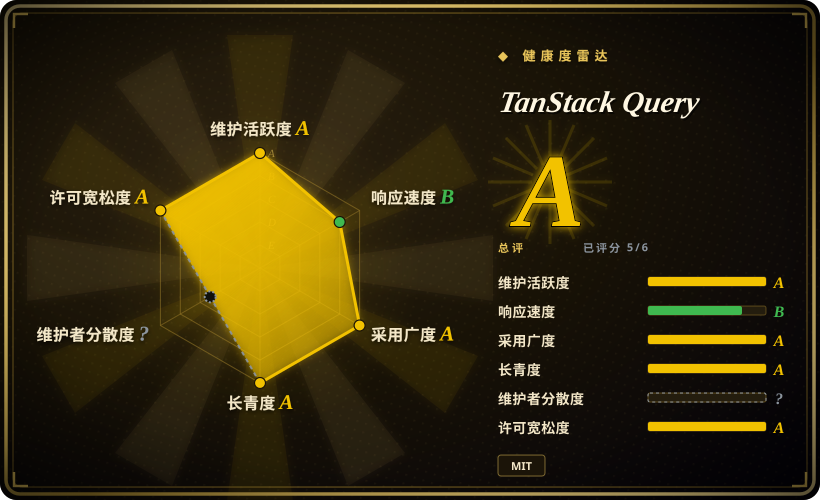
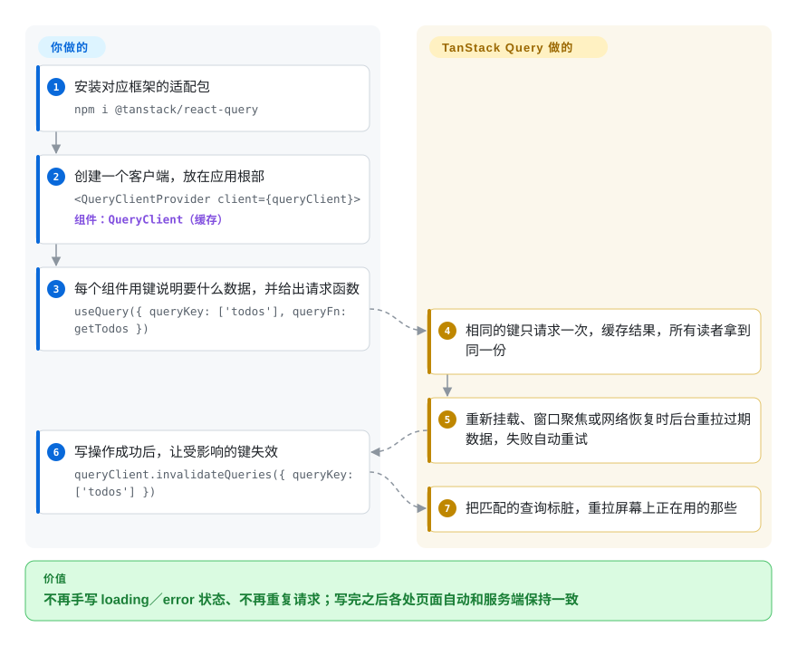

# TanStack Query

前端每个页面都在手写同一套 `useEffect` 加 `isLoading` 加 `error`，侧边栏和主表格各自把同一个列表拉一遍，保存之后表格里还是旧数据，非得刷新页面才对。TanStack Query 把服务端数据放进一份按“你要的是什么”编号的共享缓存：组件都从这里读，过期的在后台自动重拉，写操作之后把受影响的编号标脏。

## 何时使用

你是前端工程师，在做一个 React（或 Vue、Solid、Svelte、Angular）后台，后端是别人维护的 REST 或 GraphQL 接口。代码里到处是 `const [todos, setTodos] = useState(); useEffect(() => { fetch('/api/todos').then(...) }, [])` 这样的片段，每个都自带一个 loading 标志。侧边栏和主表格挂载时都去请求 `/api/todos`，网络面板里躺着两条一模一样的请求；`POST /api/todos` 之后，侧边栏还显示“3 项”，因为没人通知它重新加载。你已经开始搭一个全局 store 专门存接口返回值——reducer、action creator、各种 loading 状态——它眼看要成为仓库里最大的文件。

这时就该想到 TanStack Query：在需要数据的地方写 `useQuery({ queryKey: ['todos'], queryFn: getTodos })`，库负责请求去重、按 key 缓存、在重新挂载／窗口重新聚焦／网络恢复时刷新过期数据、失败自动重试，写操作之后让 `['todos']` 失效，所有读它的组件一起刷新。和 **SWR** 比，你要的是显式 `staleTime`、缓存回收、请求取消、离线写操作和一个不绑定框架的内核时选它（SWR 只支持 React，更轻）；和 **RTK Query** 比，你没在用 Redux、想在组件里就地定义查询而不是集中写一个 API slice 时选它；和 **Apollo Client** 比，你的接口不是以 GraphQL 为主，或者用不上按实体归一化的缓存时选它。

## 怎么用起来

你在应用根部放一个 `QueryClient`——缓存加调度器——然后每个组件用一个**查询键**（像 `['todos', { page: 2 }]` 这样的 JSON 数组）加一个返回 Promise 的**查询函数**，说明自己要什么数据。两者之间的事都由库包办：把结果存在这个键下，别的组件要同一个键时直接给缓存里那份；判断这份数据什么时候算“过期”（默认立刻过期——过期数据照样显示，只是在下次挂载、窗口重新聚焦或网络恢复时在后台重拉）；失败的请求按指数退避重试 3 次；5 分钟没人用的缓存条目自动回收。发请求本身仍由你负责（fetch、axios、某个 GraphQL 客户端），写操作之后让哪些数据失效也由你决定：在写操作（mutation）的 `onSuccess` 里调用 `invalidateQueries({ queryKey: ['todos'] })`，所有以 `todos` 开头的键都被标脏，正在显示它们的组件随即重拉。可以把它想成图书馆的借阅台而不是仓库：你告诉它要哪本书、多久以内的副本算新，它把共享的那本递给你，到期了悄悄再订一本——但书永远不会替你写。同一个内核（`@tanstack/query-core`）下面挂着很薄的各框架适配层，所以 React 的 hooks、Vue 的 composables、Svelte 和 Solid 的绑定共用一套缓存引擎。

<!-- flow-steps:begin (generated from flows/tanstack-query.json by tools/flow_card.py — do not edit) -->

流程文字版

1. **你**：安装对应框架的适配包 — `npm i @tanstack/react-query`
2. **你**：创建一个客户端，放在应用根部 — `<QueryClientProvider client={queryClient}>` — 组件：`QueryClient（缓存）`
3. **你**：每个组件用键说明要什么数据，并给出请求函数 — `useQuery({ queryKey: ['todos'], queryFn: getTodos })`
4. **TanStack Query**：相同的键只请求一次，缓存结果，所有读者拿到同一份
5. **TanStack Query**：重新挂载、窗口聚焦或网络恢复时后台重拉过期数据，失败自动重试
6. **你**：写操作成功后，让受影响的键失效 — `queryClient.invalidateQueries({ queryKey: ['todos'] })`
7. **TanStack Query**：把匹配的查询标脏，重拉屏幕上正在用的那些

**价值**：不再手写 loading／error 状态、不再重复请求；写完之后各处页面自动和服务端保持一致

<!-- flow-steps:end -->

## 何时不用

- **如果你的接口是 GraphQL，而且同一个实体会在多个查询里出现，用 Apollo Client 或 Relay，别用 TanStack Query，因为**它按键缓存整份响应——官方对比页自己把归一化缓存标为不支持——在一个查询里改了某个用户，另一个查询里嵌着的同一个用户不会跟着变，只能靠失效再重拉。
- **如果你已经在用 Redux Toolkit，用 RTK Query，因为**服务端数据能放进你现有的同一个 store、同一套 devtools 和中间件；再加一个 TanStack Query 就是一个应用里两份缓存、两套心智模型。
- **如果你在 Next.js App Router 上、大部分数据只在 Server Components 里读一次，用框架自带的 `fetch` 缓存和服务端组件取数，因为** TanStack Query 没法让服务端组件重新渲染——它的高级 SSR 指南明说：服务端渲染出来、客户端又重拉的数据会对不上，除非设 `staleTime: Infinity`，而那样用它就没意义了。
- **如果状态只存在于客户端（表单草稿、界面开关、画布编辑器的文档），用 Zustand、Redux 或框架自带的 signals 这类客户端状态库，因为**官方文档明说 TanStack Query 是服务端状态库，“不能替代本地／客户端状态管理”。
- **如果你只请求一两个接口、拉一次就不再回头，直接在 effect 里用 `fetch`，或用路由的 loader（React Router、Remix），因为**没有需要去重、需要保鲜的数据时，额外引入 Provider、缓存客户端和 devtools 得不到什么。
- **如果你基于 Angular 或 Lit、又需要 API 稳定，先锁版本或再等等，因为** `@tanstack/angular-query-experimental` 的文档写着“minor 和 patch 版本都会有破坏性变更”，`@tanstack/lit-query` 还是 v0.x、标注为实验性（2026-09-28 核对）。
- **如果团队不了解它的默认行为，准备好看到意外的流量，因为**开箱即用时每个查询一拿到就算过期，窗口聚焦、重新挂载、网络恢复都会重拉，失败还会静默重试 3 次——这是“先显示旧的、后台再刷新”的缓存策略，在调好 `staleTime` 之前看起来就像“多发了很多请求”。

## 横向对比

| 替代品 | 是否收录 | 我们的评价 | 取舍 |
| --- | --- | --- | --- |
| SWR（`vercel/swr`） | 未收录 | 纯 React 应用、只想要最小的“先旧后新”数据 hook、不想配置太多时选 SWR；需要 `staleTime`、缓存回收、请求取消、离线写操作或非 React 框架时选 TanStack Query。 | SWR 更轻更简单；代价是没有按查询设置过期时间、没有自动回收、没有框架无关的内核。本批次（tab-intake）未收录。 |
| RTK Query（`reduxjs/redux-toolkit`） | 未收录 | 应用已经跑着 Redux Toolkit 时选 RTK Query，让服务端数据进同一个 store 和 devtools；没有 Redux 可复用时选 TanStack Query。 | RTK Query 换来单一 store 和便于代码生成的集中式接口定义；代价是必须引入 Redux，接口要在 slice 里定义而不是在调用处。本批次（tab-intake）未收录。 |
| Apollo Client（`apollographql/apollo-client`） | 未收录 | 以 GraphQL 为主、同一实体出现在许多查询里的应用选 Apollo，用它的归一化缓存；REST 或混合后端选 TanStack Query。 | Apollo 写操作后能自动更新所有地方的同一实体，不用手动失效；代价是客户端更重、要配置缓存策略、API 是 GraphQL 形状。本批次（tab-intake）未收录。 |
| Relay（`facebook/relay`） | 未收录 | 只有当你掌控一个符合 Relay 规范的 GraphQL 服务端、想要编译器强制的 fragment 就近声明时才选 Relay；其他形态的接口都选 TanStack Query。 | Relay 提供编译期数据依赖检查和归一化 store；代价是构建期编译器和严格的服务端约定。本批次（tab-intake）未收录。 |
| urql（`urql-graphql/urql`） | 未收录 | GraphQL 应用想要比 Apollo 更小的客户端、需要时再通过 exchange 加归一化缓存，选 urql；接口不是 GraphQL 时选 TanStack Query。 | urql 的文档缓存简单，Graphcache exchange 可加归一化；但它只管 GraphQL，REST 接口还得另找工具。本批次（tab-intake）未收录。 |

TanStack Query 是 TanStack 系列（Router、Table、Form、Store、DB）中的一个；TanStack Router 提供 `react-router-ssr-query` 集成包，TanStack DB 提供通过 Query 加载数据的 `query-db-collection`——它们是搭档，不是替代品。

## 技术栈

- **TypeScript** 贯穿整个 monorepo（pnpm workspaces 加 Nx），用 `tsdown` 构建、Vitest 测试；内核自己的脚本会针对 TypeScript 5.6–5.9 和 7.0 做类型检查。
- **`@tanstack/query-core`**——与框架无关的缓存（`QueryClient`、`QueryCache`、`MutationCache`、observers），零运行时依赖。
- **框架适配层**——`react-query`（React 18／19）、`vue-query`（Vue 2.6／3.3+，经 `vue-demi`）、`solid-query`、`svelte-query`（Svelte 5，v6 线）、`preact-query`、`angular-query-experimental`、`lit-query`（v0.x）。
- **附加包**——各框架的 devtools、持久化器（同步／异步存储、`persistQueryClient`）、基于 BroadcastChannel 的跨标签页同步插件（实验性）、ESLint 插件，以及大版本迁移用的 codemods。

## 依赖

- **运行时**：只有对应框架这一个 peer 依赖（如 `react ^18 || ^19`、`vue ^2.6 || ^3.3`、`svelte ^5.25`、`@angular/core >=16`）。内核没有运行时依赖；Vue 适配层额外引入 `vue-demi` 和 `@vue/devtools-api`。
- **你自己提供**：请求层（fetch／axios／graphql-request）——TanStack Query 自己从不发 HTTP 请求；要离线缓存的话，还要提供持久化存储（localStorage、AsyncStorage，或通过自定义持久化器接 IndexedDB）。
- **没有服务端组件、没有数据库、没有托管服务。**它就是一个从 npm 安装、跑在客户端（也支持 SSR）的库。

## 运维难度

**低。**没有任何要部署或运维的东西——它只是前端打包里的一个 npm 依赖。真正的成本在理解和升级上：
- 要吃透默认行为（`staleTime`、`gcTime`、聚焦重拉、重试）并设计好查询键；键设计得不好，要么重复请求，要么页面数据过期。
- SSR／水合需要每个请求一个 `QueryClient`、预取加 `dehydrate`／`HydrationBoundary`；用 `useSuspenseQuery` 时忘了预取会导致水合不一致（SSR 指南原话）。
- 大版本会改 API（v4 升 v5 把 `cacheTime` 改名为 `gcTime` 等）；有 codemods，但迁移仍要动到每个调用点。
- Angular／Lit 适配层是实验性的，必须锁版本。

## 健康度与可持续性

- **维护（2026-09-28）。**非常活跃：核对当天仍有推送，2026-06-28 到 2026-09-28 共 461 个提交，各包每周发布多次（2026-09-26 发了 react／vue-query 5.104.0 和 svelte-query 6.3.0）。v5 自 2023-10-17 起是主线，前一个大版本 v4 发布于 2022-07-18。
- **治理／巴士因子。**归属 TanStack GitHub 组织；作者 Tanner Linsley，维护者还有 Dominik Dorfmeister（TkDodo，最近一次提交 2026-09-15）和 Lachlan Collins 等。近期提交高度集中在一个人身上（最近 100 个提交里 sukvvon 占 84 个，多为 chore／基础设施类），日常产出靠少数几个人，而不是基金会。资金来自 GitHub Sponsors 和 README 里列出的商业合作方。
- **背书与寿命。**创建于 2019-09-10（约 7 年），至今每周发版——对一个变化极快的前端库来说，这是很强的 Lindy 信号。它经历了从 React Query 到 TanStack Query 的改名，也扛过了 React 几次范式转变（Suspense、Server Components），这才是这个领域真正的考验。
- **采用与生态。** `@tanstack/react-query` 周下载约 7720 万次、`@tanstack/query-core` 约 8250 万次（2026-09-21 那一周），同期 SWR 约 1940 万、`@reduxjs/toolkit` 约 3470 万；健康度评分器统计的 `@tanstack/query-core` 近一个月下载量为 236,211,912 次——React 服务端状态的事实默认选项。文档详尽，还有 ESLint 插件把最佳实践写成规则。
- **风险信号。**从一开始就是 MIT，没有改许可证，也没有 CLA。scarf.sh 追踪像素只出现在根目录和各包的 README 里；在 `packages/` 里 grep，找不到任何源码引用它。主要技术风险是和 React Server Components 的配合，维护者自己也说“还在摸索”。

## 存疑（未验证）

- [未验证] 没有遥测这一点，是在提交 `e878990` 上 grep 仓库源码确认的，没有检查发布到 npm 的构建产物；构建步骤理论上可能不同。
- [推断] “React 服务端状态的事实默认选项”是根据 npm 周下载量相对 SWR／RTK 推出来的；下载量包含 CI 安装和间接依赖（比如内置 Query 的框架），会高估直接采用。
- [推断] 巴士因子的判断来自近期提交的作者分布，没有覆盖代码审查负担、issue 分诊以及谁持有 npm 发布权限。
- [未验证] SWR、RTK Query、Apollo、Relay、urql 各行的判断基于 TanStack 自家的对比页和对这些项目的一般了解，本批次没有去读它们的仓库；TanStack 的对比页出自利益相关方。
- [未验证] Svelte 适配层 v6 线（版本号已和 5.x 内核分叉）的稳定性没有实测，只读了它的 peer 范围（`svelte ^5.25.0`）。
