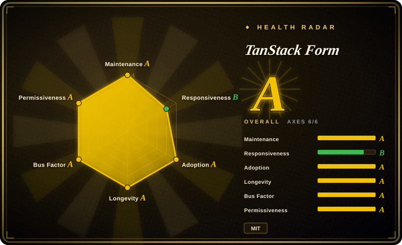
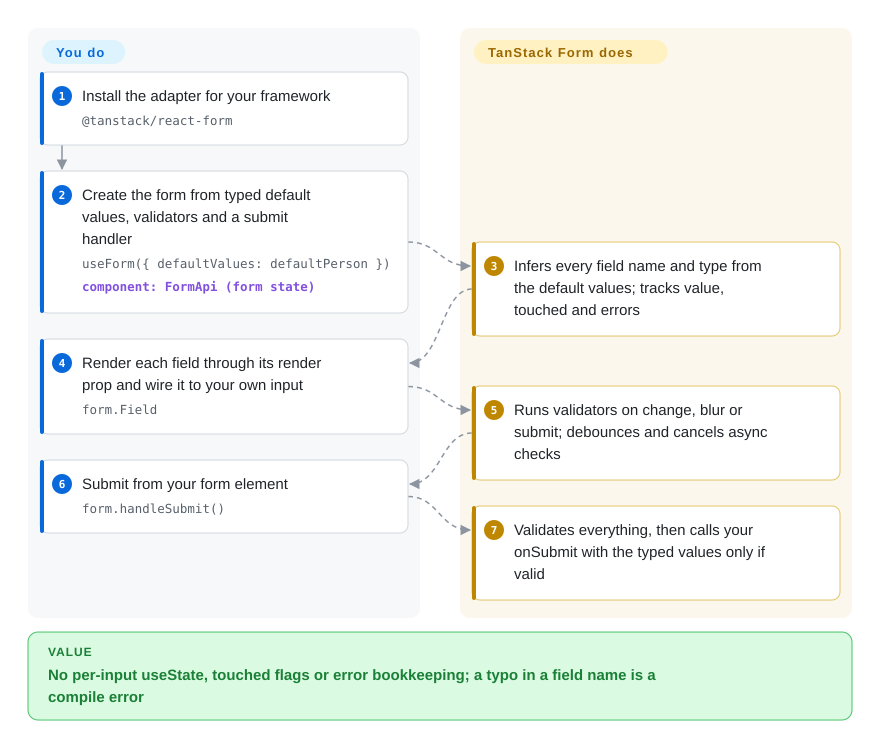

# TanStack Form

Your sign-up form has fifteen `useState` calls, a `touched` object you keep forgetting to update, an async "is this username taken?" check that fires on every keystroke, and a rename of `email` to `emailAddress` that silently broke the error message because the field name was a string. TanStack Form holds the whole form's values, touched flags and errors in one typed object inferred from your default values, runs your validators at the moments you choose (with async checks debounced for you), and makes a misspelled field name a compile error — while you keep rendering your own inputs.

## When to use

You are a front-end engineer building a settings or checkout flow in React (or Vue, Angular, Solid, Svelte, Lit) where forms are the product: nested addresses, a dynamic list of line items, a field whose validity depends on another field, a server check for "coupon already used" that must not hammer the API on every keystroke, and a design system your team wants every form to use the same way. Today each form re-invents the state: `const [errors, setErrors] = useState({})`, `onBlur={() => setTouched({...touched, email: true})}`, and a `fetch` inside `onChange` you debounce by hand; in TypeScript, `errors['adress']` compiles fine and simply never shows.

Reach for TanStack Form here: `useForm({ defaultValues, validators, onSubmit })` infers the form's type from the defaults, `form.Field name="age"` rejects a wrong name at compile time, validators run on change / blur / submit / mount at field or form level (functions or any Standard Schema library — Zod, Valibot, ArkType), async ones get `asyncDebounceMs` and cancellation, and `createFormHook` pre-binds your design-system inputs so every form looks the same. You pick it over **React Hook Form** when you need the same form model across more than one framework, want controlled state you can read and test at any moment (including React Native or custom renderers), or want the SSR integrations for TanStack Start / Next.js / Remix; over **Formik** because Formik's last release was 2025-11 and it is React-only; over **Final Form** because TanStack's types are inferred from values rather than supplied as generics.

## How it works

You create one form object — a `FormApi`, the store that holds every field's value plus its metadata (touched, dirty, errors, whether validation is running) — from plain `defaultValues`, and TypeScript derives the shape of the whole form from those values, so you never write `useForm<MyForm>()`. Each input is rendered through `form.Field` (or `form.AppField`), a render prop that hands you a `field` object with its current value and `handleChange` / `handleBlur` functions; you decide which HTML element, UI-kit component or React Native widget to draw — the library ships no inputs at all ("headless"). Validators are functions or schemas you attach to a field or the whole form under the moment they run (`onChange`, `onBlur`, `onSubmit`, `onMount`, plus `…Async` variants); the library runs them, debounces and cancels the async ones, and routes the messages into `field.state.meta.errors`. It is controlled rather than DOM-driven: the form object, not the input element, is the source of truth, like a clerk keeping the one master copy of a paper form while every counter window only shows and edits its own box. The same core (`@tanstack/form-core`, built on TanStack Store) sits under thin adapters for each framework, and `createFormHook` lets you pre-register your own field components once so every form in the app reuses them.

<!-- flow-steps:begin (generated from flows/tanstack-form.json by tools/flow_card.py — do not edit) -->

Text version of the flow

1. **You**: Install the adapter for your framework — `@tanstack/react-form`
2. **You**: Create the form from typed default values, validators and a submit handler — `useForm({ defaultValues: defaultPerson })` — component: `FormApi (form state)`
3. **TanStack Form**: Infers every field name and type from the default values; tracks value, touched and errors
4. **You**: Render each field through its render prop and wire it to your own input — `form.Field`
5. **TanStack Form**: Runs validators on change, blur or submit; debounces and cancels async checks
6. **You**: Submit from your form element — `form.handleSubmit()`
7. **TanStack Form**: Validates everything, then calls your onSubmit with the typed values only if valid

**Value**: No per-input useState, touched flags or error bookkeeping; a typo in a field name is a compile error

<!-- flow-steps:end -->

## When NOT to use

- **If you are starting a React form today and cannot absorb a near-term breaking upgrade, use React Hook Form, or pin TanStack Form v1 and budget the migration, because** v2 is in alpha (2.0.0-alpha.2, 2026-08-21) and its migration guide changes the everyday API: validators become arrays of `{ run, triggers }` objects, `field.state.value` becomes `field.value`, `withForm` and `withFieldGroup` are replaced, and the packages drop CommonJS and React 17.
- **If most of your forms are a handful of plain inputs, use React Hook Form (or the platform's own `<form>` plus a schema check) instead, because** TanStack Form is controlled and render-prop based — each field is a component subscribed to state — and its own quick start says it "values scalability and long-term developer experience over short and sharable code snippets"; React Hook Form's uncontrolled, ref-registered inputs are less code for small forms and have a far larger pool of examples (about 66.5M weekly npm downloads vs 3.7M, week of 2026-09-21).
- **If your forms must work before JavaScript loads and submit through server actions with progressive enhancement, use Conform instead, because** Conform is built around native form submission and server-side validation in Remix / Next.js; TanStack Form's Start / Next.js / Remix adapters share validation between client and server, but the form itself is still a client-state object.
- **If you are on Vue only, weigh VeeValidate before adopting, because** it is Vue-native with a large installed base (about 1.3M weekly downloads) and does not require the Vue 3.6 minimum that TanStack Form v2's Vue adapter documents — a version that, per that same migration guide, was still a release candidate when it was written.
- **If other code reaches into the form's internal store, pin exact versions or stick to documented hooks, because** a minor release (1.29.1) changed `form.store.subscribe`'s signature when the underlying TanStack Store moved to 0.9; the maintainers answered that only `useStore` was ever documented (issue #2146), and v2 replaces `form.store` with `form.atom` anyway.
- **If you pass a form instance through props in your own component tree, plan on the library's composition helpers instead of hand-written types, because** `FormApi` / `FormState` carry about a dozen generic parameters (users hit `useForm` requiring 9 generics in 0.43, issue #1175); v1's answer is `withForm`, v2's is `ReactFormType<typeof formOpts>`, and hand-typing either is painful.
- **If you use the Lit adapter, expect it to trail, because** `@tanstack/lit-form`'s latest stable is 1.25.5 while the other adapters are on 1.33.5 (npm dist-tags, checked 2026-09-28).

## Comparison

| Alternative | In index | Our verdict | Tradeoff |
| --- | --- | --- | --- |
| React Hook Form (`react-hook-form/react-hook-form`) | not indexed | For a React (or React Native) app whose forms are many and mostly simple, pick React Hook Form; pick TanStack Form when you need the same form model in another framework, fully inferred deep-field types without casts, or controlled state you can read at any time. | React Hook Form gives the smallest amount of code per form, uncontrolled inputs with few re-renders and by far the largest ecosystem; you give up framework portability and TanStack's SSR adapters. Not added in this tab-intake batch. |
| Formik (`jaredpalmer/formik`) | not indexed | Keep Formik only where it already runs and works; for new React forms choose TanStack Form or React Hook Form, because Formik's last stable release is 2.4.9 (2025-11-10) and its 3.0 line has not moved past `3.0.0-next.8` (2020-12-02). | Formik's API is familiar and heavily documented; you pay a React-only, slow-moving project with no first-class async debounce. Not added in this tab-intake batch. |
| Final Form (`final-form/final-form`) | not indexed | If you want a small framework-agnostic subscription-based form engine and are happy to supply types yourself, Final Form fits; choose TanStack Form when deep-field type inference and schema validators out of the box matter more. | Final Form is lean and long-lived with granular subscriptions; per TanStack's own comparison page it lacks fully inferred deep-field TypeScript, and its GitHub license field reads NOASSERTION. Not added in this tab-intake batch. |
| Conform (`edmundhung/conform`) | not indexed | For Remix / Next.js server-action forms that must submit without JavaScript, pick Conform; pick TanStack Form when the form is a rich client-side interaction across frameworks. | Conform gets progressive enhancement and server-side validation as the default path; it is tied to the native-form model and has a smaller community. Not added in this tab-intake batch. |
| VeeValidate (`logaretm/vee-validate`) | not indexed | For a Vue-only codebase, pick VeeValidate for its Vue-native API and larger Vue user base; pick TanStack Form when Vue is one of several frameworks sharing one form model. | VeeValidate fits Vue idioms directly and has no Vue 3.6 requirement; you give up the cross-framework core and the TanStack Start integration. Not added in this tab-intake batch. |

TanStack Form is one of several TanStack libraries: it is built on TanStack Store, its devtools plug into TanStack Devtools, and it has a dedicated TanStack Start adapter. A mutation from [TanStack Query](../data-fetching/tanstack-query.md) is a common submit handler — they are companions, not substitutes.

## Tech stack

- **TypeScript** monorepo (pnpm workspaces + Nx, Vite/Vitest), type-checked against TypeScript 5.4–5.9 in its own scripts.
- **`@tanstack/form-core`** — framework-agnostic `FormApi` / `FieldApi`, built on `@tanstack/store` (reactive state), `@tanstack/pacer-lite` (debouncing) and `@tanstack/devtools-event-client`.
- **Framework adapters** — `react-form`, `vue-form`, `angular-form`, `solid-form`, `svelte-form`, `lit-form`, `preact-form`; meta-framework adapters `react-form-start`, `react-form-nextjs`, `react-form-remix`; devtools packages for React and Solid.
- **Validation** — plain functions or any Standard Schema implementation (Zod, Valibot, ArkType, Effect/Schema are named in the docs; the library itself does not bundle one).

## Dependencies

- **Runtime:** the peer framework (React adapter v1: `react ^17 || ^18 || ^19`) plus three small TanStack packages pulled in by the core (Store, Pacer Lite, devtools event client). No server, no database, no hosted service.
- **You bring:** your input components or UI kit (it renders none), a schema library if you want schema validation, and your own submit call (fetch, a server function, a TanStack Query mutation).
- **v2 (alpha) raises the floor:** ESM only, Node.js 18+, React 18+, and Vue 3.6+ for the Vue adapter.

## Ops difficulty

**Low.** It is an npm dependency with nothing to deploy. The real costs are conceptual and on upgrades:
- Learning the render-prop field API, validator timing (`onChange` vs `onBlur` vs `onSubmit`, sync-before-async) and the `createFormHook` / composition pattern the docs recommend for larger apps.
- The v1 → v2 migration touches every field render and every validator definition; codemods were not found in the alpha branch.
- Typing a form across component boundaries must go through the provided helpers, not hand-written generics.
- Pin versions if you touch anything beyond documented hooks — a minor release has already broken undocumented store access.

## Health & viability

- **Maintenance (2026-09-28).** Active: pushed 2026-09-27, 45 commits between 2026-06-28 and 2026-09-28, stable 1.33.x patch releases through 2026-08-11 and three v2 alphas since 2026-08-10. v1.0.0 shipped 2025-03-02 after two years of 0.x.
- **Governance / bus factor.** Owned by the TanStack GitHub organization; creator Tanner Linsley plus maintainers Corbin Crutchley (crutchcorn, the most active human committer in the last 100 commits), Leonardo Montini (Balastrong), Lachlan Collins and others. A small core team, not a foundation; funded by GitHub Sponsors and commercial partners listed in the README (CodeRabbit, Cloudflare).
- **Backing & longevity.** The repository dates from 2016-11-29, but that is the old `react-form` project — the current framework-agnostic library began on npm in 2023-04 and has been stable for about 18 months. Treat the Lindy prior as TanStack's (Query, Table have run 7+ years) rather than this API's: the form API itself is young and about to change again in v2.
- **Adoption & ecosystem.** About 3.7M weekly downloads for `@tanstack/react-form` and 4.0M for `@tanstack/form-core` (week of 2026-09-21), and the health scorer counted 11,084,626 `@tanstack/form-core` downloads in its last-month window — a distant second to React Hook Form (≈66.5M weekly) and still below Formik (≈5.3M weekly) in raw volume, though its latest week ran above its monthly average. Docs cover React, Vue, Angular, Solid, Svelte and Lit, with a React Native guide.
- **Risk flags.** MIT, no CLA or relicense history found. The main risk is API churn: a minor release broke undocumented store access, and v2 rewrites the validator and composition APIs. Performance reports on very large forms (O(n²) store updates on validate-all, #1786; slow nested fields, #1805) were closed in 2025, indicating responsiveness but also that big forms were a weak spot.

## Caveats (unverified)

- [推断] "Distant second to React Hook Form " and the growth reading are inferred from npm download counts only (the growth reading compares the last week with the last-month total); downloads include CI and transitive installs and say nothing about satisfaction or production-critical usage.
- [未验证] The v2 API changes are taken from `docs/migrate-from-v1.md` on the `alpha` branch; alpha APIs may change again before v2 is stable, and no v2 stable release date was found.
- [未验证] That the 2025 large-form performance fixes (#1786, #1805) hold for your form size was not benchmarked; only the issue states were read.
- [未验证] The comparison cells for React Hook Form, Final Form, Conform and VeeValidate rest on their GitHub metadata, npm downloads and TanStack's own comparison page (which itself says it is "still not completely accurate"), not on reading their repositories in this batch.
- [推断] The claim that no codemods exist for v1 → v2 comes from not finding any in the alpha branch file tree; they may be published separately later.
