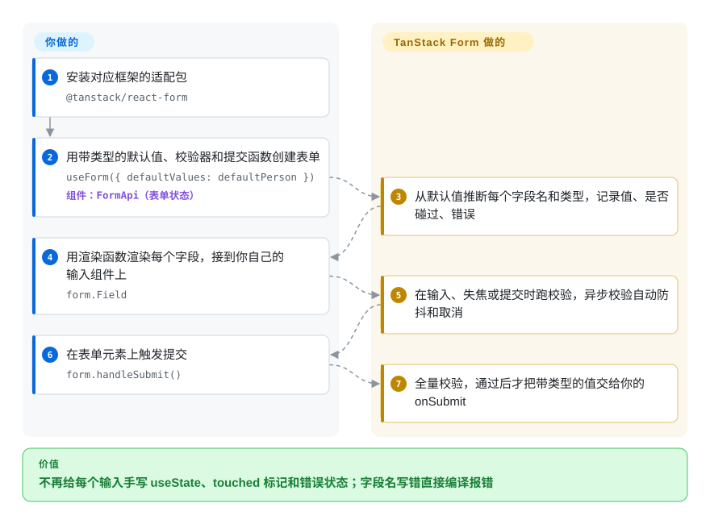

# TanStack Form

一个注册表单里写了十五个 `useState`，一个总忘了更新的 `touched` 对象，一个“用户名是否已被占用”的异步检查每敲一个字就打一次接口；把 `email` 改名成 `emailAddress` 之后错误提示悄悄不显示了，因为字段名只是个字符串。TanStack Form 把整张表单的值、是否碰过、错误都放进一个从默认值推断出类型的对象里，在你指定的时机跑校验（异步校验自动防抖），字段名写错直接编译报错——输入框还是你自己画。

## 何时使用

你是前端工程师，在 React（或 Vue、Angular、Solid、Svelte、Lit）里做设置页或结算流程，表单就是产品本身：嵌套的地址、可增删的商品行、一个字段合不合法取决于另一个字段、“优惠券已被使用”要问服务端但不能每敲一个字就请求一次，团队还希望所有表单都用同一套设计系统组件。现状是每张表单各写一遍状态：`const [errors, setErrors] = useState({})`、`onBlur={() => setTouched({...touched, email: true})}`、`onChange` 里手动防抖的 `fetch`；在 TypeScript 里写成 `errors['adress']` 照样编译通过，只是错误永远显示不出来。

这时用 TanStack Form：`useForm({ defaultValues, validators, onSubmit })` 从默认值推断整张表单的类型，`form.Field name="age"` 把写错的字段名挡在编译期；校验可以挂在字段或整张表单上，在输入、失焦、提交、挂载时运行，写成函数或任何 Standard Schema 库（Zod、Valibot、ArkType）都行，异步校验有 `asyncDebounceMs` 和自动取消；`createFormHook` 把设计系统的输入组件预先绑定好，全应用的表单写法一致。选它而不选 **React Hook Form**，是因为你要在不止一个框架里用同一套表单模型、想要随时可读可测的受控状态（包括 React Native 或自定义渲染器），或者需要 TanStack Start／Next.js／Remix 的 SSR 集成；不选 **Formik**，是因为 Formik 最近一次发布在 2025-11 且只支持 React；不选 **Final Form**，是因为 TanStack 的类型从值推断出来，不用自己传泛型。

## 怎么用起来

你用普通的 `defaultValues` 创建一个表单对象——`FormApi`，它保存每个字段的值和元信息（是否碰过、是否改过、错误、校验是否在跑）——TypeScript 从这些值推出整张表单的形状，所以你从来不写 `useForm<MyForm>()`。每个输入通过 `form.Field`（或 `form.AppField`）渲染：这是一个渲染函数，交给你一个 `field` 对象，里面有当前值和 `handleChange`／`handleBlur`；画成 HTML 元素、UI 组件库的组件还是 React Native 控件，由你决定——库本身一个输入组件都不带（这就是“无头”）。校验器是挂在字段或整张表单上的函数或 schema，按运行时机命名（`onChange`、`onBlur`、`onSubmit`、`onMount`，外加 `…Async` 版本）；库负责运行它们、给异步校验防抖和取消，并把错误信息放进 `field.state.meta.errors`。它是“受控”的而不是靠 DOM：真正的数据在表单对象里，不在输入框里，好比办事大厅只有一份总表由一个办事员保管，每个窗口只负责显示和修改自己那一格。同一个内核（`@tanstack/form-core`，基于 TanStack Store）之上是各框架的薄适配层；`createFormHook` 让你把自己的字段组件注册一次，全应用复用。

<!-- flow-steps:begin (generated from flows/tanstack-form.json by tools/flow_card.py — do not edit) -->

流程文字版

1. **你**：安装对应框架的适配包 — `@tanstack/react-form`
2. **你**：用带类型的默认值、校验器和提交函数创建表单 — `useForm({ defaultValues: defaultPerson })` — 组件：`FormApi（表单状态）`
3. **TanStack Form**：从默认值推断每个字段名和类型，记录值、是否碰过、错误
4. **你**：用渲染函数渲染每个字段，接到你自己的输入组件上 — `form.Field`
5. **TanStack Form**：在输入、失焦或提交时跑校验，异步校验自动防抖和取消
6. **你**：在表单元素上触发提交 — `form.handleSubmit()`
7. **TanStack Form**：全量校验，通过后才把带类型的值交给你的 onSubmit

**价值**：不再给每个输入手写 useState、touched 标记和错误状态；字段名写错直接编译报错

<!-- flow-steps:end -->

## 何时不用

- **如果你今天开始写 React 表单，又承受不起近期一次破坏性升级，用 React Hook Form，或者锁定 TanStack Form v1 并预留迁移工作量，因为** v2 正在 alpha（2.0.0-alpha.2，2026-08-21），迁移指南改的是日常 API：校验器变成 `{ run, triggers }` 对象数组，`field.state.value` 变成 `field.value`，`withForm` 和 `withFieldGroup` 被替换，包也不再提供 CommonJS、不再支持 React 17。
- **如果你的表单大多只有几个普通输入框，用 React Hook Form（或者原生 `<form>` 加一次 schema 校验），因为** TanStack Form 是受控、基于渲染函数的——每个字段都是订阅状态的组件——它自己的快速上手也说它“把可扩展性和长期开发体验放在简短、便于分享的代码片段之前”；React Hook Form 用非受控、通过 ref 注册的输入，小表单代码更少，能找到的示例也多得多（2026-09-21 那一周 npm 周下载约 6650 万，对比 370 万）。
- **如果表单必须在 JavaScript 加载前就能用、通过 server action 提交并渐进增强，用 Conform，因为** Conform 围绕原生表单提交和 Remix／Next.js 的服务端校验设计；TanStack Form 的 Start／Next.js／Remix 适配器能让客户端和服务端共用校验，但表单本身仍是一个客户端状态对象。
- **如果你只用 Vue，先评估 VeeValidate，因为** 它是 Vue 原生写法、用户基数大（周下载约 130 万），也不需要 TanStack Form v2 的 Vue 适配器写明的 Vue 3.6 最低版本——按那份迁移指南自己的说法，写作时 Vue 3.6 还只是候选版本。
- **如果别的代码会直接碰表单内部的 store，锁定精确版本或只用文档里的 hook，因为** 一个小版本（1.29.1）在底层 TanStack Store 升到 0.9 时改了 `form.store.subscribe` 的签名；维护者的回复是只有 `useStore` 是写进文档的用法（issue #2146），而 v2 反正会把 `form.store` 换成 `form.atom`。
- **如果你要在自己的组件树里通过 props 传表单实例，用库提供的组合工具，别手写类型，因为** `FormApi`／`FormState` 带着十来个泛型参数（0.43 时用户就遇到 `useForm` 要 9 个泛型，issue #1175）；v1 的办法是 `withForm`，v2 是 `ReactFormType<typeof formOpts>`，手写哪个都很痛苦。
- **如果你用 Lit 适配器，预期它会落后，因为** `@tanstack/lit-form` 最新稳定版是 1.25.5，其他适配器已经是 1.33.5（npm dist-tags，2026-09-28 查）。

## 横向对比

| 替代品 | 是否收录 | 我们的评价 | 取舍 |
| --- | --- | --- | --- |
| React Hook Form（`react-hook-form/react-hook-form`） | 未收录 | 纯 React（或 React Native）应用、表单多且大多简单时，选 React Hook Form；需要在别的框架复用同一套表单模型、要不靠强转就推断出深层字段类型、或要随时可读的受控状态时，选 TanStack Form。 | React Hook Form 每张表单代码最少、非受控输入重渲染少、生态大得多；代价是不能跨框架，也没有 TanStack 的 SSR 适配器。本批标签收录未连带新增。 |
| Formik（`jaredpalmer/formik`） | 未收录 | 只在已经跑着且没出问题的地方保留 Formik；新写 React 表单选 TanStack Form 或 React Hook Form，因为 Formik 最新稳定版 2.4.9 发布于 2025-11-10，3.0 线停在 `3.0.0-next.8`（2020-12-02）没再往前走。 | Formik 的 API 大家熟、文档资料多；代价是只支持 React、项目推进缓慢，也没有内置的异步校验防抖。本批标签收录未连带新增。 |
| Final Form（`final-form/final-form`） | 未收录 | 想要一个小巧、跨框架、按订阅更新的表单引擎，又不介意自己写类型，Final Form 合适；更看重深层字段类型推断和开箱即用的 schema 校验时，选 TanStack Form。 | Final Form 轻、历史长、订阅粒度细；按 TanStack 自己的对比页，它没有完整推断的深层字段类型，GitHub 许可证字段显示 NOASSERTION。本批标签收录未连带新增。 |
| Conform（`edmundhung/conform`） | 未收录 | Remix／Next.js 里要走 server action、没有 JavaScript 也能提交的表单，选 Conform；表单是跨框架的复杂客户端交互时，选 TanStack Form。 | Conform 默认就走渐进增强和服务端校验；代价是绑定原生表单模型，社区也小。本批标签收录未连带新增。 |
| VeeValidate（`logaretm/vee-validate`） | 未收录 | 只写 Vue 的代码库，选 VeeValidate，写法贴合 Vue、Vue 用户更多；Vue 只是多个框架之一、要共用一套表单模型时，选 TanStack Form。 | VeeValidate 直接贴合 Vue 习惯，也不要求 Vue 3.6；代价是没有跨框架内核和 TanStack Start 集成。本批标签收录未连带新增。 |

TanStack Form 是 TanStack 系列库之一：它基于 TanStack Store 构建，开发者工具接入 TanStack Devtools，还有专门的 TanStack Start 适配器。[TanStack Query](../data-fetching/tanstack-query.zh.md) 的 mutation 常被用作提交处理函数——两者是搭档，不是替代品。

## 技术栈

- **TypeScript** monorepo（pnpm workspaces + Nx，Vite／Vitest），在自己的脚本里对 TypeScript 5.4–5.9 做类型检查。
- **`@tanstack/form-core`**——与框架无关的 `FormApi`／`FieldApi`，基于 `@tanstack/store`（响应式状态）、`@tanstack/pacer-lite`（防抖）和 `@tanstack/devtools-event-client`。
- **框架适配器**——`react-form`、`vue-form`、`angular-form`、`solid-form`、`svelte-form`、`lit-form`、`preact-form`；元框架适配器 `react-form-start`、`react-form-nextjs`、`react-form-remix`；React 和 Solid 的开发者工具包。
- **校验**——普通函数或任意 Standard Schema 实现（文档点名 Zod、Valibot、ArkType、Effect/Schema；库本身不捆绑任何一个）。

## 依赖

- **运行时：** 对应框架作为 peer 依赖（React 适配器 v1：`react ^17 || ^18 || ^19`），外加内核引入的三个小 TanStack 包（Store、Pacer Lite、devtools 事件客户端）。不需要服务端、数据库或托管服务。
- **你自己提供：** 输入组件或 UI 组件库（它一个都不渲染）、想用 schema 校验时的 schema 库、自己的提交调用（fetch、服务端函数、TanStack Query 的 mutation）。
- **v2（alpha）抬高门槛：** 只发 ESM，需要 Node.js 18+、React 18+，Vue 适配器需要 Vue 3.6+。

## 运维难度

**低。** 它只是一个 npm 依赖，没有要部署的东西。真正的成本在理解和升级上：
- 学会基于渲染函数的字段 API、校验时机（`onChange`／`onBlur`／`onSubmit`，同步先于异步），以及文档推荐大应用使用的 `createFormHook`／组合模式。
- v1 → v2 迁移会动到每一个字段的渲染和每一个校验器定义；在 alpha 分支里没找到 codemod。
- 跨组件传表单的类型必须走库提供的工具，不能手写泛型。
- 只要碰了文档以外的东西就锁定版本——已经有小版本打破过未公开的 store 用法。

## 健康度与可持续性

- **维护（2026-09-28）。** 活跃：2026-09-27 有推送，2026-06-28 到 2026-09-28 之间 45 次提交，稳定版 1.33.x 补丁发到 2026-08-11，2026-08-10 以来发了三个 v2 alpha。v1.0.0 在经历两年 0.x 之后于 2025-03-02 发布。
- **治理／巴士因子。** 归 TanStack GitHub 组织所有；作者 Tanner Linsley，维护者有 Corbin Crutchley（crutchcorn，最近 100 次提交里最活跃的人类提交者）、Leonardo Montini（Balastrong）、Lachlan Collins 等。是一个小核心团队，不是基金会；资金来自 GitHub Sponsors 和 README 里列出的商业合作方（CodeRabbit、Cloudflare）。
- **背书与寿命。** 仓库创建于 2016-11-29，但那是旧的 `react-form` 项目——现在这个跨框架的库 2023-04 才在 npm 上出现，稳定版至今约 18 个月。Lindy 先验应该算在 TanStack 整个组织头上（Query、Table 已经跑了 7 年以上），而不是这套 API 头上：表单 API 本身还年轻，而且 v2 又要改。
- **采用与生态。** 2026-09-21 那一周 `@tanstack/react-form` 周下载约 370 万，`@tanstack/form-core` 约 400 万，健康度评分器在它的近一个月窗口里统计到 `@tanstack/form-core` 下载 11,084,626 次——远远排在 React Hook Form（周下载约 6650 万）之后，绝对量也还低于 Formik（周下载约 530 万），不过它最近一周高于月均水平。文档覆盖 React、Vue、Angular、Solid、Svelte、Lit，还有一篇 React Native 指南。
- **风险信号。** MIT，没发现 CLA 或改许可证的历史。主要风险是 API 变动：一个小版本打破过未公开的 store 用法，v2 又重写了校验和组合 API。超大表单的性能问题（全量校验时 store 更新 O(n²)，#1786；嵌套字段极慢，#1805）都在 2025 年关闭，说明维护者响应及时，也说明大表单曾经是短板。

## 存疑（未验证）

- [推断] “远远排在 React Hook Form 之后”和增长判断只依据 npm 下载量（增长的判断是拿最近一周和近一个月总量对比）；下载量包含 CI 和传递依赖安装，说明不了满意度或生产关键程度。
- [未验证] v2 的 API 变化取自 `alpha` 分支上的 `docs/migrate-from-v1.md`；alpha 阶段的 API 在 v2 稳定前可能还会变，也没找到 v2 稳定版的发布日期。
- [未验证] 2025 年的大表单性能修复（#1786、#1805）在你的表单规模下是否成立，没有做基准测试，只读了 issue 状态。
- [未验证] 对 React Hook Form、Final Form、Conform、VeeValidate 的对比格依据的是它们的 GitHub 元数据、npm 下载量和 TanStack 自己的对比页（该页自己也写着“仍不完全准确”），本批没有去读它们的仓库。
- [推断] “v1 → v2 没有 codemod”是因为在 alpha 分支的文件树里没找到；以后可能单独发布。
