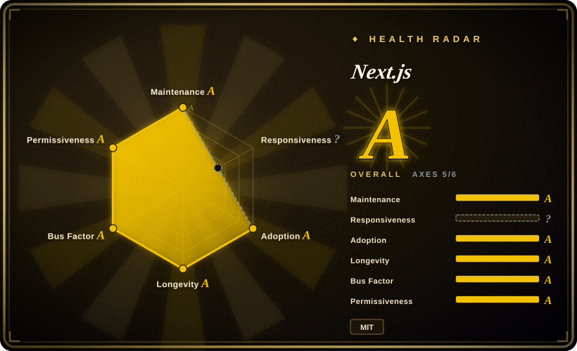
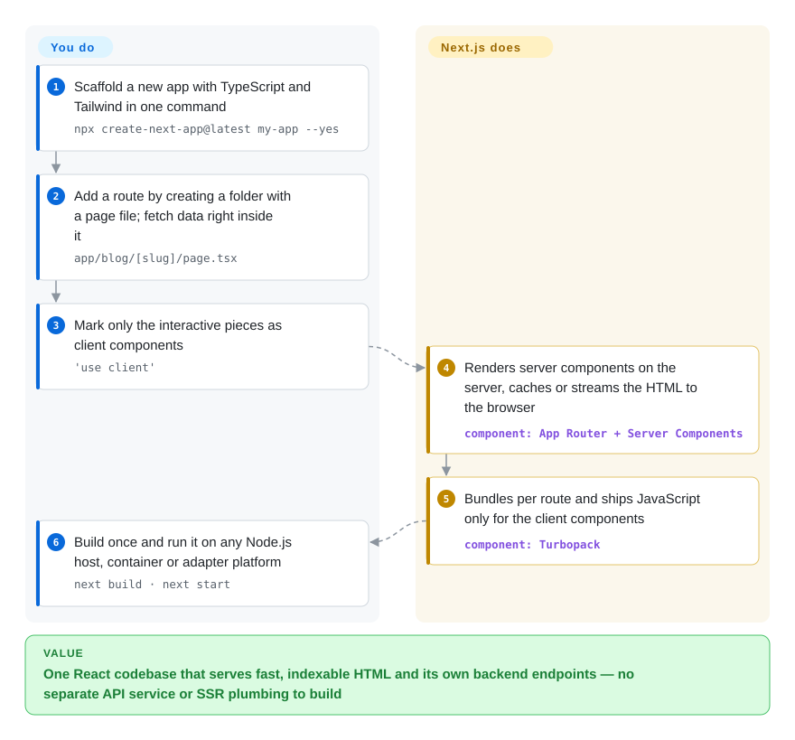

# Next.js

Your React single-page app shows Google an empty `
`, the first screen takes seconds while a JavaScript bundle downloads, and every feature needs a matching endpoint in a separate API service. Next.js renders your React components on the server and lets the same codebase hold its backend routes, so pages arrive as real HTML and the frontend and backend ship together.

## When to use

You're a product team building a web application that has to be both findable and interactive: a marketplace, a SaaS dashboard with public marketing pages, a content site with logged-in features. You started with a client-rendered React SPA and hit the wall — "View source" on a product page shows no product, Lighthouse flags a slow first paint, and your "backend" is a second service with its own deploy pipeline and duplicated types. You reach for Next.js because it lets you stay in React while fixing all three: components render on the server by default and only the interactive pieces ship JavaScript, route handlers and server actions live in the same repo and share your types, and the build decides per route whether to prerender, cache or render on demand.

The deciding tradeoff against its neighbours is *ecosystem and defaults versus simplicity and neutrality*. Against [React](../view-frameworks/react.md) alone with a bundler you trade freedom for routing, rendering and data fetching already decided. Against React Router's framework mode (the former Remix) or TanStack Start you get the largest community, template and hiring pool among React meta-frameworks, but accept a more opinionated caching model and a roadmap set by one vendor, Vercel. If your team writes Vue or Svelte, the same role is played by [Nuxt](nuxt.md) or [SvelteKit](sveltekit.md).

## How it works

Next.js is a framework around React: you write components, and it decides where and when they run. Your folders are your URLs — `app/blog/[slug]/page.tsx` becomes `/blog/:slug` — and every page and layout is a *server component* by default, meaning it runs only on the server (or at build time), can `await` a database query directly, and sends the browser finished HTML plus a compact description of the tree instead of its code. Components that need clicks or browser APIs opt in with `'use client'`, and only those are bundled for the browser. Next.js owns the plumbing: routing, bundling with Turbopack (its Rust-based bundler, default for both `next dev` and `next build` since v16), code splitting per route, caching and revalidating rendered output, image and font optimization, and streaming slow parts of a page in later. You own the components, the data access, and the decision of where to host — `next start` on any Node.js server or container supports every feature, static export supports a subset, and platform adapters (Vercel's own among them) customize the build for specific hosts. Think of it as a restaurant kitchen layout where the pass, the ovens and the order tickets are already installed: you cook, it routes the plates.

<!-- flow-steps:begin (generated from flows/nextjs.json by tools/flow_card.py — do not edit) -->

Text version of the flow

1. **You**: Scaffold a new app with TypeScript and Tailwind in one command — `npx create-next-app@latest my-app --yes`
2. **You**: Add a route by creating a folder with a page file; fetch data right inside it — `app/blog/[slug]/page.tsx`
3. **You**: Mark only the interactive pieces as client components — `'use client'`
4. **Next.js**: Renders server components on the server, caches or streams the HTML to the browser — component: `App Router + Server Components`
5. **Next.js**: Bundles per route and ships JavaScript only for the client components — component: `Turbopack`
6. **You**: Build once and run it on any Node.js host, container or adapter platform — `next build · next start`

**Value**: One React codebase that serves fast, indexable HTML and its own backend endpoints — no separate API service or SSR plumbing to build

<!-- flow-steps:end -->

## When NOT to use

- **If you are building a mostly static content site (blog, docs, marketing), use [Astro](../site-frameworks/astro.md) instead of Next.js, because** Astro ships zero JavaScript by default and hydrates only the interactive islands, while Next.js still carries the React runtime and its router to every page.
- **If you want a lean client-only SPA (an internal tool behind login, no SEO), use [React](../view-frameworks/react.md) with Vite instead of Next.js, because** server rendering, the caching model and server/client component boundaries add concepts and failure modes you get no benefit from.
- **If you self-host and cannot commit to a fast security patch cadence, prefer a smaller-surface stack (a plain React SPA plus your existing API, or React Router's framework mode) over Next.js, because** Next.js published 41 security advisories between January and early October 2026 alone — 3 critical (including remote code execution in image handling) and 14 high, many of them middleware/proxy bypasses and cache poisoning in self-hosted setups. Running it safely means upgrading within days, not quarters.
- **If you want to stay away from a single vendor's roadmap, use React Router's framework mode (formerly Remix, not indexed) or TanStack Start (not indexed) instead of Next.js, because** Vercel employs the core team and sets direction; self-hosting on Node.js or Docker is officially supported for all features, but the defaults, docs and newest features are shaped around Vercel's platform first.
- **If your team writes Vue or Svelte, use [Nuxt](nuxt.md) or [SvelteKit](sveltekit.md) instead of Next.js, because** Next.js is React-only.
- **If you cannot absorb churn in rendering and caching APIs, think twice before adopting the newest App Router features, because** the App Router (v13), async request APIs (v15), and the `middleware` → `proxy` rename plus Turbopack-by-default builds (v16) each forced migrations; a custom `webpack` config now makes `next build` fail until you migrate it or pass `--webpack`.

## Comparison

| Alternative | In index | Our verdict | Tradeoff |
| --- | --- | --- | --- |
| [React](../view-frameworks/react.md) | ✅ | For a client-only app with no SEO need, pick React with Vite; pick Next.js when server rendering, file routing and backend endpoints in one codebase are the point. | React alone keeps the stack small and fully under your control; Next.js adds routing, SSR and caching conventions at the cost of more concepts and a bigger security surface. |
| React Router (framework mode, formerly Remix) | not indexed | When you want server rendering in React with web-standard request/response handling and no dominant hosting vendor, pick React Router's framework mode; pick Next.js when its larger ecosystem and built-in image/font optimization matter more. | React Router keeps closer to web standards and is less tied to one platform; Next.js has the bigger community, more templates and more batteries included. |
| TanStack Start | not indexed | If your team already uses TanStack Router or Query and wants type-safe routing with explicit server functions, evaluate TanStack Start; pick Next.js for the mature, widely hired default. | TanStack Start offers end-to-end type safety and less implicit caching; Next.js offers years of production use and far more learning material. |
| [Nuxt](nuxt.md) | ✅ | For a Vue team, pick Nuxt; pick Next.js for a React team — the UI framework your team already writes decides this row. | Both cover SSR, file routing and server routes; Nuxt brings the Vue ecosystem, Next.js the larger React one. |
| [SvelteKit](sveltekit.md) | ✅ | For small-to-medium apps where bundle size and simplicity outweigh hiring pool, pick SvelteKit; pick Next.js when you need the React ecosystem and a large talent market. | SvelteKit ships less JavaScript and has fewer concepts; Next.js has a vastly larger ecosystem of libraries, components and developers. |
| [Astro](../site-frameworks/astro.md) | ✅ | For content-heavy, mostly static sites, pick Astro; pick Next.js for dynamic, logged-in applications with heavy interactivity. | Astro sends near-zero JavaScript and mixes UI frameworks; Next.js handles app-like interactivity and server logic but costs more client JavaScript per page. |
| [Angular](../view-frameworks/angular.md) | ✅ | For a large enterprise team that wants one batteries-included, strongly structured TypeScript framework with long support windows, pick Angular; pick Next.js when the team is React-based. | Angular bundles DI, forms, routing and SSR under one Google-backed release train; Next.js rides React's ecosystem and moves faster, with more breaking churn. |

## Tech stack

- **React** — the UI layer; the App Router builds on React Server Components, Server Actions and React 19.2 features; the Pages Router remains supported.
- **TypeScript / JavaScript** — first-class TypeScript; `create-next-app` defaults to TypeScript, Tailwind CSS, ESLint and the App Router.
- **Node.js** — runtime for the server, route handlers, server actions and `proxy` (the v16 name for middleware, Node.js runtime only); the Edge runtime remains available for `middleware`.
- **Turbopack** — Rust-based bundler, default for `next dev` and `next build` since v16, with on-disk caching; webpack stays available via `--webpack`.
- **Rendering & caching** — static prerendering, server rendering, streaming, incremental regeneration and Cache Components (`use cache`, `cacheLife`, `cacheTag`); optional React Compiler support.
- **Built-in optimizations** — `next/image`, `next/font`, `next/script`.
- **Version (2026-10-08)** — v16.4.0 stable (2026-10-07); v16.0.0 shipped 2025-10-22; daily canary releases on the `canary` default branch.

## Dependencies

- **Node.js 20.9 or newer** — required for the build, dev server and production server.
- **React and React DOM** — peer dependencies, `^18.2.0` or `^19`; App Router features target React 19.
- **A package manager** — npm, pnpm, yarn or bun.
- **Optional: hosting platform or adapter** — Vercel, or another host via a deployment adapter; plain Node.js servers and Docker run all features.
- **Image optimization on self-hosted servers** — `next/image` runs in-process; the self-hosting guide warns that on glibc-based Linux it may need Sharp's memory-allocator configuration to avoid excessive memory use.
- **Optional: shared cache store** — a custom cache handler (the docs ship a Redis example) when several self-hosted instances or pods must share cached output; the default cache is in memory and on local disk, per instance.

## Ops difficulty

**Medium on a managed platform, medium-to-high self-hosted.** On Vercel (or another platform with a verified adapter) deployment is close to zero-config. Self-hosting is officially supported and runs every feature, but the work moves to you:
- Run `next build` + `next start` (or the `output: "standalone"` Docker image) behind a reverse proxy, and size memory for server rendering.
- With more than one instance, configure a shared cache handler, or cached pages and revalidation diverge between instances.
- Keep up with security releases — the 2026 advisory volume (cache poisoning, proxy bypass, SSRF, image optimizer RCE) makes "upgrade within days" an operational requirement.
- Major upgrades come roughly yearly with codemods (`npx @next/codemod`) and an AI-agent upgrade path in the docs; budget time for caching and request-API changes.
- Large apps still have heavy builds; Turbopack's filesystem cache reduces rebuild time.

## Health & viability

- **Maintenance (2026-10-08):** extremely active — maintenance grade A, commits every week, a stable release on 2026-10-07 and canary builds most days.
- **Responsiveness:** could not be scored this round (no usable issue-response window in the scorer); the repo carries 3,500+ open issues and pull requests, so do not expect quick answers on niche bugs. [推断]
- **Governance & backing:** governance grade A on contributor spread — dozens of active maintainers and no single dominant committer — but it is single-vendor governance: Vercel employs the core team and owns the roadmap. Vercel is well funded and Next.js is its flagship.
- **Age & Lindy:** open-sourced in 2016 and still shipping majors — about ten years, longevity grade A; it has survived the Pages→App Router and webpack→Turbopack shifts.
- **Adoption (A):** the `next` package had 246,347,357 npm downloads in the last month and 345,645 dependent repositories on the scorer's 2026-10-09 reading — the most-used React meta-framework on npm by a wide margin.
- **Risk flags:** MIT with no relicense history. The live risks are the 2026 security-advisory volume and vendor-shaped defaults, not license or abandonment.

## Caveats (unverified)

- [未验证] npm reported 253,413,359 downloads of `next` for 2026-09-05 → 2026-10-04 (npm downloads API, read 2026-10-08); the scorer's 2026-10-09 figure (246,347,357) comes from ecosyste.ms and covers a slightly different window.
- [未验证] Advisory counts (41 in 2026, 3 critical, 14 high) come from GitHub's repository security advisories API on 2026-10-08; severity is as published by Vercel.
- [推断] The degree to which the newest features land first or best on Vercel's platform is inferred from defaults and docs emphasis; it has not been benchmarked.
- [未验证] ~143.2k GitHub stars as of 2026-10-08; star counts are approximate and time-sensitive.
- [推断] The long-term stability of the Cache Components model is still being proven at scale; caching APIs have changed across v14, v15 and v16.
