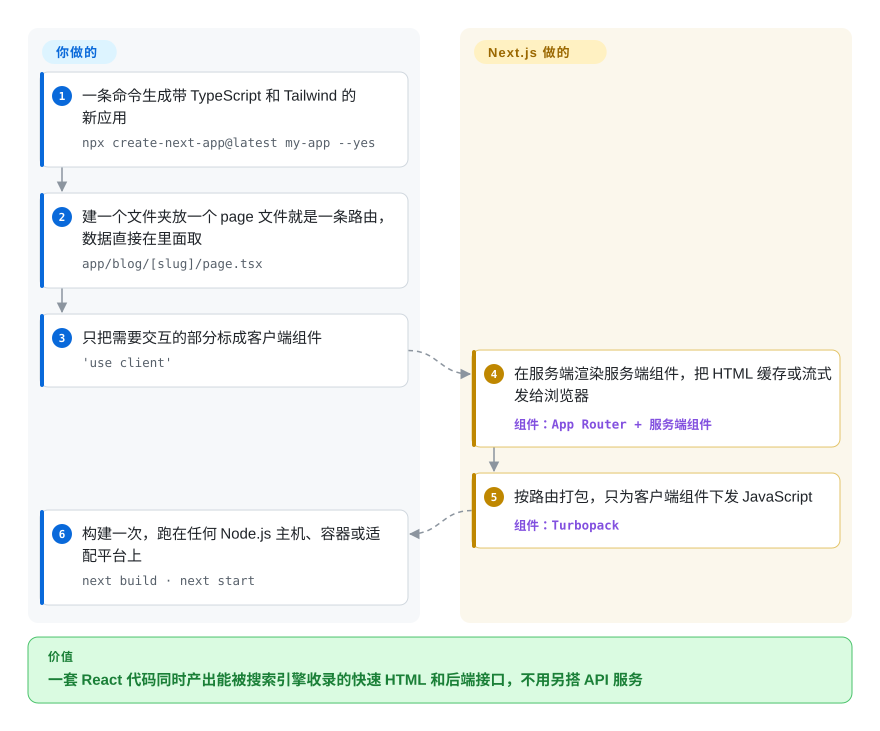

# Next.js

你的 React 单页应用给 Google 看的是一个空的 `
`，首屏要等一大包 JavaScript 下完才出来，每加一个功能还得去另一个 API 服务里配一个接口。Next.js 在服务端把 React 组件渲染成 HTML，并让同一套代码同时容纳后端路由，于是页面以真实 HTML 到达浏览器，前后端一起发布。

## 何时使用

你是一个产品团队，在做一个既要能被搜到、又要高度交互的 Web 应用：一个交易市场、一个带公开营销页的 SaaS 仪表盘、一个有登录功能的内容站。你从客户端渲染的 React 单页应用起步，然后撞墙了——商品页“查看源代码”里看不到商品，Lighthouse 报首屏慢，所谓的“后端”是另一个服务，有自己的部署流水线和一份重复的类型定义。你选 Next.js，是因为它让你留在 React 里同时解决这三件事：组件默认在服务端渲染，只有交互部分才下发 JavaScript；路由处理器（route handler）和服务端动作（server action）就在同一个仓库里，和前端共用类型；构建时按路由决定是预渲染、缓存还是按需渲染。

和邻居相比，决定性的取舍是“生态和默认配置”还是“简单和中立”。对比只用 [React](../view-frameworks/react.zh.md) 加一个打包器，你用自由换来了已经定好的路由、渲染和取数方式。对比 React Router 的框架模式（原 Remix）或 TanStack Start，你得到的是 React 元框架里最大的社区、模板库和招聘池，代价是更有主见的缓存模型，以及由一家厂商 Vercel 主导的路线图。如果团队写的是 Vue 或 Svelte，同样的角色由 [Nuxt](nuxt.zh.md) 或 [SvelteKit](sveltekit.zh.md) 担任。

## 怎么用起来

Next.js 是包在 React 外面的一层框架：你写组件，它决定组件在哪里、什么时候运行。文件夹就是 URL——`app/blog/[slug]/page.tsx` 对应 `/blog/:slug`——每个页面和布局默认都是“服务端组件”，也就是只在服务端（或构建时）运行，可以直接 `await` 一条数据库查询，发给浏览器的是渲染好的 HTML 加一份紧凑的组件树描述，而不是组件代码。需要点击或浏览器 API 的组件用 `'use client'` 声明，只有这些会被打包进浏览器。管线归 Next.js：路由、用 Turbopack 打包（它基于 Rust 的打包器，v16 起 `next dev` 和 `next build` 都默认用它）、按路由拆分代码、缓存并重新验证渲染结果、优化图片和字体、把页面里慢的部分稍后流式补上。组件、数据访问和部署位置归你——`next start` 跑在任何 Node.js 服务器或容器上都支持全部功能，静态导出只支持一部分，平台适配器（包括 Vercel 自己的）则为特定托管平台定制构建。可以把它想成一间已经装好出菜口、烤箱和点菜单系统的餐厅后厨：菜你来做，盘子怎么送由它安排。

<!-- flow-steps:begin (generated from flows/nextjs.json by tools/flow_card.py — do not edit) -->

流程文字版

1. **你**：一条命令生成带 TypeScript 和 Tailwind 的新应用 — `npx create-next-app@latest my-app --yes`
2. **你**：建一个文件夹放一个 page 文件就是一条路由，数据直接在里面取 — `app/blog/[slug]/page.tsx`
3. **你**：只把需要交互的部分标成客户端组件 — `'use client'`
4. **Next.js**：在服务端渲染服务端组件，把 HTML 缓存或流式发给浏览器 — 组件：`App Router + 服务端组件`
5. **Next.js**：按路由打包，只为客户端组件下发 JavaScript — 组件：`Turbopack`
6. **你**：构建一次，跑在任何 Node.js 主机、容器或适配平台上 — `next build · next start`

**价值**：一套 React 代码同时产出能被搜索引擎收录的快速 HTML 和后端接口，不用另搭 API 服务

<!-- flow-steps:end -->

## 何时不用

- **如果做的主要是静态内容站（博客、文档、营销页），用 [Astro](../site-frameworks/astro.zh.md) 而不是 Next.js，因为** Astro 默认不发任何 JavaScript，只给交互“岛屿”做水合，而 Next.js 每个页面都要带上 React 运行时和它的路由器。
- **如果要的是一个精简的纯客户端单页应用（登录后的内部工具，不需要 SEO），用 [React](../view-frameworks/react.zh.md) 加 Vite 而不是 Next.js，因为**服务端渲染、缓存模型和服务端/客户端组件边界会带来一堆概念和故障点，而你得不到任何好处。
- **如果要自托管、又做不到快速跟进安全补丁，优先选攻击面更小的方案（纯 React 单页应用加你现有的 API，或 React Router 的框架模式），而不是 Next.js，因为** 仅 2026 年 1 月到 10 月初，Next.js 就发布了 41 条安全公告——3 条严重（包括图片处理中的远程代码执行）、14 条高危，其中很多是自托管场景下的 middleware/proxy 绕过和缓存投毒。安全地运行它意味着以“天”而不是“季度”为单位升级。
- **如果想避开单一厂商主导的路线图，用 React Router 的框架模式（原 Remix，未收录）或 TanStack Start（未收录）而不是 Next.js，因为** Vercel 雇用核心团队、决定方向；官方支持在 Node.js 或 Docker 上自托管全部功能，但默认配置、文档和最新功能都首先围绕 Vercel 平台设计。
- **如果团队写的是 Vue 或 Svelte，用 [Nuxt](nuxt.zh.md) 或 [SvelteKit](sveltekit.zh.md) 而不是 Next.js，因为** Next.js 只支持 React。
- **如果承受不了渲染和缓存 API 的反复变动，采用最新的 App Router 功能前要三思，因为** App Router（v13）、异步请求 API（v15）、`middleware` 改名 `proxy` 加 Turbopack 默认构建（v16）每一次都逼着迁移；现在有自定义 `webpack` 配置的项目，`next build` 会直接失败，直到你迁移配置或加上 `--webpack`。

## 横向对比

| 替代品 | 是否收录 | 我们的评价 | 取舍 |
| --- | --- | --- | --- |
| [React](../view-frameworks/react.zh.md) | ✅ | 纯客户端应用、不需要 SEO，选 React 加 Vite；服务端渲染、文件路由和后端接口放在一套代码里正是你要的，选 Next.js。 | 只用 React 技术栈更小、完全由你掌控；Next.js 加上路由、SSR 和缓存约定，代价是概念更多、安全攻击面更大。 |
| React Router（框架模式，原 Remix） | 未收录 | 想在 React 里做服务端渲染、用 Web 标准的请求/响应处理、不被某个托管厂商主导，选 React Router 框架模式；更看重更大的生态和内置的图片/字体优化，选 Next.js。 | React Router 更贴近 Web 标准、和单一平台绑得更松；Next.js 社区更大、模板更多、内置功能更全。 |
| TanStack Start | 未收录 | 团队已经在用 TanStack Router 或 Query、想要类型安全的路由和显式的服务端函数，可以评估 TanStack Start；要成熟、好招人的默认选项，选 Next.js。 | TanStack Start 提供端到端类型安全，隐式缓存更少；Next.js 有多年生产使用和多得多的学习资料。 |
| [Nuxt](nuxt.zh.md) | ✅ | Vue 团队选 Nuxt，React 团队选 Next.js——这一行由团队已经在写的 UI 框架决定。 | 两者都覆盖 SSR、文件路由和服务端路由；Nuxt 带来 Vue 生态，Next.js 带来更大的 React 生态。 |
| [SvelteKit](sveltekit.zh.md) | ✅ | 中小型应用、包体积和简单性比招聘池更重要，选 SvelteKit；需要 React 生态和庞大的人才市场，选 Next.js。 | SvelteKit 下发的 JavaScript 更少、概念更少；Next.js 的库、组件和开发者生态大得多。 |
| [Astro](../site-frameworks/astro.zh.md) | ✅ | 内容为主、大部分静态的网站，选 Astro；登录后、交互重的动态应用，选 Next.js。 | Astro 几乎不发 JavaScript，还能混用多种 UI 框架；Next.js 能承载应用级交互和服务端逻辑，但每页的客户端 JavaScript 更多。 |
| [Angular](../view-frameworks/angular.zh.md) | ✅ | 大型企业团队想要一个全家桶、结构严格、支持周期长的 TypeScript 框架，选 Angular；团队以 React 为主，选 Next.js。 | Angular 把依赖注入、表单、路由和 SSR 放进一条由 Google 支撑的发布线；Next.js 依托 React 生态、迭代更快，破坏性变动也更多。 |

## 技术栈

- **React**——UI 层；App Router 构建在 React 服务端组件、Server Actions 和 React 19.2 特性之上；Pages Router 仍受支持。
- **TypeScript / JavaScript**——一等 TypeScript 支持；`create-next-app` 默认启用 TypeScript、Tailwind CSS、ESLint 和 App Router。
- **Node.js**——服务端、路由处理器、服务端动作和 `proxy`（v16 中 middleware 的新名字，只支持 Node.js 运行时）的运行环境；`middleware` 仍可用 Edge 运行时。
- **Turbopack**——基于 Rust 的打包器，v16 起 `next dev` 和 `next build` 默认使用，带磁盘缓存；仍可用 `--webpack` 切回 webpack。
- **渲染与缓存**——静态预渲染、服务端渲染、流式渲染、增量再生成，以及 Cache Components（`use cache`、`cacheLife`、`cacheTag`）；可选支持 React Compiler。
- **内置优化**——`next/image`、`next/font`、`next/script`。
- **版本（2026-10-08）**——稳定版 v16.4.0（2026-10-07）；v16.0.0 于 2025-10-22 发布；默认分支 `canary` 上几乎每天发 canary 版。

## 依赖

- **Node.js 20.9 或更新**——构建、开发服务器和生产服务器都需要。
- **React 和 React DOM**——对等依赖，`^18.2.0` 或 `^19`；App Router 的功能以 React 19 为目标。
- **包管理器**——npm、pnpm、yarn 或 bun。
- **可选：托管平台或适配器**——Vercel，或通过部署适配器接入其他平台；普通 Node.js 服务器和 Docker 支持全部功能。
- **自托管时的图片优化**——`next/image` 在进程内运行；自托管指南提醒，在基于 glibc 的 Linux 上可能需要按 Sharp 的说明调整内存分配器，避免内存占用过高。
- **可选：共享缓存存储**——多个自托管实例或 pod 需要共享缓存结果时，配一个自定义缓存处理器（文档附了 Redis 示例）；默认缓存放在每个实例自己的内存和本地磁盘里。

## 运维难度

**托管平台上中等，自托管中等到高。** 在 Vercel（或有已验证适配器的其他平台）上部署几乎零配置。自托管有官方支持、能跑全部功能，但活儿转到了你身上：
- 用 `next build` + `next start`（或 `output: "standalone"` 的 Docker 镜像）跑在反向代理后面，并为服务端渲染预留足够内存。
- 多于一个实例时要配置共享缓存处理器，否则各实例的缓存页面和重新验证结果会不一致。
- 跟上安全发布——2026 年的安全公告数量（缓存投毒、proxy 绕过、SSRF、图片优化器 RCE）让“几天内升级”成了运维要求。
- 大版本大约一年一次，配有 codemod（`npx @next/codemod`），文档里还有让 AI agent 执行升级的路径；要为缓存和请求 API 的变化预留时间。
- 大型应用的构建依然很重；Turbopack 的文件系统缓存能缩短重复构建时间。

## 健康度与可持续性

- **维护（2026-10-08）：** 极其活跃——维护评级 A，每周都有提交，2026-10-07 刚发了稳定版，canary 版几乎天天发。
- **响应速度：** 这一轮没能评分（评分器拿不到可用的 issue 响应窗口）；仓库挂着 3,500 多个未关闭的 issue 和 PR，小众 bug 别指望很快有人回。[推断]
- **治理与背书：** 按贡献者分布，治理评级 A——几十位活跃维护者，没有一家独大的提交者——但这是单一厂商治理：Vercel 雇用核心团队、掌握路线图。Vercel 资金充足，Next.js 是它的旗舰项目。
- **年龄与 Lindy：** 2016 年开源，至今仍在发大版本——大约十年，长期性评级 A；它挺过了 Pages→App Router、webpack→Turbopack 两次大转向。
- **采用度（A）：** 按评分器 2026-10-09 的读数，`next` 包上月 npm 下载 246,347,357 次，有 345,645 个依赖它的仓库——在 npm 上是遥遥领先的 React 元框架。
- **风险信号：** MIT，没有改协议的历史。眼下真正的风险是 2026 年的安全公告数量和围绕厂商设计的默认配置，而不是许可证或弃坑。

## 存疑（未验证）

- [未验证] npm 下载量 API 显示 `next` 在 2026-09-05 → 2026-10-04 期间下载 253,413,359 次（2026-10-08 读取）；评分器 2026-10-09 的读数（246,347,357）来自 ecosyste.ms，统计窗口略有不同。
- [未验证] 安全公告数量（2026 年 41 条，3 条严重、14 条高危）来自 2026-10-08 的 GitHub 仓库安全公告 API；严重级别以 Vercel 发布的为准。
- [推断] 最新功能在 Vercel 平台上“先落地、效果最好”的程度，是从默认配置和文档侧重推出来的，没有做过基准对比。
- [未验证] 截至 2026-10-08 约 14.32 万 GitHub star；star 数是近似值，会随时间变化。
- [推断] Cache Components 模型的长期稳定性仍在大规模生产中验证；缓存 API 在 v14、v15、v16 之间都变过。
