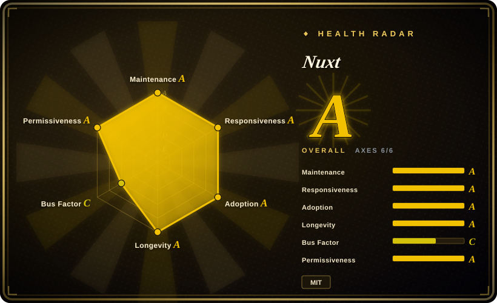
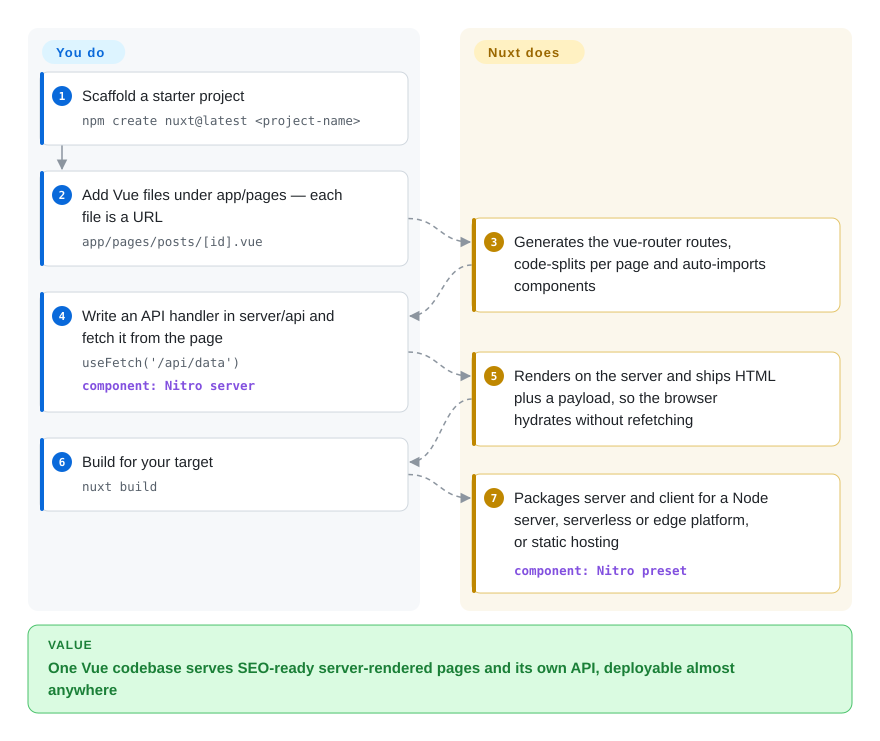

# Nuxt

A plain Vue single-page app hands search engines an empty `
` and makes you build and deploy a separate API server next to it. Nuxt renders the same Vue components on the server first, and lets the API live in a `server/` folder of the same project.

## When to use

You lead a Vue team shipping something public: a storefront, a SaaS with SEO-critical landing pages and a logged-in dashboard behind them. Your Vite + Vue SPA is fine for the dashboard, but the crawler sees `

`, the first paint waits for the JavaScript bundle, and your "backend for the frontend" is a separate Express app with its own repo and deploy. You reach for Nuxt because it keeps every Vue component you already have and adds what the SPA lacks: file-based routing from `app/pages/`, server-side rendering with the fetched data handed to the browser so it does not fetch twice, and a Nitro server folder (`server/api/…`) that ships with the front end to a Node server, a serverless platform, an edge runtime or a static host.

The deciding tradeoff against its neighbours: Next.js gives you the same shape but means rewriting in React; SvelteKit is leaner but means rewriting in Svelte; Astro is better when the site is mostly static content. Nuxt wins when the team and the existing code are Vue and you want the 300+ community modules (auth, content, images, i18n and so on) instead of wiring each concern yourself.

## How it works

Nuxt is a set of conventions plus a build step around Vue. **You write ordinary Vue components in agreed places**: a file in `app/pages/` becomes a URL (`pages/posts/[id].vue` → `/posts/:id`), a file in `server/api/` becomes an HTTP endpoint built with `defineEventHandler`, and components, composables and utilities are auto-imported, so most files have no import lines. **Nuxt does the rest**: it generates the vue-router configuration and splits the JavaScript per page, renders each request on the server, and — when a page calls `useFetch` or `useAsyncData` — puts the fetched data into a *payload* (a JSON blob embedded in the HTML) so the browser reuses it during *hydration* (attaching interactivity to server-rendered HTML) instead of calling the API again. At build time Nitro, Nuxt's server engine, packages the server part for the target you pick through a *preset* — a Node server you start with `node .output/server/index.mjs`, a serverless or edge bundle for platforms such as Cloudflare, Netlify or Vercel, or prerendered static files. Think of it as a restaurant where the kitchen plates the dish before it leaves (server rendering) and clips the recipe to the plate (payload), so the table does not have to cook it again.

<!-- flow-steps:begin (generated from flows/nuxt.json by tools/flow_card.py — do not edit) -->

Text version of the flow

1. **You**: Scaffold a starter project — `npm create nuxt@latest <project-name>`
2. **You**: Add Vue files under app/pages — each file is a URL — `app/pages/posts/[id].vue`
3. **Nuxt**: Generates the vue-router routes, code-splits per page and auto-imports components
4. **You**: Write an API handler in server/api and fetch it from the page — `useFetch('/api/data')` — component: `Nitro server`
5. **Nuxt**: Renders on the server and ships HTML plus a payload, so the browser hydrates without refetching
6. **You**: Build for your target — `nuxt build`
7. **Nuxt**: Packages server and client for a Node server, serverless or edge platform, or static hosting — component: `Nitro preset`

**Value**: One Vue codebase serves SEO-ready server-rendered pages and its own API, deployable almost anywhere

<!-- flow-steps:end -->

## When NOT to use

- **If your team writes React, use [Next.js](nextjs.md) instead of Nuxt, because** Nuxt is Vue-only; its routing, data composables and module ecosystem do not carry over, so the switch is a rewrite, not a migration.
- **If the app is a pure client-side tool behind a login with no SEO need, use [Vue](../view-frameworks/vue.md) with Vite instead of Nuxt, because** you would be paying for server rendering, hydration and a server process you do not need; Nuxt can switch SSR off, but the conventions and build layer stay.
- **If the site is mostly static content (docs, blog, marketing pages), use [Astro](../site-frameworks/astro.md) instead of Nuxt, because** Astro ships HTML with no JavaScript by default and only hydrates the components you mark, while every Nuxt page boots a Vue app in the browser.
- **If you cannot budget a major upgrade every one to two years, prefer a Vue + Vite SPA with a separately versioned backend over Nuxt, because** Nuxt 3 reached end-of-life on 2026-07-31, and Nuxt 5 — in development on `main` as of 2026-10-08 — moves the server to Nitro v3/h3 v2, changes server imports to `nuxt/server` and requires Vite 8 and Node 22.21+/24.11+, so `server/` code and modules will need migration.
- **If your backend is heavy domain logic (background jobs, queues, long-running workers), run a dedicated backend service and keep Nuxt as the front end, because** `server/` is a set of request handlers deployed with the front end; that fits a backend-for-frontend layer, not a full application server [推断].
- **If explicit imports and minimal "magic" matter for your codebase, use Vue + Vite instead of Nuxt, because** auto-imports and directory conventions mean a symbol's origin is decided by folder placement and build-time code generation, which some teams find harder to trace.

## Comparison

| Alternative | In index | Our verdict | Tradeoff |
|---|---|---|---|
| [Next.js](nextjs.md) | ✅ | When the team writes React, pick Next.js; when it writes Vue, pick Nuxt — the UI library decides, not the feature list. | Next.js has the larger ecosystem and React Server Components; Nuxt gives Vue teams the same SSR, file routing and server routes without a rewrite. |
| [SvelteKit](sveltekit.md) | ✅ | For a greenfield app where less client-side JavaScript matters more than an existing Vue codebase, pick SvelteKit; otherwise stay on Nuxt. | SvelteKit compiles components to smaller output and has fewer conventions; Nuxt has the Vue ecosystem and a 300+ module catalogue. |
| [Vue](../view-frameworks/vue.md) | ✅ | For an internal SPA with no SEO or server rendering need, use Vue with Vite and skip Nuxt. | Plain Vue gives explicit imports and no server process; you hand-assemble routing, data fetching and SSR if you later need them. |
| [Astro](../site-frameworks/astro.md) | ✅ | For a content site with a few interactive widgets, pick Astro; for an app where most pages are interactive Vue, pick Nuxt. | Astro ships zero JavaScript by default and can embed Vue islands; Nuxt hydrates every page but gives a full app router and server layer. |
| Quasar | 未收录 | When one Vue codebase must also ship as a mobile or desktop app with a ready Material-style component set, evaluate Quasar; for a web-first SSR app, pick Nuxt. | Quasar bundles components and multi-platform build modes; Nuxt focuses on web rendering modes, server routes and deployment presets. |

## Tech stack

- **TypeScript** — the framework source; Nuxt projects get TypeScript with zero configuration.
- **Vue 3 + vue-router** — the component model and the router that file-based routes are generated into.
- **Vite** — default bundler (Vite 8 since Nuxt 4.5); webpack and Rspack builders are alternatives.
- **Nitro (on h3)** — the server engine for `server/` routes, rendering and deployment presets; Nuxt 5 moves to Nitro v3 / h3 v2.
- **unhead** — head and SEO meta management (`useSeoMeta`, `useHead`).
- **`@nuxt/kit` / modules** — the public API that modules use to hook into the build.

## Dependencies

- **Node.js** — Nuxt CLI v4 (shipped with Nuxt 4.6) requires Node 22.21+, 24.11+ or 26+; the docs recommend an even-numbered LTS.
- **Runtime target** — one of: a Node process (`node .output/server/index.mjs`, listening on port 3000 by default), a serverless/edge platform via a Nitro preset, or any static host for fully prerendered output.
- **No database or external service** is required by Nuxt itself; data sources are whatever your `server/` handlers call.
- **Modules** — optional npm packages (auth, content, image, i18n…) added to `nuxt.config`; each is another dependency to upgrade with Nuxt majors.

## Ops difficulty

**Low to medium.** A prerendered or SPA build is static files on a CDN. A server-rendered build is one stateless Node process (or a serverless function) that you scale horizontally behind a reverse proxy; the docs recommend terminating TLS at the proxy and setting `NODE_ENV=production`. The ongoing cost is upgrades: majors have arrived every two to three years with deprecation windows (Nuxt 3 EOL 2026-07-31), and modules must keep pace with each major.

## Health & viability

- **Maintenance (2026-10-08):** very active — v4.6.0 released 2026-10-05 (one of the largest minors, 420+ commits since v4.5.2), patch releases every few weeks, and Nuxt 5 under development on `main`.
- **Governance / bus factor:** an organization repo with ~100 active contributors in the last 12 months, but commit share is concentrated — the top contributor accounts for roughly two-thirds of commits in the scorer's window (governance grade C). The roadmap is set by a small core team.
- **Backing:** NuxtLabs, the company behind the core team, joined Vercel (announced on the Nuxt blog with Nuxt UI v4). The framework stays MIT and deploys to any provider through Nitro presets, but the roadmap owner is now a hosting vendor that also owns Next.js — watch for priority shifts.
- **Age / Lindy:** about 10 years old (repo created 2016-10) and still shipping weekly — a strong Lindy prior, discounted by disruptive majors (Nuxt 2→3 needed a migration guide and the Nuxt Bridge compatibility layer).
- **Adoption:** ~61k GitHub stars, 32,041,302 npm downloads of `@nuxt/kit` in the last month (scorer snapshot, 2026-10-08), 300+ modules; the default SSR framework for Vue.
- **Risk flags:** MIT, no relicensing; the main risk is upgrade churn across majors and modules that lag them.

## Caveats (unverified)

- [推断] The claim that `server/` suits a backend-for-frontend layer rather than heavy background processing is a judgment from the docs' description of endpoints and middleware, not a documented limit.
- [未验证] Whether Vercel's ownership of NuxtLabs will change Nuxt's priorities is unknown; only the acquisition itself is documented.
- [未验证] Nuxt 5's release date and final breaking-change list were not fixed as of 2026-10-08 (the upgrade guide says it is still in development).
- [未验证] A v3.21.11 maintenance patch was published on 2026-08-05, after the announced 2026-07-31 end-of-life; whether further 3.x security patches will follow is not stated.
- [推断] The Quasar row is based on its general positioning as a multi-platform Vue framework; it is not indexed and was not re-read for this page.
