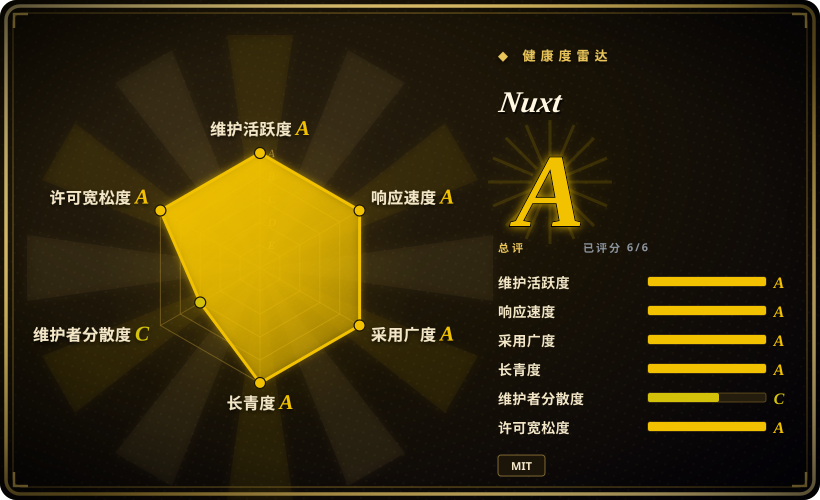
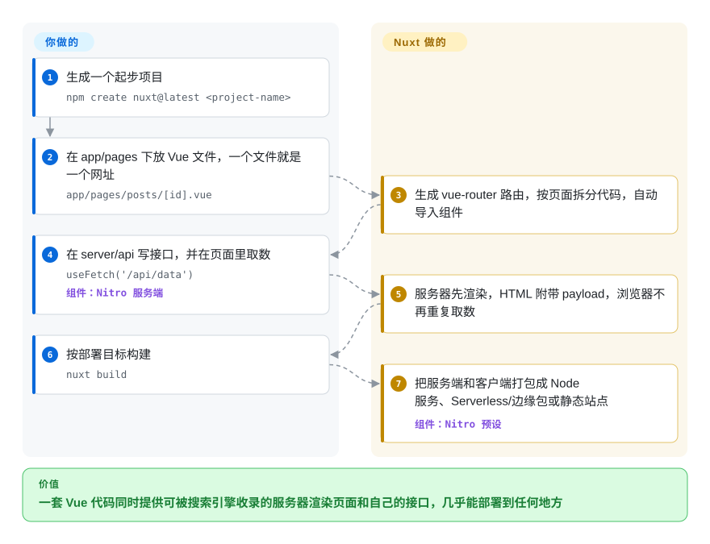

# Nuxt

纯 Vue 单页应用交给搜索引擎的只是一个空的 `
`，接口还得另起一个后端项目单独部署。Nuxt 让同一套 Vue 组件先在服务器上渲染成完整页面，接口直接写在同一项目的 `server/` 目录里。

## 何时使用

你带一个 Vue 团队，做的是对外的产品：电商前台，或者前面是要被搜索引擎收录的落地页、后面是登录后台的 SaaS。Vite + Vue 的 SPA 做后台没问题，但爬虫抓到的是 `

`，首屏要等 JavaScript 包下载完才出现，所谓“给前端用的后端”又是一个独立的 Express 应用，有自己的仓库和发布流程。你选 Nuxt，是因为现有的 Vue 组件一个都不用扔，它补上了 SPA 缺的东西：`app/pages/` 下的文件自动变成路由；页面在服务器端渲染，取到的数据随 HTML 一起交给浏览器，不必再请求一遍；`server/api/…` 里写的 Nitro 接口和前端一起发布，目标可以是 Node 服务器、Serverless 平台、边缘运行时或静态托管。

和邻居比，决定性的取舍是：Next.js 形态相同，但意味着用 React 重写；SvelteKit 更轻，但意味着用 Svelte 重写；内容为主的站点 Astro 更合适。团队和存量代码都是 Vue，又想直接用社区 300 多个模块（鉴权、内容、图片、国际化等）而不是自己逐个拼装时，选 Nuxt。

## 怎么用起来

Nuxt 是围绕 Vue 的一套约定加一个构建步骤。**你在约定的位置写普通的 Vue 组件**：`app/pages/` 里的文件变成网址（`pages/posts/[id].vue` → `/posts/:id`），`server/api/` 里用 `defineEventHandler` 写的文件变成 HTTP 接口，组件、组合式函数和工具函数都会自动导入，多数文件不用写 import。**其余由 Nuxt 完成**：生成 vue-router 配置并按页面拆分 JavaScript；每个请求先在服务器上渲染；页面调用 `useFetch` 或 `useAsyncData` 时，把取到的数据放进 *payload*（嵌在 HTML 里的一段 JSON），浏览器在 *hydration*（给服务器渲染好的 HTML 接上交互能力）时直接复用，不再重新请求接口。构建时，Nuxt 的服务器引擎 Nitro 按你选的 *preset*（部署目标预设）打包服务端部分：用 `node .output/server/index.mjs` 启动的 Node 服务、Cloudflare、Netlify、Vercel 等平台的 Serverless 或边缘包，或者预渲染好的静态文件。打个比方：后厨先把菜装好盘再端出去（服务器渲染），菜谱夹在盘子边上（payload），餐桌上就不用再做一遍。

<!-- flow-steps:begin (generated from flows/nuxt.json by tools/flow_card.py — do not edit) -->

流程文字版

1. **你**：生成一个起步项目 — `npm create nuxt@latest <project-name>`
2. **你**：在 app/pages 下放 Vue 文件，一个文件就是一个网址 — `app/pages/posts/[id].vue`
3. **Nuxt**：生成 vue-router 路由，按页面拆分代码，自动导入组件
4. **你**：在 server/api 写接口，并在页面里取数 — `useFetch('/api/data')` — 组件：`Nitro 服务端`
5. **Nuxt**：服务器先渲染，HTML 附带 payload，浏览器不再重复取数
6. **你**：按部署目标构建 — `nuxt build`
7. **Nuxt**：把服务端和客户端打包成 Node 服务、Serverless/边缘包或静态站点 — 组件：`Nitro 预设`

**价值**：一套 Vue 代码同时提供可被搜索引擎收录的服务器渲染页面和自己的接口，几乎能部署到任何地方

<!-- flow-steps:end -->

## 何时不用

- **如果团队写的是 React，用 [Next.js](nextjs.zh.md)，不要用 Nuxt，因为** Nuxt 只支持 Vue；路由、数据组合式函数和模块生态都带不过去，切换等于重写而不是迁移。
- **如果应用是登录后才能用的纯客户端工具、没有 SEO 需求，用 [Vue](../view-frameworks/vue.zh.md) 加 Vite，不要用 Nuxt，因为** 你会为用不上的服务器渲染、hydration 和服务进程买单；Nuxt 可以关掉 SSR，但约定和构建层还在。
- **如果站点以静态内容为主（文档、博客、营销页），用 [Astro](../site-frameworks/astro.zh.md)，不要用 Nuxt，因为** Astro 默认只发 HTML、不带 JavaScript，只给你标注的组件做 hydration；Nuxt 的每个页面都会在浏览器里启动一个 Vue 应用。
- **如果你排不出每一两年一次大版本升级的工期，优先选 Vue + Vite SPA 配一个独立版本管理的后端，而不是 Nuxt，因为** Nuxt 3 已于 2026-07-31 停止维护；截至 2026-10-08 仍在 `main` 分支开发中的 Nuxt 5 把服务端换成 Nitro v3/h3 v2，服务端导入改到 `nuxt/server`，并要求 Vite 8 和 Node 22.21+/24.11+，`server/` 代码和模块都要跟着迁移。
- **如果后端是重业务逻辑（后台任务、队列、长时间运行的 worker），单独起一个后端服务，Nuxt 只做前端，因为** `server/` 是和前端一起部署的一组请求处理函数，适合做“给前端用的后端”这一层，不是完整的应用服务器 [推断]。
- **如果代码库看重显式 import、少一些“魔法”，用 Vue + Vite，不要用 Nuxt，因为** 自动导入和目录约定意味着一个符号从哪来，由文件放在哪个目录和构建期代码生成决定，有些团队会觉得更难追踪。

## 横向对比

| 替代品 | 是否收录 | 我们的评价 | 取舍 |
|---|---|---|---|
| [Next.js](nextjs.zh.md) | ✅ | 团队写 React 就选 Next.js，写 Vue 就选 Nuxt——决定因素是 UI 库，不是功能清单。 | Next.js 生态更大，有 React Server Components；Nuxt 让 Vue 团队不用重写就拿到同样的 SSR、文件路由和服务端接口。 |
| [SvelteKit](sveltekit.zh.md) | ✅ | 全新项目、客户端 JavaScript 越少越好、又没有存量 Vue 代码时选 SvelteKit；否则留在 Nuxt。 | SvelteKit 把组件编译成更小的产物，约定更少；Nuxt 有 Vue 生态和 300 多个模块。 |
| [Vue](../view-frameworks/vue.zh.md) | ✅ | 没有 SEO 和服务器渲染需求的内部 SPA，用 Vue 加 Vite，跳过 Nuxt。 | 纯 Vue 导入显式、没有服务进程；以后需要路由、取数和 SSR 时得自己拼。 |
| [Astro](../site-frameworks/astro.zh.md) | ✅ | 内容站点加少量交互组件选 Astro；大多数页面都是交互式 Vue 的应用选 Nuxt。 | Astro 默认零 JavaScript，可以嵌入 Vue 岛；Nuxt 每页都要 hydration，但给你完整的应用路由和服务端层。 |
| Quasar | 未收录 | 一套 Vue 代码还要打包成移动端或桌面应用、并想要现成的 Material 风格组件时，评估 Quasar；Web 优先的 SSR 应用选 Nuxt。 | Quasar 自带组件库和多平台构建模式；Nuxt 专注 Web 渲染模式、服务端接口和部署预设。 |

## 技术栈

- **TypeScript**——框架源码语言；Nuxt 项目零配置即可用 TypeScript。
- **Vue 3 + vue-router**——组件模型，以及文件路由最终生成到的路由器。
- **Vite**——默认打包器（Nuxt 4.5 起为 Vite 8）；也可换用 webpack 或 Rspack 构建器。
- **Nitro（基于 h3）**——`server/` 接口、渲染和部署预设背后的服务器引擎；Nuxt 5 将升级到 Nitro v3 / h3 v2。
- **unhead**——页面 head 和 SEO 元信息管理（`useSeoMeta`、`useHead`）。
- **`@nuxt/kit` / 模块**——模块挂进构建流程所用的公开 API。

## 依赖

- **Node.js**——随 Nuxt 4.6 发布的 Nuxt CLI v4 要求 Node 22.21+、24.11+ 或 26+；文档建议用偶数版本的 LTS。
- **运行目标**——三选一：一个 Node 进程（`node .output/server/index.mjs`，默认监听 3000 端口）、通过 Nitro 预设部署的 Serverless/边缘平台，或者用于完全预渲染产物的任意静态托管。
- **Nuxt 本身不需要数据库或外部服务**；数据源就是你的 `server/` 处理函数去调用的东西。
- **模块**——可选的 npm 包（鉴权、内容、图片、国际化……），加到 `nuxt.config` 里；每个模块都是 Nuxt 大版本升级时要一起升级的依赖。

## 运维难度

**低到中。** 预渲染或 SPA 构建产物就是 CDN 上的静态文件。服务器渲染的构建产物是一个无状态的 Node 进程（或一个 Serverless 函数），放在反向代理后面水平扩容即可；文档建议由代理终止 TLS，并设置 `NODE_ENV=production`。持续成本在升级：大版本每两三年来一次，带弃用过渡期（Nuxt 3 于 2026-07-31 停止维护），模块也得跟着每个大版本更新。

## 健康度与可持续性

- **维护（2026-10-08）：** 非常活跃——v4.6.0 于 2026-10-05 发布（规模最大的小版本之一，距 v4.5.2 有 420 多个提交），每隔几周有补丁版本，Nuxt 5 在 `main` 上开发中。
- **治理 / bus factor：** 组织仓库，过去 12 个月约 100 位活跃贡献者，但提交高度集中——评分窗口内头号贡献者约占三分之二的提交（治理评级 C），路线图由一个小核心团队决定。
- **背书：** 核心团队所在的公司 NuxtLabs 已加入 Vercel（Nuxt 官方博客在 Nuxt UI v4 公告中说明）。框架仍是 MIT 许可，借 Nitro 预设可以部署到任何平台，但路线图的主人现在是一家同时拥有 Next.js 的托管厂商——需要留意优先级变化。
- **年龄 / Lindy：** 约 10 年（仓库创建于 2016-10），至今每周都在发版——Lindy 先验很强，但要扣掉大版本带来的折腾（Nuxt 2→3 需要迁移指南和 Nuxt Bridge 兼容层）。
- **采用：** GitHub 约 6.1 万星，`@nuxt/kit` 近一个月 npm 下载 32,041,302 次（评分快照，2026-10-08），300 多个模块；是 Vue 生态默认的 SSR 框架。
- **风险信号：** MIT，没有改许可证的历史；主要风险是跨大版本的升级成本，以及跟不上大版本的模块。

## 存疑（未验证）

- [推断] “`server/` 适合做给前端用的后端层、不适合重型后台处理”是根据文档对接口和中间件的描述作出的判断，不是文档写明的限制。
- [未验证] Vercel 拥有 NuxtLabs 之后会不会改变 Nuxt 的优先级尚不可知；有文档的只是收购本身。
- [未验证] 截至 2026-10-08，Nuxt 5 的发布日期和最终破坏性变更清单尚未确定（升级指南写明仍在开发中）。
- [未验证] 在宣布的 2026-07-31 停止维护之后，2026-08-05 仍发布了 v3.21.11 维护补丁；之后是否还会有 3.x 安全补丁，官方没有说明。
- [推断] Quasar 一行依据的是它作为多平台 Vue 框架的总体定位；它未收录，本页没有重读它的资料。
