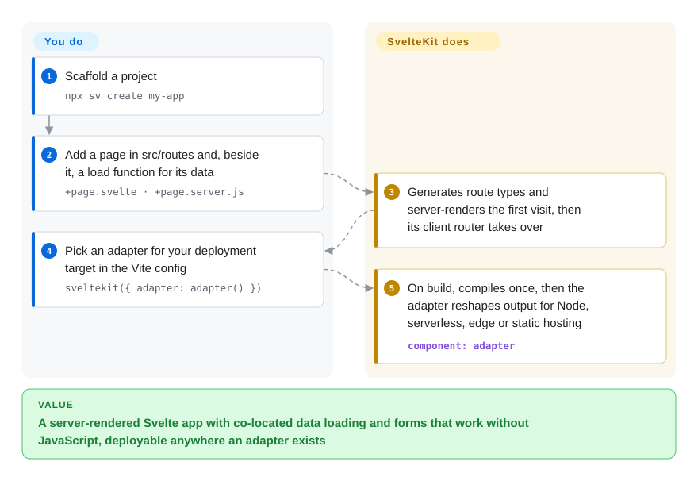

# SvelteKit

Turning a component library into a real web app usually means picking a router, a data-loading pattern, a server for forms and an SSR setup, then keeping them in sync yourself. SvelteKit is Svelte's official app framework: folders become routes, each page sits next to the function that loads its data, and one build command adapts the result to a Node server, a serverless platform or a static host.

## When to use

You are a small product team (or one developer) building a web app with public pages that must rank and a logged-in area that must feel instant — a booking site, a community tool, a SaaS dashboard. You want the first visit server-rendered for SEO and speed, later navigation handled in the browser, and forms that still submit when JavaScript has not loaded: a plain `<form method="POST">` that works, then gets progressively enhanced. You reach for SvelteKit because all of that is the default rather than a recipe: `src/routes/blog/[slug]/+page.svelte` is a page, the `+page.server.js` beside it loads its data on the server, form *actions* handle POSTs without a client-side `fetch`, and an *adapter* (a small plugin that repackages the build for one deployment target) decides where it runs.

The deciding tradeoff: against Next.js you trade React's far larger ecosystem and hiring pool for Svelte's compiled components and a smaller set of framework concepts; against Nuxt the question is simply whether your team writes Svelte or Vue. If the site is mostly static content, Astro is a better fit.

## How it works

SvelteKit is a Vite plugin plus a set of file conventions on top of Svelte, the compiler that turns components into plain JavaScript. **You write route files**: in `src/routes`, a directory is a URL, `+page.svelte` is the page, `+page.js` or `+page.server.js` exports a `load` function whose return value arrives as the page's `data` prop (`.server` means it only ever runs on the server, so it may touch a database or secrets), `+server.js` is a raw HTTP endpoint, and `+layout.svelte` wraps everything below it. **SvelteKit does the rest**: it generates types for each route (`./$types`), renders the first request on the server, then lets its client-side router take over so later navigations only fetch data, and it keeps form actions working with or without JavaScript. `vite build` (usually `npm run build`) produces one production build, then the *adapter* you chose — `adapter-node`, `adapter-static`, `adapter-vercel`, `adapter-cloudflare`, `adapter-netlify`, `adapter-bun`, or `adapter-auto`, which detects supported platforms — turns it into the shape that platform expects. Since 3.0 the adapter is set in `vite.config.js` as `sveltekit({ adapter: adapter() })`.

<!-- flow-steps:begin (generated from flows/sveltekit.json by tools/flow_card.py — do not edit) -->

Text version of the flow

1. **You**: Scaffold a project — `npx sv create my-app`
2. **You**: Add a page in src/routes and, beside it, a load function for its data — `+page.svelte · +page.server.js`
3. **SvelteKit**: Generates route types and server-renders the first visit, then its client router takes over
4. **You**: Pick an adapter for your deployment target in the Vite config — `sveltekit({ adapter: adapter() })`
5. **SvelteKit**: On build, compiles once, then the adapter reshapes output for Node, serverless, edge or static hosting — component: `adapter`

**Value**: A server-rendered Svelte app with co-located data loading and forms that work without JavaScript, deployable anywhere an adapter exists

<!-- flow-steps:end -->

## When NOT to use

- **If you are on SvelteKit 2 with a large app and cannot schedule a migration now, stay on 2.x (or start new work on [Next.js](nextjs.md) if Svelte was not a firm choice), because** 3.0 (2026-10-01) is a large breaking release: Node 22.17+, Vite 8, TypeScript 6 and Svelte 5.56.4+ are required, `$app/stores` is removed, the `$lib` alias becomes `#lib`, `$service-worker` is deleted and the adapter moves into the Vite config. Community adapters and libraries need time to catch up [推断].
- **If your team writes React or needs React's component ecosystem and hiring pool, use [Next.js](nextjs.md) instead of SvelteKit, because** SvelteKit only runs Svelte components; React UI kits, data libraries and patterns do not plug in.
- **If your team writes Vue, use [Nuxt](nuxt.md) instead of SvelteKit, because** Nuxt gives the same SSR, file routing and server routes with your existing Vue components and its module catalogue.
- **If the site is mostly static content (docs, blog, marketing), use [Astro](../site-frameworks/astro.md) instead of SvelteKit, because** Astro ships no JavaScript by default and hydrates only the components you mark; SvelteKit's own docs note that purpose-built static generators may prerender very large sites more efficiently.
- **If you want typed client-to-server function calls as a stable, documented API today, do not build on SvelteKit's remote functions yet, because** in 3.0 `*.remote.ts` files are still gated behind `experimental.remoteFunctions`; use `load` + form actions inside SvelteKit, or [TanStack Router](tanstack-router.md) with TanStack Start if a typed RPC layer is the requirement.
- **If you need a separate backend in another language to own all business logic, keep SvelteKit thin or use plain [Svelte](../view-frameworks/svelte.md) as an SPA, because** SvelteKit's server files are optional; the docs recommend deploying the SvelteKit frontend separately with `adapter-node` or a serverless adapter rather than letting it grow a second backend.

## Comparison

| Alternative | In index | Our verdict | Tradeoff |
|---|---|---|---|
| [Next.js](nextjs.md) | ✅ | Pick Next.js when React's ecosystem, component libraries or hiring pool decide the project; pick SvelteKit when a smaller framework surface and compiled Svelte components matter more. | Next.js brings React Server Components and the largest meta-framework community; SvelteKit has fewer concepts, progressive-enhancement forms by default and adapter-based deployment. |
| [Nuxt](nuxt.md) | ✅ | Choose by UI language: Vue codebase → Nuxt, Svelte codebase → SvelteKit; for a greenfield team the Svelte option usually means less client-side JavaScript. | Nuxt adds auto-imports and 300+ modules but more conventions; SvelteKit relies on explicit imports and a smaller official adapter and add-on set. |
| [Svelte](../view-frameworks/svelte.md) | ✅ | Use plain Svelte (with Vite) for an embedded widget or a pure SPA in front of an existing backend; use SvelteKit as soon as you need routing, SSR or server endpoints. | Plain Svelte has no routing, SSR or deployment conventions to learn; SvelteKit adds them at the cost of a framework upgrade cycle (3.0 just landed). |
| [Astro](../site-frameworks/astro.md) | ✅ | For content-first sites with islands of interactivity, pick Astro; for app-like sites where most pages are interactive, pick SvelteKit. | Astro ships zero JavaScript by default and can host Svelte islands; SvelteKit gives a client-side router, form actions and per-route rendering modes. |
| [TanStack Router](tanstack-router.md) | ✅ | Pick TanStack Router when you want a client-first React app with fully typed URLs and search params; pick SvelteKit for a server-rendered Svelte app with built-in data loading. | TanStack Router is React-only and SSR comes from TanStack Start; SvelteKit includes SSR, endpoints and adapters in one package. |

## Tech stack

- **JavaScript with JSDoc types** — the framework source (GitHub reports JavaScript); published with TypeScript declarations, and TypeScript 6 is the minimum for typed projects since 3.0.
- **Svelte 5** — the component compiler (peer dependency `svelte ^5.57.1` in `@sveltejs/kit` 3.0.1).
- **Vite 8** — dev server and build; SvelteKit is the `sveltekit()` Vite plugin (`@sveltejs/vite-plugin-svelte` v7).
- **Adapters** — official `@sveltejs/adapter-*` packages for auto, Node, Bun, static, Cloudflare, Netlify and Vercel; community adapters for other targets.
- **Small runtime dependencies** — `cookie`, `devalue` (serialization of load data), `sirv` (static file serving), `@standard-schema/spec`; optional OpenTelemetry tracing.

## Dependencies

- **Node.js 22.17+** to build and run in development (3.0 `engines`); production runtime depends on the adapter.
- **A deployment target chosen via adapter**: a Node (or Bun) server process for `adapter-node`/`adapter-bun`, a serverless/edge platform for the Vercel, Netlify or Cloudflare adapters, or any static host for `adapter-static` / SPA mode.
- **No database or external service** is required by SvelteKit; `+page.server.js` and `+server.js` call whatever you choose.
- **The `sv` CLI** (`npx sv create`, `npx sv add`) for scaffolding and adding integrations — a separate package from the framework.

## Ops difficulty

**Low to medium.** Static or SPA output is a folder for a CDN. Server output is one stateless Node process (or a set of serverless functions) behind a proxy; `kit.paths.origin` replaced the old `ORIGIN` environment variable in 3.0, so check the adapter docs when upgrading. Version-skew handling is built in: 3.0 detects new deployments on data and form responses and polls hourly by default. The main recurring cost is major upgrades — 3.0 changed import paths, aliases, cookie defaults and required runtime versions in one release.

## Health & viability

- **Maintenance (2026-10-08):** very active — `@sveltejs/kit` 3.0.0 shipped 2026-10-01 together with new majors of the official adapters, followed by 3.0.1 on 2026-10-06; commits land daily.
- **Governance / bus factor:** a `sveltejs` organization repo with a spread-out core — about 33 active contributors in the scorer's 12-month window, top contributor about a third of commits (governance grade A); Rich Harris, Svelte's creator, is the top all-time committer alongside several long-time maintainers.
- **Backing:** the README describes Svelte as an MIT project developed by volunteers and funded through Open Collective; several core maintainers are employed by a hosting company to work on it [未验证].
- **Age / Lindy:** about 6 years old (repo created 2020-10, 1.0 in 2022) and on its third major — a moderate Lindy prior, younger than Next.js or Nuxt but clearly past the hype stage.
- **Adoption:** ~20.8k stars, 11,853,064 npm downloads of `@sveltejs/kit` in the last month and 17,842 dependent repositories (scorer snapshot, 2026-10-08); the default way to build a Svelte app.
- **Risk flags:** MIT with no relicensing history; the live risk is migration cost from the 3.0 break and how quickly libraries and community adapters follow.

## Caveats (unverified)

- [推断] That community adapters and libraries will lag 3.0 for a while is inferred from the size of the breaking-change list, not from a survey of them.
- [未验证] Whether the 2.x line will receive further bug or security fixes after 3.0 is not stated in the repository; the last 2.x release found was 2.70.3 on 2026-08-18.
- [未验证] Employment of core maintainers by a hosting company is general community knowledge and was not confirmed from a primary source during this re-read.
- [推断] Remote functions may become stable during 3.x; the "do not build on them yet" advice should be re-checked at the next sync.
- [未验证] Download and dependent counts are point-in-time scorer snapshots (2026-10-08) and move month to month.
