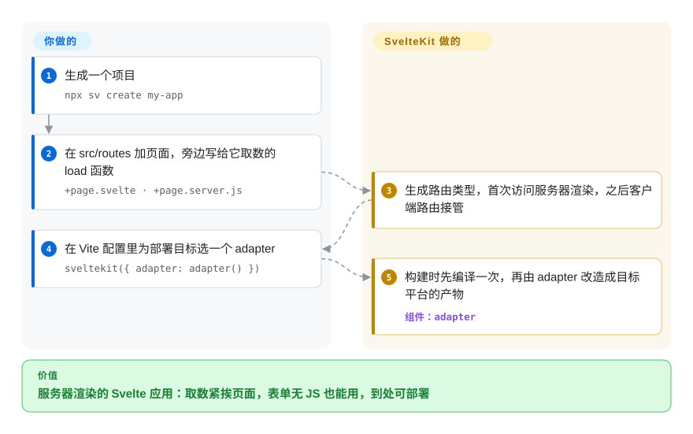

# SvelteKit

把一堆组件变成真正的 Web 应用，通常要自己挑路由、定取数方式、给表单配服务端、搭 SSR，再一直维护它们彼此兼容。SvelteKit 是 Svelte 官方的应用框架：目录就是路由，每个页面旁边放着给它取数的函数，一条构建命令再把结果适配成 Node 服务、Serverless 平台或静态站点。

## 何时使用

你是一个小产品团队（或者独立开发者），做的 Web 应用既有要被搜索引擎收录的公开页面，又有要求点了就出的登录区——预约网站、社区工具、SaaS 后台。你希望首次访问由服务器渲染，兼顾 SEO 和速度；之后的跳转交给浏览器；表单在 JavaScript 还没加载时也能提交：先是一个能用的普通 `<form method="POST">`，再逐步增强。你选 SvelteKit，是因为这些都是默认行为而不是要自己拼的方案：`src/routes/blog/[slug]/+page.svelte` 就是一个页面，旁边的 `+page.server.js` 在服务器上给它取数，表单 *action* 处理 POST 而不用写客户端 `fetch`，*adapter*（把构建产物重新打包成某个部署目标所需形态的小插件）决定它跑在哪里。

决定性的取舍：和 Next.js 比，你放弃 React 大得多的生态和招聘池，换来 Svelte 的编译式组件和更少的框架概念；和 Nuxt 比，问题只是团队写 Svelte 还是 Vue。站点以静态内容为主时，Astro 更合适。

## 怎么用起来

SvelteKit 是一个 Vite 插件，加上一套建在 Svelte（把组件编译成普通 JavaScript 的编译器）之上的文件约定。**你写路由文件**：在 `src/routes` 里，目录就是网址，`+page.svelte` 是页面；`+page.js` 或 `+page.server.js` 导出 `load` 函数，返回值作为页面的 `data` 属性送进来（带 `.server` 的只在服务器上运行，所以可以碰数据库和密钥）；`+server.js` 是原始 HTTP 接口；`+layout.svelte` 包住它下面的所有页面。**其余由 SvelteKit 完成**：为每个路由生成类型（`./$types`），首个请求在服务器上渲染，之后交给客户端路由接管，后续跳转只取数据；表单 action 无论有没有 JavaScript 都能工作。`vite build`（通常经由 `npm run build`）先产出一份生产构建，再由你选的 *adapter*——`adapter-node`、`adapter-static`、`adapter-vercel`、`adapter-cloudflare`、`adapter-netlify`、`adapter-bun`，或者自动识别所支持平台的 `adapter-auto`——把它改造成目标平台要求的形态。3.0 起，adapter 写在 `vite.config.js` 里：`sveltekit({ adapter: adapter() })`。

<!-- flow-steps:begin (generated from flows/sveltekit.json by tools/flow_card.py — do not edit) -->

流程文字版

1. **你**：生成一个项目 — `npx sv create my-app`
2. **你**：在 src/routes 加页面，旁边写给它取数的 load 函数 — `+page.svelte · +page.server.js`
3. **SvelteKit**：生成路由类型，首次访问服务器渲染，之后客户端路由接管
4. **你**：在 Vite 配置里为部署目标选一个 adapter — `sveltekit({ adapter: adapter() })`
5. **SvelteKit**：构建时先编译一次，再由 adapter 改造成目标平台的产物 — 组件：`adapter`

**价值**：服务器渲染的 Svelte 应用：取数紧挨页面，表单无 JS 也能用，到处可部署

<!-- flow-steps:end -->

## 何时不用

- **如果你在 SvelteKit 2 上有个大应用、眼下排不出迁移工期，先留在 2.x（如果 Svelte 并非定论，新工作可以改用 [Next.js](nextjs.zh.md)），因为** 3.0（2026-10-01）是一次大规模破坏性发布：要求 Node 22.17+、Vite 8、TypeScript 6 和 Svelte 5.56.4+，删除了 `$app/stores`，`$lib` 别名改成 `#lib`，删掉了 `$service-worker`，adapter 配置挪进 Vite 配置。社区 adapter 和周边库需要时间跟上 [推断]。
- **如果团队写 React，或者离不开 React 的组件生态和招聘池，用 [Next.js](nextjs.zh.md)，不要用 SvelteKit，因为** SvelteKit 只跑 Svelte 组件；React 的 UI 套件、数据库和惯用模式都接不进来。
- **如果团队写 Vue，用 [Nuxt](nuxt.zh.md)，不要用 SvelteKit，因为** Nuxt 用你现有的 Vue 组件和它的模块目录，就能拿到同样的 SSR、文件路由和服务端接口。
- **如果站点以静态内容为主（文档、博客、营销页），用 [Astro](../site-frameworks/astro.zh.md)，不要用 SvelteKit，因为** Astro 默认不发 JavaScript，只给你标注的组件做 hydration；SvelteKit 自己的文档也说，超大型站点的预渲染，专门的静态站点生成器可能更高效。
- **如果你今天就想要一套稳定、有文档的“客户端直接调用带类型的服务端函数”，先别押在 SvelteKit 的 remote functions 上，因为** 3.0 里 `*.remote.ts` 仍要打开 `experimental.remoteFunctions` 才能用；在 SvelteKit 内部改用 `load` 加表单 action，或者如果类型化 RPC 层是硬需求，用 [TanStack Router](tanstack-router.zh.md) 配 TanStack Start。
- **如果所有业务逻辑都要由另一种语言写的独立后端承担，让 SvelteKit 保持很薄，或者直接用纯 [Svelte](../view-frameworks/svelte.zh.md) 做 SPA，因为** SvelteKit 的服务端文件是可选的；文档建议用 `adapter-node` 或 Serverless adapter 把前端单独部署，而不是让它长成第二个后端。

## 横向对比

| 替代品 | 是否收录 | 我们的评价 | 取舍 |
|---|---|---|---|
| [Next.js](nextjs.zh.md) | ✅ | 项目由 React 生态、组件库或招聘池决定时选 Next.js；更看重更小的框架面和编译式 Svelte 组件时选 SvelteKit。 | Next.js 有 React Server Components 和最大的元框架社区；SvelteKit 概念更少，表单默认渐进增强，部署靠 adapter。 |
| [Nuxt](nuxt.zh.md) | ✅ | 按 UI 语言选：Vue 代码库用 Nuxt，Svelte 代码库用 SvelteKit；全新团队选 Svelte 通常意味着更少的客户端 JavaScript。 | Nuxt 有自动导入和 300 多个模块，但约定更多；SvelteKit 靠显式 import，官方 adapter 和插件集更小。 |
| [Svelte](../view-frameworks/svelte.zh.md) | ✅ | 嵌入式小组件或挂在现有后端前面的纯 SPA，用纯 Svelte（配 Vite）；一旦需要路由、SSR 或服务端接口，就上 SvelteKit。 | 纯 Svelte 没有路由、SSR 和部署约定要学；SvelteKit 补上这些，代价是框架的升级周期（3.0 刚发布）。 |
| [Astro](../site-frameworks/astro.zh.md) | ✅ | 内容优先、只有零星交互的站点选 Astro；大多数页面都要交互的应用型站点选 SvelteKit。 | Astro 默认零 JavaScript，可以嵌 Svelte 岛；SvelteKit 提供客户端路由、表单 action 和按路由选择的渲染模式。 |
| [TanStack Router](tanstack-router.zh.md) | ✅ | 想要客户端优先、网址和查询参数全程有类型的 React 应用，选 TanStack Router；要服务器渲染、自带取数的 Svelte 应用，选 SvelteKit。 | TanStack Router 只支持 React，SSR 要靠 TanStack Start；SvelteKit 一个包里就有 SSR、接口和 adapter。 |

## 技术栈

- **JavaScript + JSDoc 类型**——框架源码（GitHub 识别为 JavaScript）；发布时附带 TypeScript 类型声明，3.0 起类型化项目最低要求 TypeScript 6。
- **Svelte 5**——组件编译器（`@sveltejs/kit` 3.0.1 的 peer 依赖为 `svelte ^5.57.1`）。
- **Vite 8**——开发服务器和构建；SvelteKit 本身就是 `sveltekit()` 这个 Vite 插件（配合 `@sveltejs/vite-plugin-svelte` v7）。
- **Adapter**——官方 `@sveltejs/adapter-*` 覆盖 auto、Node、Bun、静态、Cloudflare、Netlify、Vercel；其他目标有社区 adapter。
- **很少的运行时依赖**——`cookie`、`devalue`（序列化 load 数据）、`sirv`（静态文件服务）、`@standard-schema/spec`；可选 OpenTelemetry 链路追踪。

## 依赖

- **Node.js 22.17+**，用于构建和本地开发（3.0 的 `engines`）；生产环境的运行时取决于 adapter。
- **用 adapter 选定的部署目标**：`adapter-node`/`adapter-bun` 对应一个 Node（或 Bun）服务进程，Vercel、Netlify、Cloudflare adapter 对应 Serverless/边缘平台，`adapter-static` / SPA 模式对应任意静态托管。
- **SvelteKit 本身不需要数据库或外部服务**；`+page.server.js` 和 `+server.js` 调什么由你决定。
- **`sv` 命令行**（`npx sv create`、`npx sv add`），用来生成项目和添加集成——它和框架是两个独立的包。

## 运维难度

**低到中。** 静态或 SPA 产物就是放到 CDN 上的一个目录。服务端产物是代理后面的一个无状态 Node 进程（或一组 Serverless 函数）；3.0 用 `kit.paths.origin` 取代了原来的 `ORIGIN` 环境变量，升级时要对照 adapter 文档。版本错配（新部署上线时旧页面还开着）有内置处理：3.0 会在数据和表单响应里检测新部署，默认每小时轮询一次。主要的周期性成本是大版本升级——3.0 在一次发布里改了导入路径、别名、cookie 默认值和运行时最低版本。

## 健康度与可持续性

- **维护（2026-10-08）：** 非常活跃——`@sveltejs/kit` 3.0.0 于 2026-10-01 与各官方 adapter 的新大版本一起发布，2026-10-06 跟进 3.0.1；每天都有提交。
- **治理 / bus factor：** `sveltejs` 组织仓库，核心成员分散——评分的 12 个月窗口内约 33 位活跃贡献者，头号贡献者约占三分之一提交（治理评级 A）；Svelte 作者 Rich Harris 是历史提交最多的人，另有几位长期维护者。
- **背书：** README 称 Svelte 是由志愿者开发、通过 Open Collective 筹资的 MIT 项目；几位核心维护者受雇于一家托管公司专职做它 [未验证]。
- **年龄 / Lindy：** 约 6 年（仓库创建于 2020-10，1.0 发布于 2022-12），已到第三个大版本——Lindy 先验中等，比 Next.js、Nuxt 年轻，但明显已过炒作期。
- **采用：** 约 2.08 万星，`@sveltejs/kit` 近一个月 npm 下载 11,853,064 次，依赖仓库 17,842 个（评分快照，2026-10-08）；是构建 Svelte 应用的默认方式。
- **风险信号：** MIT，没有改许可证的历史；现实风险是 3.0 断代带来的迁移成本，以及周边库和社区 adapter 跟进的速度。

## 存疑（未验证）

- [推断] “社区 adapter 和周边库会滞后 3.0 一段时间”是从破坏性变更清单的规模推断的，没有逐个调查它们。
- [未验证] 3.0 之后 2.x 是否还会有缺陷或安全修复，仓库里没有说明；找到的最后一个 2.x 版本是 2026-08-18 的 2.70.3。
- [未验证] 核心维护者受雇于托管公司属于社区常识，本次重读没有从一手来源确认。
- [推断] remote functions 可能在 3.x 期间转为稳定；“先别押在上面”的建议应在下次同步时复查。
- [未验证] 下载量和依赖仓库数是评分器在 2026-10-08 的快照，每月都会变。
